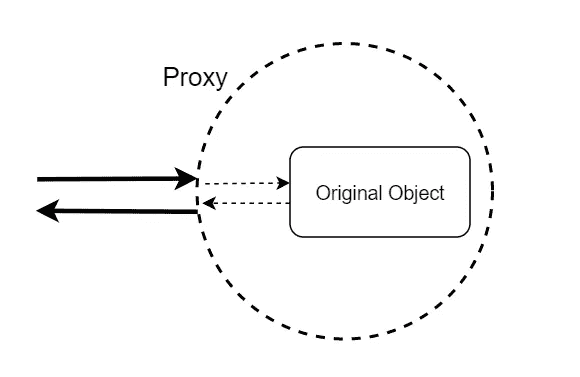
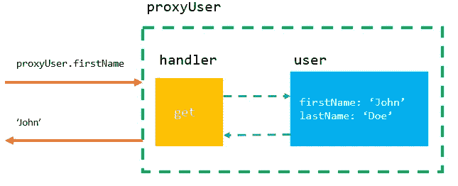
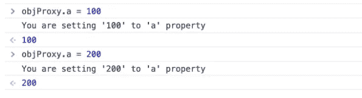
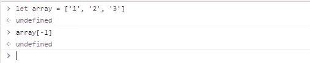
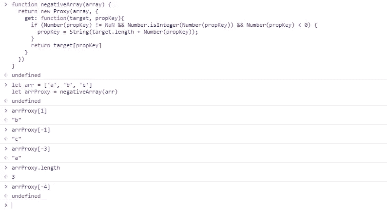
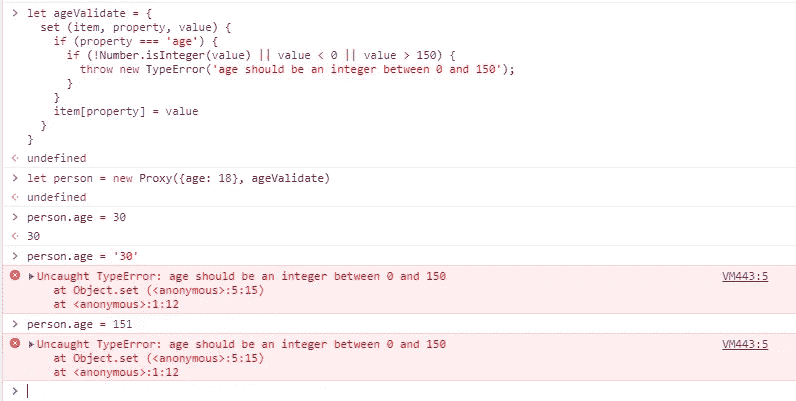
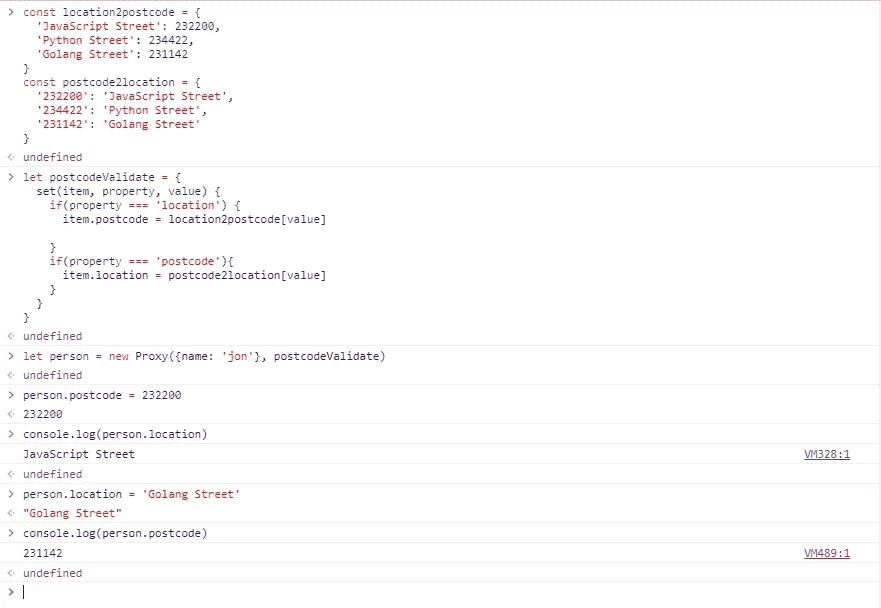
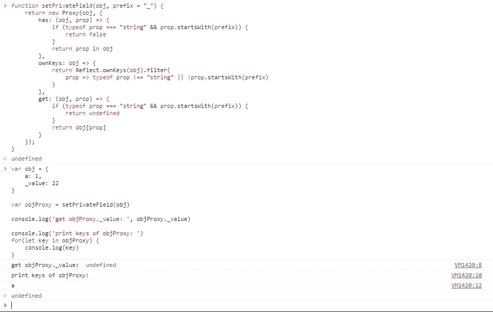

# 关于 JavaScript 代理你应该知道的一切

> 原文：<https://betterprogramming.pub/everything-you-should-know-about-javascript-proxy-67576f2e069e>

## 立即开始在您的 JavaScript 代码中使用代理


奥斯卡·伊尔迪兹上传于 Unsplash

首先:MDN 对`Proxy`的官方定义是:

> `Proxy`对象使你能够为另一个对象创建一个代理，它可以截取并重新定义那个对象的基本操作

现在，在深入挖掘之前，让我们先讨论一些现实生活中的例子，以便最后我们可以更好地了解`Proxy` *。*这是 [bitfish](https://medium.com/@bf2) 在他的[文章](https://medium.com/javascript-in-plain-english/why-proxies-in-javascript-are-fantastic-db100ddc10a0)里是怎么解释的。

作为人类，我们在日常生活中有很多事情要做，例如阅读电子邮件、接收快递等。有时候，我们可能会因为许多额外的和不必要的任务而感到有点焦虑——比如有许多垃圾邮件，需要一些努力和时间才能清除它们，或者收到的快递可能包含恐怖分子放置的炸弹，威胁到我们的安全(只是一种可能性)。

这就是你希望有人保护你免受这种威胁的地方:一个忠诚的管家。我们需要有人为我们做额外的事情来保护我们正在做的事情。

现在，让我们回到基础——JavaScript。我们知道我们可以扩展 JavaScript 来使用面向对象编程范例提供的特性，比如封装、抽象、类、对象等等。我们可以说，每个 JavaScript 开发人员都使用对象，在对象中保存一些信息是很常见的。

但是当我们这样做时(使用对象)，我们的代码变得不那么安全。因为 JavaScript 对象总是裸着运行，你可以用它们做任何事情。

因此，为了解决这个问题，ECMAScript 2015 中引入了一个名为 Proxy 的新功能，通常称为 ES6。通过代理，我们可以为对象找到一个忠实的管家，帮助我们增强对象的原有功能。

# 什么是 JavaScript 代理对象？

> “JavaScript 代理是一个包装另一个对象(目标)并拦截目标对象的基本操作的对象。”— [Javascript 教程](https://www.javascripttutorial.net/es6/javascript-proxy/)

对于一个人来说，我们可能会有阅读邮件、收取快递等操作。，管家可以帮我们做。对于一个对象，基本操作可以是属性查找、赋值、枚举和函数调用等。，这也可以通过代理对象来增强。



代理对象的简单说明

## 创建代理对象

最基本的，你可以使用下面的语法来创建一个`Proxy`。

```
let proxy = new Proxy(target, handler);
```

在哪里

*   `target`是要包装的对象
*   `handler`是一个包含控制`target`行为的方法的对象。在`handler`对象内部的方法被称为陷阱。

一个`Proxy`在目标对象周围创建一个不可检测的屏障，将所有操作重定向到处理程序对象。如果我们发送一个空的`handler`，代理只是原始对象周围的一个空包装器。

## 一个简单的代理示例

首先，让我们定义一个名为`user`的新对象。

```
const user = { 
    firstName: ‘John’, 
    lastName: ‘Doe’, 
    email: ‘john.doe@example.com’, 
}
```

现在，定义一个`handler`对象:

> 在处理程序中，我们可以列出我们想要代理的动作。例如，如果我们想在控制台中打印出一条语句，同时获取一个对象属性，我们可以这样写:

```
const handler = {     
    get(item, property, itemProxy) {         
        console.log(`Property ${property} has been read.`); 
        return target[property];     
    } 
}
```

`get`函数可以接受三个参数:

*   `item`:就是物体本身。
*   `proerty`:您正在尝试读取的属性的名称。
*   `itemProxy`:是我们刚刚创建的管家对象。

现在，创建一个`proxy`对象，这非常简单，就像这样:

```
const proxyUser = new Proxy(user, handler);
```

`proxyUser`对象使用`user`对象存储数据。`proxyUser`可以访问`user`对象的所有属性



上面示例代码的图示

现在，让我们通过`proxyUser`对象访问`user`对象的`firstName`和`lastName`属性:

```
console.log(proxyUser.firstName);
console.log(proxyUser.lastName);
```

输出将如下所示:

```
Property firstName has been read. 
John 
Property lastName has been read. 
Doe
```

在上面的例子中，`get`函数的返回值是读取该属性的结果。因为我们还不想改变任何东西，所以我们只返回原始对象的属性值。

如果有必要，我们也可以改变结果。例如，我们可以这样做:

```
let obj = {a: 1, b:2}let handler = {
  get: function(item, property, itemProxy){
    console.log(`You are getting the value of '${property}'     property`)
    return item[property] * 2
  }
}let objProxy = new Proxy(obj, handler)console.log(objProxy.a)
console.log(objProxy.b)
```

它将输出以下内容:

```
You are getting the value of 'a' property 
2
You are getting the value of 'b' property 
4
```

# 代理陷阱

## `get()`陷阱

当通过代理对象访问`target`对象的属性时，触发`get()`陷阱。

在前面的例子中，当`proxyUser`对象访问`user`对象的属性时，会输出一条消息。

## `set()`陷阱

除了拦截对属性的读取，我们还可以拦截对属性的修改。像这样:

```
let obj = {a: 1, b:2}let handler = {
  set: function(item, property, value, itemProxy){
    console.log(`You are setting '${value}' to '${property}' property`)
    item[property] = value
  }
}let objProxy = new Proxy(obj, handler)
```

现在，如果我们尝试更新属性的值，我们将看到如下输出:



因为我们需要在设置属性值时传递一个额外的值，所以上面的`set`函数比`get`函数多接受一个参数。

除了拦截对属性的读取和修改，代理可以拦截对象上总共 13 个**操作/陷阱**。

它们是:

*   **get(item，propKey，itemProxy):** 拦截对象属性的读取操作，如`obj.a`、`ojb['b']`
*   **set(item，propKey，value，itemProxy):** 拦截对象属性的设置操作，如`obj.a = 1`。
*   **has(item，propKey):** 拦截`propKey in objProxy`的运算，返回一个布尔值。
*   **deleteProperty(item，propKey):** 拦截`delete proxy[propKey]`的操作，返回一个布尔值。
*   **ownKeys(item):** 拦截`Object.getOwnPropertyNames(proxy)`、`Object.getOwnPropertySymbols(proxy)`、`Object.keys(proxy)`、`for...in`等操作，返回一个数组。方法返回所有目标对象自身属性的属性名，而`Object.keys()`的返回结果只包含目标对象自身的可枚举属性。
*   **getOwnPropertyDescriptor(item，propKey):** 拦截`Object.getOwnPropertyDescriptor(proxy, propKey)`的操作，返回属性的描述符。
*   **defineProperty(item，propKey，propDesc):** Intercepter 这些操作:`Object.defineProperty(proxy, propKey, propDesc）`，`Object.defineProperties(proxy, propDescs)`，返回一个布尔值。
*   **prevent extensions(item):**拦截`Object.preventExtensions(proxy)`的操作，返回一个布尔值。
*   **getPrototypeOf(item):** 拦截`Object.getPrototypeOf(proxy)`的操作，返回一个对象。
*   **isExtensible(item):** 截取`Object.isExtensible(proxy)`的操作，返回一个布尔值。
*   **setPrototypeOf(item，proto):** 截取`Object.setPrototypeOf(proxy, proto)`的操作，返回一个布尔值。

如果目标对象是一个函数，还有两个额外的操作需要拦截。

*   **apply(item，object，args):** 拦截函数调用操作，如`proxy(...args)`、`proxy.call(object, ...args)`、`proxy.apply(...)`。
*   **construct(item，args):** 拦截代理实例作为构造函数调用的操作，比如`new proxy(...args)`。

现在让我们进入一些用例，看看`*Proxy*`实际上能为我们做什么。以下是 [bitfish](https://medium.com/@bf2) 在他的[文章](https://medium.com/javascript-in-plain-english/why-proxies-in-javascript-are-fantastic-db100ddc10a0)中分享的用例，其中代理可以成为救世主。

# 实现数组的负索引

一些编程语言，比如 Python，支持数组的负索引。

负索引以数组的最后一个位置为起点，向前计数。比如:

*   arr[-1]是数组的最后一个元素。
*   arr[-4]是数组中倒数第四个元素。

> 这不是一个强大而有用的特性。但是不幸的是，JavaScript 现在不支持数组负索引。

如果你试图这样做，你会得到*未定义的*，就像这样:



> 在这里，如果我们真的必须在代码中使用负索引，代理会非常有用。

我们可以将一个数组包装成一个代理对象。当用户试图访问负索引时，我们可以通过代理的 get 方法拦截这个操作。然后，根据之前定义的规则，将负索引转换为正索引，访问完成。

让我们看看如何使用*代理*来实现这一点。

所以我们的要求是:当用户试图访问一个属性，这个属性是一个数组的索引，并且发现它是一个负索引时，那么拦截并相应地处理它。如果属性不是一个指数，或者如果指数是正的，我们不做任何事情。

首先，Proxy 的 get 方法会拦截对数组所有属性的访问，包括对数组的一个索引的访问和对数组其他属性的访问。仅当属性名可以转换为整数时，才执行访问数组中元素的操作。我们实际上需要截取这个操作来访问数组中的元素。

我们可以通过检查一个数组的属性是否可以转换成整数来确定它是否是一个索引。

```
Number(propKey) != NaN && Number.isInteger(Number(propKey))
```

下面是完整的代码:

```
function negativeArray(array) {
  return new Proxy(array, {
    get: function(target, propKey){
      if (Number(propKey) != NaN && Number.isInteger(Number(propKey)) && Number(propKey) < 0) {
        propKey = String(target.length + Number(propKey));
      }
      return target[propKey]
    }
  })
}
```

让我们看看 Chrome 的开发者工具中的例子。



# 数据有效性

众所周知，javascript 是一种弱类型语言。通常，当一个对象被创建时，它是裸运行的。任何人都可以修改。

但是大多数情况下，对象的属性值需要满足某些条件。例如，记录用户信息的对象在其年龄字段中应该有一个大于 0 的整数，通常小于 150。

```
let person1 = {
  name: 'Jon',
  age: 23
}
```

但是，默认情况下，JavaScript 不提供安全机制，您可以随意更改该值。

```
person1.age = 9999
person1.age = 'hello world'
```

为了使我们的代码更加安全，我们可以用代理来包装我们的对象。我们可以截取对象的 set 操作，验证 age 字段的新值是否符合规则。

下面是我们如何用代码做到这一点:

```
let ageValidate = {
  set (item, property, value) {
    if (property === 'age') {
      if (!Number.isInteger(value) || value < 0 || value > 150) {
        throw new TypeError('age should be an integer between 0 and 150');
      }
    }
    item[property] = value
  }
}
```

现在我们尝试修改这个属性的值，我们可以看到我们设置的保护机制正在工作。



# 关联属性

很多时候，一个对象的属性是相互关联的。例如，对于存储用户信息的对象，其邮政编码和位置是两个高度相关的属性。当用户的邮政编码确定后，他的位置也就确定了。

为了适应不同国家的读者，我在这里使用一个虚拟的例子。假设位置和邮政编码具有以下关系:

```
JavaScript Street  --  232200Python Street -- 234422Golang Street -- 231142
```

这就是用代码表达他们关系的结果。

```
const location2postcode = {
  'JavaScript Street': 232200,
  'Python Street': 234422,
  'Golang Street': 231142
}const postcode2location = {
  '232200': 'JavaScript Street',
  '234422': 'Python Street',
  '231142': 'Golang Street'
}
```

然后看一个例子:

```
let person = {
  name: 'Jon'
}person.postcode = 232200
```

我们希望能够在设置`person.postcode=232200`时自动触发`person.location='JavaScript Street'`。

解决方案如下:

```
let postcodeValidate = {
  set(item, property, value) {
    if(property === 'location') {
      item.postcode = location2postcode[value]

    }
    if(property === 'postcode'){
      item.location = postcode2location[value]
    }
  }
}
```



所以我们将`postcode`和`location`绑定在一起。

# 私有财产

我们知道 JavaScript 从来不支持私有属性。这使得我们在编写代码的时候无法合理地管理访问权限。

为了解决这个问题，JavaScript 社区的惯例是以字符`_`开头的字段被视为私有属性。

```
var obj = {
  a: 1,
  _value: 22
}
```

上述`_value`房产被视为私有。但是，需要注意的是，这只是一个约定，在语言层面上没有这样的规则。

现在我们有了代理，我们可以模拟私有属性特性。

与普通房产相比，私有房产具有以下特点:

*   无法读取此属性的值
*   当用户试图访问对象的键时，该属性不明显

然后，我们可以检查前面提到的代理的 13 个拦截操作，并看到有 3 个操作需要被拦截。

```
function setPrivateField(obj, prefix = "_"){
  return new Proxy(obj, {
    // Intercept the operation of `propKey in objProxy`
    has: (obj, prop) => {},        // Intercept the operations such as `Object.keys(proxy)`
    ownKeys: obj => {},        //Intercepts the reading operation of object properties
    get: (obj, prop, rec) => {})
    });
}
```

然后，我们将适当的判断语句添加到模板中:如果发现用户试图访问以`_`开头的字段，访问将被拒绝。

```
function setPrivateField(obj, prefix = "_"){
  return new Proxy(obj, {
    has: (obj, prop) => {
      if(typeof prop === "string" && prop.startsWith(prefix)){
        return false
      }
      return prop in obj
    },
    ownKeys: obj => {
      return Reflect.ownKeys(obj).filter(
        prop => typeof prop !== "string" || !prop.startsWith(prefix)
      )
    },
    get: (obj, prop) => {
      if(typeof prop === "string" && prop.startsWith(prefix)){
        return undefined
      }
      return obj[prop]
    }
  });
}
```

下面是该示例的最终代码:



# 结论

我们已经了解了 JavaScript 中的`Proxy` 到底是什么，它的一些用例是什么。我们现在知道如何使用代理来监视对象。现在，您应该能够通过在 handler 对象中使用 trap 方法向它们添加行为。我希望你现在有足够的灵感来探索 JavaScript 中使用`Proxy`的可能性。

感谢阅读。我希望这篇文章对你有帮助。请随时提出一些问题或建议作为回应。

# 资源

*   [代理](https://developer.mozilla.org/en-US/docs/Web/JavaScript/Reference/Global_Objects/Proxy)
*   [JavaScript 代理](https://www.javascripttutorial.net/es6/javascript-proxy/)
*   [为什么代理是 JavaScript 中的瑰宝？](https://medium.com/javascript-in-plain-english/why-proxies-in-javascript-are-fantastic-db100ddc10a0)
*   [现代 JavaScript 代理入门](https://indepth.dev/getting-started-with-modern-javascript-proxy/)