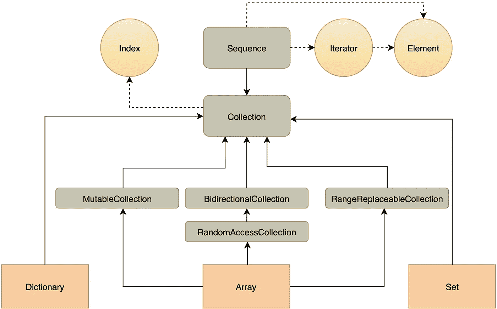

# Swift 收藏类型的演变

> 原文：<https://betterprogramming.pub/evolution-of-collection-types-in-swift-a409c15067b5>

## 理解使数组、字典和集合工作的协议


苏珊·d·威廉姆斯在 [Unsplash](https://unsplash.com?utm_source=medium&utm_medium=referral) 上拍摄的照片

Swift 中的三种主要收款类型— `Array`、`Dictionary`和`Set` —无需介绍。但是，如果您曾经探索过其中任何一个的协议一致性层次，您可能会注意到它可能相当长，而且似乎过于复杂。例如，对于`Array`，它可能看起来像下面这样(由于多个协议一致性，可以有多个路径，这不是最长的一个):

```
Sequence <- Collection <- MutableCollection <- Array
```

`Array`可用的大多数方法和属性都分布在这些协议上。但是`Array`的功能有这么多成熟阶段有什么意义呢？让我们从头开始，弄清楚每个阶段都引入了哪些新的语义和新的 API。

# 顺序

作为所有集合类型的根协议，`Sequence`可以说是一个原型集合，它只包含基本的雏形，可以发展成更多的东西。顾名思义，`Sequence`建模了一个值列表，您可以一次一个地按顺序遍历它。任何`Sequence`必须实现的唯一方法是`makeIterator()`，它返回`IteratorProtocol`的一个实例——与`Sequence`协议相关的类型。

`IteratorProtocol`又有唯一需要的方法`next()`，每次调用它时返回下一个元素，如果没有下一个元素，则返回 nil。顺便说一下，你可以让你的自定义类型同时符合`Sequence`和`IteratorProtocol`。然后你只需要实现`next()`，而`makeIterator()`会被自动推断出来。这个非常简单的机制正是一个`for-in`循环所利用的。因此，如果你正在`for`循环某个东西，这个东西就是`Sequence`。`for-in`句法当然不是必要的；你可以显式地使用迭代器。

所以，严格地说，`Sequence`不一定包含某种元素的列表；相反，它代表了某种抽象的能力，可以动态地连续生成它们。例如，您可以创建序列`OddNumbers`，其`Element`为`Int`。第一个元素是 1，每次调用`next()`都会将前一个元素加 2 并返回。使用这个基本序列也让我想起在一些老式的环境中从文件中读取。您一点一点地阅读它，直到发现文件结束符号，这类似于调用`iterator.next()`直到它返回`nil`。

虽然这些基本的`Sequence`看起来非常简单，但是它们足以开发成一个丰富和繁荣的 API，可以免费用于任何序列。标准库为大量有用的操作提供了默认实现，从搜索(`contains()`、`first(where:)`等)开始。)并以`filter`、`map`和`reduce`结尾——这些都是函数式编程的支柱。你也可以洗牌，反转，连接，分割你的序列，删除它的元素，提取前缀和后缀，等等。当然现在有了 Combine，你可以免费为你的序列得到一个`Publisher`。

关于`Sequence`协议有一个重要的免责声明:没有要求它是否会被迭代破坏性地消耗。也就是说，如果你已经在序列的一个实例上执行了一个`for-in`循环，然后在同一个实例上开始另一个循环，你不能确定它是否会继续迭代，或者重新开始，或者什么都不做——你得到的行为是不确定的。如果您确实需要这样的非破坏性迭代，`Collection`就在这里为您服务，我们将很快回到这个主题。

# 收藏品

`Collection`协议继承了`Sequence`*协议，增加了任何元素都可以通过其位置直接访问的要求，保证了对其元素更加精细和可控的管理。从语义上来说，集合模型是一个预定义的有限元素列表，每个元素都固定在一个特定的位置。它不像`Sequence`那样有迭代的能力。*

*给你另一个例子，`Sequence`可以被看作是你桌上的一堆文件，你只能从上到下浏览，检查每一项，直到你找到你要找的东西。相比之下，`Collection`反映了一些扩展的文件夹，每个口袋上都有标签、书签，甚至还有目录，以便更快地查阅。*

*为此，`Collection`引入了指数的概念。它声明了定义索引界限的`startIndex`和`endIndex`属性，以及推进索引的`index(after:)`方法。请注意，这些方法使索引适用于任意类型，而不一定适用于整数。`Index`是`Collection`协议的关联类型，对取代它的类型的唯一限制是`Comparable`。最后，至少有一个只读的[下标](https://developer.apple.com/documentation/swift/collection/1641358-subscript)用于访问给定索引处的元素。而且可以认为是`Collection`功能的基石。*

*此外，`Collection`声明并提供了下一批利用索引的现成 API 的默认实现。它不仅仅是通过索引访问，还包括前缀、后缀、切片、确定索引之间的距离等。甚至`count`最早出现在`Collection`。对于`Sequence`，我们只有`underestimatedCount`，根据定义，它小于或等于估计的元素数量，默认情况下是零。因为你永远不知道迭代器的`next()`什么时候会返回最终的`nil`。*

*与`Sequence`相比，索引访问自然意味着将`Collection`带到下一个级别的另一个需求。与我们对`Sequence`所做的不同，符合`Collection`的类型必须保证每次你用`for-in`循环(或使用迭代器)遍历它时，迭代将重新开始，你将得到与上次相同的结果(当然，除非你没有在这两次循环之间修改它)。*

*在这个例子中，第一个`for-in`循环没有消耗数组的前两个元素。所以当你重新开始迭代时，它将从头开始。请记住，对于`Sequence`，第二个循环的行为没有定义。还要注意另一种迭代`Collection`的方法，除了从`Sequence`继承的基本方法之外，还使用了索引和下标。*

*让我在索引直接访问的能力和非破坏性、可重复遍历的需求之间的深层联系上多停留一会儿。从技术上讲，一些基本的索引访问不仅适用于`Collection`，也适用于`Sequence`。您可以声明一个单独的计数器，在每次迭代`for-in`时进行递增和检查，并在它达到您想要的索引值时触发您需要的逻辑。*

*但且不说有多尴尬，这对于真实案例来说几乎完全不可用，那只是因为默认情况下`Sequence`不能被重复遍历。通常情况下，如果索引是在之前的某个时间点保存的，就使用它，或者保存索引以备将来访问同一个元素。因此，这至少是一个两步过程——保存索引并以任何顺序使用索引——它假设您的对象列表足够持久和稳定，可以重复迭代。否则，即使技术上可以，也没有理由索引它。*

# *集合类型*

*到目前为止，我们主要讨论了协议结构和含义，但是让我们最终转向具体的集合类型。现在有了所有关于集合协议的神圣知识，您应该能够创建您的自定义类型，但是您可能不会。标准的(`Array`、`Dictionary`和`Set`)是非常详尽的，经过很好的优化，在 99.9%的情况下足够了。让我们看看它们是如何准确地被写入完整的收集协议层次结构的。*

**

*集合类型家族树*

*正如你现在所看到的，正如简介中所提到的，`Array`通过一些过渡形式与`Collection`协议相连。在这篇文章中，我们不会把重点全部放在它们上面，但是如果你想更深入地了解它们，你可以看看 Ole Begemann 的这篇[伟大的文章](https://oleb.net/blog/2017/02/why-is-dictionary-not-a-mutablecollection/)。但是这里让我们至少强调一些有趣的事情。*

*从上图可以看出，`Array`的一致性之一是`MutableCollection`协议。嗯，这似乎一点也不违反直觉；当然`Array`是可变的！但是如果你的第一个联想是像`append()`，或者`insert()`，或者`remove()`这样的方法，那就不是这样了。事实是，`MutableCollection`协议的文档假设改变其元素的值不应该影响`Collection`的长度。但显然，`append()`、`insert()`和`remove()`有，所以不在这个协议范围内。它们是在`Array`本身中声明和实现的。那`MutableCollection`呢？除了从`Collection`继承的只读访问之外，主要是关于`subscript`的写访问。顺便说一下，当我们讨论数组下标的时候，你可能会对我的前一篇文章感兴趣，这篇文章揭示了数组工作原理中隐藏的一个细节。*

*这也是为什么`Set`实际上是可变的，绕过`MutableCollection`并立即符合`Collection`。但是`Dictionary`呢？它确实有一个[下标](https://developer.apple.com/documentation/swift/dictionary/2885650-subscript)来设置键的值，替换之前的值，因此不会影响大小。那么，这有什么问题呢？*

*好吧，这里出现了另一个微妙之处，是时候更仔细地看看字典的`Index`了。这个乍一看有点纠结，但是`Dictionary`里的`Key`和`Collection.Index`没有关系，就像`Value`和`Sequence.Element`完全没有关系一样。所以如果你声明，比如说，`Dictionary<Int, String>`，它的`Key`会是`Int`，它的`Value`是`String`，它的`Element`是元组`(key: Int, value: String)`。*

*而`Index`呢？它是一个[单独的结构](https://developer.apple.com/documentation/swift/dictionary/index)，在字典中内部声明，在我们的例子中是`Dictionary<Int, String>.Index`。这个结构基本上保存了所有与哈希相关的东西，这些东西是`Dictionary`的内部实现成为哈希表所依赖的。顺便说一下，类似的东西也适用于`Set.Index`，我们也很少直接使用。*

*所以，key 和值是特定于`Dictionary`的东西，它们属于它的实现，而不属于`Collection`协议的实现。因此，广泛使用的`Dictionary`的 get-set `subscript(Key)->Value?`与`Collection`协议要求的只读`subscript(Index) -> Element`没有任何关系。当然，后者对于`Dictionar`来说也还在发挥作用，你可以很好地使用它(以及其他所有继承了`Collection`的`Index`的操作)。但这不是我们通常会做的，因为`Key`和`Value`是为了让我们的生活更轻松。下面是总结所有这些的一小段代码:*

*顺便说一句，如果你想知道为什么`Dictionary`的下标是可选的，而`Array`的显然等价的下标不是可选的，那么你已经得到了答案——它们是不等价的。*

# *序列与集合——主题的更多变化*

*如果你还没有被上面的内容搞得不知所措，让我分享一些关于`Sequence`和`Collection`协议的相似和不同之处的推测。希望你能从接下来的章节中模糊的指控中获得一些实际的收获。*

*由于语义不同，这些协议也提供了性质稍有不同的操作。这在符合两种协议的每个具体集合类型的 API 之间创建了一定的角色划分。在设计自己的涉及集合的 API 时，感觉某种方法或属性更适合哪种协议可能会有所帮助。尽管在大多数实际情况下，你可以指定一个具体的类型，但有时你必须减少限制，使用`Collection`，或者甚至减少限制，使用`Sequence`，这取决于在这个特定的范围内，他们的 API 的哪个行为或部分是预期的或必要的。毕竟，让你的 API 尽可能的通用是一个很好的实践，如果明智的使用，它永远不会有坏处。*

*因此，你可能已经猜到，一般的经验法则是，当你对某些元素的位置有所了解或者需要获得这些知识以备将来使用时，主要使用`Collection`，而如果你可以从头开始浏览所有元素，那么`Sequence`就足够了。*

*但这里有一些进一步的思考。请注意，`Sequence`上最典型的操作涵盖了将众多元素作为一个整体来处理的情况，比如用`map`将其全部转换，用`reduce`将其全部消化，用`filter`将其浓缩，等等。即使当你搜索`Sequence`的单个元素时(例如，用`first(where:)`)，在内部它仍然逐个测试它们，所以它通常仍然作为一个列表与它们交互。*

*从数学上来说(以防万一你也喜欢把简单的事情复杂化)，这样的操作实际上是输入是一个元素列表，输出也是一个元素列表的函数。这只是一种特殊的情况，结果可能碰巧是一个空列表，或者它被强制修剪为只有一个元素。例如，`first(where:)`是访问序列中某个元素的主要方法，它只是`filter(where:)`的精简版本。如果过滤的结果是一个空列表，它将丢弃过滤结果中除第一个元素之外的所有元素，或者返回`nil`。并且，让我们说，`contains(where:)`只是另一种方式来说明检索到的元素列表的大小是否大于零。*

*相比之下，`Collection`的根本目的是给出一个明确而有保证的结果。索引下标是`Collection`API 的核心，它提供了一个且只有一个元素。如果没有这样的单一元素，它就会崩溃。所以它不是可选的，不像`Sequence`的大多数语义对应的方法。这代表了从一系列元素到一个单一且必须的元素的投影的数学思想。同样，这不是一个严格的规则或定义，而更像是试图找到一些模式和规律。*

*另一个要再次提到的区别是，只有使用`Collection`你才能首先获得知道它的元素数量*的能力。*用`Sequence`是不可能的，因为你永远不知道它上面的迭代什么时候会到达最后一个元素。出于同样的原因，要知道`Sequence`在概念上是无限的，所以遍历它和使用它的大部分方法(内部仍然包含遍历)都不太安全。迭代器的`next()`方法可能会一直返回非零值，直到时间结束。当使用标准库中的序列时，你不太可能遇到这种情况，但是当处理一个未知的序列时，你不能 100%确定你不会陷入某个方法中。*

*看起来你唯一可以依赖的方法是那些处理有限前缀的方法(比如`dropFirst(Int)`和`prefix(Int)`)。顺便说一下，不知道序列的大小还会阻止您访问最后一个元素和任何包含后缀的逻辑。(好吧，坦白说，`Sequence`里还是有`suffix()`和`dropLast()`的方法，但是它们需要刻意限制接收者为有限的，在这里理论上有些不协调)。*

*今天最后要提到的是性能。除非另有说明，`Sequence`必须提供不差于 O(n)中的元素，而`Collection`必须使达到最高的 O(1)，这是索引访问的另一个优点。然而，性能-内存权衡的伟大定律预测`Collection`在内存方面更昂贵。当然，这一切都取决于具体的实现，但是作为一个概念，是的，这来自于重复访问的需求。这是一种松散的类比，但是`Collection`可以被认为更面向状态(事实上，处理索引意味着保存状态)，而`Sequence`更符合函数式方法。*

*呼，这就是我想告诉你的。如果你跟踪了这么远，我应该为能让你注意这么久而感到骄傲！在评论中分享你的想法和问题。感谢您的阅读，下次再见。*