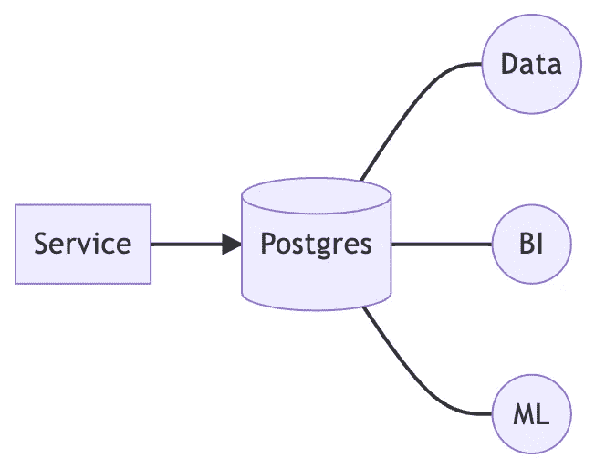
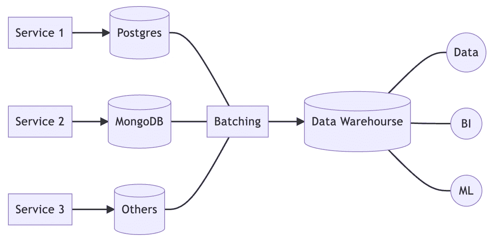
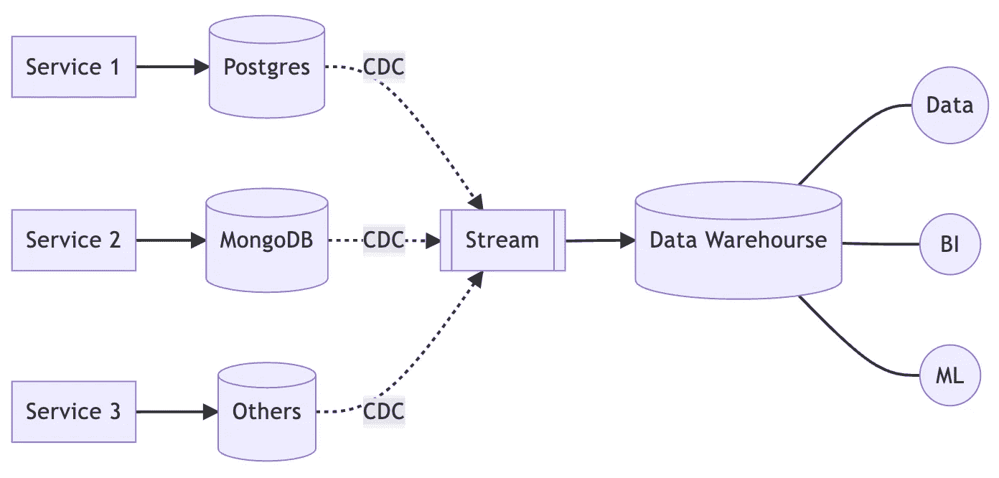
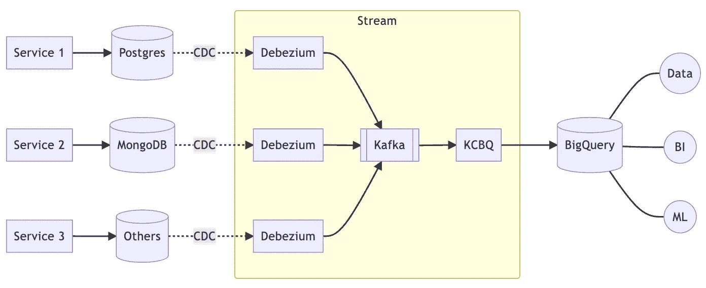
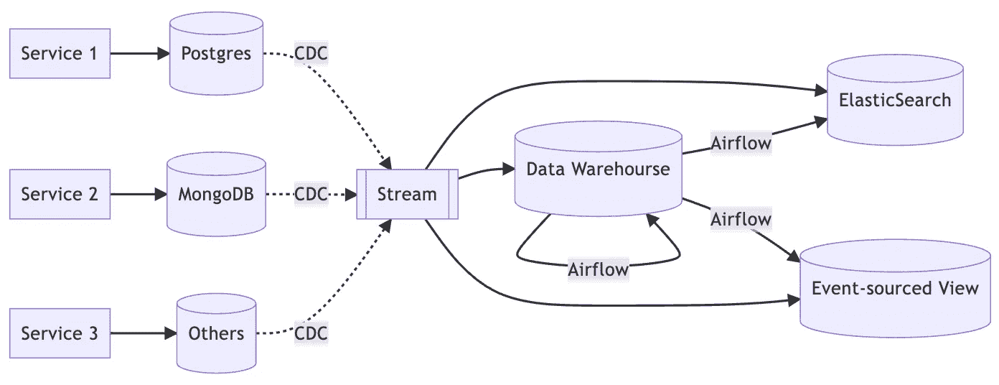
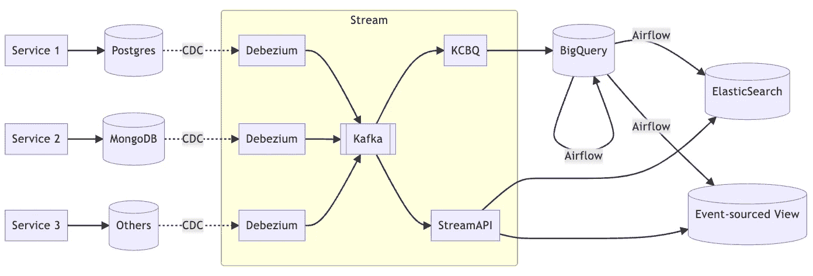
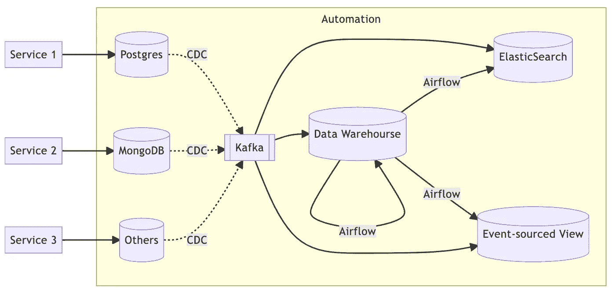

# 进化数据基础设施

> 原文：<https://betterprogramming.pub/evolutionary-data-infrastructure-4ddce2ec8a7e>

## 从整体到自助服务平台

照片由[米切尔罗](https://unsplash.com/@mitchel3uo)在 [Unsplash](https://unsplash.com/photos/UiSU4AUcQEA)

所有系统都是从一个小整体开始的。最初，当资源和人力不足时，我们不得不选择整体架构，即使是数据基础架构也不例外。

但是随着需求的增加，有越来越多的场景是当前架构无法实现的，因此系统必须演进。系统的每一次进化，都是为了解决遇到的问题，所以需要了解需要考虑的不同方面，用最高效的工程方法来实现目标。

在本文中，我们仍将像以前一样，从一个整体开始。

*   [从独石转向 CQRS](https://medium.com/interviewnoodle/shift-from-monolith-to-cqrs-a34bab75617e)

但是这一次，我们的目标不是服务于一个生产环境，而是提供所有生产环境背后的数据基础设施。

数据基础设施是一个存储各种数据的“地方”，无论是结构化数据还是时间序列数据，甚至是原始数据。这些大数据(它们确实很大)的目的是为数据分析、商业智能或机器学习提供材料。

除了内部使用，还可能有面向用户的功能，例如，电子商务网站上的推荐产品列表。推荐功能是大数据最常用的客户场景，比如电商网站的商品推荐，Youtube 这样的视频平台的视频推荐。所有这些都是在存储各种用户动作后，分析、汇总、编译的结果。

知道今天的话题后，我们开始工作吧。

# 整体建筑

让我们从整体架构开始。

无论服务是什么，典型的整体架构都是一个与数据库配对的服务。所有的数据分析、商业智能和机器学习都直接在这个数据库上运行。

这是最简单的做法，但也是所有产品的开始。

为什么我们要以整体风格展示它？多做点不是更好吗？

嗯，如果产品在流行之前就死了，那么整块就足以保持完整的功能。为了避免过度设计和投资成本激增，我们更愿意从最简单的概念验证开始。

当然，这种架构肯定会遇到问题。有三个常见问题。

1.  分析会影响生产绩效。
2.  如果引入微服务，对每个微服务的数据库的运行分析就会受到影响。
3.  执行跨服务分析非常困难。

各种分析不可避免的占用大量数据库资源，客户直接感受到那段时间的性能差。

此外，当产品需求增加时，我们通常采用微服务进行快速迭代，这意味着创建了许多服务和数据库配对。为了能够分析各种产品需求，有必要在每个数据库上构建几个分析框架。

此外，即使可以单独分析每个服务，我们也无法轻松获得全局视图，因为分析是相互独立的。

因此，有必要进行第一次进化。

# 成批处理

我们有两个目标，首先是拥有独立的数据存储，这样它就不会直接影响生产环境，其次是能够执行跨服务分析。

为了实现这些目标，我们建立了一个集中的数据仓库，这样所有的数据都可以存储在一个地方。所有分析都从每个服务的数据库迁移到数据仓库。

我们还需要一个批处理角色来收集数据，甚至定期预处理数据，以便数据仓库不仅包含原始数据，还包含结构化数据，从而加快分析速度。

对于批处理，我推荐使用 [Apache Airflow](https://airflow.apache.org/) ，它易于管理，易于为各种 Dag 编写脚本，以满足多个批处理场景的需求。

这种架构简单但功能强大，足以处理各种各样的分析和报告场景。然而，有两个缺点不容易解决。

1.  缺乏实时性
2.  缺乏模式

由于周期性的批量任务，我们无法进行实时分析。如果我们每小时运行一次任务，那么我们在数据仓库中看到的数据是前一小时数据的快照。

此外，批处理任务需要了解每个服务的数据模式，以便正确获取数据并将其保存到相应的仓库表中。假设我们的数据仓库是 [GCP BigQuery](https://cloud.google.com/bigquery) ，仓库表中的模式也需要手工创建和修改。

当服务数量非常大时，仅仅了解模式就要花费大量时间，更不用说管理它了。

那么，让我们做第二次进化。

# 流处理

要解决实时问题，最直接的想法是使用流式架构。

首先，捕获服务的所有数据库更改，然后将更改发送到流，最后将流归档到仓库。

但是有办法解决模式问题吗？答案是，是的，通过 [KCBQ](https://github.com/confluentinc/kafka-connect-bigquery) 。

让我们仔细看看流的内部架构。

我们使用 [Debezium](https://debezium.io/) 来捕获每个数据库的更改，并将流发送到 Kafka，然后 KCBQ 订阅 Kafka 流，并将它们归档到 BigQuery。

值得注意的是，KCBQ 可以自动更新 BigQuery 的内部模式(需要启用设置，必须使用 AVRO 格式)。

在这个阶段，我们有一个完整的数据集来进行分析，我们有足够的数据来处理各种数据分析，无论是实时还是批量。然而，在前一阶段，我们能够通过批处理预处理来加速分析，以生成结构化数据，我们仍然希望保留这种能力。

此外，尽管数据分析工作正常，但我们目前无法支持外部客户访问数据。主要原因是数据仓库的响应时间慢，当我们需要与外部客户进行交互时，这是一个很大的问题。例如，如果一个推荐列表需要 5 分钟才能生成，那么推荐的有效性将接近于零。

此外，当提供给外部客户的功能数量增加时，数据仓库可能难以处理。比如搜索是常用功能，但是数据仓库的搜索性能很差。

因此，我们必须整合批次处理和串流处理，让这个资料基础架构可以灵活地支援各种以客户为导向的功能。

# 集成架构

我们已经有了一个批处理架构和一个流架构，现在让我们将它们适当地集成起来。

我们仍然通过流将每个数据库的更改归档到数据仓库，但是我们定期使用批处理来预处理原始数据，以便进行数据分析。

同时，流框架不仅可以归档，还可以聚合流以生成面向客户的实时数据存储。例如，`ElasticSearch`通常用于搜索上下文，而基于事件的视图用于提供面向客户的功能，例如推荐列表。

但是这些功能通常也需要事实表，如果是静态的可以从数据仓库中迁移，否则需要通过[流丰富](/design-pattern-of-streaming-enrichment-17a9eb065eca)来实现。

因此，让我们进一步看看流架构的内部。

该框架与上一个基本相同，但有一个新的角色，`StreamAPI`。

`StreamAPI`中没有指定具体的框架，即使使用卡夫卡的原生库也没问题。

但是如果使用流处理框架可以节省很多实现工作，比如数据划分、容错、状态持久化等等。

因此，我仍然建议使用流框架，如[阿帕奇弗林克](https://flink.apache.org/)或[阿帕奇卡夫卡流](https://kafka.apache.org/documentation/streams/)。

此时，整个数据基础设施完全正常运行。无论是对于内部数据分析，还是对于外部客户，这个框架都能满足要求。

然而，这种架构并不意味着一劳永逸。

接下来的问题是管理问题。到目前为止，我们需要做的最常见的任务不是特性开发，而是这么多中间件的配置和运行。对于每个新服务，我们需要构建`Debezium`，添加 Kafka 主题，配置流框架，确定最终的`sink`。此过程也适用于新功能请求。

此外，管理所有数据存储之间的权限也是一个问题。当一个新人进入组织时，框架中的每个参与者都必须授予一些权限。类似地，当一个新的服务或特性启动时，需要管理服务之间的权限。

更重要的是，当所有数据被转储到数据仓库时，我们必须加密或屏蔽 PII(个人身份信息)以符合法律要求，如 GDPR。

这些任务依赖于大量的手工工作或半自动脚本，这无疑给繁忙的组织增加了沉重的负担。

# 自动化(自助服务平台)

因此，有必要建立一个完全自动化的机制来解决数据基础架构的所有管理问题。

当然，这种自动化机制在理想情况下应该是自助式的，我见过的最成功的例子是网飞的 Keystone。

这个自动化平台涉及到非常深的技术细节，不是一篇文章可以简单说明的，所以我只提供这个平台应该具备的功能，至于实现细节就要看各个机构的实践了。

在基础设施层面，为了自动建立设置和监控，有必要通过 IaC(基础设施即代码)实现全自动部署。

为了解决数据所有权的问题，有三个与权限相关的控制也应该包含在 IaC 中，如下所示。

*   身份访问管理
*   基于角色的访问控制，RBAC
*   访问控制列表

隐私问题需要一个易于使用的界面，可以配置该界面来确定哪些数据必须被屏蔽。数据丢失预防，又名 DLP，也是当今非常流行的数据隐私话题。

从上面的描述可以看出，要实现一个全自动化的管理平台，有很多实现细节，没有捷径——实现，实现，很多实现。

# 结论

这篇文章是关于通过不断的解决问题，将一个整体架构发展成为一个完全自动化和全功能的数据平台。

但是在演进过程中还是有很多细致的技术选择，比如用什么数据存储，什么批处理，什么实时处理都是值得关注的。

这样的进化需要大量的人力资源和时间，不太可能一步到位。当且仅当我们遇到无法解决的问题时，我们将被迫进入下一阶段。

事实上，即使我们实现了自动化平台，进化仍然没有结束。

当各种业务需求、各种产品和服务都不得不依赖单一的数据工程师部门时，那么人力资源就会遇到瓶颈。怎么解决？

由于我们有一个全自动化的管理平台，我们可以让每个产品部门维护自己的数据仓库和数据管道。数据工程师成为平台解决方案的提供者，而不是数据的所有者。

> *数据网格诞生。*

然而，数据网格实现有许多不同的方法，不存在一刀切的架构模式。

这完全是关于数据基础架构的演变。如果有什么特别的做法，欢迎随时分享给我。