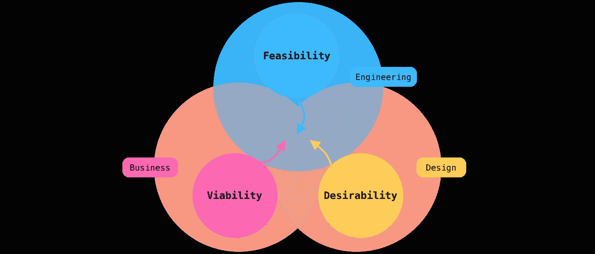
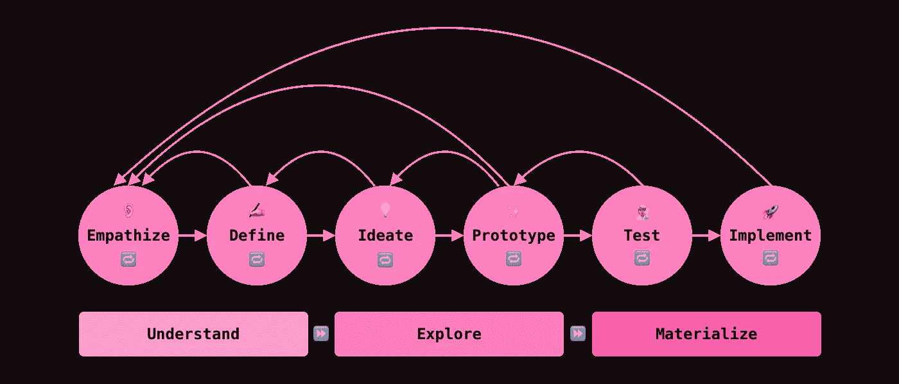
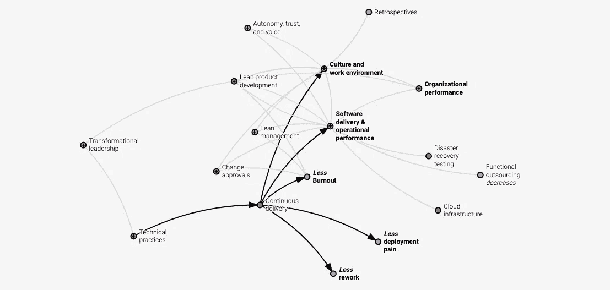
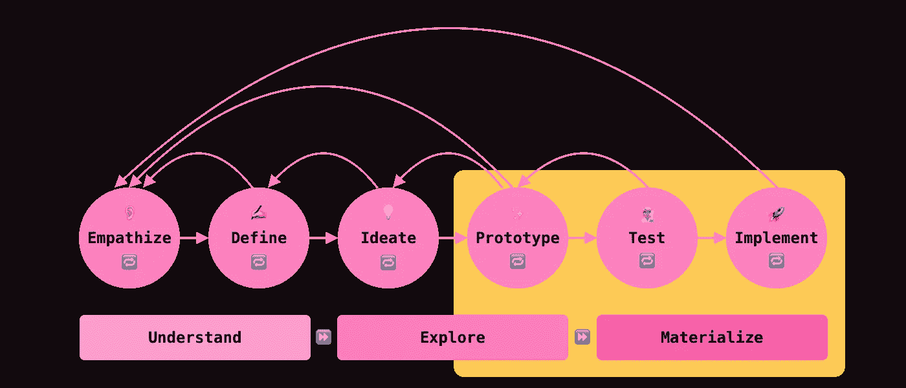
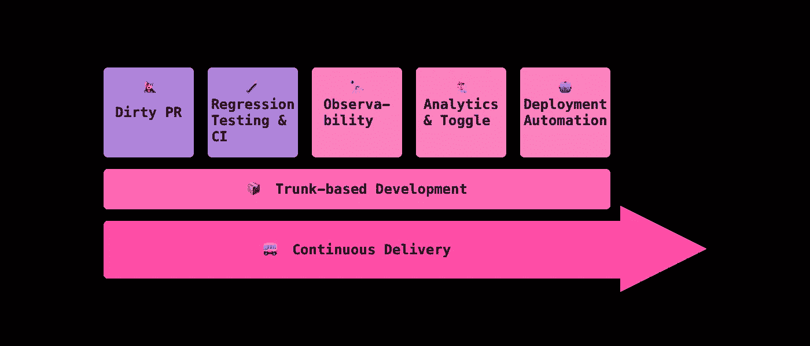
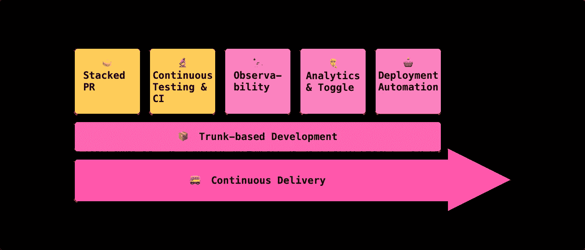

# 前首席工程师设计思维和持续交付指南

> 原文：<https://betterprogramming.pub/ex-principal-engineers-guide-to-design-thinking-and-continuous-delivery-c4381196467f>

## 大型科技公司和独角兽创业公司如何在保持代码质量的同时成功进行敏捷产品开发？


作者图片

# TL；速度三角形定位法(dead reckoning)

*   我们将讨论什么是设计思维。
*   我们将讨论什么是连续交货。
*   我们将揭示如何利用设计思维和持续交付来构建敏捷和高质量的产品。
*   成吨的学习资料！

设计思维和持续交付是产品创新的惊人方法。它们在敏捷环境中没有被广泛讨论，但是它们的协同对于构建人们喜爱的产品是至关重要的。

# 什么是设计思维

设计思维是关于解决问题的。像 Airbnb、网飞和优步这样的公司使用设计思维来深入了解他们的用户，并构建功能来满足他们的需求。

> “设计思维是一种以人为中心的创新方法，它利用设计师的工具包来整合人们的需求、技术的可能性和商业成功的要求。” *—* [*迪姆·布朗，Ideo 的执行主席*](https://designthinking.ideo.com/)

我非常喜欢它，因为它在创新过程中具有包容性。它从理解用户开始。目标是从人的角度用一个可取的、技术上可行的解决方案来解决问题，同时抓住市场机会。



设计思维是一种以人为中心的创新方法。

# 如何练习设计思维

设计思维遵循理解、探索和具体化的流程。有六个阶段:

*   换位思考:进行研究，了解你的用户。
*   定义:结合研究，找出问题所在。
*   想法:集思广益，大胆创新，解决问题，实现商业目标。
*   原型:从想法的子集构建精益解决方案。
*   测试:回到你的用户那里，收集反馈。
*   实现:将您的解决方案逐步交付给您的用户。



设计思维包括六个阶段。

如你所见，设计思维通过[产品发现](https://www.producttalk.org/2018/08/effective-product-discovery/)、[测试](https://hbr.org/1975/05/when-where-and-how-to-test-market)和[构建](https://www.mojotech.com/blog/building-the-right-product-vs-building-the-product-right/)进行迭代。你可以灵活运用设计冲刺的[在短短一周内运行它，或者你可以迭代和重复各个阶段，直到你找到适合你的](https://www.thesprintbook.com/the-design-sprint)[产品市场的](https://pmarchive.com/guide_to_startups_part4.html)。

你可以阅读更多关于设计思维过程的信息:

*   尼尔森诺曼集团[设计思维 101](https://www.nngroup.com/articles/design-thinking/)
*   [设计思维，麻省理工学院斯隆管理学院解释](https://mitsloan.mit.edu/ideas-made-to-matter/design-thinking-explained)
*   《哈佛商业评论》的[为什么设计思维有效](https://hbr.org/2018/09/why-design-thinking-works)
*   [IDEO 的设计思维](https://designthinking.ideo.com/)

现在，在工程中，我们想要实现的是拥有基础设施和工作流程来实现如此快速的产品迭代，以便多个团队可以快速、大规模地原型化、测试和实现您的产品。这就是持续交付可以帮助我们的地方。

# 什么是持续交付

持续交付将工作软件放在第一位。快速、安全、可持续地发布软件[是一种实践。](https://cloud.google.com/architecture/devops/devops-tech-continuous-delivery)

> “连续交付(CD)是一种软件工程方法，其中团队在短周期内生产软件，确保软件可以在任何时候可靠地发布，并且在发布软件时，无需手动完成。
> 
> 它旨在以更高的速度和频率构建、测试和发布软件。该方法允许对生产中的应用程序进行更多的增量更新，从而有助于降低交付变更的成本、时间和风险。*——*[*百科*](https://en.wikipedia.org/wiki/Continuous_delivery)

集成连续交付有几个好处。我们可以从 [DORA State of DevOps 研究项目](https://www.devops-research.com/research.html)中看到绩效和文化方面的明显优势，该项目总结了七年来对高性能技术交付和组织成果的研究。下面是截图:



截图:[多拉州 DevOps 研究项目](https://www.devops-research.com/research.html)

这个想法是要有一个自动化的过程，在整个产品周期中不断地构建、测试、分析、集成和部署。如果过程中出现任何错误，该过程将阻止您的产品更改集成到生产中，这样就不会影响您的用户。它带来了更高水平的[心理安全](https://rework.withgoogle.com/print/guides/5721312655835136/)，使我们能够测试我们的原型并收集反馈和数据，而不用担心破坏产品。

# 如何练习连续交货

根据 devo PS 2021[加速状态，](https://services.google.com/fh/files/misc/state-of-devops-2021.pdf)[几个能力因素](https://cloud.google.com/architecture/devops)表示软件交付和组织绩效。在本文中，我想强调敏捷产品开发环境中的一些技术能力:

*   基于主干的开发:开发人员小批量工作，频繁合并到主干中。
*   持续测试:在整个交付周期中，QAs 尽早且频繁地进行测试。
*   持续集成:触发一系列提供早期反馈的自动化测试。
*   可观察性实践:在整个交付周期中监控您的系统。
*   部署自动化:缩短交付时间并减少部署错误。

您可以阅读有关持续交付的概念、最佳实践和 KPI 的更多信息:

*   [加速:DevOps 2019 状态—朵拉&谷歌云](https://services.google.com/fh/files/misc/state-of-devops-2019.pdf)
*   [加速:DevOps 2021 状态—多拉&谷歌云](https://services.google.com/fh/files/misc/state-of-devops-2021.pdf)
*   [DevOps tech:持续交付—谷歌云](https://cloud.google.com/architecture/devops/devops-tech-continuous-delivery)
*   [软件交付指南—马丁·福勒](https://martinfowler.com/delivery.html)
*   [SRE 学校— LinkedIn](https://linkedin.github.io/school-of-sre/)

既然我们已经讨论了设计思维和持续交付，我们就准备看看它们如何一起工作来实现更高的速度和代码质量。

# 在产品开发中把它们放在一起

持续交付处于原型、测试和实现阶段。



持续交付在设计思想的原型、测试和实现阶段都扮演着重要的角色。

我们分开来看相。

# 在原型和测试阶段

这两个阶段最重要的关注点是学习和速度。你想尽可能快地把你的原型放在你的用户面前来测试你的想法和假设，这样你就可以根据你的学习来设计下一个迭代。

为了优先考虑学习和速度，我们可以这样设计连续交付流程:



原型和测试阶段的持续交付优先考虑速度和学习。

我们保留了大部分最佳实践，但做了一些修改:

## 脏请求

**Dos**

*   尽快组装出原型。
*   模块化代码更改。
*   用一个明显的前缀标记你的原型模块。喜欢`UNSAFE_EXPERIMENT_`。
*   没有必要编写测试。
*   关注代码评审中的功能。

**不要做**

*   不要完美地编码。
*   不要用冗长的代码审查来阻止发布。
*   不要破坏建筑。

## 回归测试和持续集成

**Dos**

*   守护主用户旅程。例如，电子商务网站中的结账流程。
*   为了提高速度，只运行基线回归测试。
*   通知连续交货过程中出现警告。

**不要做**

*   不要让测试失败的原型投入生产。
*   不要降低测试覆盖率。

## 分析和功能切换

当你的原型是为[定量研究](https://www.nngroup.com/articles/quant-vs-qual/)而设计时，它需要改变产品中的代码，这样你就可以在更大的范围内分析数据。这就是分析和[功能切换](https://www.martinfowler.com/articles/feature-toggles.html)有用的地方。

特性切换使您能够灵活地针对用户群进行测试，分析为您提供聚合数据来跟踪您的 KPI。

这些阶段中功能切换的目的是收集数据并从目标用户群中学习。确保你没有使用切换来隐藏原型或者特性。这违背了学习的目的。

# 在实施阶段

当你处于实施阶段时，你已经测试了原型，并正式开始实施你的一个想法。恭喜你！

与原型和测试阶段不同，我们希望优先考虑持续交付的最佳实践，而不是速度:



实施阶段的持续交付优先考虑持续集成。

## 堆叠拉取请求

**Dos**

*   提交[小代码修改](https://github.com/google/eng-practices/blob/master/review/developer/small-cls.md) ( < 400 行)。
*   使用一系列[拉动式请求](https://www.michaelagreiler.com/stacked-pull-requests/)而不是大量的拉动式请求来实现你的产品或功能。
*   写好公关描述。[有系统或设计图者优先](https://engineering.atspotify.com/2022/07/software-visualization-challenge-accepted/)。
*   确保你有一个共享的[代码评审标准](https://google.github.io/eng-practices/)。
*   编写全面的测试。
*   标准化和自动化[编码风格](https://en.wikipedia.org/wiki/Programming_style)。

**不要做**

*   不要提交大的代码更改。这使得代码审查更加困难和缓慢。
*   不要以评审者的身份延长代码评审。尽快行动(接受、拒绝或辞职)。
*   不要形成一个做守门的精英群体，阻挡代码评审。

您可以找到有关拉式请求作者和审阅者的最佳实践的更多信息:

*   [代码审查的最佳实践— SmartBear](https://smartbear.com/learn/code-review/best-practices-for-peer-code-review/)
*   [好的代码评审，更好的代码评审——Gergely Orosz](https://blog.pragmaticengineer.com/good-code-reviews-better-code-reviews/)
*   [谷歌如何进行代码审查——来自谷歌文档的质量保证提示——Kealan Parr](https://www.freecodecamp.org/news/what-google-taught-me-about-code-reviews/)
*   尊敬的代码审查——谷歌浏览器
*   [激进的代码审查—博迪](https://blog.devgenius.io/aggressive-code-review-e5f8869f3967)
*   [利用研究让代码审查更加公平——谷歌](https://developers.googleblog.com/2022/06/Using-research-to-make-code-review-more-equitable.html)

## 持续测试和持续集成

Dos

*   设置一个高的测试覆盖率阈值。
*   标准化和自动化[编码风格](https://en.wikipedia.org/wiki/Programming_style)。
*   编写端到端测试来保护主要用户的旅程。

**不要**

*   不要降低代码覆盖率。
*   不要跳过连续交付自动化中的步骤。
*   不要满足于缓慢的自动化。交付周期对于产品交付和您的业务至关重要。

# 最后的想法

设计思维提供了一个以人为中心的框架来迭代产品创新，而持续交付创建了一个有效且可预测的基线来保护代码质量。

在许多公司中，代码质量经常失去其对交付周期的优先权。通过遵循设计思维，我们可以快速构思和测试原型，以了解市场和用户。通过集成持续交付，我们拥有了大规模协作和测试的技术能力，而不会破坏我们的产品。

# 参考

*   文章:[设计思维 101 —尼尔森诺曼集团](https://www.nngroup.com/articles/design-thinking/)
*   文章:[设计思维，讲解——麻省理工斯隆管理学院](https://mitsloan.mit.edu/ideas-made-to-matter/design-thinking-explained)
*   文章:[为什么设计思维有效——哈佛商业评论](https://hbr.org/2018/09/why-design-thinking-works)
*   文章:[设计思维— IDEO](https://designthinking.ideo.com/)
*   文章:[商业设计思维的 5 个例子——哈佛商学院](https://online.hbs.edu/blog/post/design-thinking-examples)
*   文章:[敏捷宣言背后的原则——敏捷软件开发宣言](https://agilemanifesto.org/principles.html)
*   文章: [6 有效产品发现的指导原则](https://www.producttalk.org/2018/08/effective-product-discovery/)
*   文章:[何时、何地以及如何测试市场——哈佛商业评论](https://hbr.org/1975/05/when-where-and-how-to-test-market)
*   不要“验证”设计；测试他们——尼尔森诺曼集团
*   文章:[构建正确的产品与构建正确的产品— MojoTech](https://www.mojotech.com/blog/building-the-right-product-vs-building-the-product-right/)
*   文章:[唯一重要的事——马克·安德森](https://pmarchive.com/guide_to_startups_part4.html)
*   本书:[设计冲刺——杰克·纳普&约翰·泽拉特斯基](https://www.thesprintbook.com/the-design-sprint)
*   书籍:[灵感:如何创造顾客喜爱的科技产品——马蒂·卡甘](https://www.goodreads.com/book/show/35249663-inspired)
*   文章: [DevOps tech:持续交付—谷歌架构中心](https://cloud.google.com/architecture/devops/devops-tech-continuous-delivery)
*   维基百科:[连续发货](https://en.wikipedia.org/wiki/Continuous_delivery)
*   文章:[加速状态 DevOps 2019 — DORA &谷歌云](https://services.google.com/fh/files/misc/state-of-devops-2019.pdf)
*   文章:[加速 DevOps 2021 状态—朵拉&谷歌云](https://services.google.com/fh/files/misc/state-of-devops-2021.pdf)
*   文章:[SRE 学校— LinkedIn](https://linkedin.github.io/school-of-sre/)
*   Article: [Project Aristotle:了解团队效率— re:Work](https://rework.withgoogle.com/print/guides/5721312655835136/)
*   文章:[定量与定性可用性测试——尼尔森诺曼集团](https://www.nngroup.com/articles/quant-vs-qual/)
*   文章:[功能切换(又名功能标志)——皮特·霍奇森](https://www.martinfowler.com/articles/feature-toggles.html)
*   文章:[堆叠拉取请求:让代码评审更快、更容易、更有效——米凯拉·格雷勒博士](https://www.michaelagreiler.com/stacked-pull-requests/)
*   文章:[软件可视化—挑战，已接受— Spotify](https://engineering.atspotify.com/2022/07/software-visualization-challenge-accepted/)
*   文章:[谷歌工程实践文档—谷歌](https://google.github.io/eng-practices/)
*   维基百科:[编程风格](https://en.wikipedia.org/wiki/Programming_style)
*   文章:[好的代码评审，更好的代码评审——Gergely Orosz](https://blog.pragmaticengineer.com/good-code-reviews-better-code-reviews/)
*   文章:[谷歌如何进行代码审查——来自谷歌文档的质量保证提示——凯艾伦·帕尔](https://www.freecodecamp.org/news/what-google-taught-me-about-code-reviews/)
*   文章:[尊重代码审查——谷歌浏览器](https://chromium.googlesource.com/chromium/src/+/master/docs/cr_respect.md)
*   文章:[激进的代码审查—博迪](https://blog.devgenius.io/aggressive-code-review-e5f8869f3967)
*   文章:[利用研究让代码审查更加公平——谷歌](https://developers.googleblog.com/2022/06/Using-research-to-make-code-review-more-equitable.html)
*   文章:[代码评审的最佳实践— SmartBear](https://smartbear.com/learn/code-review/best-practices-for-peer-code-review/)

```
**Want to Connect?**This article was originally posted on [Daw-Chih’s website](https://dawchihliou.github.io/articles/ex-principal-engineers-guide-to-design-thinking-and-continous-delivery).
```