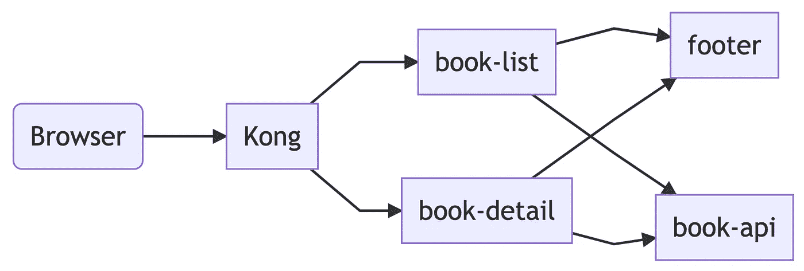

# 以孔为例微前端

> 原文：<https://betterprogramming.pub/example-micro-front-end-with-kong-ed001d601c0a>

## 构建微前端不必复杂——孔的一个应用实例

照片由[费迪南·斯托尔](https://unsplash.com/@fellowferdi?utm_source=unsplash&utm_medium=referral&utm_content=creditCopyText)在 [Unsplash](https://unsplash.com/s/photos/micro-front-end?utm_source=unsplash&utm_medium=referral&utm_content=creditCopyText) 拍摄

这一块的代码可以在 GitHub 上找到[。](https://github.com/HarryEMartland/kong-micro-front-end)

# 微前端(MFE)概述

[micro-frontends.org](https://micro-frontends.org/)是理解 MFEs 的一个很好的资源。对于这个示例应用程序来说，主要目标不是让一个整体服务于一个应用程序的所有页面。我们编写小的服务，每个服务处理一件事情。

# 按指定路线发送

完整的源代码可以在[这里找到](https://github.com/HarryEMartland/kong-micro-front-end)

由于您的应用程序被分成许多小的服务，您需要一种方法将请求路由到正确的服务。对于这个示例项目来说，Kong 可能有些过了，但它允许在实际系统中使用复杂的路由规则。本质上，它充当服务的反向代理，这些服务将为特定的路由生成内容。

在上面的例子中，我们将`/`路由到`book-list`服务，并将匹配`/book/\d+`的路由到`book-detail`服务。Kong 接受路径路由规则的正则表达式，允许配置是特定的，查找以`/book/`开始的请求，然后使用正则表达式`\d+`(至少一个数字)查找图书 id。这使得以`/book/`开始但不以数字结束的路由为将来的服务开放。

当我第一次建立孔的时候，我确实经历了一些困惑。默认情况下，Kong 不在路径上代理，因此`/book/\d+`正确地代理到了`book-detail`服务。然而，`book-detail`服务返回了一个`404`，因为它将请求视为`/`。添加`strip_path`参数后，一切正常。在某些情况下，不代理路由可能是有用的，例如，长的入站 URL 可能对下游服务隐藏。

# 体系结构

内置[美人鱼 JS](https://github.com/mermaid-js/mermaid)

这个应用程序有两个页面——一个列出书籍，另一个显示给定书籍的详细信息。这些页面由两个服务处理，`book-list`和`book-detail`。关于书籍的数据由`book-api`提供，它有两个端点，一个返回书籍名称和 ID 的列表，另一个返回给定 ID 的书籍详细信息。两个页面的底部都有一个页脚，页脚的 HTML 由`footer`服务提供。页面服务向`footer`发出 HTTP 请求，后者返回部分 HTML，然后可以嵌入页面。

# 提高

就目前的情况来看，这个演示相当基础。我的计划是为页面内容和路由增加基本的实验。我还想添加一些服务，将请求元数据添加到页面微服务的请求中。这两个特性都需要为 Kong 编写 Lua 插件。

Kubernetes 是目前部署应用程序的标准方式。我们应该能够像使用 k8s 资源声明应用程序定义一样声明我们的应用程序路由配置。这允许我们将所有的配置保存在我们的应用程序附近，并且在版本控制中。

通过在 GitHub 上查看[这个回购](https://github.com/HarryEMartland/kong-micro-front-end)来玩这个设置。