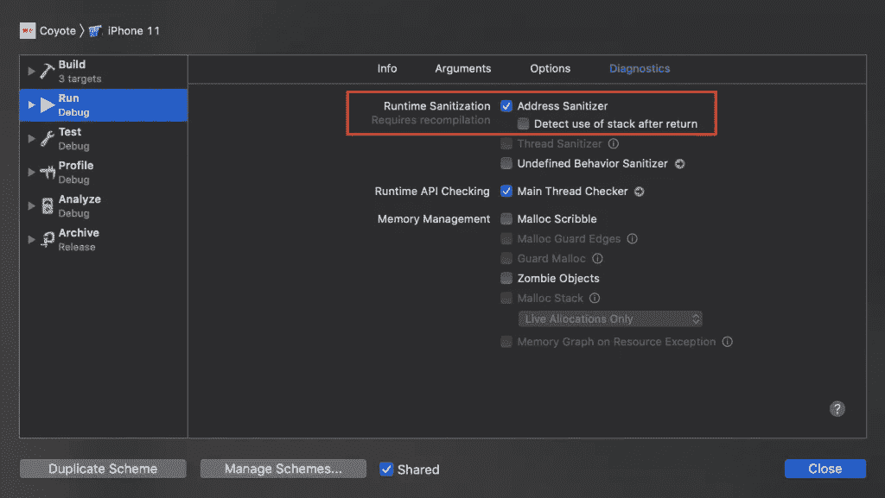

# EXC _ 坏 _ 访问崩溃错误:理解和解决它们

> 原文：<https://betterprogramming.pub/exc-bad-access-crash-error-understanding-and-solving-it-ba1fa424b748>

## 了解 Swift、地址杀毒器和线程杀毒器中的僵尸对象，并解决那些令人沮丧的崩溃

丹尼尔·科尔派在 [Unsplash](https://unsplash.com/s/photos/mac?utm_source=unsplash&utm_medium=referral&utm_content=creditCopyText) 上拍摄的照片

构建应用程序一开始一切顺利。你正在从头开始开发一个应用程序，它稳定且运行良好。在发布第一个版本后，你得到了关于正在发生的崩溃的第一个见解，其中一个被标记为 EXC _ 坏 _ 访问错误。寻找真相的旅程从这里开始。

第一个挑战是重现崩溃，这可能是困难的。当你做到这一点，它仍然是一个完整的另一个挑战，找出原因和解决办法。

# EXC 机场是什么意思？

EXC _ 坏 _ 访问是由于访问坏内存而引发的异常。我们一直在使用指向 Swift 中某个内存地址的内存指针。每当我们试图访问无效或不再存在的指针时，应用程序就会崩溃。这种指针也称为“悬空指针”。

这种糟糕的记忆的根本原因可能不同。引用内存可以被删除或释放，而指针的值永远不会更新。指针仍然指向被释放的内存的内存位置—它变成了一个悬空指针。

# 如何解决不良访问异常

Swift 中的 EXC _ 坏 _ 访问错误经常令人沮丧。事故的原因可能还不清楚。但是，如果您知道可能的原因，就很有可能快速找到不良访问异常的根本原因。

## 如果你不知道如何重现崩溃

如果你不知道如何重现崩溃，它就很难修复——这意味着你无法证实你真的修复了它。你可能知道崩溃发生在哪里，但你无法在你的应用程序中找到同样的崩溃。

确保运行完全相同的崩溃配置。如果可能，在相同的 iOS 和设备上安装正确的应用程序版本。这至少排除了由于配置不匹配导致崩溃不可重现。

如果您仍然无法重现崩溃，请尝试以下方法之一:

*   看看崩溃的面包屑，例如，在 [Firebase](https://www.avanderlee.com/workflow/firebase-crashlytics-breadcrumbs/)
*   联系发生崩溃的用户，要求提供诊断报告。在我的博客文章 [4 个让修复崩溃和错误变得更容易的技巧](https://www.avanderlee.com/workflow/fixing-crashes-bugs/)中阅读更多信息
*   观看 WWDC 2018 的[了解碰撞和碰撞日志](https://developer.apple.com/videos/play/wwdc2018/414/)会议，找出原因

## 使用地址杀毒软件

一旦您能够在本地重现崩溃，就该运行一些检查来验证您的代码不包含任何内存问题了。

地址杀毒程序，也称为 ASan，在运行时发现内存损坏和其他内存错误。苹果甚至建议在开发过程中持续使用 ASan:

> 内存问题经常是安全漏洞的原因。强烈建议您将地址杀毒软件作为软件鉴定流程的一部分。

可以在诊断下的方案设置中启用地址清除器:

启用地址清除器来查找 EXC 访问崩溃的原因

一旦启用，您将再次开始再现崩溃。每当地址杀毒软件检测到内存问题时，它都会暂停应用程序。查看它是否发现任何内存问题，解决它，并验证 EXC _ 坏 _ 访问是否仍然发生。

## 由于竞争条件，访问不良

数据竞争可能是坏的内存访问的另一个原因。因此，验证您的应用程序不包含任何线程问题是值得的。你可以使用 Thread Sanitizer 来做这件事，这在我的博客文章 [Thread Sanitizer 解释:Swift 中的数据竞争](https://www.avanderlee.com/swift/thread-sanitizer-data-races/)中有详细的解释。

# 僵尸物件怎么样？

经历过 Objective-C 和 bad 访问异常的开发人员可能会想到僵尸对象来解决内存问题。僵尸对象可以从与我们之前启用地址杀毒程序相同的诊断设置中启用。它使被释放的对象保持活动状态，如果与访问被释放的实例有关，这有助于找到内存问题的根本原因。

与 Objective-C 相比，Swift 在防止内存问题发生方面做得更多。您更有可能遇到崩溃，比如“试图读取一个无主引用”,而不是像在 Objective-C 中访问被释放的实例那样遇到糟糕的访问异常。在这种情况下，您可以启用僵尸对象，这样您仍然可以读取正在被访问的已释放内存的内存地址。

如果您在 Swift 中使用不受管理和不安全的指针，您更有可能遇到与内存相关的崩溃。干扰 Objective-C 框架也可能导致这些崩溃更频繁地发生。如果是这样，尝试在启用僵尸对象的情况下再次重现崩溃，并查看它是否会为您提供更多信息来修复崩溃。

# 结论

尽管 EXC _ 坏 _ 访问在 Swift 中比在 Objective-C 中发生得少得多，但它仍然是一个常见的崩溃。希望在读完这篇文章后，你能够更容易地解决这些问题。

如果您想进一步提高您的 Swift 知识，请查看 [Swift 类别页面](https://www.avanderlee.com/category/swift/)。

谢谢！