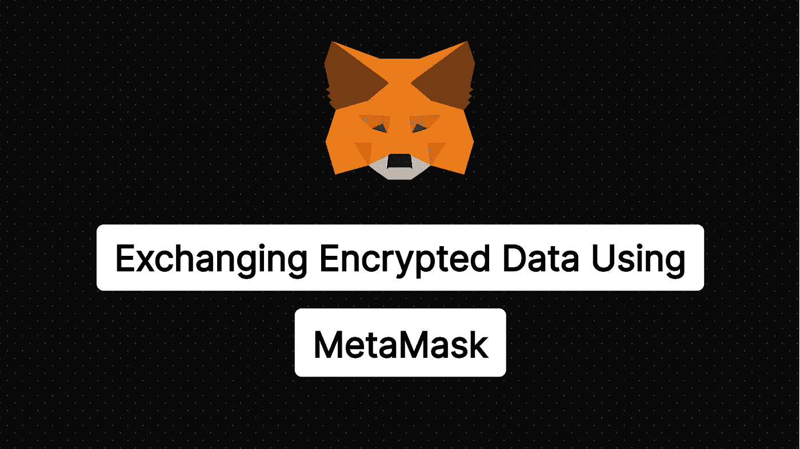
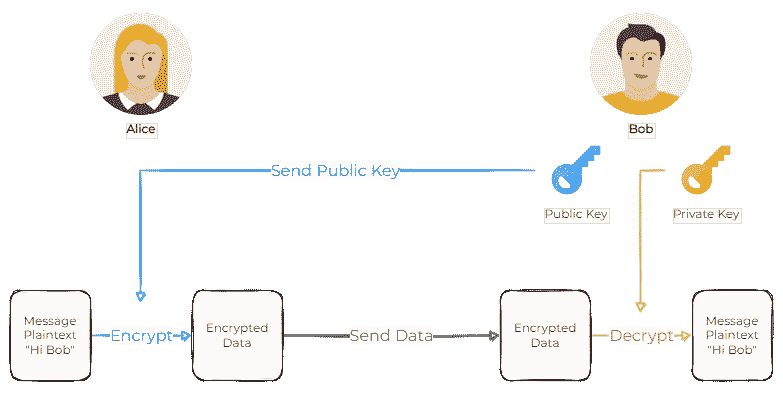

# 使用元掩码在区块链上交换加密数据

> 原文：<https://betterprogramming.pub/exchanging-encrypted-data-on-blockchain-using-metamask-a2e65a9a896c>

## 关于如何使用本机元掩码加密解密函数的教程



每个以太坊帐户都与私钥/公钥对相关联。一个自然的问题是如何使用这些密钥来加密数据？元掩码支持加密吗？本教程将展示一种用户友好的方式来使用元掩码在区块链上交换加密消息。

> 在本教程中，我一直使用 TypeScript 符号，因为我认为它有助于理解正在发生的事情。如果您使用 JavaScript，请从代码中删除这些类型。

在开发我们最新的项目[felt oken](https://feltlabs.ai/)——一种分散式保护隐私的机器学习工具——时，我们只需要在区块链的具体账户之间交换数据。每个帐户都与密钥对相关联，其主要目的是对交易进行签名。然而，它也可以用于加密。唯一的问题是，用户的钱包通常会处理这些密钥，要求用户复制他们的私钥是非常糟糕的。使用钱包提供的功能是一个更干净的解决方案。

# 公钥密码学

这里只是对公钥加密的一个快速回顾。核心思想是你有公钥和私钥，它们通过一些数学属性联系在一起。如果用公钥加密邮件，只有私钥可以解密。这意味着您可以与其他人共享公钥。然后他们可以用它来加密只有你能解密的信息。此外，加密的工作方式正好相反，通常用于签署消息。



基本非对称加密方案

对我们来说至关重要的是，如果 Alice 想要向 Bob 发送秘密消息，则需要以下步骤:

1.  鲍勃把他的公钥发送给爱丽丝
2.  Alice 使用 Bob 的公钥对消息进行加密
3.  爱丽丝将加密的信息发送给鲍勃
4.  鲍勃用他的私钥解密这条消息

不管数量多少，加密技术都是网络中至关重要的一部分，在我看来，每个开发人员都应该至少了解加密技术的基础知识。更多实用信息，我推荐以下书籍:

[](https://cryptobook.nakov.com/asymmetric-key-ciphers) [## 非对称密钥密码

### 密钥对生成(私钥+公钥)、加密算法(非对称密钥密码和加密方案，如…

cryptobook.nakov.com](https://cryptobook.nakov.com/asymmetric-key-ciphers) 

# 元掩码加密

幸运的是，MetaMask 中有一个原生的**解密**函数。另一方面，加密机制不是标准化的，所以这个功能很可能不被其他钱包支持。不管这些，让我们更详细地看看元掩码解密。

元掩码文档中提供了关于此函数的大多数信息:

 [## RPC API |元掩码文档

### MetaMask 使用 ethereum.request(args)方法包装 RPC API。该 API 基于一个由所有…

docs.metamask.io](https://docs.metamask.io/guide/rpc-api.html#eth-decrypt) 

> 我稍后也会提到这一点，但是文档忽略了这样一个事实，即只有当明文包含有效的 UTF-8 时，解密才有效。它对任意字节序列都不起作用！

## 1.鲍勃把他的公钥发送给爱丽丝

第一步是获得 Bob 的公钥，并将其发送给 Alice。这个密钥是加密所必需的，并且可以公开共享。事实上，您发送的每笔区块链交易都共享这个密钥。您可能已经知道帐户地址与公钥不同。地址是作为公钥的散列来计算的，使得仅仅基于用户地址来计算公钥变得不可能(在我看来，这是一个不幸的决定)。

我们首先需要从 MetaMask 请求一个公钥。我们可以使用 MetaMask 提供的函数`eth_getEncryptionPublicKey`。使用这个函数相对简单；把账户地址传过去就行了。该应用程序必须能够访问指定的帐户；传递随机账号会失败。

> **注意:** MetaMask 自动将`window.ethereum`对象注入网站。如果您使用某个库与 MataMask 通信，您可能需要以不同的方式访问这个对象(请求部分将是相同的)。

现在您已经有了公钥，您可以将它发送给 Alice，这样她就可以使用它进行加密。好消息是公钥符合`bytes32`变量；因此，您可以轻松地将其传递给智能合约。或者您可以使用任何其他方式来交换公钥。

## 2.Alice 使用 Bob 的公钥对消息进行加密

一旦我们有了公钥，我们就可以继续加密消息了。您需要从 MetaMask: `[@metamask/eth-sig-util](https://www.npmjs.com/package/@metamask/eth-sig-util)` 安装一个提供加密功能的包。然后，对于作为`Buffer`提供的加密数据，我们使用以下函数(公钥与上一步获得的相同):

**重要提示:** MetaMask 只解密有效的 UTF-8 序列，所以如果你想发送任意字节，你必须首先使用 base64 之类的东西对它进行编码。我用的是`[ascii85](https://www.npmjs.com/package/ascii85)`包提供的 base85。我试图尽可能地节省空间，因为我们将加密数据存储在智能合同中。

## 3.爱丽丝将加密的信息发送给鲍勃

加密消息的交换由您决定。我们使用智能合约来存储和交换加密消息。在您的智能契约中，您可能会使用`bytes`类型来存储加密的消息。我们还使用`[ethers.js](https://www.npmjs.com/package/ethers)`包与智能契约交互，这需要在向`bytes`参数发送数据时使用类型`number[]`。如果你想做同样的事情，你可以把缓冲区转换成`number[]`类型为:

```
numberArray = buffer.toJSON().data;
```

## 4.鲍勃用他的私钥解密这条消息

最后，当 Bob 收到加密的数据时，他可以重建原始对象并请求 MetaMask 为他解密。所有这些都是使用以下函数完成的(`data` buffer 是加密函数输出的缓冲区):

在用户体验方面，MetaMask 解密功能相当方便。它对应用程序完全隐藏了私钥。此外，用户不必手动处理私钥。唯一的缺点是弹出窗口总是要求用户批准解密。

# 额外收获:用 Python 实现

现在我们的情况是，我们也需要使用 Python 与智能合约进行交互。在这种情况下，我们需要用 Python 实现匹配的加密/解密函数。您将需要安装`[PyNaCl](https://pypi.org/project/PyNaCl/)`，它提供加密和解密功能。然后，您可以使用以下代码:

加密过程的技术细节我就不多说了。重要的是，这些函数产生的字节序列将与 JavaScript 实现中的缓冲区相同。如果你想对加密机制有更好的解释，请在评论中提问。

# 结论

我希望人们开始更多地使用这种加密机制，迫使钱包实现标准化。在整个教程中，我尽量不抱怨太多，但目前的状态确实是一团糟。每当我不得不处理一些设计决策时，它们都会让我大吃一惊。我想我们必须为用户友好的交互做出牺牲。

不管怎样，如果你喜欢这篇文章，考虑关注我和 [@FELT_Labs](https://twitter.com/FELT_labs) 。会有更多关于 Web3 开发的文章。