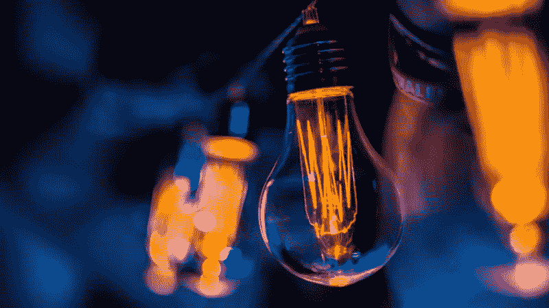
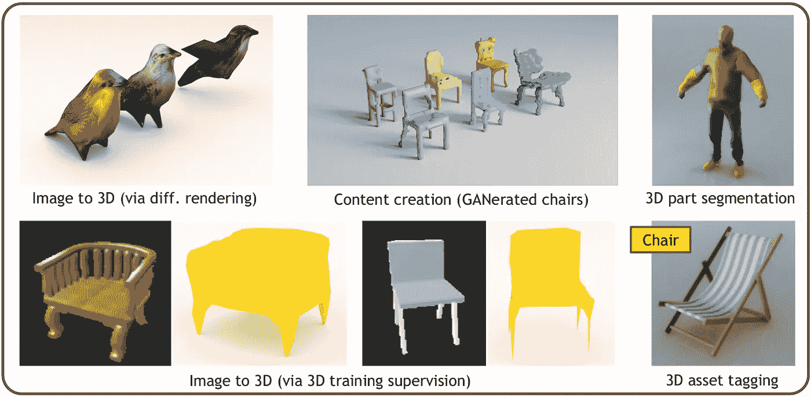
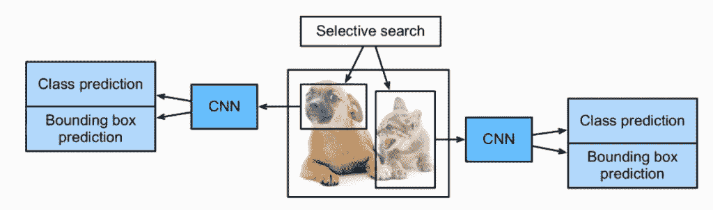
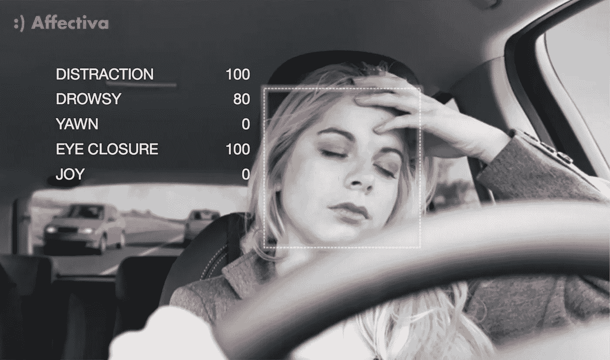
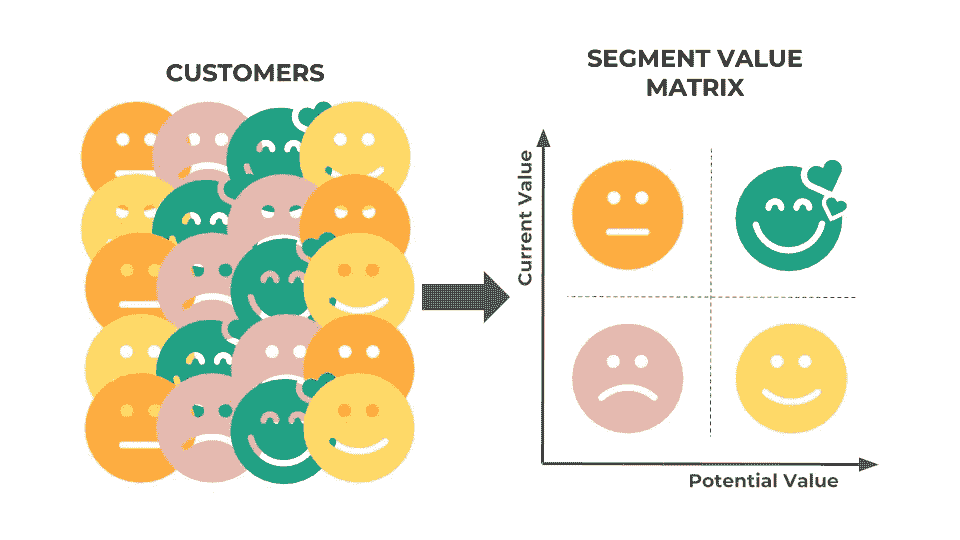

# 激动人心的数据科学项目想法来提升您的技能

> 原文：<https://betterprogramming.pub/exciting-data-science-project-ideas-to-brush-up-your-skills-54475993d413>

## 启发你的 7 个当代数据科学项目想法

项目一直被认为是从产生的结果中产生的可测量的改进，是实现个人或公司目标的锦上添花。

说到个人项目，你有没有发现在家学习很有挑战性？我们中的许多人都在同一条船上——在这些艰难的时刻，有太多的事情要处理，与我们的期望相反，学习已经退居二线。

那么，我们有什么回到正轨的选择呢？我们如何在现实世界中应用我们所学的数据科学知识？

选择一个开源数据科学项目并坚持下去是非常有益的。这不仅明确了你需要发展的主要领域，也为你指明了正确的方向。

这些也不是你日常的数据科学项目。这些计划专注于数据科学的特定领域，如计算机视觉或网络分析。该项目可能是一个数据集，一个推进了数据科学产业的前沿库，甚至是一个可访问的分析工具。

现在让我们通读一些新奇的数据科学项目想法，热心的数据科学家可以从中挑选。

# 1.图像转换为 3D

这是计算机视觉应用的一个极好的例子。曾几何时，将图像转换成三维照片需要对 Photoshop 等技术有广泛而深入的了解。由于深度学习和计算机视觉的进步，数据科学专业人员现在只需几行代码就可以完成这种转换。

这正是这个基于 GitHub 的项目所做的。它从单一的 RGB-D 输入图像创建 3D 照片。如果你更喜欢深度学习术语，这是“新视觉合成的多层表示，包括原始图像中模糊区域的幻觉颜色和深度特征”。

资料来源:analyticsvidhya

# 2.对象检测框架

[对象检测框架](https://neptune.ai/blog/object-detection-algorithms-and-libraries)数据科学项目在过去几年里取得了长足的进步。从在静态照片上制作简单的锚盒到检测电影中的动态对象，我们已经走过了漫长的道路。这就是计算机视觉的强大之处。

另一方面，对象识别和重新识别的思想的集成是缓慢的(至少可以这么说！).在这项迷人的工作中，研究人员通过利用一次多目标跟踪提供了一个简单的基线来解决这一差距。

来源:neptune.ai

# 3.驾驶员睡意检测

夜间开车不仅困难，而且危险。许多事故的发生都是由于驾车者在开车时睡着了。

因此，我们的研究有助于预防因这类事件而发生的大量交通事故。这个项目的主要目标是检测驾驶员在驾驶过程中何时变得疲劳和睡着。该项目利用 Python 编程语言创建了一个模型，可以实时识别疲劳司机的行为，并通过响亮的嘟嘟警笛发出警报。

作为一名数据科学家，你可以使用这个项目来构建一个“深度学习模型”，并使用它来对人眼不存在的照片进行分类。不仅如此，该模型中的另一个公式行也用于计算分数。

资料来源:tomtom

这个分数是由眼睑保持闭合的时间长短决定的。在整个驾驶过程中，分数会一直保持。如果分数超过某一点并达到某一标准，该模型将激活工作流自动化，导致警报开始大声蜂鸣。

# 4.根据图像创建卡通插图

如果 [**数据科学家**](https://www.dasca.org/data-science-certifications/21-powerful-tips-tricks-and-hacks-for-data-scientist) 没有很多空闲时间，这是一件值得关注的愉快的事情。它完全按照盒子上说的做:你给模型提供一个输入图像，它会把它变成卡通版本。你能猜到这个项目基于什么计算机视觉理念吗？

是的，生成对抗网络(GANs)是对抗网络(GANs)的一种。自 2014 年 GANs 向社区开源以来，我们所看到的巨大进步让我惊叹不已。有很多不同的框架可供选择，从 CycleGANs 到 StarGANs。

来源:https://towardsdatascience.com/

这个数据科学项目的创建者已经制作了一个预先训练好的模型，供您在 PC 上加载和运行。

# 5.浅析优步的拾音器

优步是否导致了纽约市高峰时间交通的恶化？

数据驱动的新闻网站 fivethirtyeeight，现归美国广播公司所有，作为四个回答之一回答了这个问题。如果你想提高你的数据分析和强大的分析能力，这是一个非常好的数据科学项目。

FiveThirtyEight 收集了优步的 rideshare 数据，并对其进行了研究，以更好地了解乘客趋势、它与公共交通的联系以及它对出租车的影响。然后，他们继续根据数据分析撰写全面的新闻报道。

# 6.认识人类行为

人体动作识别模型是本数据科学研究的主题。它将调查人们执行特定任务的短片。这个模型试图根据事物采取的行动对其进行分类。在这个数据科学项目中，你需要使用一个复杂的神经网络。之后，在包括这些短视频的数据集上训练神经网络。然后是来自加速度计的数据，这些数据与数据集相关联。首先，转换加速度计数据，然后是“时间切片”表示。接下来，您必须使用“Keras”(一个易于使用且功能强大的开源 Python 库)来训练、验证和测试使用这些数据集的网络。

# 7.客户细分

在数据科学学科中，这是最突出的项目之一。如今，数字营销是企业利用其在线营销业务达到营销目标的一种增强方法。因此，在开展营销活动之前，要确定不同的客户群。

来源:https://towardsdatascience.com/

客户细分是无监督学习最广泛的应用之一。公司现在可以很容易地识别不同类别的客户，使用聚类方法来锁定可能的用户群。基于诸如性别、兴趣领域、年龄和行为等共同因素对客户进行细分并生成群组。他们可以根据这些信息有效地推广每个客户群。该项目利用“K 均值聚类”，你将学习如何可视化性别和年龄分布。还可以考察客户的年收入和平均分数值。

# 展示您的数据科学项目有哪些方式？

现在和潜在的[数据科学专业人士](https://www.dasca.org)可以做到以下几点:

*   这应该包括在你的简历中
*   将这些连接到您的 Linkedin 帐户
*   保持您的 Github 帐户活跃
*   为你的作品集制作一个网站
*   你的计划的案例研究应该写下来并发表在博客/媒体上。

# 尾注

理解数据科学背后的理论至关重要。然而，基于项目的学习对于正确掌握数据科学流程至关重要。

完成部分或全部数据科学项目后，最好在继续更难的项目之前，再回头研究几个主题。

在你获得信心后，你可以继续进行更高级的项目。如果你想提高你的数据科学技能，你应该得到上述建议。