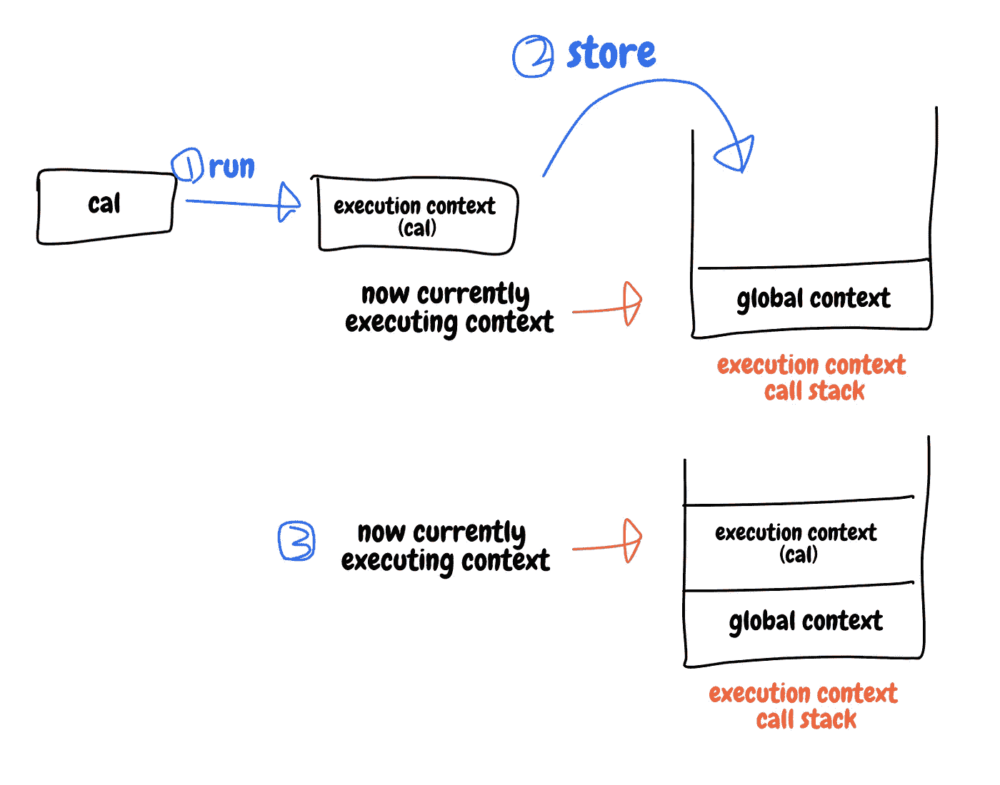
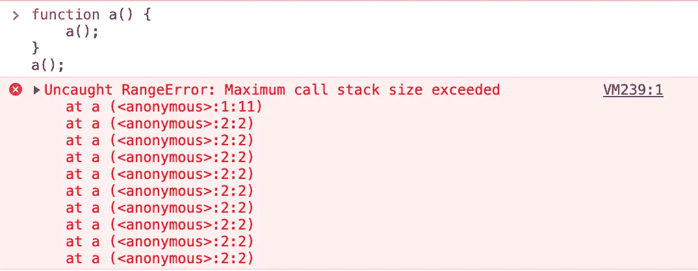
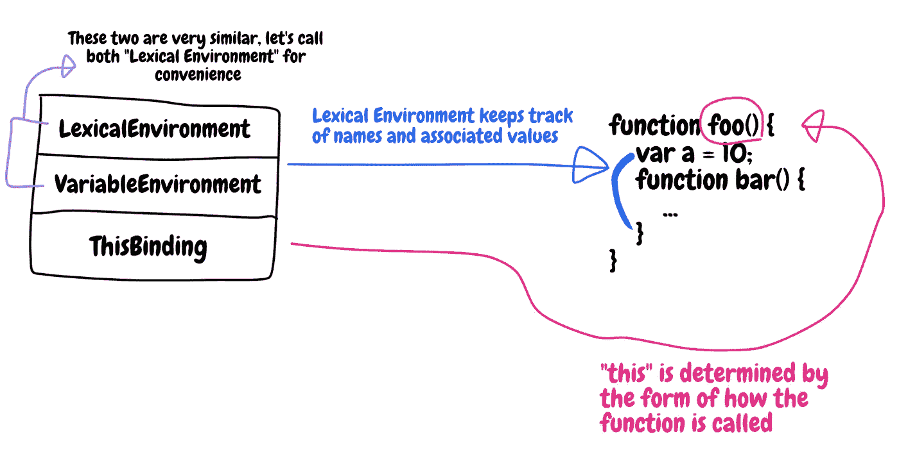
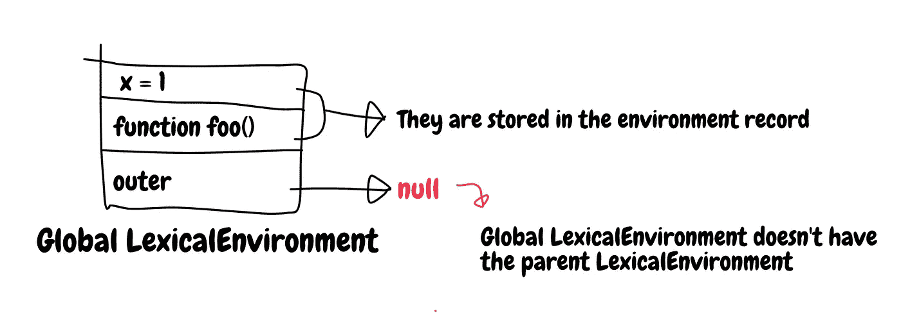
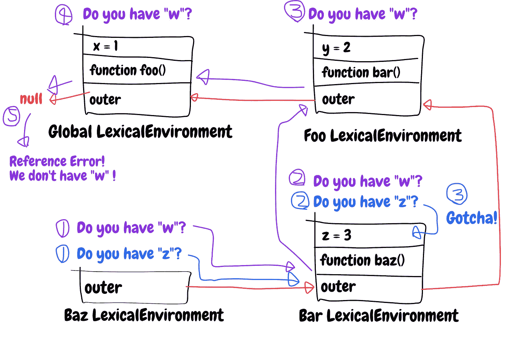
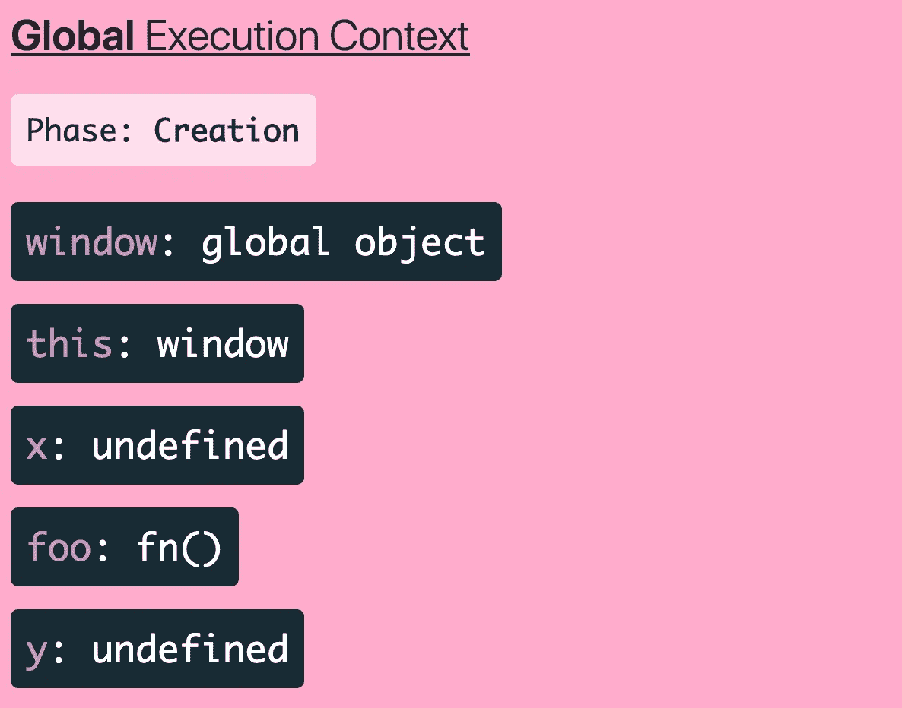
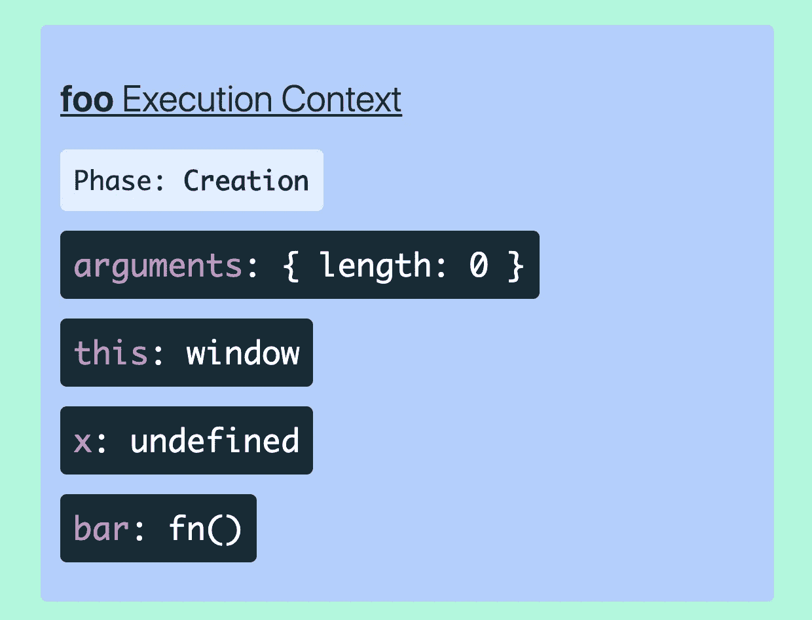
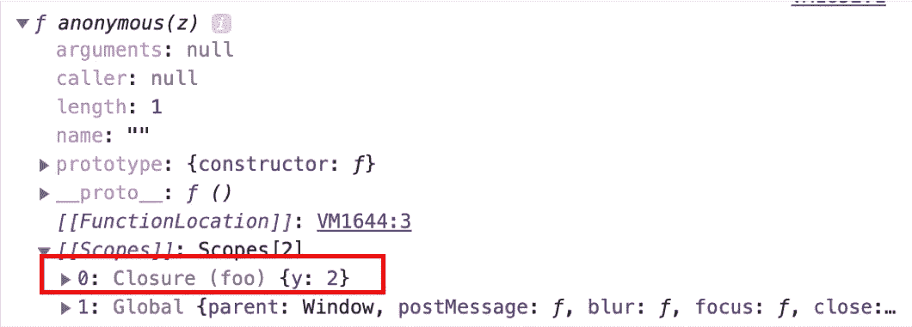
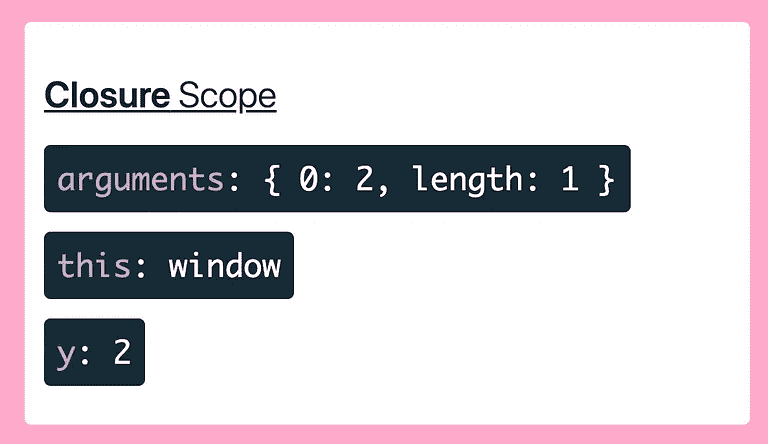
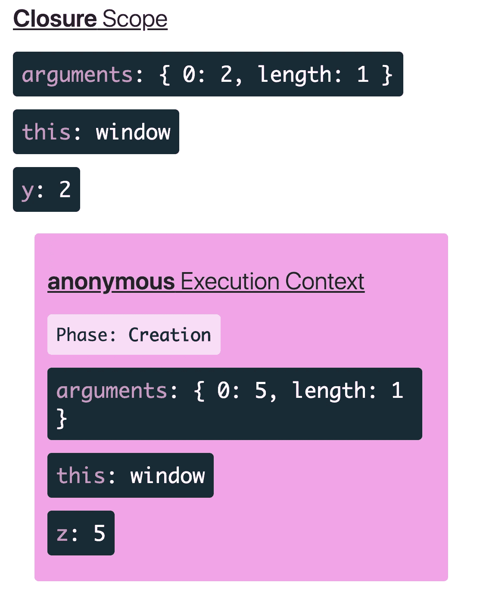

# JavaScript 中的执行上下文、词汇环境和闭包

> 原文：<https://betterprogramming.pub/execution-context-lexical-environment-and-closures-in-javascript-b57c979341a5>

## 你应该知道的高级 JavaScript 概念


照片由[哈维尔·塞拉](https://unsplash.com/@lepetitpatte?utm_source=medium&utm_medium=referral)在 [Unsplash](https://unsplash.com?utm_source=medium&utm_medium=referral) 上拍摄

在这篇文章中，我想谈谈三个高级 JavaScript 概念:执行上下文、词法环境和闭包。

这将是一篇长文。如果您想跳到摘要，请滚动到页面底部。

# 什么是执行上下文？

那么，什么是执行上下文呢？每当你写一些代码时，你的代码都在一个空间中——这个空间被称为“执行上下文”。假设您编写了一个简单的计算器:

```
function cal(type, a, b) {
  if (type === 'add') {
    return a + b;
  } else if (type === 'subtract') {
    return a - b; 
  } else if (type === 'multiply') {
    return a * b; 
  } else {
    return a / b; 
  }
}

var four = 4;
var seven = 7;
cal('add', 4, 7);
```

在 JavaScript 中，每当调用一个函数时，都会在当前运行的执行上下文上创建一个新的执行上下文。新创建的一个存储在执行上下文的堆栈中。

因此，如果我们调用`cal()`，新的上下文将被创建，并被推送到上下文堆栈中。但是，默认情况下，堆栈中已经存在一个上下文—全局执行上下文。



执行上下文的基本概念

首先调用并运行函数`cal`,这样就创建了新的执行上下文。然后，它被存储在上下文堆栈中。然后，当前执行上下文的控制被转移到新创建的上下文，在这种情况下，是从全局上下文转移的。

每当您调用一个函数时，就会创建一个执行上下文。使用 JavaScript 开发时，您可能会看到以下错误:



调用堆栈错误

函数`a`不断递归调用自己。每次`a`调用自己时，一个关于`a`的新的执行上下文将被创建并存储在堆栈中。因为内存堆栈的存储空间不是无限的，所以它会溢出。

现在你知道了什么是执行上下文，但是还有更多要学习。我们稍后会进一步讨论这个问题。

# 词汇环境

当你运行一个函数或者声明一个变量或者函数的时候会发生什么？我几乎没有解释过，每个函数调用都会创建一个执行上下文，默认情况下，堆栈中有一个全局执行上下文。执行上下文分为三个不同的区域。



在执行上下文中

执行上下文中的前两个部分——`LexicalEnvironment`和`VariableEnvironment`，非常相似，所以我想我可以称它们为`LexicalEnvironment`。`LexicalEnvironment`所做的是跟踪变量、函数名和相关的值。换句话说，如果你声明一个函数`foo`,如上图所示，那么*词汇环境*将如下所示:

```
function foo() {
  var a = 10;
  function bar() {

  }
}
foo();

// When foo is called, a new execution environment 
// might look like this below
execution_environment: {
  LexicalEnvironment: {
    a: 10,
    bar: function() {}
  },
  ThisBinding: ...
}
```

你现在知道什么是`LexicalEnvironment`了，它有什么作用。

正如执行上下文由三部分组成一样，`LexicalEnvironment`也由几部分组成。它有一个`EnvironmentRecord` ——我称之为环境记录，以及一个外部词法环境，你可能认为它是作用域。

当你声明一个变量或函数时，它们实际上被存储在它的环境记录中。链接属性值基本上意味着链接属于环境记录的属性值。

当`LexicalEnvironment`被创建时，对外部词法环境的引用也被创建。它直接链接到父`LexicalEnvironment`，JavaScript 在当前`LexicalEnvironment`中找不到属性时使用这个值。如果它仍然不能在父词典环境中找到它，那么它将再次找到父词典`LexicalEnvironment`。这个过程不会停止，直到它找到它要找的东西，或者直到没有东西连接到`LexicalEnvironment` *。*全局`LexicalEnvironment`没有父级`LexicalEnvironment`。所以，当 JavaScript 试图在全局`LexicalEnvironment`中寻找某些东西时，一个`Reference Error` 发生了。

## 附图示例

为了更好地理解这个流程，让我们看一下这个例子:

```
var x = 1;
function foo() {
  var y = 2;
  function bar() {
    var z = 3;
    function baz() {
      console.log(z);
      console.log(y);
      console.log(x);
      console.log(w);
    }
    baz();
  }
  bar();
}
foo();
// 3
// 2
// 1
// Reference Error: w is not defined
```



全球词汇环境

当 JavaScript 运行代码时，变量`x`和函数`foo`在全局`LexicalEnvironment`中声明。正如我解释过的，全局的外部不指向任何东西。当 JavaScript 遇到`foo()`时，运行该函数，新的`foo` 的`LexicalEnvironment` 被创建。它的外部链接链接到其父级的全局`LexicalEnvironment`。下图说明了示例代码中的整个关系:


词汇环境之间的整体关系

你可以在每个`LexicalEnvironment`中看到`outer`指向父`LexicalEnvironment`。

当`baz()`被调用时，它寻找`z`、`y`、`x`和`w`。



查找 z 和 w 时的工作流

像这样的流程，查找变量`y`和`x`做同样的工作——检查当前 `*LexicalEnvironment*`中是否存在该值，如果没有变量，则移动到父变量。但是对于`w`，它在代码中不存在，所以我们以引用错误结束。

这就是你通常听到的作用域链。**但是请记住，连接到父环境的外部环境是在声明函数时确定的，而不是在调用函数时确定的** ( [单击此处](https://www.ecma-international.org/ecma-262/5.1/#sec-10.2)以获得更多信息)。例如，猜测`bar()`的返回值。

```
var x = 1;
function foo() {
  var x = 2;
  bar();
}

function bar() {
  console.log(x); 
}

foo(); // 1
```

为什么`foo()`的结果是 1 而不是 2？正如我所说，外部引用是父节点的`LexicalEnvironment`，而不是围绕它的函数。

## 这种绑定

执行上下文中的引用`ThisBinding`决定了如何调用函数。我将在另一篇文章中更多地谈论这个话题。

# 返回执行上下文

现在，您知道了执行上下文中的内容— `LexicalEnvironment`和`ThisBinding`。实际上有两种执行上下文——**全局**执行上下文和**函数**执行上下文。

全局执行上下文是 JavaScript 中全局对象的执行上下文，是一切的根源。它包含几个对象。其中之一是`window` ——当 JavaScript 解析和解释您的脚本时，它实际上首先运行这个。(当然，这并不完全是 JavaScript 的工作方式)。

```
<script>
  window = {
    ClipboardCopyElement: class ClipboardCopyElement,
    CodeMirror: f Ea,
    DetailDialogElement: class DetailDialogElement,
    ...
  };

  GlobalExecutionContext: {
    LexicalEnvironment: {
      window: window,
      outer: null
    },
    ThisBinding: window
  }
</script>
```

这就是为什么你可以使用`window.document`或`window.setTimeout`，因为它们都在全局对象的`LexicalEnvironment`中。

函数执行上下文呢？它就像一个全局执行上下文，但是内部不存在`window`或其他全局对象，它是在函数被调用时创建的。全局执行上下文和函数执行上下文的共同点是它们在运行时都有两个阶段:创建和执行阶段。在创建阶段，声明变量和函数:

```
var x = 1;
function foo() {
  var x = 2; 
  function bar() {
    var x = 3; 
  }
}
console.log(y);
var y = 3;

foo();
```

运行代码的第一步是创建全局执行上下文。动作的控制处于创建阶段。



创建阶段—图像源从[到这里](https://tylermcginnis.com/javascript-visualizer/)

在创建阶段，变量默认由`undefined`设置。另一方面，函数是由一个函数分配的——就像上面例子中的`foo`。需要注意的是`y`也被定义为`undefined`，尽管它是在`console.log`之后声明的。这种症状在 JavaScript 中被称为“提升”。提升意味着在执行阶段之前，变量和函数被声明并赋予默认值，通常为`undefined`。

当控件进入执行阶段时，它会从头开始运行每段代码。将被执行的第一条语句是`console.log(y)`，它打印出`undefined`。然后`y`被设置为三。下一步是运行`foo()`。当调用一个函数时，会创建一个新的执行上下文并将其推入调用堆栈。



功能-图像源的创建阶段从[开始，此处为](https://tylermcginnis.com/javascript-visualizer/)

当一个函数被调用时，会产生一个函数执行上下文。那么它的创建阶段首先开始。函数执行上下文的`LexicalEnvironment`定义了它需要的所有变量。特殊对象`arguments`，是每个函数`LexicalEnvironment`中定义的变量的一部分。你可以看到有一个功能`bar()`。然后调用`bar`——它的执行上下文在创建后也将存储在堆栈中。

一旦函数中的所有代码都被执行，它的执行上下文就从堆栈中删除。

这个视频是由泰勒·麦金尼斯制作的

在这个视频中，演讲者很好地解释了 JavaScript 中执行上下文切换的工作流程。

# 关闭

我解释说`LexicalEnvironment`也有一个外部环境，是指父母的`LexicalEnvironment`。看一下这个例子:

```
var x = 1;
function foo(y) {
  return function(z) {
    return x + y + z;	
  }
}

var f = foo(2);
```

如果您在 web 控制台上运行此命令，您将看到以下内容:

```
console.dir(f);
```



结束看起来像这样

左边是你能从谷歌控制台看到的，右边是你能从 JavaScript 可视化工具看到的——你能在这里看到的网页。

发生了什么事？当函数`foo`被执行时，它返回一个新函数。`f`现在有了`foo`的返回值。但是在`f`中，有一个新的范围对象，名为`Closure`。即使`foo`的执行上下文已经从堆栈中移除，引用链仍然被变量`f`激活。那么如果我们执行`f`，现在是一个函数呢？

```
f(5);
```



closure-image 源中的执行上下文来自[这里是](https://tylermcginnis.com/javascript-visualizer/)

然后新的执行上下文将被创建，如上图所示。`z`不在闭包范围内的原因是，它是`f`运行的函数的属性，在当前执行上下文中是活动的。

一旦`return x + y + z;`运行并且函数完成，那么`f`的执行上下文将被清除，闭包也将消失。

MDN 定义了闭包:

> 一个**闭包**是一个函数的组合，该函数被捆绑在一起(被封闭)并引用其周围的状态(即**词法环境**)。换句话说，闭包允许您从内部函数访问外部函数的范围。

Closure 是一个允许您访问父函数作用域的函数，即使它已经从执行上下文堆栈中删除了。

# 最终总结

要解释什么执行上下文、`LexicalEnvironment`、闭包等等，那是一个很长的故事。基本上，当 JavaScript 运行代码时，它会创建一个空间来存储和管理变量和函数。它记录名字和变化。每当一个函数被创建时，JavaScript 就会产生这个空间，并把它放在堆栈的顶部，之前存在的空间从底部开始堆叠。这个空间被称为执行上下文。

JavaScript 中有两种执行上下文——全局执行上下文和函数执行上下文。一个执行上下文由`LexicalEnvironment`和`ThisBinding`组成。`LexicalEnvironment`是实际存储和管理变量和函数的地方。`ThisBinding`是`this` 的参考，但我们在这里没有涉及。

JavaScript 在管理变量和函数时有两个阶段——创建阶段和执行阶段。在创建阶段，变量被声明，但由缺省值设置，通常是`undefined`，而函数被同时声明和初始化。在创建阶段之后，动作控制转移到执行阶段，从文件的顶部开始，一个接一个地执行所有的代码。如果在这个阶段调用了一个函数，将会为该函数创建一个新的执行上下文，并存储在堆栈中。如果堆栈中有太多的上下文，我们也会确认发生引用错误。

即使执行上下文在运行完内部的所有代码后被从堆栈中删除，当原始函数返回一个使用其作用域之外的变量的新函数时，对该函数的引用仍然有效。然后，到外部函数的链接不会被删除，直到它的代码被执行并完全从堆栈中移除。这就叫完结。闭包是一个允许你访问父函数作用域的函数，即使它的执行阶段已经结束。

# 资源

*   [ECMAScript 详解—词法环境](http://dmitrysoshnikov.com/ecmascript/es5-chapter-3-2-lexical-environments-ecmascript-implementation/)
*   [stack overflow 中的环境记录](https://stackoverflow.com/questions/20139050/what-really-is-a-declarative-environment-record-and-how-does-it-differ-from-an-a)
*   [词法环境— ECMAScript 规范](https://www.ecma-international.org/ecma-262/5.1/#sec-10.2)
*   [JavaScript 可视化工具](https://tylermcginnis.com/)
*   [执行环境的终极指南——YouTube](https://www.youtube.com/watch?v=Nt-qa_LlUH0)
*   [MDN 中的闭包](https://developer.mozilla.org/en-US/docs/Web/JavaScript/Closures)