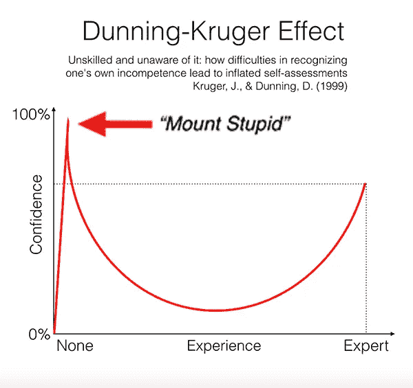

# 冒名顶替综合症如何帮助你提高软件开发水平

> 原文：<https://betterprogramming.pub/experience-and-confidence-128a6a4812cd>

## [软件工程](https://rakiabensassi.medium.com/list/software-engineering-7a179a23ebfd)T2&个人发展

## 自信、经验和持续学习之间是有联系的

汤米·卢切纳·维拉尔在 [Unsplash](https://unsplash.com?utm_source=medium&utm_medium=referral) 拍摄的照片

> “冒名顶替综合症(IS)指的是一种内心体验，即认为自己没有别人认为的那么能干。它可以影响任何人，无论他们的社会地位、工作背景、技能水平或专业程度。据估计，70%的人一生中至少会经历一次这种现象。
> [……]进入一个新角色会引发冒名顶替综合征。例如，刚开始上大学时，你可能会觉得自己没有归属感，也没有能力。”— [阿林·库契奇](https://www.verywellmind.com/imposter-syndrome-and-social-anxiety-disorder-4156469)

在与一位朋友的一次讨论中，他不同意这种观点，讨论的内容是“冒名顶替综合症”对推动我们学习的重要性，以及感觉自己完全知道该做什么和一切如何运作的风险。他指出:

*“当你觉得自己确切地知道需要做什么，以及在你的专业范围内一切是如何运作的时候，这是一个给你绝对信心的很好的指标，这对于将所有的问题和困难视为小事至关重要。因此，你会自动地、轻松地找到解决问题的方法，然后你会向前迈进，学到更多。”*

尽管我自己也经历过“冒名顶替综合症”,而且我确信它会造成严重后果，但我也坚信，只要态度正确，它可以成为提升我们自己的工具。拥抱它比不舒服和对抗它更有帮助。

下面，我将解释“为什么”和“如何”去做。

# 掌握一个领域几乎是不可能的

拥有足够的知识和经验对成功很重要。虽然这对于某些学科来说可能是可以实现的，但对于像编程和 it 这样的领域来说就不是这样了。

我从事软件工程师工作大约 15 年了，我见过数百名不同职业水平的程序员，直到现在我还没有见过一个开发者——包括我——对自己的专业了如指掌。

这在我们的领域几乎是不可能的，因为每隔几个月市场上就会出现新的技术和范例。

# 持续学习是必须的

通常情况下，程序员开始他们的任务时对它知之甚少，不知道要花多长时间以及如何完成它。但是在寻找解决方案的过程中，他们会研究和学习很多东西。

如果你确切地知道你应该做什么来完成你的工作，你将获得的知识量将是有限的。这就是为什么许多开发人员讨厌呆在一个没有足够挑战性的职位上的主要原因。因为他们不会像换了工作或使用新技术的同事那样进步。

伟大的开发人员和普通的开发人员之间的区别不是他们已经掌握的工具和语言，而是他们解决问题的能力和学习技能的能力。

在一个日新月异的世界里，持续学习成为我们每个人的决定性素质。我们在[疫情](https://levelup.gitconnected.com/top-erp-and-technology-trends-60b3f67d7e26)中看到的——工作逐渐消失，工作不断创造，人工智能的崛起——就是证据。

# 自信并不总是最重要的

“对一门学科有足够的知识”或“认为我们知道的足够多”会激发自信，但这并不意味着我们处于改进和成长的状态。

在邓宁克鲁格效应曲线中，社会心理学家大卫邓宁和贾斯汀克鲁格解决了这一点。曲线显示，低能力的人膨胀了高信心。然后，他们学得越多，他们就越没有信心，因为他们意识到这比他们最初想象的要复杂得多。

邓宁·克鲁格效应——不熟练且不自知:难以认识到自己的不称职如何导致自我评估膨胀([图片来源](https://first10em.com/making-it-stick/dunning-kruger-effect-and-mount-stupid-60px/))

*   当人们对一个问题一无所知时，他们的信心很低。
*   然而，一旦他们知道了一点，他们的信心突然暴涨。
*   然后，随着他们学得越来越多，越来越意识到他们忽略了什么，他们的信心就会下降。
*   在达到特定学科的专家水平后，他们的信心最终会逐渐恢复。

# 最后的想法

缺乏经验和缺乏自信可能会导致冒名顶替综合症。然而，对某件事略知一二可能会导致错误的自信感。

如果你的目标是提高自己，冒名顶替综合症会激励你成长，激发你不断学习的欲望。

我想通过将我的职业经历分成两种类型来结束这篇文章:

1.  经历我的技能和知识优于我的同事，并且我非常自信。
2.  同事的技能比我好，而我信心不足的经历。

这两种经历都很重要，但第二种经历让我受益匪浅。我的同龄人的卓越技能帮助我看清了我需要什么，以及我想成为什么样的人。

🧠💡我为一群聪明、好奇的人写关于工程、技术和领导力的文章。 [**加入我的免费电子邮件简讯，独家获取**](https://rakiabensassi.substack.com/) 或在此注册 Medium [。](https://rakiabensassi.medium.com/membership)