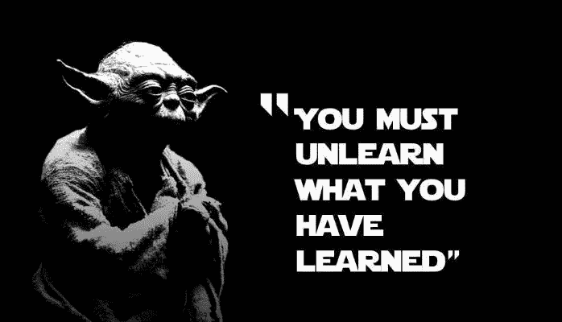
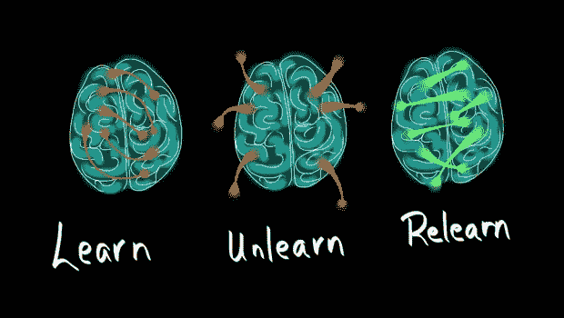
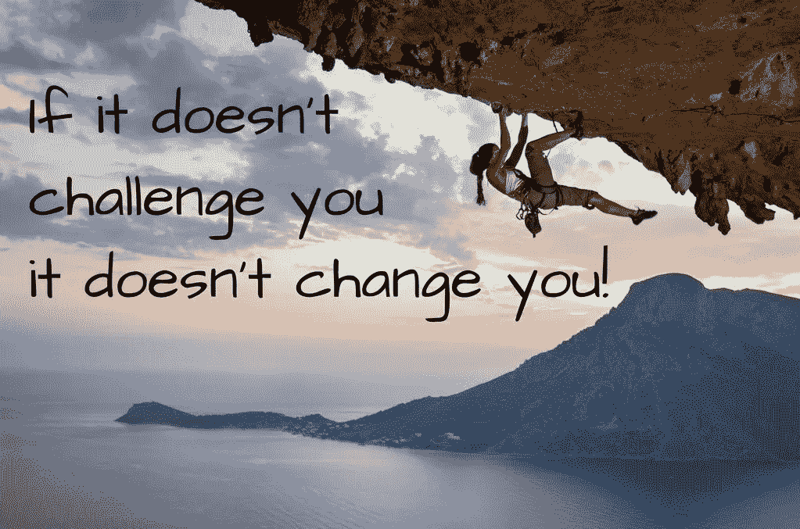

# 经验已死，欢迎忘却

> 原文：<https://betterprogramming.pub/experience-is-dead-welcome-unlearning-fda05076dfb5>

## 为什么学习是 21 世纪最重要的技能

随着自动化和人工智能扰乱就业市场，人们将期待工人不断学习。有鉴于此,“经历过”在未来到底意味着什么？

# 持续学习范式

在本文中，我们将重点关注终身学习或*持续学习，*即终生进行的学习活动，目的是从与就业相关的角度提高知识、技能和能力。

这种类型的学习发生在经过童年的正规教育后的成年期。这通常是*个人驱动的*——逻辑驱动，而不是*教师驱动的*——教学驱动。

随着新信息技术(IT)的出现，终身学习的概念变得至关重要，这有两个主要原因:

*   它改变了我们接收和收集信息、与他人合作和交流的方式。
*   它促进了思想的产生和传播，因此加快了人类工作的诞生和消亡。

仅举几个统计数据来强调这一点:

*   一些成人教育专家估计，从现在起十年后，学生们所学的东西中有 40%将会过时。
*   如今大多数热门职位在 10 年前甚至还不存在。

当然，专家表示，将会创建更广泛的教育和技能培养项目，以满足未来的新需求。第二次工业革命的口号是:

在学校努力学习，然后用你学到的技能努力工作，遵守规则:你会有一个好的生活，并为你的孩子铺平道路。

不幸的是，这不再是真的了。为了今天的成功，你必须处于一种不断适应的状态——不断地抛弃旧规则，重新学习新规则。

# 我们如何学习，忘却，再学习

学习本质上是[记忆形成](https://mindovermuseum.wordpress.com/2013/04/27/visitors-remember-5-of-their-visit-hey-thats-pretty-good-3/)，记忆形成本身本质上是一个[情感过程](https://mindovermuseum.wordpress.com/2013/11/22/unlearning-is-harder-than-learning/)。你可能有多个例子强调，当快乐或惊喜等积极情绪触发记忆形成过程时，你更可能喜欢你学到的信息。

你需要对一条新信息产生情绪反应(恐惧、愤怒、厌恶、悲伤、惊讶/兴趣和喜悦)，以在神经元之间创建新的“强”连接。

然后，你也需要定期使用这些信息，将它们整合到永久记忆中(尤其是在你睡觉的时候)。

要忘却，你首先需要为新信息腾出空间

然而，我们的大脑没有足够的空间来储存每天遇到的所有刺激。因此，当它过载时(特别是当你睡觉时)，它会定期清理多余的信息。

[大脑使用不同的属性](https://www.quora.com/How-does-the-human-brain-decide-which-memories-to-store)来决定保留什么信息，其中:

*   重复
*   情绪影响
*   最终结果

当考虑持续学习时，这个过程是最重要的，也是[忘记实际上比学习更难的部分解释。](https://www.youtube.com/watch?time_continue=291&v=MFzDaBzBlL0)

例如，如果你认为忘记吸烟很难，想象一下忘记地球是平的。在这些财产中，并不是所有的都在你的控制之下。

例如，很难停止执行给定的行为，特别是当它支持你的日常工作任务时。当然，如果可能的话，你可以强迫自己这样做。

同样，与众所周知的行为相比，新行为的结果乍一看并不明显。你实际上能更多控制的财产毕竟是情感上的影响。

因此，忘却不应该是一个无意识的过程，而应该是一个[有意识的实践，导致行动](https://thecoffeelicious.com/the-art-of-unlearning-4354a96ce061):认识并愿意拆除曾经奏效但现在已经过时的东西。

承认，不知何故，我们故意犯了错误，这并不容易。这种态度的主要方面是:

*   暂停对新事物的判断。
*   保持谦逊，意识到认知和知识的局限性。
*   不要害怕失去对当前信念的依恋。
*   意识到我们的[认知偏差](https://betterhumans.coach.me/cognitive-bias-cheat-sheet-55a472476b18)。

这种态度旨在“优化”情绪影响以促进记忆，避免引发恐惧、愤怒或厌恶等负面情绪。

如果你看所有这些方面，你现在会清楚地看到为什么孩子在学习方面相当好。不幸的是，有几个心理原因会让你成年后感到不舒服:

*   不要看起来像个白痴。
*   来证明你之前的学习投资。
*   与您之前的行为(即您的身份)保持一致。
*   因为你的环境反对你的承诺。

# 实用指南

为了最大化你忘却的机会，可以遵循一套[实用技巧](https://www.fastcompany.com/3063112/three-ways-to-unlearn-old-habits-faster):

1.  挑战自我。

就像科学家一样，努力以最快的速度证明自己是错的，因为只有这样，你才能找到进步。

2.欢迎反馈。

从各种可信的来源收集信息，迫使不准确的心理模型从你的大脑中消失。

3.要真正投入。

通过公开你的承诺、设定时间表、设置奖励等等，达到使用新习惯比避免它们更容易的程度。

[http://www.artjones.tv](http://www.artjones.tv)

# 结论

如果你想雇佣你的团队的下一个英雄，也许是时候重新考虑你的最后一个问题了，它不应该是:“在过去的六个月里，你学到了什么？”而是:“在过去的六个月里，你忘记了什么？”

事实上，拒绝忘却和适应就是被变革之海卷走。因此，最“有经验”的人将来可能是最好的“无知的人”。