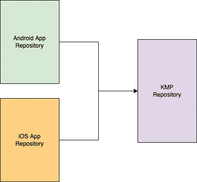
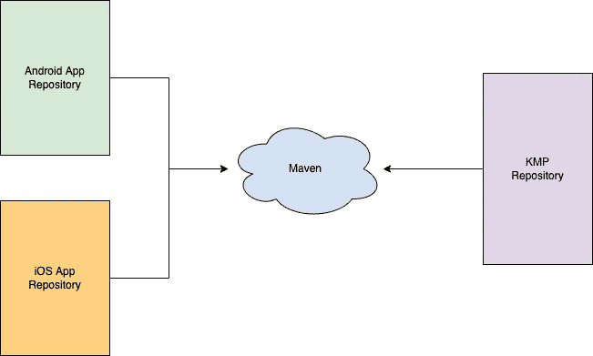
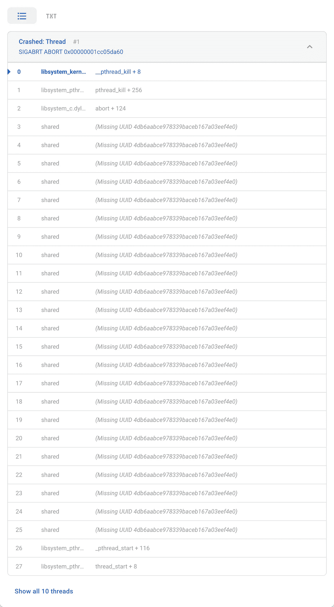
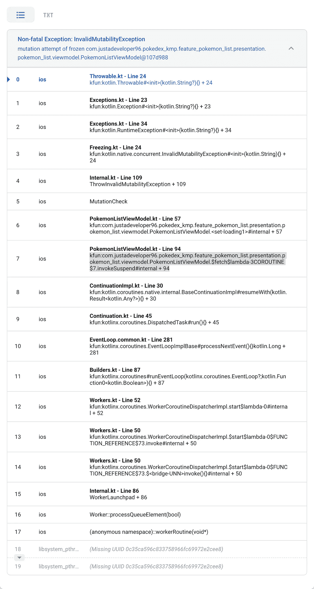
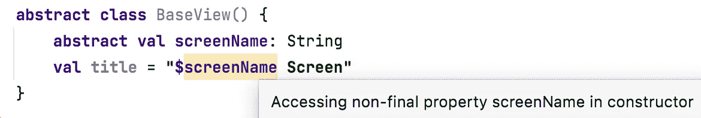

# 我在生产应用中使用 Kotlin 多平台一年后的体验

> 原文：<https://betterprogramming.pub/experience-using-kmp-in-production-apps-for-a-year-2474406d99d4>

## 用 kickstarter 项目好东西帮你开始


照片由 [Gift Habeshaw](https://unsplash.com/@gift_habeshaw?utm_source=medium&utm_medium=referral) 在 [Unsplash](https://unsplash.com?utm_source=medium&utm_medium=referral) 上拍摄

在生产应用、Android 和 iOS 中使用 Kotlin 多平台(KMP)大约一年后，以下是我们的一些统计数据:

*   250 多万 MAU
*   非常稳定。无崩溃会话:> 99.75 %
*   超过 70%的代码重用。
*   24 个移动设备(14 个 Android + 10 个 iOS)
*   Kotlin 当前版本:1.6.21

这里看一下我们用来保持高开发速度的过程！

# 将 KMP 存储库与您的应用程序存储库分开。

*   更好地将通用模块与特定平台应用程序存储库(android、ios、web、后端应用程序等)分离开来。
*   这将使通用的 KMP 工具、插件、库等远离现有的/新的应用程序。
*   这使得现有/新的应用程序可以轻松地将通用代码作为第三方库进行即插即用，而不是在特定于平台的应用程序库中设置通用 KMP 工具、插件、库、集成等。



# 将通用 KMP 代码作为库发布。

*   你可以通过 maven 共享普通的 KMP 代码作为 android 和 ios 应用的库。
*   Publishing 将把通用的 KMP 代码输出到所有目标(android、ios、js 等)中，maven 将托管工件。
*   主机应用程序将从 maven 加载它们自己的平台工件，就像我们在 Gradle 中通过 maven 加载第三方库一样。
*   对于本地开发，maven 有一个本地存储库，它托管在同一台机器上，只需一个 Gradle 命令就可以在同一台机器上的项目之间轻松共享工件:`publishToMavenLocal`



**提示**:

*   您可以使用 GitLab 让它变得非常简单，因为它有一个现成的 maven 存储库。因此 git 存储库和 maven 包可以从一个 GitLab 存储库中访问。
*   通过在“KMP 资源库”中添加远程 maven 配置，您可以直接使用 gradle `publish`任务在 maven 上构建和推送工件。
*   在应用程序存储库方面，需要相同的 maven 配置来从 maven 中提取库。
*   示例:Maven 配置将在此处添加[。](https://github.com/har5hit/PokeDex-KMP/blob/master/plugins/publish.gradle)

# 研究 Kotlin 本地(K/N)规则并创建 PoC。

*   KMP 最糟糕的地方是，任何人都可以像在 android 中编写 Kotlin 一样编写通用的 KMP 代码，它将在 Android 中完美运行。
*   这是最糟糕的，因为它会在 iOS 中崩溃，由于 Kotlin 的本地规则，如多线程中对象的冻结等，所以应该进行 PoC，以了解什么是可能的，什么是不可以的，以便在通用代码中制定开发指南和规则。例如:`InvalidMutabilityException`
*   从[这里](https://kotlinlang.org/docs/multiplatform-mobile-concurrency-overview.html)了解规则。创建一个指南列表，以便其他开发人员在开发任何新的/现有的 KMP 功能时可以遵循它们。

# 很少使用 expect-actual。依赖于接口。

*   **Expect-actual** 给出了一种创建特定于平台的访问的非常简单的方法，但是它有一些限制，比如相同的构造函数签名。
*   在支持新的平台依赖性方面存在可扩展性问题。例如:一个新的平台可能需要一些不同的构造函数依赖关系。
*   另外，您只需要从 Kotlin 文件中生成`actual class`。

```
*// commonMain* **expect class** NetworkGateway(debug: Boolean) {
    **val** client: HttpClient
}*// androidMain* **actual class** NetworkGateway **actual constructor**(debug: Boolean) {
    **actual val client**: HttpClient = *TODO*(**"Not yet implemented"**)
}*// iosMain* **actual class** NetworkGateway **actual constructor**(debug: Boolean) {
    **actual val client**: HttpClient = *TODO*(**"Not yet implemented"**)
}
```

*   相反，使用抽象将使您能够用任何特定于平台的构造函数自由地创建实现。
*   您可以用任何特定于平台的语言实现`interface`,比如 iOS 版 Swift。因此，您也可以从平台端发送依赖关系。
*   因此，您可以更自由地传递实现接口的现有平台依赖性，并通过 DI 传递到通用 KMP 代码。

```
*// commonMain* **interface** INetworkGateway{
    **val client**: HttpClient
}*// androidMain or from Android App Repository.* **class** AndroidNetworkGateway(
    debug: Boolean,
    interceptors: List<Interceptor>,
    networkInterceptor: List<Interceptor>
) : INetworkGateway {
    **override val client**: HttpClient = *TODO*(**"Not yet implemented"**)
}

*// iosMain* **class** IOSNetworkGateway(
    debug: Boolean
) : INetworkGateway {
    **override val client**: HttpClient = *TODO*(**"Not yet implemented"**)}
```

# 编写大量的单元测试

*   即使遵守了 K/N 规则，也总有遗漏某些规则或某些条件的空间，所以要有容纳它们的计划。
*   假设一个常见的功能已经在 android 上推出，并且在将其集成到 iOS 中时，出现了一个问题，需要修复代码。
*   现在，该修复将在下一个 KMP 图书馆版本中影响 android 和 iOS。因此，为了将影响最小化，如果在我们对 K/N 做了任何更改之后单元测试已经存在，我们可以确保在更新代码以遵守 iOS 规则时不会破坏任何现有的流程。
*   为 iOS 编写集成测试会好得多，因为它会为 K/N 规则崩溃创建一个回归套件。

# 使用您单独的 KMP 存储库中的 android 和 ios 模块作为测试主机。

*   在本地发布一个公共代码，并将其包含在实际的应用程序存储库中进行集成测试和重建，会降低您的速度。
*   因此，如果您需要测试它 E2E，那么您可以连接测试主机模块中的共享代码，这些模块已经在新的 KMP 项目中制作，并在本地/远程发布之前使用它们来测试任何集成。
*   这将更快地工作，甚至调试问题。

# 在不同文件中保存通用的 KMP 和特定于平台的依赖关系。

*   您可以创建一个通用依赖文件和不同的平台依赖文件。
*   例如:`[CommonDependencies](https://github.com/har5hit/PokeDex-KMP/blob/master/buildSrc/src/main/kotlin/Dependencies.kt)`、`[AndroidDependencies](https://github.com/har5hit/PokeDex-KMP/blob/master/buildSrc/src/main/kotlin/AndroidDependencies.kt)`等。
*   这使您可以在 KMP 存储库和平台应用存储库上保持通用平台第三方库同步。

# 改进 iOS 的崩溃日志记录

*   默认情况下，在 Crashlytics 上报告的 iOS 应用程序中常见 KMP 代码的崩溃不会有任何重要的崩溃原因/痕迹，这将使其对调试原因无用。

例如`InvalidMutabilityException` 在`var loading1: Boolean`的崩溃日志



*   上面没有任何关于崩溃的有用信息。
*   我们可以在 iOS 端使用 [Kermit](https://github.com/touchlab/Kermit) 来解决这个问题。它将从 Kotlin 端捕获大量关于崩溃的重要信息，这些信息可用于调试。

使用 Kermit 后，与上面的崩溃示例相同，



这个例外在标题中清晰可见，并且`index 7`明确了崩溃发生的位置，即`line 94`。总体信息对于理解和修复崩溃是有用的。(注意:日志上说**非致命**是不正确的。)

# 我们用来避免 K/N 崩溃的一些准则:

*   不要在公共代码中对较大的作用域使用`*var*`。用`MutableStateFlow`代替。例如，对于类范围的变量。所以不言而喻，多用`*val*`。避免:`InvalidMutabilityException` (因为变量可能会被一个类中的不同线程变异)

```
*// Don't* **class** PersonViewModel{
    **private var** loading:Boolean = **false**}*// Do* **class** PersonViewModel{
**private val** loading = *MutableStateFlow*(**false**)}
```

*   即使在使用`*val*` *的情况下，*也要确保它是最终的。

```
*// Don't* **abstract class** BaseView() {
    **abstract val screenName**: String     
    **val title** = **"$screenName Screen"** *//****screenName*** *is not final* }*// Do*
**abstract class** BaseView(**val screenName**: String) {
    **val title** = **"$screenName Screen"** *//****screenName*** *is final* }
```



甚至 IDE 都会给出警告。

*   声明所有类变量后使用`init {}`块。这是为了避免任何人在`init`中创建协程，这将使整个类实例冻结，并导致在它之后声明的加载字段上抛出异常。

```
*// Don't* **class** PersonViewModel{

    **init** {

    }**private val loading** = *MutableStateFlow*(**false**)

}*// Do*
**class** PersonViewModel{

    **private val loading** = *MutableStateFlow*(**false**)

    **init** {

    }
}
```

*   实际[视图模型](https://github.com/har5hit/PokeDex-KMP/blob/master/feature_pokemon_list/src/commonMain/kotlin/com/justadeveloper96/pokedex_kmp/feature_pokemon_list/presentation/pokemon_list/viewmodel/PokemonListViewModel.kt)供参考。

在平台应用程序中创建 DI 文件，让宿主应用程序能够根据需要自由灵活地传递不同的依赖实现。用例可以是:

*   将平台应用中现有的`UserRepository`传递给通用 KMP 代码，而不是在通用代码中从头开始创建。
*   在 KMP 存储库和平台存储库中，一个依赖项可以有多种实现。因此，可以根据需要在平台级别进行切换或 A/B。

以下存储库用于博客参考。此外，如果您需要 KMP 项目模板作为参考、快速入门或试用，您也可以查看:

[](https://github.com/har5hit/PokeDex-KMP) [## GitHub - har5hit/PokeDex-KMP:使用 Kotlin 多平台的 PokeDex

### 这是一个演示程序，使用 Kotlin Multiplatform (KMP)演示了 Android 和 iOS 应用程序中的代码重用。一些…

github.com](https://github.com/har5hit/PokeDex-KMP) 

谢谢大家！