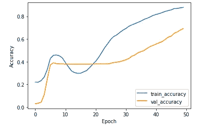
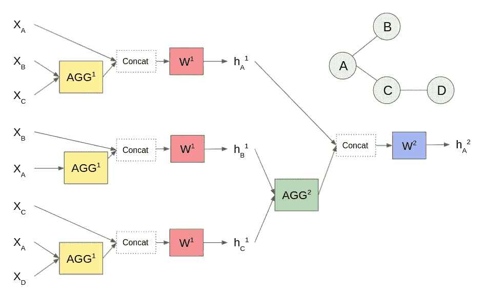
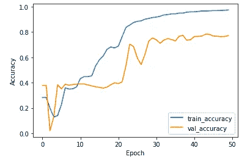
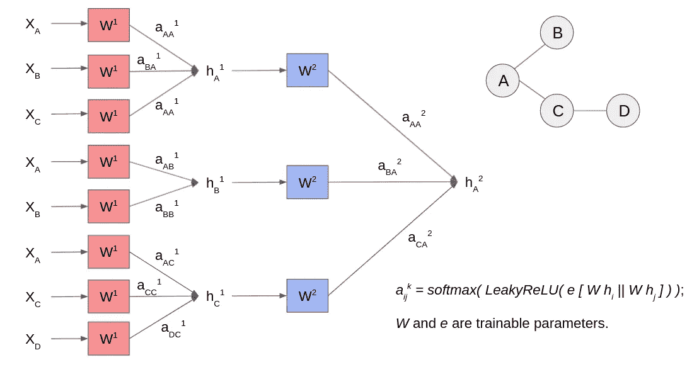
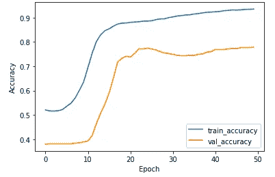
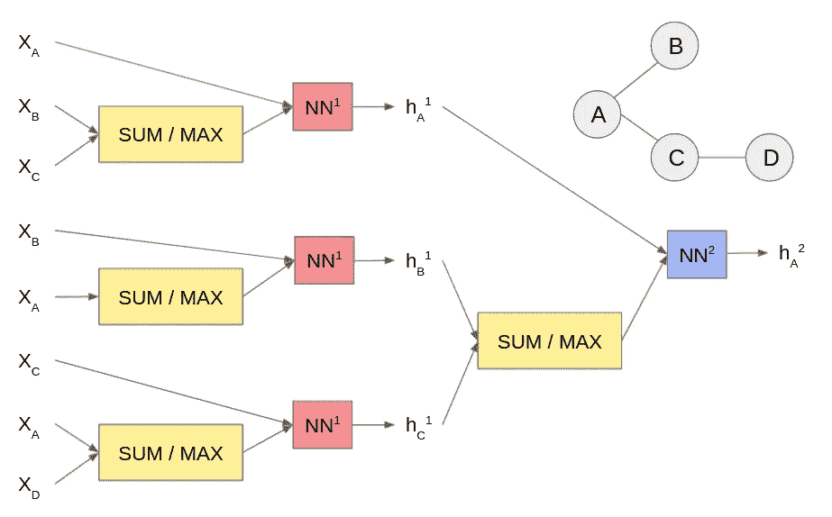
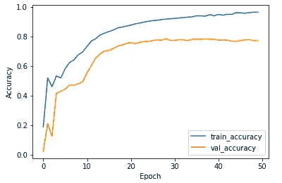

# 张量流中图形神经网络的实验变体

> 原文：<https://betterprogramming.pub/experiment-variants-of-graph-neural-network-in-tensorflow-1f0e010011e0>

## 了解这些模型背后的思想及其在 Tensorflow 中的实现

[Pritesh Sudra](https://unsplash.com/@pritesh557?utm_source=medium&utm_medium=referral) 在 [Unsplash](https://unsplash.com?utm_source=medium&utm_medium=referral) 上拍摄的照片

在之前的[博客文章](https://levelup.gitconnected.com/graph-convolutional-network-node-classification-with-tensorflow-49d3e091ea15#ab41-5cda1f0a557e)中，我们已经详细研究了图卷积网络(GCN)。它允许我们不仅利用节点特征，而且利用节点连接来训练机器学习模型，这明显优于纯粹基于节点特征训练的模型。

在这篇博客文章中，我们将介绍其他一些类似于 GCN 的图形神经网络架构。

一如既往，我们将解释新模型架构背后的核心思想，并使用 Tensorflow 演示端到端培训工作流。

强烈建议您在尝试这篇博文之前先通读一下之前的博文。

# **训练目标**

首先，让我们布置我们的训练目标，并在这篇博文中把它作为所有模型的运行实验。

我们将上一篇博文中介绍的 [Cora](https://graphsandnetworks.com/the-cora-dataset/) 数据集重新用于节点分类任务。数据集是以每篇论文为节点，每篇引文为边的论文引文图。

该纸张分为 7 类(标签)。任务是在已标记的纸张上训练一个模型来预测未见过的纸张的标签。请注意，Cora 数据集通常用于直推式学习环境中，在这种环境中，模型会看到所有示例(已标记或未标记)。

目标是预测未标记的标签。转导学习的思想是，即使你不知道一些例子的标签。这些例子仍然告诉你一些关于问题空间的有用信息。

只是为了好玩，我们将把实验框架设计为归纳学习，在这种学习中，模型将只看到标记的例子。我们留出一部分节点用于验证目的。

在训练期间，这些节点及其对应的边会从图形中移除。

在验证过程中，移除的节点和边会重新加入。准确性度量仅根据验证节点上预测的正确性来衡量。

这在现实世界中更适用，在现实世界中，新的看不见的节点不断被添加到图形中。有关详细信息，请参见以下培训和评估代码片段。

注意，训练函数接受模型类定义。我们将在这篇博文中定义各种模型类，但是所有实验都共享这些训练和评估代码。

此外，请注意，我们不会费心创建测试集，因为我们的主要目标是这篇博文中的培训演示。

培训和评估代码。

# **图卷积网络**

首先，我们用一个两层的 GCN 运行这个任务。关于 GCN 建筑的细节，请参考之前的[博文](https://levelup.gitconnected.com/graph-convolutional-network-node-classification-with-tensorflow-49d3e091ea15#ab41-5cda1f0a557e)。

我们将下面的模型类定义提供给上面的训练和评估代码，以获得结果。

图形卷积网络类别定义

图形卷积网络的精度。最终验证准确率:69%

# **图表用法**

我们将介绍的第一个新模型是 [GraphSAGE](https://arxiv.org/abs/1706.02216) 。GraphSAGE 在许多方面不同于 GCN，但 GCN 可以轻松适应这些差异。

例如，GCN 最初是为直推式学习而建立的，而 GraphSAGE 既可以进行直推式学习，也可以进行归纳式学习；GCN 看起来像所有邻居，而`GraphSAGE`对邻居进行采样，这在社交网络等节点度可能非常高的环境中更实用。

GraphSAGE 和 GCN 之间最有意义的区别在于模型如何聚集来自节点及其邻居的信息。

GCN 使用一种简单的聚合方案，在该方案中，模型将所有相关节点特征(来自节点本身及其邻居)与一个共享矩阵相乘，并将结果相加。

在 GraphSAGE 中，相邻要素通过聚合函数进行聚合，其结果随后与节点要素本身连接在一起。

这里的意义是双重的:(1)聚合函数也是可以学习的——比如一个 max-pooling 层或者 LSTM；(2)串联形成一种到节点特征本身的跳过连接，允许模型特别注意节点自身的特征。请参见下图作为说明。

图表说明

注意，GraphSAGE 论文还提出了一种无监督损失函数，该函数进行优化以使相同邻域中的节点的节点嵌入更接近，同时分离图中相距较远的节点的节点嵌入。

这在某种程度上是有道理的。但是，由于我们有一个直接的训练目标，我们将优化节点分类的准确性，如上面的训练对象部分所述。

我们使用 DGL [GraphSAGE](https://docs.dgl.ai/en/0.6.x/api/python/nn.tensorflow.html#sageconv) 组件实现 GraphSAGE，并将模型类输入到上面的相同训练和评估代码中。它的表现优于 GCN:验证准确率为 77.1%对 69%。

GraphSAGE 类定义

准确性图表。最终验证准确率:77.1%

# **图关注网**

现在，基于上面 GraphSAGE 的思想，我们为什么要规定模型应该如何关注节点特征及其邻域呢？

这启发了[图关注网络(GAT)](https://arxiv.org/abs/1710.10903) 。GAT 没有使用预定义的聚合方案，而是使用[注意力机制](https://en.wikipedia.org/wiki/Attention_(machine_learning)#:~:text=In%20neural%20networks%2C%20attention%20is,important%20part%20of%20the%20data.)来学习模型应该更重视哪些特征(来自自身或邻居)。

请参见下图进行说明。

图形注意网络图

我们使用 DGL [GATConv](https://docs.dgl.ai/en/0.6.x/api/python/nn.tensorflow.html#gatconv) 组件实现 GAT，并将模型输入到相同的训练和评估代码中。它的表现优于 GraphSAGE:验证准确率为 77.8%对 77.1%。

图形注意网络类别定义

图形注意网络的准确性。最终验证准确率:77.8%

# **图同构网络**

为了进一步扩展 GAT 的思想，为什么聚集方案应该是注意力机制呢？它可以是任何东西。[图同构网络(GIN)](https://arxiv.org/abs/1810.00826) 来帮忙了。

提出的论文使用严格的理论分析来证明图形神经网络模型的表达能力(表示能力)在于它聚集特征的方式。

其提出的 GIN 模型使用多层感知器(MLP)来聚合特征，因为根据[通用逼近定理](https://en.wikipedia.org/wiki/Universal_approximation_theorem)，MLP 可以被训练来逼近任何函数。

图形同构网络图

我们使用 DGL [GINConv](https://docs.dgl.ai/en/0.6.x/api/python/nn.tensorflow.html#ginconv) 组件实现 GIN，并将模型输入到相同的训练和评估代码中。

它的表现很好，但不如上面的图形注意力网络:验证准确率 77.3%比 77.8%。请注意，我们并没有真的努力调整所有模型的超参数。所以都有提升的空间。

图同构网络类定义

图同构网络的精确性。最终验证准确率:77.3%

这就结束了我们对所有主要现代图形神经网络的探索。到目前为止，我们一直在单独讨论节点分类。我们将在未来探索其他与图相关的机器学习任务。