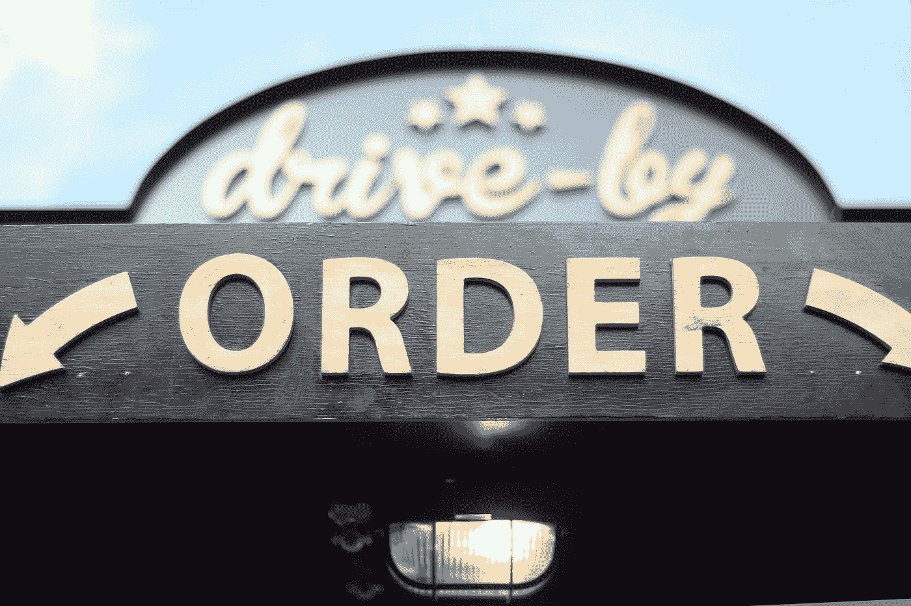
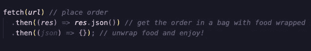
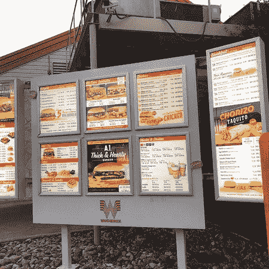
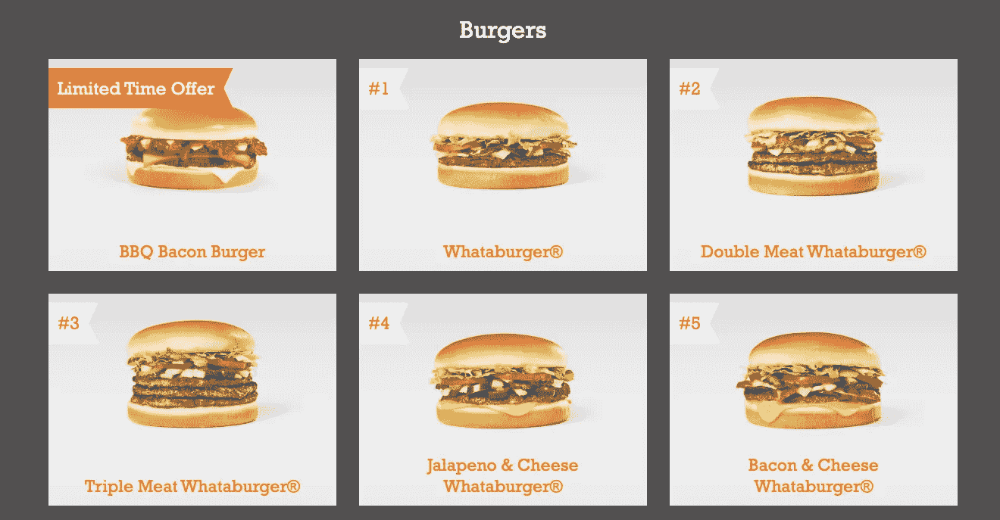
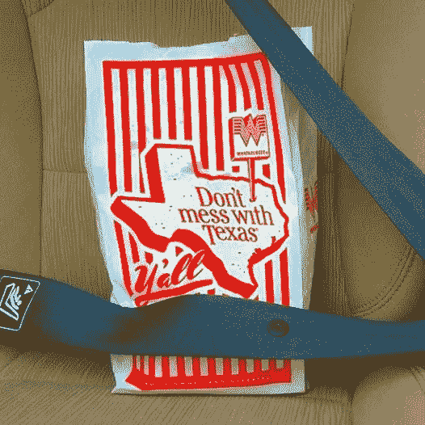
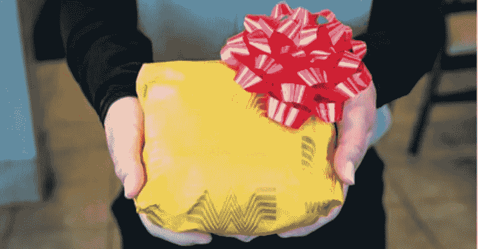
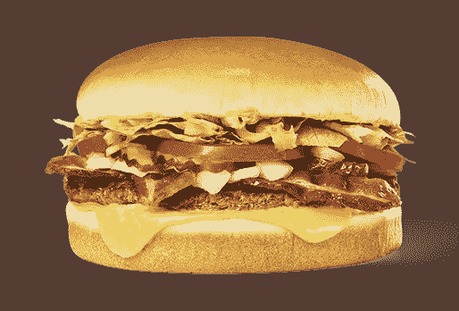

# 用一个快餐店的类比来解释 JavaScript 的获取

> 原文：<https://betterprogramming.pub/explaining-fetch-using-fast-food-drive-through-analogy-9b19428eab72>

## 如何得到你需要的东西

照片由[米歇尔·亨德森](https://unsplash.com/@micheile?utm_source=medium&utm_medium=referral)在 [Unsplash](https://unsplash.com?utm_source=medium&utm_medium=referral) 上拍摄。

如果你用 JavaScript 编码，你可能听说过`[fetch](https://developer.mozilla.org/en-US/docs/Web/API/Fetch_API)`。`Fetch()`通过与远程服务器通信，为您发出 HTTP 请求。`Fetch()`可以发出所有的 HTTP 请求，但是它的默认请求是`GET. Fetch()` 总是返回一个[承诺](https://developer.mozilla.org/en-US/docs/Web/JavaScript/Guide/Using_promises)。

有了承诺，你现在可以链接并使用所有可用于承诺的方法。对于这篇文章，我只打算讨论`.then()`。让我们看看下面的示例代码。我们会仔细检查每一条线，就像在快餐店一样。

获取示例

为了这个类比，我们要用德州图标 Whataburger！所以，让我们做好准备，迎接美好的事物。好吃！

# 下订单

好吧，我们去本地的快餐店。

Whataburger 得来速菜单

`Fetch()`需要我们传递一个 URL 给它才能工作。`Fetch()`也可以将选项作为参数，这在 [MDN web 文档](https://developer.mozilla.org/en-US/docs/Web/API/WindowOrWorkerGlobalScope/fetch)中有更详细的解释。您还希望传递一个带有正确路径的有效 URL，以便将请求路由到正确的控制器。这样想吧:如果你在 Whataburger，你想点一个巨无霸，你只会让员工感到困惑和失望。

一旦我们传递了一个有效的 URL，我们就可以下订单了！让我们看看菜单:

Whataburger 汉堡菜单

它们看起来都很美味，但是让我们为这篇文章选择第五个。让我们对着对讲机问好。

*   “喂？”
*   “你好，欢迎来到 Whataburger。我能为你做些什么？”

成功！我们得到了我们想要的回应！让我们点一份 5 号餐，开始我们旅程的下一部分。

# 将您的订单打包并放入袋子中

恭喜你！我们现在在代码的第二行，离得到美味的汉堡又近了一步。

第二行是我们如何处理 HTTP 响应。`Res`是应答对象的简称。这是表示对请求的响应的对象。我们将`.json()`放在`Res`的末尾，从响应中提取 JSON 主体内容。回到我们的“得来速”旅程，这是我们把车停在窗口拿食物袋的地方。

什么汉堡包

不错！但这就是我们的第二行代码。

就像一个包装好的汉堡，我们得到了我们想要的东西，但只有打开包装才能享用。

照片来自[脸书](https://www.facebook.com/whataburger/photos/a.196181800410538/2414945288534167/?type=3&theater)上的 Whataburger。

为了打开我们的汉堡，我们需要做另一个步骤。输入我们代码的最后一行。

# 打开食物，尽情享用吧！

我们马上就要品尝到所有的美味了！

让我们最后一次看一下代码:

我们的最后一行代码将响应体作为一个对象或一个对象数组来处理。在括号中，我们可以调用依赖于请求成功的函数，或者如果需要的话，我们可以更新 DOM。

这是一行代码，在我们的类比中，我们调用一个函数来打开我们的汉堡。所以让我们把包好的汉堡和薯条一起从袋子里拿出来，找到可以开始打开汉堡的终点。打开汉堡。漫威看着它。咬一口。微笑吧，因为你刚刚尝到了天堂的滋味——尝到了汉堡的滋味。享受你剩下的晚餐吧！

Whataburger #5 培根芝士汉堡

我希望这个类比能够帮助您理解一个简单的`Fetch()`请求是如何工作的。敬请期待下一篇文章！