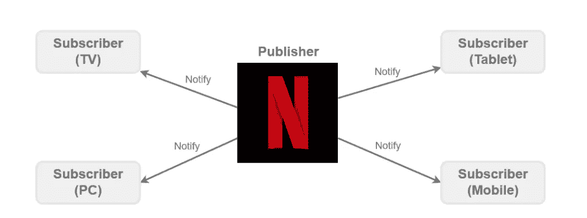

# 使用网飞和 TypeScript 解释观察者模式

> 原文：<https://betterprogramming.pub/explaining-the-observer-pattern-using-netflix-and-typescript-afbbff219c4d>

## 对软件中的事件做出反应


图片由 [**帕维切维斯基**](https://unsplash.com/@pawel_czerwinski) 提供

[](https://dleroari.medium.com/membership) [## 通过我的推荐链接加入媒体

### 作为一个媒体会员，你的会员费的一部分会给你阅读的作家，你可以完全接触到每一个故事…

dleroari.medium.com](https://dleroari.medium.com/membership) 

观察者模式是一种行为设计模式，当事情发生时，它对变化做出反应。术语*观察者*是指观察或注意到变化的人。

在编程中，它是一种订阅机制，在事件被触发时通知一个或多个对象(观察者)。同样的概念也适用于 Twitter、YouTube、Instagram、Snapchat 等社交媒体。

每当有人发帖，关注此人的每个人都会收到通知。这一概念与数据和自动化领域高度相关。

> **观察者模式**是一种软件设计**模式**，其中一个被称为主体(或发布者)的对象维护一个被称为观察者(或订阅者)的依赖者列表，并自动通知它们任何状态变化，通常是通过调用它们的方法之一— [来源](https://en.wikipedia.org/wiki/Observer_pattern)。

# 观察者的世界

如果我们退一步想想，我们周围的一切都是一连串的事件。事件是发生的事情。一些事件是关键的，而另一些则不是。

你在日常生活中所做的事情是一系列的事件。你早上醒来，穿好衣服，洗个澡，吃早餐，然后去上班。这些都是事件的例子。

在像飞机这样的复杂系统中，当飞行员在起飞时进行机动动作时，会触发成千上万的事件，其中大多数都是在幕后处理的，因此飞行员可以专注于飞行。

例如，当飞机到达某一高度时，座椅安全带标志关闭，压缩空气被管理以平衡机舱内的新鲜空气，洗手间的门被打开，监视器上播放商业广告，等等。

当这一切发生时，飞机向空中交通管制发送信号，以确保他们在空域中的安全。

# JavaScript 中的事件

JavaScript 中的事件通常基于用户事件，比如用户点击按钮、在屏幕上输入内容、鼠标移动、上下滚动。这些是我们可以跟踪的典型用户事件。

它也可以等待来自服务器的一些数据，例如从数据库请求用户。但是事件本身并没有多大作用，真正重要的是系统对这些事件的反应方式。

例如，在 JavaScript 中，我们有一个名为`addEventListener`的流行函数，它基于 MDN 文档中列出的[事件之一触发。](https://developer.mozilla.org/en-US/docs/Web/Events)

下面是一个响应用户事件的 JavaScript 函数的例子:

在 JavaScript 中监听用户事件

`addEventListener`函数只是一个观察器(订阅者),它等待一个点击事件(通知者)。当用户单击页面上的某个地方时，它将触发一个称为回调的操作，打印一条消息“clicked”。

# 这是我们要解决的问题

1.  用网飞解释观察者模式。
2.  定义发布者和订阅者。
3.  创建一个流媒体平台。
4.  创建一个设备。
5.  订阅网飞。
6.  总结。

# 1.用网飞解释观察者模式

解释观察者模式的最好方法是使用我们都熟悉的东西，那就是网飞。

网飞是一个流媒体平台，允许成员在全球数千台联网设备上观看各种各样的电视节目、电影、纪录片等。

## 但是为什么是网飞呢？

网飞是遵循观察者模式的一个很好的例子。每当有新内容上传到网飞服务器时，所有激活了网飞帐户的设备都会收到通知，根据内部配置显示或不显示内容。

因此，第二天某人打开网飞，这个人最喜欢的节目的一个新系列就可以观看，而不必手动安装新的内容。

这样，网飞可以专注于发布内容，而世界各地的设备则负责展示内容。

换句话说，我们通过让一个平台发布，另一个平台观察来分离责任。这就是观察者模式的突出之处！



网飞的观察者模式

如上图所示，网飞是发布者，负责通知设备(观察者)发生了一些事情，比如上传了新内容。

让我们看看如何构建一个像网飞一样的流平台，并在 TypeScript 中实现观察者模式。

注意:这个例子的全部代码都写在一个文件中。下面的代码示例关注文件中的不同部分。

# 2.定义发布者和订阅者

为了使我们的生活更容易，我们将创建两个接口；一个发布者和一个订阅者来定义类的语法。

## 界面的力量

在 TypeScript 中，接口通常用于类型检查，也称为协定。

接口不能被实例化，它只是一个模式，定义了一个类必须有哪些变量或函数。这使得编写代码变得更加容易，因此我们可以在实现代码之前看到我们正在处理什么数据。

这种洞察是通过代码完成来完成的，大多数 IDE 都支持这种开箱即用的功能。但是什么是代码补全呢？

代码补全( [IntelliSense](https://docs.microsoft.com/en-us/visualstudio/ide/using-intellisense) )通过在变量名后使用`.`点符号，帮助开发人员查看代码提示，比如某个类具有哪些属性或方法。

例如，编写`person1.`将显示类似`person1.getName`、`person1.setName`、`person1.getEmail`等*的建议。*

## 命名约定

对于命名约定，我们将坚持使用发布者和订阅者，但是在其他编程语言中，发布者被称为流、主题或可观察对象，而订阅者被称为观察者、监听器等等。

不要让这样的命名约定迷惑你，底层逻辑仍然遵循观察者模式的相同原则。

## 定义发布接口

发布接口是我们观察者模式的基类。它由 subscribe、unsubscribe 和`notifySubscribers`等方法组成。

唯一需要注意的是:发布者负责通知订阅者:

发布者界面

## 定义订户界面

订阅者接口只不过是一个类，它有一个发布者在出现更改时调用的方法。订户可以是侦听传入事件的任何东西。

在这个例子中，它是一个设备，但在其他情况下，它可以是在温度下降时控制热舒适性的通风设备，在红灯信号时停下来的火车，或在收到信息时振动的移动设备。

订阅者通常有一个发布者调用(通知)更改的方法，它还可以有一个类似名称的字段来帮助标识订阅者的类型:

用户界面

# 3.创建一个流媒体平台

下一步是创建一个`StreamingPlatform`,它负责在新内容发布时通知订阅的设备。这是实现部分，也是观察者模式的核心原则。

注意:单词 *implement* 意味着应用由接口描述的契约，而不是创建类的新实例。

让我们创建一个实现`Publisher`接口的类`StreamingPlatform`。

一旦实现了这个接口，类名`StreamingPlatform`下就会显示一条红色的曲线，并显示消息:

```
A classStreamingPlatform incorrectly implements interface Publisher. 
```

这意味着我们需要实现在`Publisher`接口中定义的方法。

如前所述，接口是一种模式，它帮助开发人员通过遵循一般定义来定义一个类需要哪些方法和字段。强烈建议为未来的课程提供标准。

让我们来实现`StreamingPlatform`:

通知订户的流平台

如果我们退一步分析`StreamingPlatform`，一切都是围绕使用数组的概念构建的，然后循环每个项目来调用它的方法。在我们的例子中，一个条目是一个拥有`update`方法的设备对象。

## 订阅

为了让`StreamingPlatform`在发布新内容时更新多个设备，我们需要将订户存储在我们的订户列表中。

当有人在 Twitter、脸书或 Instagram 上关注一个人时，这遵循相同的概念。例如，当有人在 Instagram 上发布新帖子时，每个关注的人都会收到通知。

## 取消订阅

订阅者应该有停止接收通知的灵活性，原因可能是它想要订阅其他内容，或者不再需要这样的功能。

例如，如果你订阅了一份邮件简讯，后来出于某种原因不想再收到电子邮件，你可以取消订阅。

此外，这更有效地节省了 HTTP 的内存和流量，因此`StreamingPlatform`不必通知已经取消订阅的用户。

## 通知订户

这是负责通知订户的机制(核心)。这是通过遍历订阅者列表中的每个订阅者并调用其`update`方法来完成的。

# 4.创建一个设备

现在`StreamingPlatform`已经准备好了，下一步是创建一个设备，这样我们就可以添加 PC、平板电脑、电视和移动设备。

`Device`(订阅者)是监听器，它实现了`Subscriber`接口；一个`deviceName`来帮助我们识别哪个设备被触发了，还有一个`update`方法来识别即将到来的变化。

订户的示例

注意:我们可以创建几个实现`Subscriber`接口的类，并添加条件状态，比如我们是否想要限制播放哪些电影。

例如，父母可以设定年龄限制来保护孩子不看暴力电影。

# 5.订阅网飞

既然我们已经设置好了`StreamingPlatform`和`Device`类，下一步就是通过创建一个流平台(网飞)和一个订阅者(设备)来实现它。这里的核心行为是网飞。

订阅网飞

## 创造网飞

在我们可以向流媒体平台添加设备之前，我们需要创建一个新的`StreamingPlatform`类实例。这可以是任何类型的流媒体平台，如 YouTube、HBO、Twitch 等。

在本例中，我们将创建网飞。一旦这个类被实例化，它现在就可以添加、删除和通知订阅者了。

## 创建设备

这些设备是我们的订户，当网飞发布新内容时，我们会通知他们。为了跟踪所通知的设备类型，该类接受设备的名称。

注意，我们不像`device2.update('blabla')`那样从`Device`类调用`update`方法，因此流媒体平台(网飞)是调用它的平台。

## 订阅网飞

为了创建一种新内容发布时网飞通知设备的机制，必须有某种类型的关系:设备必须订阅网飞。

单词 subscribe 也可以是 connect、attach、listen、follow 等等。

## 发布并通知

最后但同样重要的是，这是符合观察者模式结构的部分。发布新内容时，流媒体平台(网飞)会自动通知设备(订户):

发布和通知事件

# 摘要

观察者模式是一种众所周知的行为设计模式，在软件中被大量用于跟踪事件和对事件做出反应。

让软件响应这些事件的需求对于创建健壮的系统是必不可少的。已经有数十亿个系统遵循观察者模式，但是通过不同的名称和库。

如果你像我一样，你想了解事物是如何在幕后工作的，观察者模式是我们使用的东西，即使我们可能没有意识到它。

例如，当您对用户事件或任何类型的事件做出反应时，这就是观察者模式的工作。

现在，您已经对发布和订阅事件的概念以及如何实现它有了基本的了解。

> 如果你喜欢这篇文章，并想要更多这样的，请鼓掌❤，并与可能需要它的朋友分享，这是好的因果报应。
> 
> 你可以在我每周发表文章的媒体上找到我。或者你可以在[推特](http://twitter.com/dleroari)上关注我。