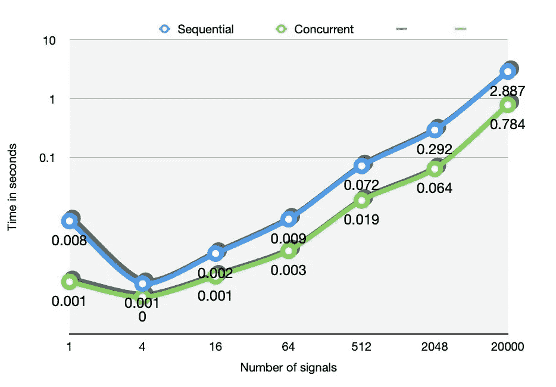

# 使用 Swift 的并发任务组提高 iOS 应用性能

> 原文：<https://betterprogramming.pub/exploiting-multiple-cores-using-concurrency-and-task-groups-in-swift-cfd66b5faf57>

## 如何利用并发的力量大幅提高 iOS 应用的性能


照片由 [Haithem Ferdi](https://unsplash.com/@haithemfrd_off?utm_source=medium&utm_medium=referral) 在 [Unsplash](https://unsplash.com?utm_source=medium&utm_medium=referral) 拍摄

构建依赖并行计算的应用程序和软件的能力还有待充分开发。Grand Central Dispatch 提供的技术自 2009 年起就可以使用，这早于 Swift 的推出。

在过去的几年里，Apple 增加了对使用同步和异步执行的多线程处理的支持。

与用于创建和管理`pthreads`的旧的和标准的 **POSIX API** 不同，Swift 允许使用封装低级操作的队列，因为它向软件开发人员展示了一个更简单的 API。

虽然应用程序开发人员目前对 GCD 的大多数使用都是关于与 web 一起工作以及异步执行任务和请求，但它还可以用于运行并行任务，以优化高负载代码的性能。

# 任务

Swift 中的任务是独立于其他代码在处理器上运行的异步工作单元。使用以下语法创建一个`Task`:

```
let task = Task {
	print ("This is a task")
}
```

一旦实例化，任务由操作系统自动调度，开发者不能直接选择何时开始执行。

由于任务的异步特性，任务对于运行独立于其余执行的特定代码非常有用。

通过使用 swift 中的`await`关键字，以如下方式等待任务完成:

```
let taskResult = await task.value
```

虽然这种语法在等待任务完成时很有用，但返回值也可以用来存储任务正在执行的代码的有意义的结果。

例如，通过在定义闭包参数时采用它，可以指定任务的实际返回类型:

```
let task = Task { () -> Int in
	// Some code being exectued
	let result = doSomeStuff()
	return result
}//Somewhere else 
let taskResult = await task.value //Waiting for the completion 
if taskResult == 0 {
	print("The task has succesfully finished executing")
}
else {
	print("The task failed during its execution")
}
```

# 任务组

在 Swift 中，任务组是并行运行的动态创建的任务的集合。

与任务不同，任务组通常用于分割正在执行的代码的工作负载，因此可以利用并行性来显著提高当前应用的整体性能。

特别是，当所需任务的数量在编译时未知时使用它们，因此在程序运行时动态决定。

任务组中的所有任务共享相同的返回类型，并使用 Swift 标准库的`withTaskGroup`函数进行实例化。

例如，一个任务组可以用来获得一组值，这些值是通过异步计算该组的单个任务获得的。

首先，让我们定义任务组:

```
let result : [Float] = withTaskGroup(of: Float.self) { group in 
	//Task definition
}
```

`group`，闭包的捕获参数，用于引用从属于闭包的代码中新创建的任务组。

组中每个任务的返回类型由参数`of:`指定，在这种情况下，任务将返回一个浮点数。

此时，使用`addTask`方法，我们可以通过定义必须执行的代码向组中添加一个任务。例如，我们可以用下面的代码动态生成 10 个任务，这些任务产生一个随机生成的浮点数:

```
let result : [Float] = withTaskGroup(of: Float.self) { group in 
	for _ in 0..<10 {
		group.addTask {
			return Float.random(in: -100...100) //Returning a random number in -100 - 100
		}
	}
}
```

之后，为了创建最终的数组，最基本的是等待所有任务完成，然后通过追加每个返回值来构造数组。

Swift 通过使用一个`for await`循环很容易地实现了这一点，该循环将等待所有任务终止执行的时刻，然后迭代每个返回值

```
let result : [Float] = withTaskGroup(of: Float.self) { group in 
	let array = [Float]()
	for _ in 0..<10 {
		group.addTask {
			return Float.random(in: -100...100) //Returning a random number in -100 - 100
		}
	}
	for await value in group {
		array.append(value) //Append the value obtained from the task
	}
	return array //Returning the created array
}
```

通过追加来自每个任务的每个值，数组被创建，并因此准备好被返回。

# 使用 Accelerate 实现离散傅里叶变换的完整示例

无需深究细节，离散傅里叶变换(DFT)是一种算法，可用于转换信号(如音频信号)以提取其频谱。

在 **DSP** (数字信号处理)领域，为了节省计算资源，广泛使用一种叫做快速傅立叶变换(FFT)的算法来处理信号，快速获得 DFT。

尽管是实际傅立叶变换的近似，FFT 仍然可以归类为依赖于拥有足够的*处理能力*以便能够按时执行的代码。

苹果公司的`Accelerate`框架的`vDSP`包可以用来成功实现 dst，而不需要无用的令人费解的代码。通过利用 vDSP 提供的 API，借助封装了所需功能的`DiscreteFourierTransform`类可以获得 DFT。

为了计算*快速傅立叶变换*，使用了*加速* DFT API，如下所示:

```
typealias SignalType = Float
func computeFFT(of signal: [SignalType]) -> [SignalType]{
	var returnedResult: (real: [SignalType], imaginary: [SignalType])?
	do {
		let fwdDFT = try vDSP.DiscreteFourierTransform(
			previous: nil,
			count: signal.count,
			direction: .forward,
			transformType: .complexComplex,
			ofType: SignalType.self)
			// Creating the imaginary part of the signal with zeroes
			let imaginary: [SignalType] = [SignalType](repeating: 0.0, count: signal.count) 			returnedResult = fwdDFT.transform(real: signal, imaginary: imaginary) // Run the transform algorithm
	}
	catch {
		//Print an error in case DiscreteFourierTransform could not be instantiated
		print(error) 
	}
	guard let real = returnedResult?.real else {
		return [] 
	}
	//We are interested only to the real part of the transformed signal
	return real 
}
```

此外，为了本文的目的，已经实现了一个函数，用于生成具有选择的计数和样本数的随机信号。

# 顺序计算 DFT

可以用来计算 DFT 的第一种方法包括对每个信号(存储在数组中)进行顺序迭代，并对其应用傅立叶变换。由于信号已经以浮点数组的形式存储在内存中，因此使用矩阵来跟踪所产生的信号集合:

```
let sigCount = 200
let sampleCount = 2048
let signals = generateSignals(numSignals: sigCount, samples: sampleCount) 
//Returns a matrix, each row representing a different signal
```

一旦有了信号，我们就可以遍历它们，并使用标准 for 循环应用上面定义的`computeFFT`函数:

```
var sequentialResults = [[SignalType]]()
for signal in signals {
	//Append every computed result
	sequentialResults.append(computeFFT(of:signal)) 		
}
```

最重要的是，我们需要一种方法来跟踪我们的处理器完成给定任务需要多少时间。

因此，使用了核心基础框架中的`CFAbsoluteTimeGetCurrent()`函数。

通过存储算法开始执行的时间，可以容易地如下计算完成时间:

```
var sequentialResults = [[SignalType]]()
var startTime = CFAbsoluteTimeGetCurrent() 
for signal in signals {
	//Append every computed result
	sequentialResults.append(computeFFT(of:signal)) 		
}
var endTime = CFAbsoluteTimeGetCurrent() //Time of terminationvar elapsedTime = endTime - startTime 
print("Sequential algorithm: \(elapsedTime)"
```

上面介绍的代码执行 DFT，并在屏幕上显示处理器完成指定任务所需的时间。

# 使用任务组并行计算 DFT

为了执行智能并行计算，我们需要在所有可用的 CPU 内核之间分配总工作负载。

这是通过让`activeProcessorCount`通过基础框架来完成的，如下所示:

```
let  processors = ProcessInfo.processInfo.activeProcessorCount
```

该变量包含 CPU 核心的数量。

此时，可以创建负责执行计算的`TaskGroup`:

```
let task = Task { () -> [[SignalType]] in 
	let concurrentResults : [[SignalType]] = await withTaskGroup(of [[SignalType]].self) {
		group in

		// Create an empty matrix that will contain all the Fourier transforms
		var transformedSignals = [[SignalType]]()		
		for i in 0..<Int(processors) {
			group.addTask {
				// For every task create a sub-matrix to be filled
				// with the Fourier transforms of the signals
				var matrix = [[SignalType]]()

				//  The bounds for each task range from (i/processors) to ((i+1)/processors)
				//	This will divide the signals equally among the various processors
				let lowerBound = Float(i)/processors * Float(signals.count)
				let upperBound = Float(i+1)/processors * Float(signals.count)				for index in Int(lowerBound)..<Int(upperBound) {
					matrix.append(computeFFT(of signals[index])
				}
				return matrix
			}
		}		// After every task is created and automatically scheduled by the OS, 
		// wait for the end of each one and append the sub-matrices to the return variable
		for await value in group {
			transformedSignals.append(contentsOf: value)
		}
		return transformedSignals
	}

	return concurrentResults
}
```

代码背后的逻辑实际上非常简单。

除了语法之外，实际发生的是在可用的 CPU 内核之间简单地划分任务总量。

这使得每个内核与其他内核相比具有相似的工作负载，从而减少了完成执行所需的时间。

理论上，所选择的产生任务的数量也可以高于实际的处理器数量。

然而，关于使用提升数量的任务，最相关的问题是实例化多个任务时产生的开销。

事实上，在引擎盖下，创建任务并对其进行调度需要 CPU 执行长时间的调度算法和不同的上下文切换(即，从正在运行的任务到另一个任务来回切换)，因此当操作系统必须调度太多任务/线程时，性能会恶化。

每个 CPU 都有固定数量的逻辑处理器，可以用来同时运行不同的操作。

例如，一个 M1 处理器配备了一个 8 核 CPU，这意味着如果我们可以在任何时间点拍摄处理器的快照，那么只有 8 个线程在该时刻实际运行。因此，实例化比可用逻辑处理器数量更多的任务是多余的，甚至弊大于利。

在我们的具体案例中，在 M1 上，在任何给定时间只能同时处理八批信号，这意味着拆分工作负载，甚至更多，将迫使组中的一些任务等待 CPU 被释放，从而成为程序性能的瓶颈。

# 结果

为了量化并发算法在多大程度上提高了执行效率，我们对不同数量的待转换信号进行了多次测试。



测试清楚地表明，在处理非常繁重的工作负载时，并发算法要好得多。

该图通过对数标度来表示，对数标度更适合于表示彼此相距很远的数字。

事实上，对数标度以 10 的幂来分隔数字，也就是说，在对数标度中，区间[0.1，1]的距离与区间[1，10]，[10，100]等的距离相同。

在这个例子中，由于两条线之间的距离大致保持不变，所以下面的值和上面的值之间的差距会越来越大。

这是一个案例的演示，在这个案例中，并发性极大地改善了特定任务的执行，而 iOS 环境中仍有许多未探索的路径有待发现。

西蒙·佐丹奴 & [米歇尔·阿韦萨纳](https://medium.com/u/344a2a281ea3?source=post_page-----cfd66b5faf57--------------------------------)撰写