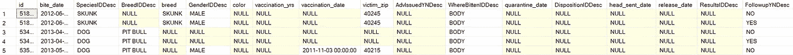
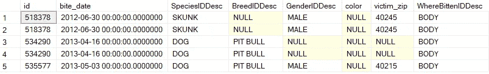
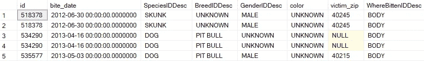
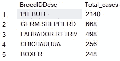

# 探索与 SQL 的数据争论

> 原文：<https://betterprogramming.pub/explore-data-wrangling-with-sql-8166119e1776>

## 利用 SQL 清理原始数据

图片来自[皮克斯拜](https://pixabay.com/?utm_source=link-attribution&utm_medium=referral&utm_campaign=image&utm_content=6060942)的[戈登·约翰逊](https://pixabay.com/users/gdj-1086657/?utm_source=link-attribution&utm_medium=referral&utm_campaign=image&utm_content=6060942)

当谈到数据操作时，每个人都意识到对 SQL 有很强的掌握的重要性。考虑到关系数据库在收集和存储数据方面是多么的流行，SQL 是一种具有巨大效用的语言，并且是必备技能列表中的第一名。

也就是说，SQL 主要用于编写提取数据和帮助获得洞察力的查询。

对于数据清理，人们更倾向于依赖 Python 和 R 之类的语言，它们提供了大量的包来实现简单方便的数据预处理。有了这些包，复杂的任务可以用最少的代码行来完成。

相比之下，使用 SQL 执行相同的任务可能会因其语法而显得繁琐。然而，尽管使用 Python/R 处理数据有很多好处，但了解如何使用 SQL 作为数据清理工具还是值得的。毕竟，在大型数据集上使用 Python 和 R 包会带来额外的复杂性，并可能引发问题。

SQL 可能没有自带的方便的软件包，但是它拥有进行简单数据清理的方法。了解基本命令可以省去在使用 SQL 执行查询之前使用额外工具清理数据的麻烦。

虽然您使用 SQL 的大部分时间将用于编写带有“SELECT”和“FROM”的查询来过滤、聚集和连接数据，但是您可能偶尔会遇到需要您永久修改表的情况。

因此，了解如何在 SQL 中应用基本的数据清理工具是值得的，这样您就可以在处理原始数据时省去一些麻烦。

# 个案研究

让我们做一个练习，在这个练习中，我们在数据集上实现了一个简单的数据预处理过程，以证明 SQL 作为数据清理工具的可用性。

注意:以下代码是在 Microsoft SQL Server 上编写的。因此，SQL 语法可能与您最熟悉的语法略有不同。

正在讨论的数据集存储了路易斯维尔市公共卫生和福利部报告的动物咬伤记录。点击[此处](https://data.louisvilleky.gov/dataset/environmental-health-bulk-data/resource/af2c0cc3-280d-4812-871a-f33fceefc62e#{view-grid:{columnsWidth:[{column:!bite_date,width:185}]}}) *可进入数据集。*

首先，让我们预览一下数据，看看我们必须处理什么:

选择前 5 行数据(由作者创建)

代码输出(由作者创建)

正如您所看到的，这里提供了大量的特征，包括日期、位置和咬伤事件中涉及的动物。数据集还包含不相关的要素和缺失值。

让我们执行简单的数据争论，以便编写查询和从数据集中提取必要的信息变得容易。

# 移除不需要的功能

我们可以从处理不想要的特性开始。假设我们计划对数据进行 EDA，或者构建动物咬伤案例的时间序列。如果我们只对分析咬伤事件本身感兴趣，我们可以忽略与咬伤后果相关的特征。我们还可以删除多余的或不能提供额外见解的功能。

在下面的代码中，我们删除了符合这些条件的功能:

移除不需要的特征(由作者创建)

代码输出(由作者创建)

# 输入缺失数据

只剩下相关的特性，下一步是处理缺失的值。出于保留尽可能多的数据的考虑，丢失的值将被替换，而不是尽可能删除。

除了像“bite_date”和“victim_zip”这样的特性之外，没有一个特性需要特定的值。用新的类别替换空值来表示这些特性的未知值就足够了。

此规则将应用于“BreedIDDesc”、“GenderIDDesc”、“color”和“WhereBittenIDDesc”列。对于这些功能，缺失值将被替换为“未知”值。

替换丢失的值(由作者创建)

插补后修改的数据集(由作者创建)

# 删除丢失的数据

最后，将从数据集中移除剩余缺失值的记录。在这种情况下，咬伤的日期和位置以及涉及的动物种类对于数据争论后的分析至关重要。

因此，“bite_date”、“SpeciesIDDesc”或“victim_zip”列中缺少值的所有记录都将被删除。

删除缺少的值(由作者创建)

删除缺失值后修改的数据集(由作者创建)

# 数据清理后

既然数据集已经过彻底的预处理，我们可以开始编写查询来从数据中提取我们想要的任何见解。

例如，这个查询将向您显示构成狗咬伤案例数量最多的五种狗。

根据案例数查找前 5 名犬种(由作者创建)

代码输出(由作者创建)

# 结论

许多程序员(包括我自己)习惯于使用 Python 和 R 这样的通用编程语言来执行令人讨厌的数据清理任务。然而，SQL 在这方面也有一些功能。

能够使用 SQL 管理原始数据使您的数据清理工作变得更加简单和方便。

编码快乐！