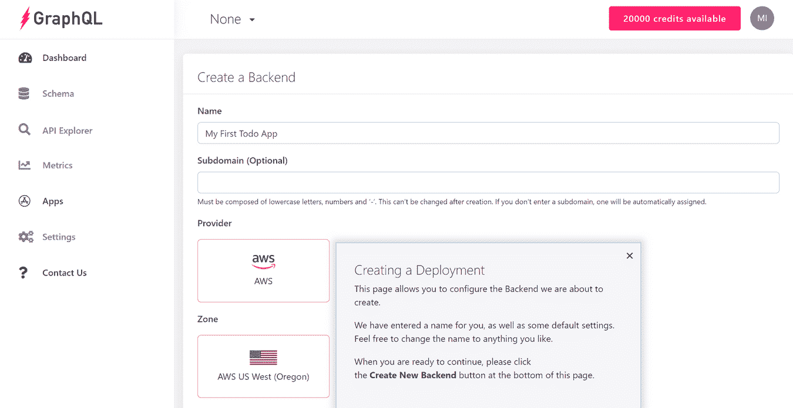
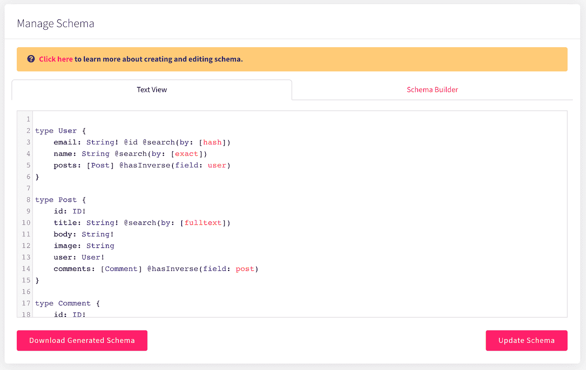
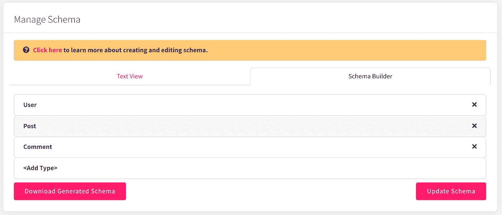
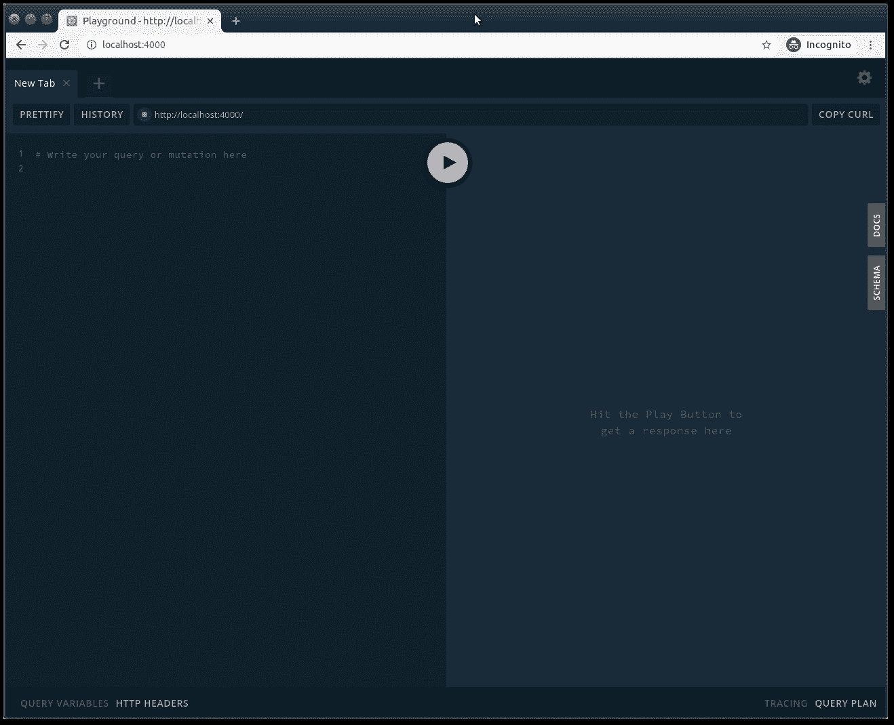
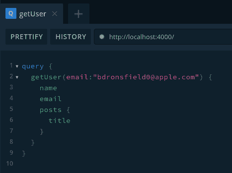
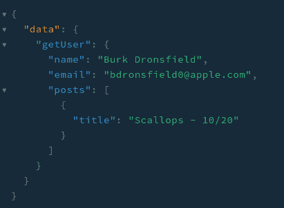
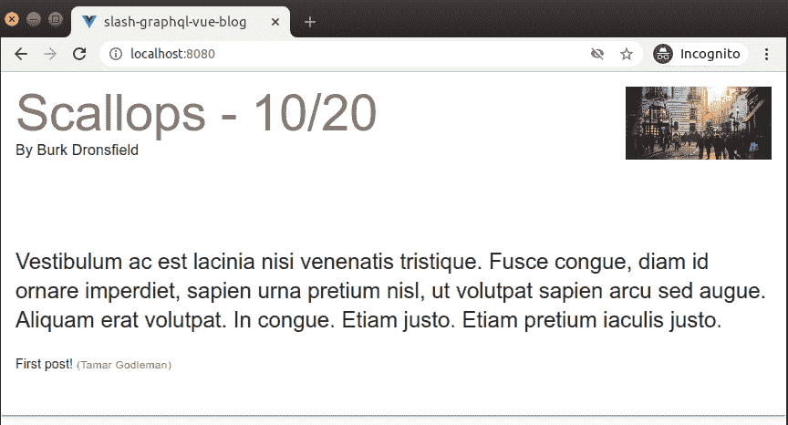

# 通过用 Slash GraphQL 构建一个博客来探索 GraphQL

> 原文：<https://betterprogramming.pub/explore-graphql-by-building-a-blog-with-slash-graphql-161443b9e110>

## 通过构建一些对你的职业生涯有帮助的实用工具来提高你的 GraphQL 技能


照片由[格雷格·拉科齐](https://unsplash.com/@grakozy?utm_source=medium&utm_medium=referral)在 [Unsplash](https://unsplash.com?utm_source=medium&utm_medium=referral) 上拍摄

在本文中，我将通过构建一个由最近发布的[斜杠 GraphQL](https://dgraph.io/slash-graphql)——一个托管的 graph QL 后端支持的概念验证博客来探索 graph 数据库/GraphQL。

图是一种对系统中的信息建模的迷人方式，其中数据片段(节点)之间的关系(边)是系统的一级实体。这是与更常见的关系数据库(RDBMS)模型不同的方法，在 RDBMS 模型中，记录之间的关系是隐含的。例如，“该用户拥有这篇文章是因为`user.id == post.user_id`”

当数据之间的关系和数据本身一样重要时，图表是最有用的。例如:

*   知识图表
*   推荐引擎
*   供应链管理
*   社会化媒体

一般来说，图提供了更具描述性的查询，在调整模型时具有更大的灵活性，并且在遍历关系时具有更好的性能。GraphQL(我们将在本文中使用)是一种数据操作和查询语言，它让您能够通过 API 绘制图表。

如果您习惯于使用 RDBMSs，那么使用图形可能会感到有些陌生，因此在本文中，我将尝试向您展示一些基本知识。我打算建立一个基于 GraphQL 的博客。`User`、`Post`和`Comment`之间的关系(`User`有许多`Post`、`Post`有许多`Comment`、`User`有许多`Comment`)凸显了 GraphQL 的强大，如下所示。像往常一样，我并不打算在这里制作完成的、生产就绪的代码——只是一些简单的例子向您展示底层的概念。

您可以在这里找到本文[的所有示例代码。](https://github.com/alvinslee/slash-graphql-blog)

# 数据图表

对于本文，我将使用 [Dgraph](https://dgraph.io/) ，这是一个用 [Go](https://golang.org/) 编写的原生 GraphQL 数据库(相对于关系数据存储之上的 GraphQL 层),为具有高可用性和事务支持的大规模应用程序而设计。如果你有兴趣了解更多关于这个项目的信息，他们的 [YouTube 频道](https://www.youtube.com/channel/UCghE41LR8nkKFlR3IFTRO4w/)上有一些很好的介绍视频。在 GraphQL 层上使用原生 GraphQL 数据库通常是首选，因为它提供了更简单的数据建模和深度连接速度，并解决了 [n+1 问题](https://medium.com/@bretdoucette/n-1-queries-and-how-to-avoid-them-a12f02345be5)。

与其在服务器上安装 Dgraph，或者通过 Docker 在本地运行它，我将使用他们托管的 GraphQL 后端服务，[斜杠 GraphQL](https://dgraph.io/slash-graphql) 。该平台提供了一个适用于本文的免费试用版(然后移动到 9.99 美元/月的固定费用，最高 5GB 的数据)。

让我们开始吧。

# 在斜杠 GraphQL 上创建 GraphQL 后端

为了使用 Slash GraphQL，您需要使用您的 GitHub 或 Google 帐户登录，然后您将看到带有创建和管理后端选项的 web 界面，以及许多教程和其他文档的链接，我建议您探索这些内容。

Dgraph 最近发布了[斜杠-graphql](https://www.npmjs.com/package/slash-graphql) ，一个托管的 graphql 后端。有了托管后端，您不需要管理自己的基础设施，创建和管理自己的数据库，或者创建 API 端点。这些都已经为您处理好了，所以这是我们项目的绝佳选择。因为我非常喜欢使用命令行，所以我将在本文中使用它。但是如果你愿意，你可以通过网络界面做任何事情。



您可以通过运行以下命令来安装命令行工具:

```
npm install — global slash-graphql
```

# 创建后端

使用 slash-graphql 来管理 Slash GraphQL 后端感觉很像使用 Heroku 命令行工具来管理 Heroku 应用程序，所以如果您对此感到满意，您会发现这很熟悉。

要通过命令行创建斜杠 GraphQL 后端，我们首先必须登录:

```
slash-graphql login
```

这将提示您确认终端上的代码与该命令将打开的网页上显示的代码相匹配。一旦你做到了这一点，你可以发出命令斜线 GraphQL。

现在我们可以创建我们的 GraphQL 后端，如下所示:

```
slash-graphql create-backend blog
```

这将输出您的后端的端点，这通常需要大约 20 秒来创建。这是我们将用来与 GraphQL 数据库交互的 URL。您将在整篇文章中使用它，所以请记下来。在我的例子中，我的 GraphQL 端点是`[https://anxious-aunt.us-west-2.aws.cloud.dgraph.io/graphql](https://anxious-aunt.us-west-2.aws.cloud.dgraph.io/graphql)`。

请在代码示例中的任何地方替换您自己的端点。

就是这样。只需几个步骤，您就拥有了一个功能完整的托管 GraphQL 后端。

# 定义模式

接下来，我们需要为我们的博客数据定义一个模式。创建一个名为`schema.graphql`的新文件，内容如下:

```
type User {
  email: String! @id @search(by: [hash])
  name: String @search(by: [exact])
  posts: [Post] @hasInverse(field: user)
}type Post {
  id: ID!
  title: String! @search(by: [fulltext])
  body: String!
  image: String
  user: User!
  comments: [Comment] @hasInverse(field: post)
}type Comment {
  id: ID!
  body: String!
  user: User!
  post: Post!
}
```

让我们稍微分解一下。我将在这里介绍几个亮点。详情请看[斜线 GraphQL 文档](https://dgraph.io/docs/slash-graphql/slash-quick-start/)。

从最后一个实体开始，我们这样定义`Comment`:

```
type Comment {
  id: ID!
  body: String!
  user: User!
  post: Post!
}
```

这意味着我们有一个名为`Comment`的节点类型，它有几个属性。

`id` : `ID!`告诉 Dgraph 为这个类型生成自己的 uid 值。

`body`是必需的字符串值。

`post`和`user`有类型`Post`和`User`，而`!`表示这些是必填字段——即每个评论属于一个`Post`并且也属于一个`User`。

`Post`类型有一个`comments`属性，它是`Comment`节点的列表:

```
comments: [Comment] @hasInverse(field: post)
```

同样，`User`也有很多帖子。

**注意:**我们告诉我们的后端存在什么样的节点类型以及它们如何相互关联，但是我们不需要定义如何使这些关系工作——没有外键，没有连接，也没有多对多映射表。

我们可以用一个命令将这个模式应用到我们的后端:

```
slash-graphql update-schema — endpoint [https://anxious-aunt.us-west-2.aws.cloud.dgraph.io/graphql](https://anxious-aunt.us-west-2.aws.cloud.dgraph.io/graphql) schema.graphql
```

如果您正在使用 web 界面，下面是该设置的外观:



现在我们有了模式，我们可以添加一些数据。

# 使用 curl 添加数据

虽然 slash-graphql 工具有导入数据功能，但它是为恢复备份而不是添加数据块而设计的。

与 GraphQL 数据库交互的通常方式是通过 HTTP 请求，所以这就是我们如何使用 curl 添加数据，通过这个脚本，我们将它保存为`post.sh`:

```
#!/bin/bash
FILE=$1
curl — request POST \
 — header “Content-Type: application/graphql” \
 — data “$(cat ${FILE})” \
${ENDPOINT}
```

该脚本使用 curl 向我们的 graphql 端点`${ENDPOINT}`发出 HTTP POST 请求( `— request POST`)。

请求的主体是文件`${FILE}` ( `— data $(cat “${FILE})”`)的内容，我们将文件名作为参数传递给脚本`FILE=$1`。

我们将`Content-Type`头设置为`application/graphql`(也可以用 JSON 发送命令)。

斜杠 GraphQL 说它的[查询和变异在默认情况下是不受限制的](https://dgraph.io/docs/slash-graphql/security/)。您可以通过在 Slash GraphQL 的模式中添加一个`@auth`指令来保护您的后端。这将要求您在请求中使用一个 API 键和一个`Authorization`头。不过，为了简单起见，我们不限制我们的后端。

顺便说一下，记得用下面的命令将`post.sh`设置为可执行:

```
chmod u+x post.sh
```

现在我们可以在我们的`post.sh`脚本中设置我们需要的环境变量:

```
export ENDPOINT=https://anxious-aunt.us-west-2.aws.cloud.dgraph.io/graphql
```

现在我们可以添加我们的数据。

# 添加数据

下面是我们将要发送的`.graphql`(一种改变数据的方式)，我们将它保存在一个名为`addData.graphql`的文件中:

```
mutation {
  addPost(input: [
    {
      user: {
        name: “Burk Dronsfield”,
        email: “bdronsfield0@apple.com”
      },
      title: “Scallops — 10/20”,
      image: “https://picsum.photos/id/441/600/300",
      body: “Vestibulum ac est lacinia nisi venenatis tristique. Fusce congue, diam id ornare imperdiet, sapien urna pretium nisl, ut volutpat sapien arcu sed augue. Aliquam erat volutpat.\n\nIn congue. Etiam justo. Etiam pretium iaculis justo.”,
      comments: [
        {
          body: “First post!”,
          user: {
            email: “tgodleman1@chronoengine.com”,
            name: “Tamar Godleman”
          }
        }
      ]
    }
  ])
  {
    post {
      id
      title
    }
  }
}
```

这些用户都不是真实的人——这是来自 [Mockaroo](https://mockaroo.com/) 的样本数据。

请注意我们是如何添加两个用户、一篇博客文章和一条评论的，所有这些都是通过对后端的一个请求完成的。从这里我们可以开始看到 GraphQL 数据库的威力。

```
./post.sh addData.graphql | jq
```

`| jq`是可选的，但是对我们的帖子的响应将是一个 JSON 文档，通过 [jq](https://stedolan.github.io/jq/) 传递它会更容易阅读。

# 查询数据库

我们可以通过 HTTP POST 以完全相同的方式查询数据库。这里有一个查询来检索用户和他们所写的任何帖子的标题，我们将把它们保存在一个名为`queryUser.graphql`的文件中:

```
query {
  queryUser {
    name
    email
    posts {
      title
    }
  }
}
```

我们以与变异完全相同的方式运行这个查询:

```
./post.sh queryUser.graphql | jq
```

您得到的输出顶部应该是这样的:

```
{
  “data”: {
    “queryUser”: [
      {
        “name”: “Tamar Godleman”,
        “posts”: []
      },
      {
        “name”: “Burk Dronsfield”,
        “posts”: [
          {
            “title”: “Scallops — 10/20”
          }
        ]
      }
    ]
  },
```

# 阿波罗中间件层

Slash GraphQL 为我们提供了一种快速简单的方法来启动和运行 GraphQL 后端。几分钟之内，我们就有了一个本地图形数据库和一个运行最常见查询和变化的界面。通过进入 Slash GraphQL 的 [API Explorer，您可以看到已经预先构建好的查询和变化。对于希望快速入门的开发人员来说，Slash GraphQL 是一个很好的选择。](https://slash.dgraph.io/_/explorer)

然而，当您准备构建面向公众的应用程序时，您可能会发现在 Slash GraphQL 之上构建一个 GraphQL 服务器作为一个瘦中间件层会很有帮助。我们可以使用 Apollo 服务器作为客户端和 Slash GraphQL 之间的网关。您可能会选择这样做，原因有很多。以下是一些可能性:

*   基于您提供的模式，Slash GraphQL 提供了一组标准的查询和变异。您可能决定不希望*所有这些查询对公众可用，并为面向公众的 GraphQL API 选择一组缩小范围的查询。*
*   您可能希望您的服务器适应更复杂的查询或变化，然后您的中间件层处理并映射到各种请求以削减 GraphQL。
*   您可能希望使用 Slash GraphQL 提供的查询，但是要对它们进行重命名，或者在使它们对面向公众的 API 可用时更改签名或默认值。
*   您可能希望您的 Slash GraphQL 后端被一个 API 密匙锁定，但又希望您自己的 GraphQL API 在不需要那个 API 密匙的情况下公开可用。您的 API 密匙可以存储在您的中间件层上，并且总是传递给 Slash GraphQL，而您的客户端或最终用户从来不需要担心它。

为了实现这一点，让我们[构建一个简单的 Apollo 服务器](https://www.apollographql.com/docs/apollo-server/getting-started/)；然后我们可以直接在 Apollo Server 的内置平台上运行我们的查询。

创建一个名为`server-layer`的新文件夹。在该文件夹中，我们将创建一个新项目，添加几个包，并创建一个名为`index.js`的新文件:

```
> mkdir server-layer
> cd server-layer
> npm init — yes
> npm install — save apollo-server graphql node-fetch
> touch index.js
```

要配置 Apollo 服务器，我们需要提供两件东西。首先，我们需要[提供一个模式](https://www.apollographql.com/docs/apollo-server/getting-started/#step-3-define-your-graphql-schema)，我们称之为`typeDefs`。我们可以使用发送给 Slash GraphQL 的稍微修改的模式版本，但也可以添加一个希望服务器提供的查询列表。

其次，我们需要[提供解析器](https://www.apollographql.com/docs/apollo-server/getting-started/#step-5-define-a-resolver),告诉我们的服务器如何检索数据以响应来自客户端的查询。这就是奇迹发生的地方。我们的解析器将向我们的 Slash GraphQL 端点发送经过身份验证的请求，然后获取响应结果并将其作为我们的响应传递给客户端。

以下是`index.js`的内容，我们将在下面一步步介绍:

```
const { ApolloServer, gql } = require(‘apollo-server’)
const fetch = require(‘node-fetch’)const ENDPOINT = ‘https://anxious-aunt.us-west-2.aws.cloud.dgraph.io/graphql'const typeDefs = gql`
  type User {
    email: String!
    name: String
    posts: [Post]
  } type Post {
    id: ID!
    title: String!
    body: String!
    image: String
    user: User!
    comments: [Comment]
  } type Comment {
    id: ID!
    body: String!
    user: User!
    post: Post!
  } type Query {
    getUser(email: String!): User
    getAllUsers: [User]
    getAllPosts: [Post]
  }
`const method = ‘POST’
const headers = {
  ‘Content-type’: ‘application/graphql’
}const argsToString = (args) => {
  if (typeof args === ‘object’) { let argStrings = []
    Object.keys(args).forEach((key) => {
    argStrings.push(`${key}:”${args[key]}”`)
    })
    if (argStrings.length) {
      return `${argStrings.join(‘, ‘)}`
    }
  }
  return ‘’
}const sendQuery = async({ name, args, fields }) => {
  let body = `
    query {
      ${name} (${argsToString(args)}) {
      ${fields}
    }
  }`
  const fetchResult = await fetch(ENDPOINT, {
    method,
    headers,
    body
  })
  const result = await fetchResult.json()
  return result.data[name]
}const resolvers = {
  Query: {
    getAllUsers: async () => sendQuery({ name: ‘queryUser’, fields: ‘name posts { id title }’ }),
    getUser: async (_parent, args) => sendQuery({ name: ‘getUser’, args, fields: ‘name email posts { id title }’ }),
    getAllPosts: async () => sendQuery({ name: ‘queryPost’, fields: ‘id title body image user { name } comments { id body user { name } }’ })
  }
}const server = new ApolloServer({
  typeDefs,
  resolvers,
})server.listen().then(({ url })=> {
  console.log(`Server ready at at ${url}`)
})
```

顺便说一下，记得更改`ENDPOINT`以匹配您的 Slash GraphQL 帐户的端点。

让我们回顾一下我们在这里所做的事情。

首先，我们包含了我们需要的包(最重要的是，`ApolloServer`)并定义了几个常量。

接下来，我们定义了我们的`typeDefs`，它是我们的模式，以及我们希望服务器提供的任何查询的签名。

您会注意到这里使用的模式看起来*非常类似于我们在 Slash GraphQL 中使用的模式。唯一的区别是，我们删除了任何与斜杠 GraphQL 一起使用的`@`指令。那些指令是专门针对 Slash GraphQL 和 Dgraph 的，Apollo Server 不知道如何处理它们。我们在斜杠 GraphQL 级别上仍然拥有这些指令的功能，因此我们不会因为在这里不包含它们而丢失任何东西。*

在我们的`typeDefs`中，您还会看到我们将接受的查询:

```
type Query {
  getUser(email: String!): User
  getAllUsers: [User]
  getAllPosts: [Post]
}
```

您应该注意到这里的一些事情。首先，虽然 Slash GraphQL 为我们提供了类似于`getComment`或`queryPost`的查询(再次参考 Slash GraphQL 上的 [API Explorer)，但是我们可能已经决定不希望我们面向公众的 API 允许这些查询。我们只想允许上面的两个查询。](https://slash.dgraph.io/_/explorer)

此外，您会注意到我们有一个名为`getAllUsers`的查询—我们将通过解析器将它映射到斜杠 GraphQL 的`queryUser`查询。也许是因为现有的 API 规范要求我们在这个查询中使用名称`getAllUsers`。构建这个中间件层允许我们进行这种重命名。我们对`getAllPosts`做同样的事情。

在讨论解析器之前，我们写了一些方便的方法来简化我们的工作。最终，我们的解析器将发送一个 HTTP 请求到我们的 Slash GraphQL 端点，然后用我们从 Slash GraphQL 得到的结果来响应。接下来的几个方法可以帮助我们做到这一点。

`sendQuery`使用 node-fetch 向斜杠 GraphQL `ENDPOINT`发送 HTTP 请求。这看起来非常类似于我们上面做的 curl 调用。我们将我们的方法设置为`POST`，并且正确地设置了我们的头。

然后，我们做一些字符串连接工作(在`argsToString`和`sendQuery`中)来拼凑我们的 fetch 请求的主体以斜杠 GraphQL。当 Apollo 服务器收到请求时，我们接受它；然后我们构建适当的请求体。

现在，让我们看一下我们的解析器。我们编写的解析器应该与我们在`typeDefs`中定义的查询相匹配。我们的 Apollo 服务器提供了一个`getUser`查询，这个查询*通过向 Slash GraphQL 发送一个非常相似的查询来解析*。同时，我们的`getAllUsers`查询*通过将等价的`queryUser`查询发送到斜杠 GraphQL 来解析*，并且`getAllPosts`的行为类似。

顺便说一下，你可能已经注意到，我们也限制哪些字段可以被返回。例如，在`getAllUsers`和`getAllPosts`中，我们查询姓名，但*不是*电子邮件。虽然 Slash GraphQL 可能允许我们查询电子邮件，但我们已经决定，我们面向公众的 GraphQL API 将*而不是*允许用户在获取用户列表时检索电子邮件。

作为替代，我们也可以为 Apollo GraphQL 服务器修改我们的`typeDefs`,使类型`User`定义不包括电子邮件。尽管我们的 Slash GraqhQL 后端包含了一封电子邮件，但我们可以决定，出于所有的意图和目的，面向公众的 Apollo GraphQL 服务器不应该包含电子邮件。

为了看到这一点，我们可以启动我们的服务器，然后打开我们的浏览器来查看 Apollo Server 的内置游戏:

```
> node index.js
Server ready at [http://localhost:4000/...](http://localhost:4000/...)
```

打开浏览器，并转至`[http://localhost:4000](http://localhost:4000)`。



让我们执行一个`getUser`查询来查找电子邮件为`[bdronsfield0@apple.com](mailto:bdronsfield0@apple.com)`的用户:



这是我们得到的结果:



我们的瘦中间件已经启动并运行了！现在，有了 Apollo Server 作为我们的客户端和 Slash GraphQL 之间的代理，我们可以构建一些额外的控制，并微调哪些查询是可用的——以及我们希望这些查询如何结构化。

# 在 Web 客户端查看我们的博客

最后，如果我们没有一个前端客户端来显示博客文章，那么提供博客文章的服务器又有什么用呢？为了进行端到端的演示，我们将构建一个小型 Vue.js web 客户端来显示我们的博客文章。

这个 [GitHub 库](https://github.com/alvinslee/slash-graphql-blog)包含了一个非常简单的 Vue 客户端。要运行它，只需执行以下操作:

```
> git clone [https://github.com/alvinslee/slash-graphql-blog.git](https://github.com/alvinslee/slash-graphql-vue-blog.git)
> cd slash-graphql-blog/vue-client
> npm install
> npm run serve
```

然后，打开浏览器进入`[http://localhost:8080/](http://localhost:8080/)`。简单来说，我们的 Vue 客户端只是一个带有`PostList`组件的页面。该组件通过向本地 Apollo GraphQL 服务器发出`getAllPosts`查询请求来填充自身(在`[http://localhost:4000](http://localhost:4000)`——确保它也在运行！).

通过打开`src/components/PostList.vue`，我们可以快速一瞥在我们的`PostList`组件下发生了什么。具体来说，让我们看看`fetchData`方法:

```
fetchData: async function () {
  const body = {
    query: ‘query { getAllPosts { id title body image user { name } comments { id body user { name } } } }’
}
  const sendFetch = await fetch(‘http://localhost:4000', {
    method: ‘POST’,
    headers: {
      ‘Content-Type’: ‘application/json’
    },
    body: JSON.stringify(body)
  })
  this.posts = (await sendFetch.json()).data.getAllPosts
}
```

这个方法创建了一个 GraphQL 查询，并在`[http://localhost:4000](http://localhost:4000)`将它作为 POST 请求发送给我们的 Apollo 服务器。返回的响应中的数据是组件用来填充页面的数据，如下所示:



不错！

现在，您可能想知道:*我们为什么要为 Apollo GraphQL 服务器费心？难道我不能设置我的客户机直接查询斜杠 GraphQL 端点吗？*答案是:*是的，你可以，但是:*

*   如果您已经将 Slash GraphQL 设置为只能由客户端 API 键访问，那么您需要在您的客户端中使该键可用，以便它可以发出 Slash GraphQL 请求。出于安全原因，您可能不想这样做。将密钥隐藏在 Apollo GraphQL 服务器中更安全。
*   如果有人查看客户机代码，他们可以看到端点和正在发送的查询。有了这些信息，他们可以尝试自己的一些查询。当您不希望公开数据时，恶意用户可能会尝试访问博客文章作者的电子邮件字段。通过让 Apollo GraphQL 服务器充当网关，您能够限制进出 Slash GraphQL 的内容。

# 结论

我们已经简要讨论了图形数据库和传统 RDBMS 之间的区别，并且我们已经经历了用斜杠 GraphQL 建立托管 GraphQL 后端、创建模式以及使用突变和查询来操作数据的过程。

我们构建了一个瘦的 Apollo GraphQL 服务器层，作为最终用户和 Slash GraphQL 之间的网关，以限制可以通过的查询类型。最后，我们组装了一个非常基本的 web 界面，作为 GraphQL 支持的博客的概念验证。

在本文中，我仅仅触及了使用 Slash GraphQL 和 GraphQL 数据库所能做的事情的表面，但是我希望它能激发您深入研究并了解更多。