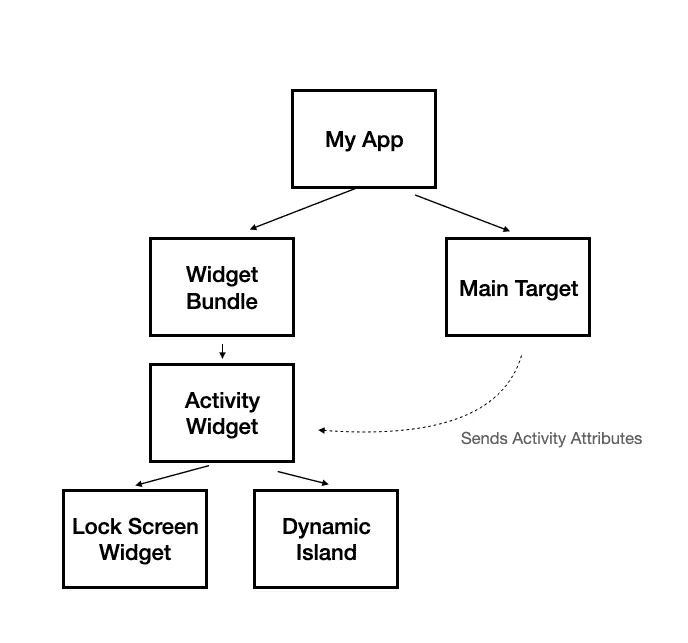
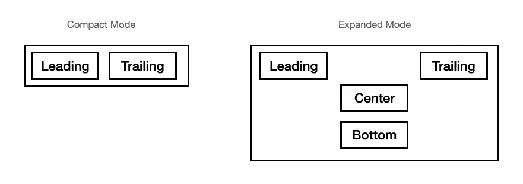
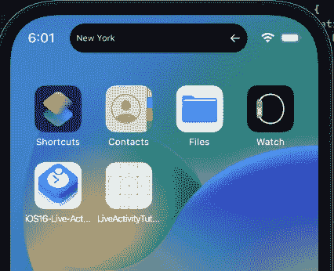
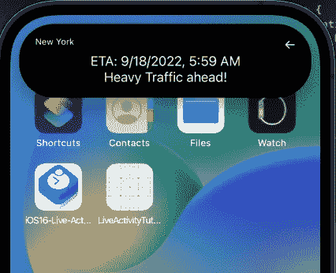
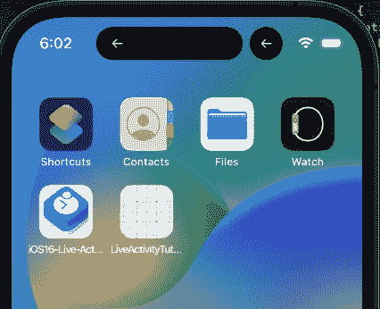

# 探索动态岛—活动指南

> 原文：<https://betterprogramming.pub/explore-the-dynamic-island-activitykit-tutorial-a7b8e3f9e234>

## 如何征服 iPhone 14 Pro 中的动态岛，为你的 app 增加支持！

苹果以一种出乎意料的方式展示了 iPhone 14 Pro，让我们惊叹不已。来自 Cupertino 的团队将硬件限制变成了一项功能，我认为这是学校需要教授的内容。

但是，当谈到动态岛时，它的独特之处在于它不仅仅是一个常规功能，而是软件和硬件的结合。苹果甚至向第三方开发者开放了这个机会。

而且非常简单！

# 为什么和什么时候

无论你是产品经理还是 iOS 开发人员，你都应该知道为什么以及何时使用动态岛及其功能。

当您想要显示正在进行的任务的更新信息时，动态岛通常很有帮助。

例如:

*   显示实时更新的体育应用程序。
*   一个显示倒计时信息的计时器应用程序。
*   显示音乐控制的音乐应用程序。
*   显示方向的导航应用程序。
*   上传/下载文件或数据信息。

这些只是何时使用动态岛的几个例子。

# 现在，对于技术部分

让我们回顾一下“现场活动”是如何构建的。

首先，Activity 实际上是一个 widget，就像 iOS 14 widgets 一样。我们为不同的状态配置小部件，并使用 SwiftUI 声明它的 UI。

主应用程序通过发送数据有效载荷来添加、删除和更新活动信息。

更新实时活动的另一种方法是使用推送通知，我们将单独介绍。

与其他小部件不同，Live Activity 不能通过网络进行自我更新，因此它是主应用程序或接收推送的责任。

请看下图:

Activity 小部件基于两种小部件配置——锁屏和动态岛。主目标通过向两个配置发送一个叫做“活动属性”的东西来更新活动小部件。系统负责为你管理所有精彩的动画和状态管理。

# 设置

我们首先需要做两件事，以确保我们可以开始开发我们惊人的动态岛。

首先，我们需要下载 Xcode 14.1，并确保我们在 iOS 16.1 或更高版本的 iPhone 14 Pro 上运行该应用程序。

我们需要做的第二件事是添加对现场活动的支持。我们向 info.plist 文件添加另一个名为“支持实时活动”的键，并将其设置为“是”。

# 创建活动属性

首先，让我们尝试理解您的小部件的数据。

例如，如果我们谈论一个导航应用程序，我们可能想要显示目的地、方向和预计到达时间。

现在，在这一点上，我们需要区分两种类型的数据——不应该改变的静态信息和动态数据。

在这个例子中，**目的地**是静态的，正在更新的数据是**下一个转弯**和 **ETA** 。

为了表示这些数据，我们创建了一个符合名为`ActivityAttributes`的协议的结构。

查看`NavigationAttributes`，我们可以看到该州被单独声明为`ContentState`的一部分。

`ContentState`是`ActivityAttributes`协议的一部分，必须符合`Codable`。

这里需要注意的一件重要事情是，该结构必须是应用程序和小部件目标的一部分，因为它们都将使用它。该应用程序将创建并发送到小部件，相应地更新用户界面。

# 创建实时活动

我们现在要做的是，一旦开始导航流，就创建一个实时活动。为此，我们创建一个新的`NavigationAttributes`并请求一个新的活动:

返回的对象是类型为`NavigationAttributes`的`Activity`。最佳做法是将该对象保存到实例变量中，这样我们就可以引用它。当我们需要更新 ETA、下一个转弯或只是关闭导航时，这将是要修改的对象。

为了更新`Activity`，我们需要发送一个新的状态(还记得`ContentState`类型吗？).

要结束导航，我们只需调用`end()`:

# 现在来看看小部件本身

我们需要做的第一件事是确保我们的项目有一个小部件目标。如果没有，我们需要创建一个(文件->新建->目标并选择“小部件扩展”)。

如果我们有一个小部件目标，我们需要确保我们有一个小部件包，这样新的`Activity`将是我们的应用程序支持的另一个小部件。

要创建一个新的小部件，我们需要添加一个符合“小部件”的新结构，并返回一个`ActivityConfiguration`:

注意，新的`ActivityConfiguration`有一个我们之前创建的通用类型`NavigationAttributes`。

我们需要返回的第一个 UI 是锁屏小部件。当我们创建一个实时活动时，我们还会创建一个锁屏小部件，显示我们发送的属性的更新信息。承认你不知道你也收到了！

`ActivityConfiguration`的第二个参数是`DynamicIsland`，它有四个参数——展开、`compactLeading`、`compactTrailing`和`minimal`。

# 动态岛屿布局

现在，支持动态岛的伟大之处在于，大部分艰苦的工作都是由 iOS 为我们完成的。

我们需要做的就是为三种状态声明动态岛 UI:

**紧凑** —这是“常规”状态，我们退出应用程序，它“收缩”到动态岛中。

**最小化** —你的应用在另一个应用缩小的地方获得最小化的视图。

**扩展** —当用户长按动态岛时，你的活动暂时扩展到有更多的空间和控制。

需要了解的一点是动态岛布局是如何构建的。苹果希望我们所有的应用程序开发人员以一种特定的模式来构建动态岛，就像标准导航栏是如何制作的一样。

紧凑模式(“常规”模式)基于两个部分——结尾和开头。

扩展模式具有前导、尾随、中心和底部。

查看以下紧凑和扩展模式的布局:

添加这些部件很容易:

注意，每个部分(动态岛和锁屏部件)都有一个包含属性和状态的上下文。

现在让我们看看我们的小部件在不同状态下的外观:

紧凑型:

展开:

最低:

很漂亮，是吧？

# 摘要

现场活动(“动态岛”)很容易设置，因为大部分脏活已经为我们做了。

下一部分将讨论如何使用推送通知来更新实时活动。敬请期待！