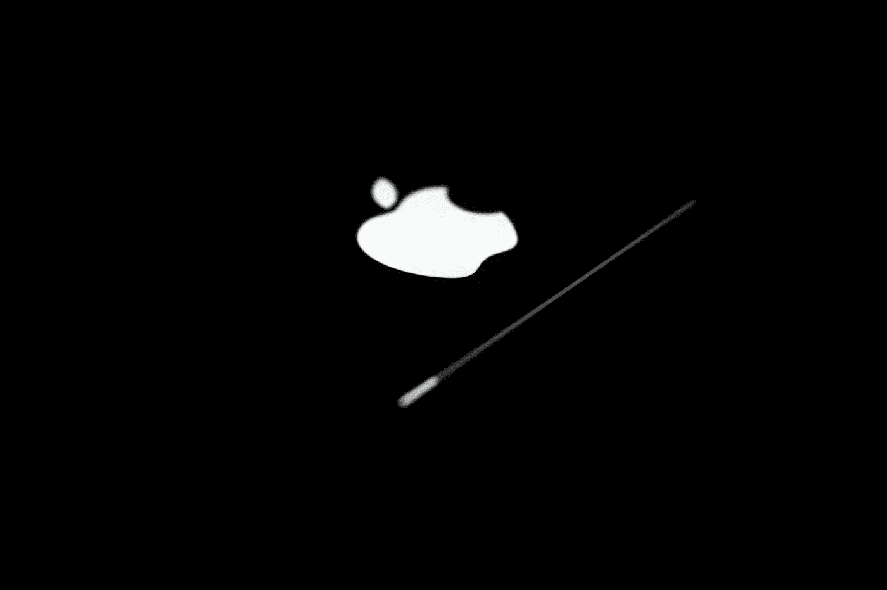
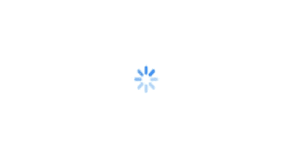
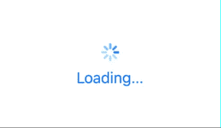
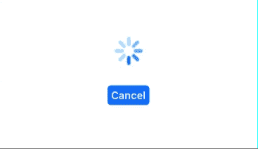
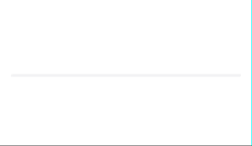

# 探索 SwiftUI 中用于构建进度视图的新功能

> 原文：<https://betterprogramming.pub/explore-the-new-features-in-swiftui-for-building-progress-views-ecba9a478910>

## 加载指示器和进度条变得更好了

[英池](https://unsplash.com/@yingchih_hao?utm_source=unsplash&utm_medium=referral&utm_content=creditCopyText)在 [Unsplash](https://unsplash.com/s/photos/progress?utm_source=unsplash&utm_medium=referral&utm_content=creditCopyText) 上的照片

苹果在 WWDC20 上发布了 SwiftUI 框架的重大更新。我们可能需要向用户显示关于正在发生的事情和任务进度的视觉反馈，比如上传或下载文件或从服务器获取数据。早先我们依赖`UIViewRepresentable`从 SwiftUI 中的 UIKit 导入和使用`UIActivityIndicatorView`,或者依赖使用实体形状的自定义实现。

随着 SwiftUI 的最新更新，我们有了一个专用的本地视图来显示 SwiftUI 应用程序中确定和不确定的进度:`[ProgressView](https://developer.apple.com/documentation/swiftui/progressview?language=objc)`。

*   不确定:显示过程是否正在发生
*   确定:显示任务的完成百分比

让我们开始，看看如何在 SwiftUI 应用中实现进度视图。你需要用`Xcode 12 beta`来尝试从`iOS 14`开始的`ProgressView`。

# 不确定进度视图

## 装载指示器

您可以在几行代码中添加连续旋转活动指示器，如下所示。您一添加指示器，它就开始显示动画。

你需要使用`CircularProgressViewStyle(tint: )`作为`progressViewStyle`来设置你的进度视图的色调。我使用了缩放效果来增加进度视图的大小，以提高可视性。

## 加载带有信息文本的指示器

您可以轻松地在进度视图中添加任何有意义的文本，如下所示。使用`CircularProgressViewStyle(tint: )`传递染色颜色将仅设置脱水负载指示器。您需要为标签单独设置前景色。

## 加载带有自定义视图的指示器

您可能想在进度视图中使用`Cancel`按钮。您可以在进度视图中添加任何类型的视图，如下所示。我在进度视图中添加了一个取消按钮。

# 确定进度视图

## 水平进度条

您可以添加一个简单的确定进度视图，总进度值在`total`参数中，完成进度值在`value`参数中。

请注意，我已经应用了一个定制的进度视图样式，以便在进度正在进行和完成时设置不同的颜色。您可以通过创建一个符合`[ProgressViewStyle](https://developer.apple.com/documentation/swiftui/progressviewstyle?language=objc)`协议的定制进度样式来对您的进度视图进行任何类型的定制。

我用了一个`Timer`来模拟演示的进度动画。你可以用你的实际进度值来改变这部分。

> 提示:将负进度值应用于确定进度视图会将其转换为不确定进度视图。

我已经添加了另一个自定义风格称为`CustomLinearProgressViewStyle2`。只要改变上面代码中的`CustomLinearProgressViewStyle1`，你将得到下面的结果。

## 带有信息文本的水平进度条

与不确定进度视图一样，您可以向确定进度栏添加信息文本，如下所示。

## **带有自定义视图的水平 p**progress**栏:**

与不确定进度视图一样，您可以将自定义视图添加到确定进度视图类型中。我在水平进度条的两边添加了两张图片。

# 结论

新的`ProgressView`只能从`iOS 14.0+`、`macOS 11.0+`、`Mac Catalyst 14.0+`、`tvOS 14.0+`和`watchOS 7.0+`开始工作。对于旧版本，您需要编写自己的进度视图逻辑。

你可以在这里得到[完整的代码](https://github.com/karthironald/NativeProgressView/tree/master)。

如果你想为 iOS 13 添加一个进度视图，你也可以检查这个 [repo](https://github.com/karthironald/ProgressIndicator) 。

谢了。