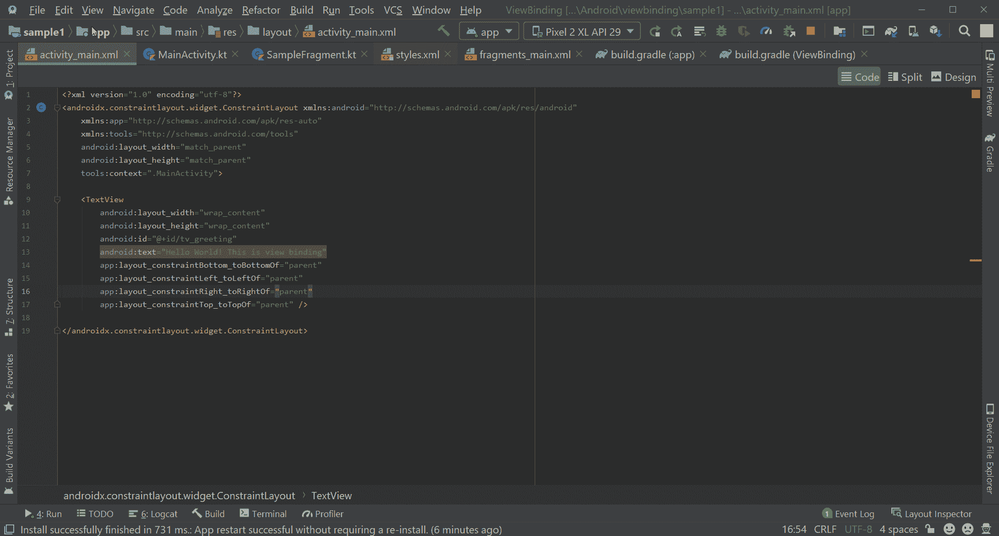
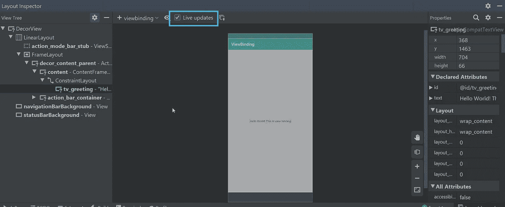
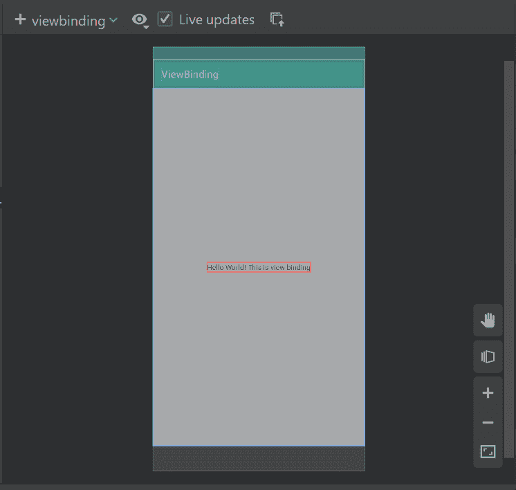
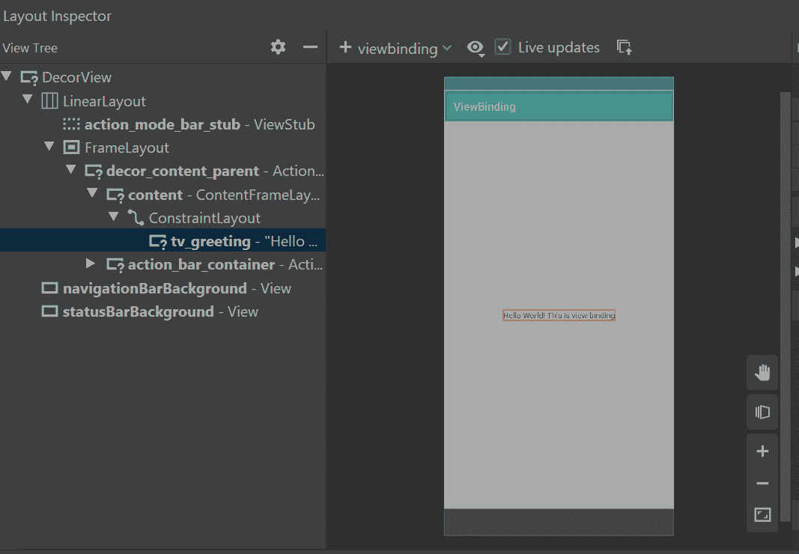
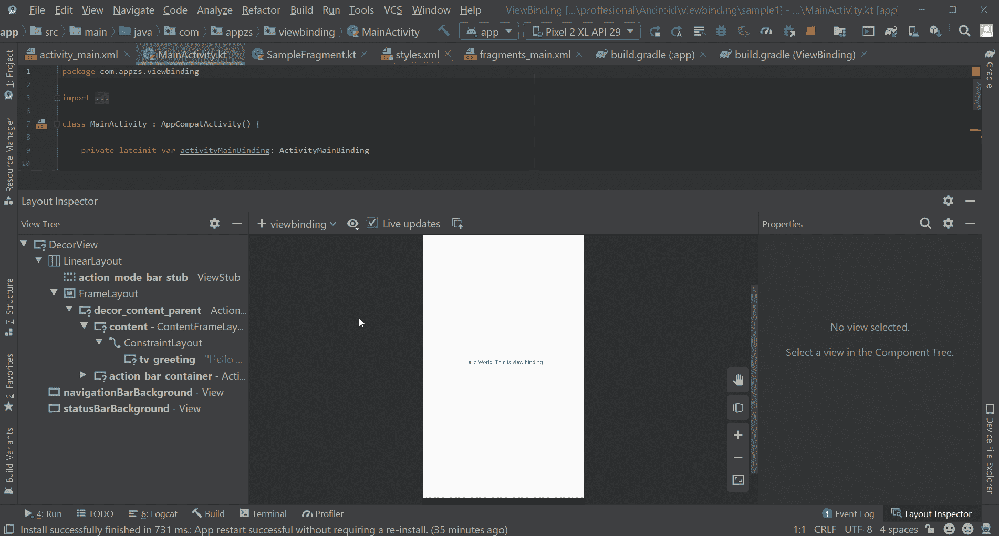
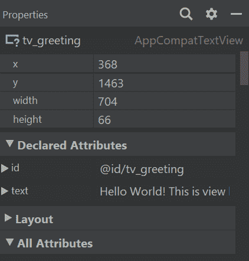

# 探索 Android Studio 4.0 中新的布局检查器

> 原文：<https://betterprogramming.pub/explore-the-new-layout-inspector-in-android-studio-4-0-6f9ffb1505f2>

## 用金丝雀 4.0 检查你的 Android 视图的层次结构

由 [Yura Fresh](https://unsplash.com/@mr_fresh?utm_source=medium&utm_medium=referral) 在 [Unsplash](https://unsplash.com?utm_source=medium&utm_medium=referral) 上拍摄的照片。

在 [Android Studio 4.0](https://android-developers.googleblog.com/2020/05/android-studio-4.html) 中引入了一个新的布局检查器。它类似于 Chrome dev tools——我们可以使用 id 检查视图，新的 3D 视图使查看视图层次变得容易，最重要的是，我们可以从检查器导航到视图代码的确切行。

调试 UI 问题从一开始就是 Android 开发者的一个问题。有了布局检查器，现在很容易找到视图层次结构并查明问题。我们可以将检查器用于物理设备和模拟器。

要启动布局检查器导航，请转到视图>工具窗口>布局检查器。

现在，带有布局检查器的新窗口在工作室的底部打开。默认情况下，您可以在中间看到仿真器/设备的当前屏幕。在左侧，有一些布局相关的东西，比如视图层次结构。在窗口的右侧，它显示了关于当前所选视图的信息。看一看:

导航到布局检查器

说了这么多，让我们开始挖掘特性。

# 实时更新

默认情况下，您可以在启动布局检查器时检查当前活跃的屏幕。但是如果你想检查你可以在模拟器/设备上导航的所有布局，那么你必须启用窗口顶部的“实时更新”选项。看一看:

实时更新

# 3D 旋转

布局的三维旋转

3D 旋转是一项新功能。顾名思义，我们可以看到布局的 3D 视图。更准确地说，我们可以看到视图层次。默认情况下，布局检查器以 2D 模式启动，要在 2D 和 3D 之间切换，我们需要使用底部布局屏幕旁边的旋转图标。

通过这个 3D 旋转，我们可以看到视图是如何布局的。3D 旋转功能仅适用于 API 级别为 29 及以上的设备。

# 隐藏视图

更改视图的可见性

隐藏视图是新版布局检查器中的另一个很酷的功能。我们可以通过右击视图并选择“只显示父视图”选项来隐藏视图的子视图。类似地，我们也可以用“只显示子树”选项隐藏视图的父视图。最后，要重置或显示所有视图，我们可以使用选项。

当您专门处理布局的某个特定部分，并且不想被整个布局分散注意力时，这个特性就很方便了。

# 代码导航

这是新版本中我最喜欢的功能之一。当我们点击一个视图时，一个新的面板将在窗口的右侧打开。该面板包含开发人员选择的视图的所有信息。这些信息包括您在实际布局中使用的视图的所有属性，以及视图的 X 和 Y 坐标、实际高度和宽度等附加信息。

这还不是全部。布局检查器将在实际布局中使用的属性下显示导航链接，以便您可以直接导航到该行代码，并在必要时进行更改。这一特点有助于我们专注于重要的事情。看一看:

# 搜索

使用 ID 和内容搜索文本视图(hello world)

当一个视图在布局检查器上展开时，它会显示所有的属性——包括我们在实际布局中没有使用的属性——您可以在右侧面板中看到它们。在这种情况下，找到你要找的东西可能会很棘手，这就是搜索功能派上用场的时候了。

我们可以用视图的名称或内容搜索任何属性，如上面的 GIF 所示。

# 奖金

要了解有关 Android Studio 和调试的更多信息，请阅读以下文章:

*   [使用实时模板的约束布局-少做多做](https://medium.com/@sgkantamani/constraint-layout-with-live-templates-do-less-finish-more-b62397725835)
*   [安卓工作室提示&招数——第一部分(针对初学者)](https://medium.com/android-dev-hacks/android-studio-tips-tricks-for-beginners-703bc9a36259)
*   [安卓工作室提示&招数——第二部分(高级)](https://medium.com/android-dev-hacks/android-studio-tips-tricks-part-2-advanced-3cfd23fc493e)
*   [Android Studio 提示&招数——第三部分(调试)](https://medium.com/android-dev-hacks/android-studio-tips-tricks-part-3-debugging-107d34b40220)

感谢您的阅读。