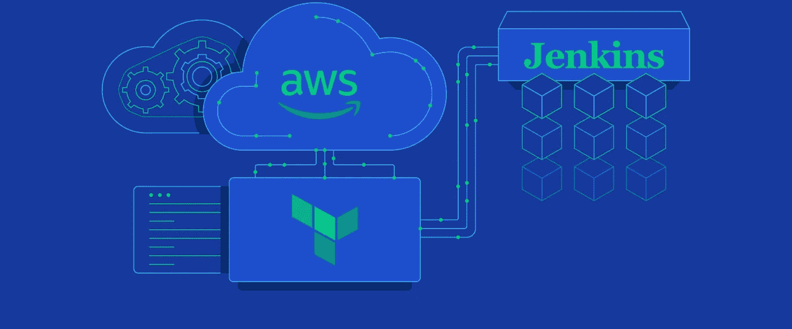
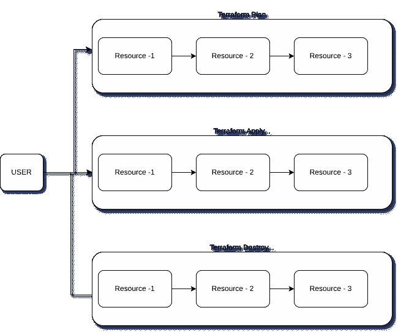
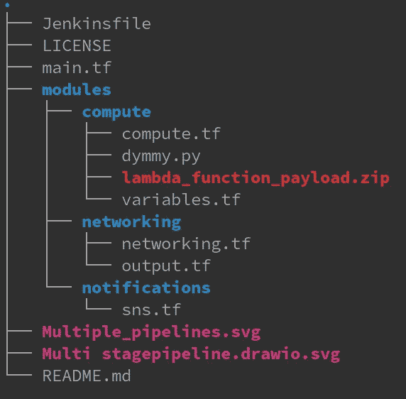
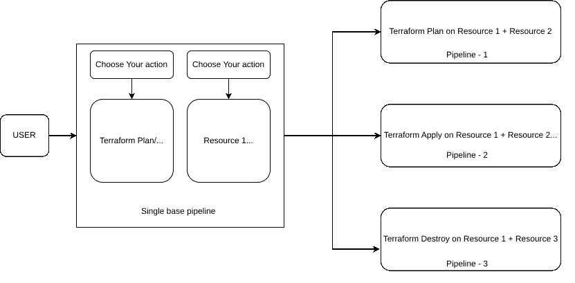
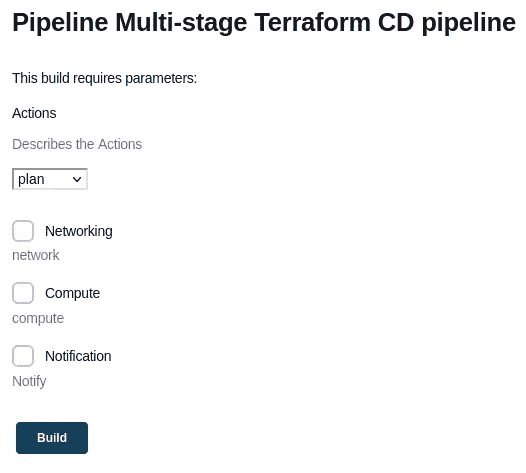
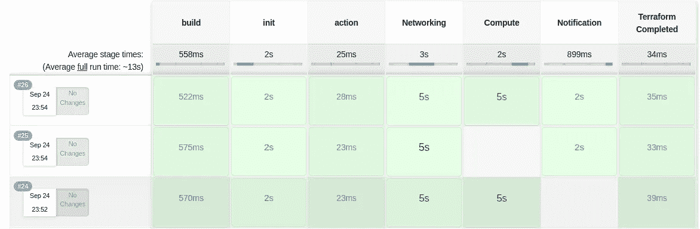

# 探索面向对象的 Jenkins 管道

> 原文：<https://betterprogramming.pub/exploring-an-object-oriented-jenkins-pipeline-for-terraform-182130111ddf>

## Jenkins 多级 Terraform CD 流水线中一种改进 CI/CD 粒度的新型体系结构设计



[来自 TopTal 的图像](https://www.toptal.com/devops/terraform-jenkins-continuous-deployment)

通常，当我们执行`terraform plan`、`terraform destroy`或`terraform apply`时，我们将这些动作应用于我们的目标文件中的所有资源，通常是`main.tf`(您可以为文件使用任何名称，但这个名称只是作为惯例使用)。

在 CI/CD 时代，当我们拥有从数据、应用程序代码到基础设施代码的所有管道时，通常很难达到这种粒度。通常，至少在 Terraform 中，为了实现这三个不同的动作，我们有三个不同的流水线来执行`terraform plan` : `terraform apply`和`terraform destroy`。当我们选择某个动作(假设是`terraform plan`)时，这个动作会在管道内的所有阶段和所有资源上执行。



但是当我们观察所有这些管道时，有一个共性可以被抽象出来以创建一个共性，在这个共性上动态的本质可以被继承。正如我们创建一个类，使用不同的对象和不同的属性值可以建立，是否有可能创建一个类似的基类(读管道),当实例化时可以创建不同的管道对象？

> ###一个管道创建所有这些内容# # #

# 模块化基础设施

为了构建这个基于类的管道，我们首先需要创建一个 terraform 脚本。开发的这个脚本应该是松散耦合的，本质上应该是模块化的。为此，我们创建了这个模块化脚本，它有三个模块，分别名为“网络”、“计算”和“通知”每个模块创建的组件如下:

1.  网络:1 个 VPC 和 1 个子网
2.  计算:1 个 IAM 角色，1 个 Lambda，1 个 EC2 t2.micro 实例
3.  通知:1 个 SNS 主题和 1 个电子邮件订阅

文件结构如下:



准备好之后，让我们在 Jenkins 文件中创建一个声明式的 groovy 脚本。

# 基于类的 Jenkins 管道



为了创建这种基于类的架构风格，以便在操作和资源级别灵活地创建管道对象，我们将利用 Jenkins 中一个名为“参数”的特性。这个特性帮助我们使用一个基类 Jenkins 管道创建多个对象。在本例中，让我们创建三个操作，即:

*   `terraform plan`:这创建并打印出我们将要在各自的提供者(可以是 AWS、Kubernetes、GCP、Azure 等)中创建的资源的计划。)
*   `terraform apply`:这个命令在各自的提供者中创建资源，并创建一个状态文件，保存资源的当前状态。
*   `terraform destroy`:这将删除状态文件中列出的所有资源。

这些操作在三个模块/资源上执行，即“网络”、“计算”和“通知”

上述参数为最终用户创建了一个 UI，如下所示，这将帮助最终用户动态创建基本管道的对象。



根据所选择的行动和必须完成这些行动的资源，Jenkins 将根据您的要求创建一个动态管道。在下图中，我们看到我们已经在#24 中为网络和计算资源应用了 terraform，并在#25 中为网络和通知运行了`terraform apply`。为了清理基础设施，我们在第 26 次运行中运行了`terraform destroy`。



目前实施的方法比持续部署更符合持续交付原则。

对于 Jenkins 文件和 Terraform 代码，请参考此[链接](https://github.com/krishnaduttPanchagnula/Multifunctional-terraform-Jenkins-pipeline)。

```
**Want to Connect?**Feel free to reach out to my [LinkedIn](https://www.linkedin.com/in/krishnadutt/) for interesting content and productive discussions.
```