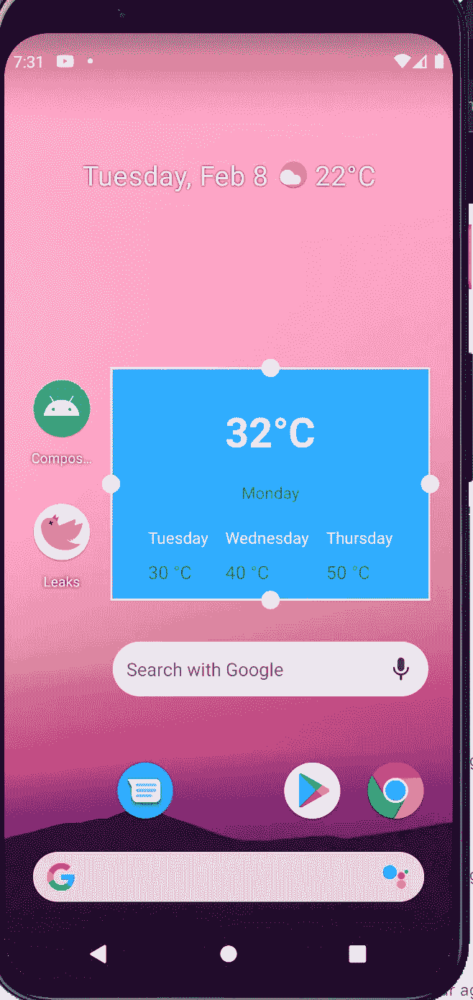

# 使用 Glance APIs 探索和构建 Android 应用程序小部件

> 原文：<https://betterprogramming.pub/exploring-and-building-android-app-widgets-with-glance-apis-4a5eb47c6d0>

## 创建直观的 Android 小工具


由[塞巴斯蒂安·贝德纳雷克](https://unsplash.com/@abeso?utm_source=medium&utm_medium=referral)在 [Unsplash](https://unsplash.com?utm_source=medium&utm_medium=referral) 上拍摄的照片

据 [Android developers](https://www.udacity.com/course/kotlin-bootcamp-for-programmers--ud9011) 网站报道，app widgets 是可以嵌入到其他应用程序中的微型应用程序(例如，主屏幕)。

一段时间以来，我一直在用新的 Jetpack Compose 工具包试验和构建一些应用程序。

Jetpack Compose 大大缩短了我的开发时间，这是一个巨大的胜利。为了让事情变得更好，引入了被称为 Glance API 的东西。

对于旧的 Android View 系统，我们使用 XML 构建应用程序小部件，而对于 Glance，我们使用从 Jetpack Compose 获得的相同知识，用 Kotlin 代码构建 Android 应用程序小部件。多酷啊。让我向您展示如何使用 Glance 实现 android 应用程序小部件。

# 设置相关性

首先，在 Android Studio 中创建一个项目，并选择 Jetpack Compose 模板项目。然后接下来，在你的 app 级`build.gradle`文件中添加 glance 依赖，如下；

```
implementation "androidx.glance:glance-appwidget:1.0.0-alpha02"
```

接下来，确保您同步了您的项目，并且一切就绪。glance 依赖项让我们可以访问 Glance 自己的组件，比如列、行等。构建应用程序小部件时，确保您的导入来自`androidx.glance`。

扫视组件的行为几乎类似于 Jetpack 组件特定的组件。我们将使用静态数据构建一个示例天气应用程序小部件，看起来像下面模拟器截图中的那个。



带有应用程序小部件的 Android 模拟器。

# 用 XML 定义应用程序小部件提供商信息

您可能认为这里的一切都将被 Kotlin 取代，但是，与旧的视图系统一样，您必须使用 XML 定义应用程序小部件提供者。

我们的将和下面的一样简单。

```
<?xml version="1.0" encoding="utf-8"?>
<appwidget-provider xmlns:android="http://schemas.android.com/apk/res/android"
    android:minHeight="180dp"
    android:minWidth="180dp"
    android:description="@string/app_widget_description"
    android:previewLayout="@drawable/example_appwidget_preview"
    android:minResizeHeight="90dp"
    android:minResizeWidth="90dp"
    android:targetCellHeight="2"
    android:targetCellWidth="2"
    android:resizeMode="horizontal|vertical"
    android:updatePeriodMillis="86400000"
    android:widgetCategory="home_screen"
    />
```

上面的`AppWidgetProviderInfo`信息是通过创建一个`xml`资源并给它起你选择的名字(它应该在`res/xml`目录中)获得的。我把这个命名为`my_widget_provider.xml`。我们定义了几个属性，如`minHeight`、`minWidth`、`previewLayout`等。Android 12 带来了`targetCellWidth`和`targetCellHeight`这样的新属性。

## 创建扫视小部件

我们要做的下一件事是创建实际的小部件。这是通过从`androidx.glance.appwidget`扩展`GlanceWidget`抽象类来实现的，并覆盖最重要的方法`Content`。

内容标有`@Composable`注释，在这里我们定义了小部件的布局。我们将从一个简单的名为`DayItem`的列开始

请注意它与普通组件的不同之处。在这里，`Modifier`被替换为`GlanceModifier`。进口来自`androidx.glance`。

接下来，让我们通过扩展`GlanceAppWidget`类来做实际工作。

正如我所说的，最重要的事情是我们扩展了`GlanceAppWidget`类并覆盖了标有`@Composable`的`Content`方法。

我们要做的下一件事是扩展`GlanceAppWidgetReceiver`并覆盖`glanceAppWidget`的值，然后返回我们的`GlanceNewWidget`

我们要做的下一件事是在 AndroidManifest 文件中注册我们的接收器。

确保将接收器注册为应用程序标记的子标记。在`meta-data`中，我们指定了我们的提供者 XML 文件。

这对我们来说应该够了。运行您的应用程序，长按屏幕的空白区域并选择`Widgets`，查找您的应用程序的名称并将小部件拖到屏幕上。你应该可以看到上面截图中的样子。

请注意，这不是某种魔法。这些组件被转换成`RemoteViews`。

# 使用 Glance 调用操作

您的应用程序小部件的目的可能是当单击某个部分或按钮时，会发生一些事情，如开始一项活动、一项服务，或者可能只是将一些内容保存到数据库中。

Glance 为我们提供了要执行的操作，我们可以创建自己的操作。默认情况下，有启动活动、服务、广播接收器和其他的动作。

好了，现在，假设我们想要在点击`32` [](https://www.degreesymbol.net/)时启动一个新的活动`NewActivity`，我们传递一个额外的被调用名称并在`NewActivity`中接收它。

我们如何做到这一点？为此，我们将应用`GlanceModifier.clickable`并向它传递一个动作。因此`Text`变为:

方法`actionStartActivity`采用一个 i `ntent`和一个`parameters`参数。在参数中，我们将想要传递的数据传递给活动。在这种情况下，我们给它键`ActionParameters.Key<String>("name")`和值`Lionel Messi`。下面是我们将如何在`NewActivity`收到它

如果您现在运行应用程序，创建一个小部件并点击文本，它将启动`NewActivity`。你会看到文字`Lionel Messi`。这就是使用动作将数据传递给活动的方式。

目前，这是使用 composables 而不是 XML 创建应用程序小部件的最简单方式。你可以做的事情很多，但我会把这些留给你去做一些研究。