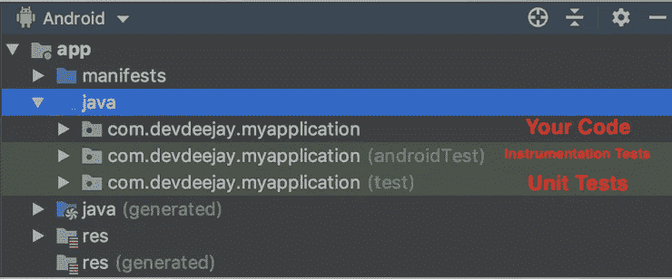

# 探索安卓系统进行测试

> 原文：<https://betterprogramming.pub/exploring-androidx-for-testing-6350100b4711>

## # 100 日代码的第 32 天

## Android 中的“一次编写，随处运行”测试


很确定这就是谷歌开发人员在构建 AndroidX 时的想法

# 理解 Android 中的测试

在 Android 上，随着你的实际代码，还有*单元测试*和*仪器测试* 。这就是为什么你会在你的主包里面看到三个包。



## 单元测试

单元测试有许多优点:

*   快速:这些测试在你的电脑上运行，而不是在 Android 服务上。你不必等到 Android 版本运行后才能测试你的代码。这使得本地测试非常快。
*   **简单设置:**像 [Mockito](https://site.mockito.org/) 和 [Roboelectric](http://robolectric.org/) 这样的框架可以帮助你通过模仿与 Android 框架的交互来编写测试，从而为测试设置环境状态。

专业提示:你应该为详尽的条件编写大量快速、可伸缩的单元测试。

## 仪器测试

仪器测试有自己的特点:

*   **较慢:**它们运行在 Android 设备上(虚拟或真实)。
*   **更准确:**更准确，因为它们运行在更接近最终用户体验的设备上，给你更大的信心。
*   较少的支持:然而，没有多少 API 可以为你的测试设置先决条件。

提示:你应该编写少量的测试程序来证明所有的单元组装在一起的行为符合你的预期。

# 如何开始在 Android 中编写测试

您从使用 [Espresso](https://developer.android.com/training/testing/espresso) 编写一个失败的 UI 测试开始(让这个测试成为一个仪器测试)。接下来，您编写一些产品代码来使失败的 UI 测试通过。为了使该特性工作，您需要编写一系列单元测试，然后是通过这些单元测试的代码。

使用 TDD 完成特性后，您将通过失败的 UI 测试。然后花些时间清理代码，重构，优化任何需要的地方。然后，按照同样的循环，继续下一个任务。

Android 上有这么多可用的工具和库。它们有不同的 API。所有的测试都是不同的，并且处于不同的层次，并且与测试工具和环境相关联。

# 安卓克斯

[AndroidX](https://developer.android.com/jetpack/androidx) 是 Android [Jetpack](https://developer.android.com/jetpack) 工具包的一部分，该工具包是完全开源的，有良好的文档记录和一致性。它有四个模块:

1.  [JUnit](https://junit.org/junit5/):**JUnit 4 的亚军和规则**
2.  **[核心](http://junit.sourceforge.net/javadoc/org/junit/runner/JUnitCore.html):由`ApplicationProvider`(帮助你快速简单地获得`ApplicationContext`)`ActivityScenario`(测试你的活动的 API)`FragmentScenario`(测试你的片段的 API)组成**
3.  **Espresso: `ViewMatchers`，`ViewActions`，`Intents` 类似于我们一直用于 UI 测试的 Espresso。**
4.  **[真相](https://developer.android.com/reference/androidx/test/ext/truth/os/package-summary):Google OS 测试断言库。帮助你测试 Android 对象，编写简洁易读的代码。包含`IntentSubject`、`BundleSubject`和`ParcelableSubject`。**

**有了统一的 API，作为开发人员，您可以专注于测试什么，而不是在哪里以及如何测试。**

# **最酷的安卓 API**

## ****应用程序提供者****

**应用程序提供者为你的测试提供上下文。到目前为止，我们有`getContext()`(用于仪器测试)和`getTargetContext()`(用于单元测试)。如果您在单元测试中使用`getContext()`,您将会得到一个运行时错误，然后您将不得不投入额外的时间和精力来调试。**

**在新的 APK 中，`ApplicationProvider`通过一个方法调用提供上下文:**

```
val context = getApplicationContext<Application>()
```

## **活动场景**

**我们都知道 [Android 生命周期](https://developer.android.com/reference/android/arch/lifecycle/Lifecycle)；在测试时，活动生命周期对于代码测试来说可能是一个挑战，因为在 UI 测试期间，活动状态可能会改变，而您的测试可能仍然在测试活动的不同状态。**

```
@Test
fun testTheStateIsNullAtStart() { // This code launches your activity
    val activityScenario = launchActivity<ActivityName>()

    // Ensures your activity stays in CREATED state
    activityScenario.moveToState(Lifecycle.State.CREATED)

    // You can inspect internal state of your activity by
    activityScenario.onActivity **{** activity **->** assertThat(activity.*variableName*).isNull()
    **}** }
```

****

**当你转动手机，你的活动经历转换时，它使用`onSavedInstance`来保存一些数据，并将其传递给新创建的活动。**

**[活动场景](https://developer.android.com/reference/androidx/test/core/app/ActivityScenario)也可以帮助你测试活动的娱乐性。当你的活动已经在后台运行了很长一段时间，而你又回来的时候，活动再造就发生了。**

```
@Test
fun testActivityRecreation() {

 **// GIVEN**    val username = "devDeejay"
    val activityScenario = launchActivity<ActivityName>() **// WHEN**
    onView(withId(R.id.usernameEditText))
    .perform(typeText(username))

    activityScenario.recreate() ** // THEN
   ** onView(withId(R.id.usernameEditText))
    .check(matches(withText(username)))}
```

**在这里，`activityScenario.recreate()`破坏并再现了活动。等待新活动到达`onResume()`。**

## ****真理中的意向主体****

**通过使用 Intent Subject，您可以验证您的 Intent 值，如果出现问题，它会提供人类可读的错误消息。**

```
@Test
fun testActivityIntent() {

 **// GIVEN**    val username = "devDeejay"
    val dataIntent = createIntent(username) **// THEN** assertThat(dataIntent)**.hasAction(ACTION_SEND)
   ** assertThat(dataIntent)**.hasType("text/plain")
   ** assertThat(dataIntent).**extras()
    .string(EXTRA_TEXT).isEqualTo(contactName)** }
```

# **关于 AndroidX 测试的更多资源**

*   **[用氮气大规模测试安卓应用](https://www.youtube.com/watch?v=-_kZC29sWAo)🔥**
*   **[使用 AndroidX 的 Android 自动化测试设置](https://proandroiddev.com/android-automated-testing-setup-564298378673)💯**
*   **[官方文件](https://developer.android.com/training/testing/set-up-project)👻**

**那是美好的一天 32:了解 AndroidX 有多酷！满足我们所有测试需求的一站式解决方案。谢谢你，谷歌开发者。**

**第 33 天见！感谢阅读。**