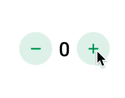
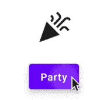
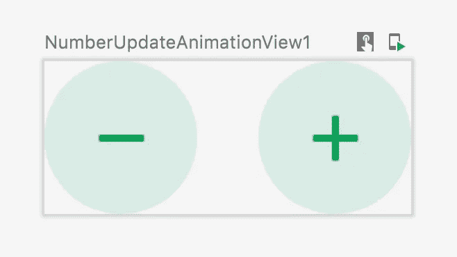
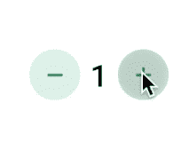
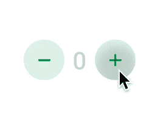
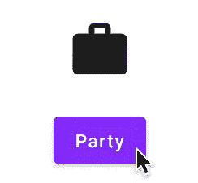
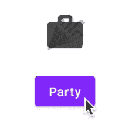

# 探索 Jetpack Compose 中的动画内容和交叉渐变

> 原文：<https://betterprogramming.pub/exploring-animatedcontent-and-crossfade-in-jetpack-compose-45374c6b842>

## Jetpack 撰写-动画注释:4


[粘土堤](https://unsplash.com/@claybanks?utm_source=medium&utm_medium=referral)在 [Unsplash](https://unsplash.com?utm_source=medium&utm_medium=referral) 上拍摄的照片

Jetpack Compose 是构建 android 应用程序 UI 的革命性更新。它利用了声明式 UI 的概念，并为用 Kotlin 构建 UI 带来了乐趣——这是许多 Android 开发人员的梦想。如果您不熟悉 Jetpack Compose，我建议您阅读以下文章:

*   [喷气背包构成组件(第一部分)](/jetpack-compose-components-part-1-a80717dbfb59)
*   [在 JetPack Compose 中构建 Android 布局](/build-android-layouts-in-jetpack-compose-bda2e0837f5e)

要了解更多关于 jetpack 合成中的动画，请阅读本动画系列中的以下文章:

*   [“Jetpack 合成—动画注释:1”——探索合成中的动画可见性](https://medium.com/better-programming/jetpack-compose-animation-notes-1-30f130189159)
*   [“Jetpack Compose—Animation Notes:2”——构建 Fab 菜单，带有 Compose AnimatedVisibility 和 Animatable](https://sgkantamani.medium.com/jetpack-compose-animation-notes-2-aef3428af6a6)
*   [“Jetpack Compose—动画说明:3”——探索合成中的 LaunchedEffect 和 infinite position](/exploring-launchedeffect-and-infinitetransition-in-jetpack-compose-5a82ba948a15)
*   “Jetpack Compose-Animation Notes:4”-你现在在这里

话虽如此，我们还是开始吧。

# 介绍

我们试图实现一个带有两个按钮的视图，将数字增加或减少 1。结果将显示在带有垂直滑入和滑出动画的按钮中间。看看结果:



我们将通过`AnimatedContent` compose API 来实现这一点。

# `AnimatedContent`

`AnimatedContent`是一个容器，当`targetState`改变时，它会自动显示其内容。看看签名:

1.  `targetState`:这是一个通用类型，每当值改变时，动画就会启动。
2.  `modifier` : Modifier 将这个 composable 里面的内容和它的父链接起来。
3.  `transitionSpec`:是`ContentTransform`类型，主要用来定义`EnterTransition`和`ExitTransitions`。
4.  `contentAlignment`:定义`content` composable 内部内容的对齐方式。
5.  `content`:可与`targetState`参数组合，提供更新值。

# 交叉渐变

交叉渐变基于其`targetState`参数值的变化，通过交叉渐变动画在布局之间切换。看看签名:

1.  `targetState`:这是一个通用类型，每当值改变时，动画就会启动。
2.  `modifier` : Modifier 将这个 composable 里面的内容和它的父对象链接起来。
3.  `animationSpec`—`AnimationSpec`用于配置动画。
4.  `content`:可与`targetState`参数组合以提供更新值。

为了更好地理解这一点，我们将构建一个可组合组件，通过交叉渐变动画在按钮点击上的两个图标之间切换。看一看:



# 简单的可组合设计

先说基础设计。我们需要两个按钮:加号和减号。为此，我们使用盒子和图标组件。让我们创建一个函数`CircleButton`来重用这两个按钮。需要三个参数:

1.  `imageVector`:定义要显示的图标。
2.  `contentDescription`:可访问性，非强制性。最佳实践。
3.  `clickable`:决定按钮是否可点击的布尔值。
4.  `click`:点击时要调用的 lambda 函数。

看一下实现情况:

现在我们可以在根 composable 中使用这个函数，并在`Row`中使用各自的内容来并排展开它们。看一看:

```
@Composable
fun NumberUpdateAnimationView(){

    Row(
        verticalAlignment = Alignment.CenterVertically,
    ) {
k
        CircleButton(
            imageVector = Icons.Default.Remove,
            contentDescription = "Minus",
        ){

        }

        Spacer(modifier = Modifier.size(16.dp))

        CircleButton(
            imageVector = Icons.Default.Add,
            contentDescription = "Add"
        ){

        }

    }

}
```

看一下输出:



然后我们需要设计`Text`来显示整数值。我们用`remember`搭配`mutableStateOf`来定义。我们将在用户点击加号按钮时更新该值，反之亦然。看一看:

看一下输出:



# 动画内容

现在是时候将动画添加到内容更改中了。我们首先需要将`Text`组件包装在`AnimatedContent`中，并使用结果值来更新文本。看一下代码:

```
*AnimatedContent*(
    targetState = displayNumber,
){ _displayNumber ->
    *Text*(
        text = "${_displayNumber}",
        fontSize = 24.*sp*,
        fontWeight = FontWeight(500),
        color = Color.Black
    )
}
```

这将把默认动画应用于`targetState`中的任何值。看一下输出:



我们的目标是添加一个像记分牌一样的自定义动画。当内容改变时，我们使用`transitionSpec`参数来定义自定义的进入和退出动画。看看下面的代码:

`ContentTransform`用于定义进入和退出动画。我们混合了两个动画`slideIn`和`fadeIn`用于新值的进入动画，以及`slideOut`和`fadeOut`用于退出动画。此`isreversed`值正在减少。看一下输出:


看一下代码的所有部分:

现在我们已经学习了如何制作内容动画，本文的下一部分是关于用交叉渐变动画制作布局变化的动画。

# 布局状态

为了简单起见，我们通过一个 enum 类来维护两种状态——work 和 party，以表示适当的图标。我们还有一个在不同状态之间切换的按钮。看看枚举类:

```
enum class ConTentType{
    *WORK*, *PARTY* }
```

在进入设计部分之前，我们需要几个扩展:

1.  `getOpposite` —该函数返回`ConTentType`的可选状态，假设是`WORK`，则返回`PARTY`。
2.  `getDisplayString` —用于根据状态显示字符串。

```
fun ConTentType.getOpposite() = run {
    when(this){
        ConTentType.PARTY -> ConTentType.WORK
        ConTentType.WORK -> ConTentType.PARTY
    }
}

fun ConTentType.getDisplayString() = run {
    when(this){
        ConTentType.PARTY -> "Party"
        ConTentType.WORK -> "Work"
    }
}
```

# 简单的可组合设计

让我们从基于`ConTentType`状态的几个图标和一个更新状态的按钮的基本设计开始。看一下代码:

现在，让我们来看看输出:



# 交叉渐变动画

现在我们必须用 CrossFade API 包装 when 块，并将`contenttype`作为`targetState`传递，这样每当`contenttype` crossfade 动画发生变化时就会触发。看一看:

请记住使用`targetState`导致的功能来操作。在我们的例子中，是`_contentType`。看一下输出:



如果动画太快，可以通过`Crossfade`的`animationSpec`参数控制时长。我们可以根据需求用时长通过`tween`。

```
Crossfade(
    targetState = contenttype,
    animationSpec = tween(durationMillis = 500)
)
```

现在看看输出:


# 结束注释

仅此而已。我们已经通过由 Jetpack Compose 提供的`AnimatedContent`和`Crossfade`API 实现了一个记分牌动画和布局之间的交叉渐变动画。

1.  请点击此处查看动画内容实现的完整代码。
2.  [请点击这里查看交叉渐变实现的完整代码。](https://gist.github.com/SG-K/567928e55c582cdcdb5cc608e6f3153f)

动画是 Jetpack Compose 中一个有趣的主题，它将更多的自然流畅引入到 UI 中。请继续关注 Jetpack Compose 中关于动画的更多文章。

# 奖金

[](/back-press-handling-in-android-jetpack-compose-42d9ed402d40) [## Android Jetpack Compose 中的反压处理

### 创建一个处理函数来定制你的反压事件

better 编程. pub](/back-press-handling-in-android-jetpack-compose-42d9ed402d40) 

目前就这些。希望你学到了有用的东西。感谢阅读。