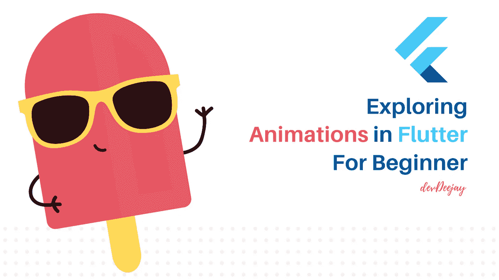
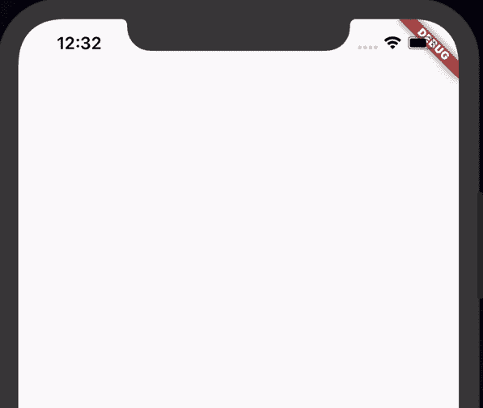
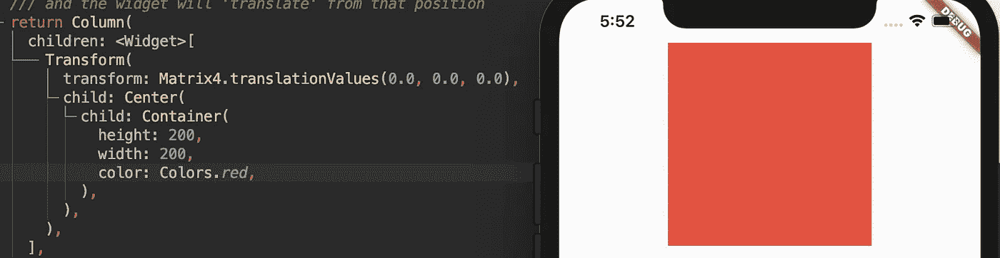
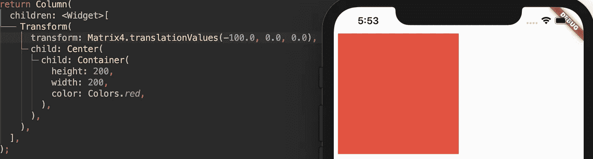
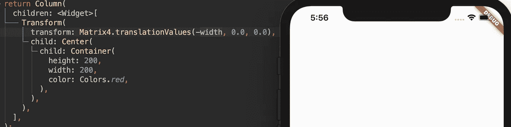
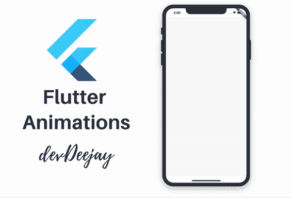
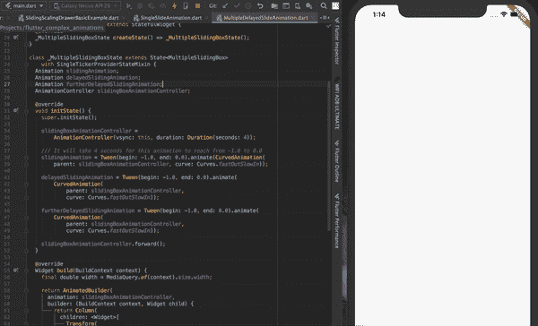

# 初学者学习颤振动画

> 原文：<https://betterprogramming.pub/exploring-animations-in-flutter-for-beginners-147151a794>

## 构建脱颖而出的应用



在我们开始之前，您应该了解有状态和无状态小部件的基础，差不多就这些了！

动画可以帮助你构建更具视觉吸引力的 [Flutter](https://flutter.dev/) 应用程序。就像如何添加一些简单的动画来制作演示文稿一样:

*   视觉上吸引人。
*   在需要的时候，在正确的地方引起用户的注意。
*   让它不那么无聊。

同样，我们可以利用动画来使我们的 Flutter 应用程序更加出色。

今天我们将从一些简单的动画开始，但是随着我们的进步，我们将学习和添加更复杂的动画。

所有示例代码都将在每个示例的末尾作为 gists 提供。

这将是一个漫长而详尽的解释。请耐心点，对这个故事有点信心，你肯定会对 Flutter 动画充满信心。

如果很简单，每个人都会做。

# 1.简单滑动动画



对于动画，您需要以下内容:

*   `AnimationController` —定义何时开始动画并控制动画，因此称为`AnimationController`。
*   动画—使用`Curves`定义动画的风格，使用`Intervals`定义动画的时长。我们将在下面的例子中探讨这两个问题。
*   小部件——您想要制作包含在`Transform`和`AnimationBuilder`小部件中的动画。
*   您想要制作动画的小部件应该是使用名为`SingleTickerProviderStateMixin`的 mixin 的有状态小部件。

如果你不知道 [Dart](https://dart.dev/) 中的 mixin:mixin 指的是向你自己的类添加另一个类或多个类的能力，而不是从那些类继承。

所以，我们定义了`Animation`和`AnimationController`。

```
Animation slidingAnimation;
  AnimationController slidingBoxAnimationController;
```

我们必须在`initState()`函数中初始化它们，如下所示:

然后，让我们在`AnimatedBuilder()`和`Transform()`的帮助下编写`build()`函数来构建我们的小部件。

我们用一个`Transform`和一个`AnimatedBuilder`包装整个小部件。

观看这段一分钟视频，了解更多关于`AnimatedBuilder`的信息。

*   `AnimatedBuilder`需要传递一个动画，因此，我们将我们的`slidingAnimation`传递给它。
*   `Transform`使用一个`Matrix`(我们中的一些人可能会从数学中记住它，但你真的不必成为使用它的专家，只需使用`Matrix4`)。
*   我们使用`translationValues` ，它采用(x，y，z)值来指定您想要平移/移动到哪个坐标。我们只想水平移动，因此我们只定义 x 轴，将 y 和 z 设为 0.0。

```
Matrix4.translationValues(x, y, z)Matrix4.translationValues(someValueOf, 0.0, 0.0)
```

## 为了定义 x 值，让我们试着想想解决方案

这样，你将学会如何在将来为你自己的动画写尺寸。

如果我们不在`x,y,z`中定义任何翻译值，并将其保留为`(0,0,0)`，我们的小部件将位于屏幕的中央。



试着自己改变 x 的值，看看会有什么变化，我正在为 x 尝试-100。



所以，在动画开始的时候，我想把它完全从屏幕上隐藏起来。所以，我就改成`(-widthOfScreen, 0.0, 0.0)`。



如果你还记得当我们用值
`(begin: -1.0, end: 0.0)`定义`slidingAnimation`时，这意味着当动画开始时，`animation.Value`将是`-1.0`，当动画结束时，`animation.value`将是`0.0`。我们能利用这一点吗？太好了。

所以，我们最后把值设置为`(widthOfScreen * animtion.value, 0.0, 0.0)`。我们去掉了负号，因为`animation.value`已经是负数了，因此最终乘积也将是负数。

我希望你能想象它将如何动画。

**待办事项:**记录`animation.value`和(`widthScreen` * `animation.value`)的最终产品，查看更新后的 x 值。

最后一个值将是 0.0，这是`width * 0 = 0`的位置。当小部件到达中心时，这就是期望的`x`坐标。

当我们的动画开始时，我们的动画值将在 0 和 1 之间变化。

下面是这个例子的完整的注释代码。

想出一个从屏幕底部中心到中心的动画方法。

我能理解这对你来说很难接受。花点时间自己尝试一下，从头开始编写整个代码。休息一下，你值得，以后再继续。

# 2.让我们更上一层楼



在这个故事的结尾，我们期望的输出

以上是我们将要建立的。

让我们再添加两个`Animation`对象和小部件的副本。这是你现在应该有的。



因为我们必须添加一个时间差，所以我们使用`interval`来完成。

我们在定义`Animation`时会在`Curve`中增加一个`interval`参数。

```
**slidingAnimation** = Tween(begin: -1.0, end: 0.0).animate(CurvedAnimation(
    parent: slidingBoxAnimationController,
    curve: Interval(0.0, 1.0, curve: Curves.*fastOutSlowIn*)));
```

如果你还记得的话，我们的`Animation`在 1 的范围内从-1 到 0，正如我们在`begin`和`end`中定义的那样。

因此，在`interval`中，我们也将幅度传递给`begin`和`end`。因此，对于`slidingAnimation`，动画将在幅度 0 到 1 的整个持续时间或间隔内发生。

我们的`animation`值可能在幅度为 1 的`-1 to 0`或`0 to 1`之间变化，这就是我们的`interval`值。

让我们将`interval`添加到这两个额外的动画中。

请注意，我们在这里传递的间隔范围是从`0.23 to 1.0`到`0.43 to 1.0`。

因此，当我们调用`aniamtionController.forward()` 时，随着动画的值从`0.0 to 1.0`(数量级)增加，并且当它达到`0.23`的值时，`delayedSlidingAnimation` 将开始。

当达到`0.43`时，`furtherDelayedSlidingAnimation` 将开始，所有动画将继续，直到幅度值达到`1.0`。

为每个容器的`AnimatedContainer`更新这个动画，并且不要忘记改变它们的颜色。

你应该能够制作这个动画:


**待办事项**:尝试不同的音程计时，以获得不同的结果，并了解音程的不同行为。

这是第二个例子的完整代码。

# 结论

各位，今天就到这里吧！

感谢阅读！我希望这值得你花时间。如果你有任何建议或改进，请在评论中告诉我。