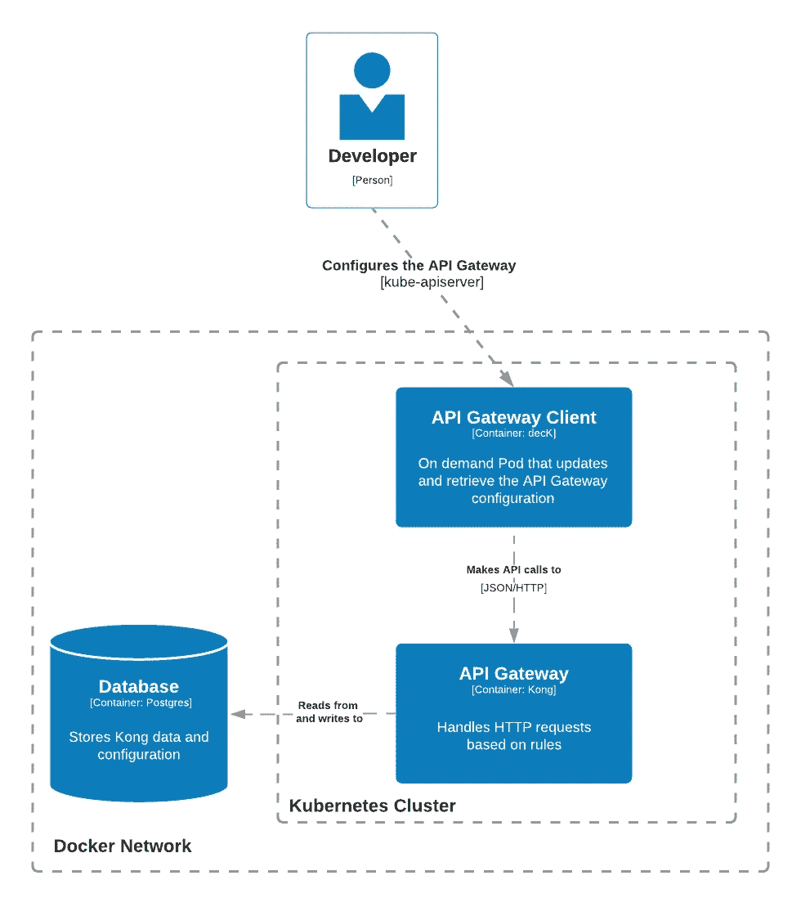

# 探索 API 网关:Kong 设置

> 原文：<https://betterprogramming.pub/exploring-api-gateways-kong-setup-abfde6ed79fb>

## 软件架构的美妙之处在于无数的策略


由[基思·哈迪](https://unsplash.com/@keithhardy2001?utm_source=medium&utm_medium=referral)在 [Unsplash](https://unsplash.com?utm_source=medium&utm_medium=referral) 上拍摄的照片

我觉得有一项技术可以帮助我创建更好的架构，那就是 API 网关。

我已经避开了微服务架构，但是我看了[连续交付的视频](https://www.youtube.com/watch?v=zzMLg3Ys5vI)，可独立部署的服务让我眼前一亮。

软件架构的美妙之处在于无数的策略。想象一个设计，你可以在开发层次上解耦你的组织。我要去争取。

我相信有一项技术可以帮助我设计更好的架构(不仅仅是微服务),那就是 API 网关。它将帮助我绑定底层容器并识别共享功能。我将在以后的文章中介绍它。现在，[我将提出我的出发点](https://github.com/vargasmesh/Kong-in-Kubernetes)。

经过一番研究，我决定用[孔](https://konghq.com/kong/)作为我的学习工具，多半是因为自定义 Golang 插件，可以在本地运行。

# 概观



集装箱图

Kong API 网关将部署在 Kubernetes 集群中，并使用声明性方法进行配置。我将把本地配置文件与包含 decK 容器的 Pod 同步，该容器将与 Kong Admin API 通信。

# 库伯内特斯

我选择 Kubernetes 只是为了个人挑战。使用 Docker Compose 可能更容易、更快。

我选择[类](https://kind.sigs.k8s.io/)来创建集群，因为它速度更快，而且我可以将所有东西保存在单个 Docker 网络中，甚至是 Postgres 数据库。

端口 8000 和 8443 将被暴露以与 Kong 代理交互并测试我们的微服务架构。

```
kind: Cluster
apiVersion: kind.x-k8s.io/v1alpha4
name: kong-in-kubernetes
nodes:
  - role: control-plane
    extraPortMappings:
      - containerPort: 32080
        **hostPort: 8000**
      - containerPort: 32443
        **hostPort: 8443**
```

最后:`kind create cluster --config kind.yaml`

# 孔的 Postgres 数据库

在 Postgres 中使用 Kong 似乎是公平的，但我不想在 Kubernetes 中部署数据库(*后悔我的选择)*，太多的工作和复杂性*。*

更简单的方法是在 kind 的网络中部署一个 Postgres 数据库，并使用一个`ExternalName`服务引用它。

Docker 撰写:

```
services:
  **database:**
    image: postgres
    ports:
      - 5432:5432
 **networks:
      - kind**
    environment:
      POSTGRES_DB: kong
      POSTGRES_USER: kong
      POSTGRES_PASSWORD: kong**networks:
  kind:
    external: true
    name: kind**
```

**Postgres ExternalName 服务**:

```
apiVersion: v1
kind: Service
metadata:
  name: postgres
spec:
  type: ExternalName
  **externalName: database**
```

运行一切:

```
docker-compose up -dkubectl apply -f postgres/svc.yaml
```

# 孔（姓）

完成所有设置后，我们可以将重点放在 API 网关上。在 Kubernetes 中部署 Kong 最简单的方法是使用 Helm 图表，我将在图表中分解一些[基本值](https://github.com/vargasmesh/Kong-in-Kubernetes/blob/main/kong/values.yaml)。

## 环境变量

```
env:
  database: postgres
  **pg_host: database**
  pg_user: kong
  pg_password: kong
  pg_database: kong
  declarative_config: /opt/kong/kong.yaml
```

`env`部分中的每个变量都将被转换为大写并以`KONG_`为前缀。我们的目的是指导孔使用 Postgres 数据库，之所以将`env.pg_host`设置为`database`，是 Postgres 在 kind 网络中的服务名称。

## Kong 管理 API

我们将使用需要与 Kong 管理 API 通信的 decK 来配置 Kong。但是我们不想在 Kubernetes 之外公开这个 API。这就是我们将使用 ClusterIP 服务的原因:

```
admin:
  enabled: true
 **type: ClusterIP**  
  http:    
    enabled: true
```

## 揭露孔代理人

到今天结束时，我们需要测试我们的 API 网关，并且它需要暴露在 Docker 网络之外。在`Kind`的配置中，这种容器将容器的端口`32080`和`32443`分别绑定到 8000 和 8443。这些将是`NodePorts`:

```
proxy:  
  enabled: true  
 **type: NodePort**   http:    
 **nodePort: 32080**  
  tls:
 **nodePort: 32443**
```

## 部署孔

一切就绪后，我们可以运行:

```
helm repo add kong https://charts.konghq.com

helm repo update

helm install -n kong --create-namespace api-gateway kong/kong --set ingressController.installCRDs=false --values kong/values.yaml
```

## 声明性配置

在迭代 Kong 的特性之前，我们的最后一步是配置 API 网关。我更喜欢声明式方法，但这需要同步本地文件。**可悲的是，我把我和 Kubernetes 的生活复杂化了，但我想到了一个解决办法。**

使用**ku bectl**CP 和 **decK** ，我创建了一个脚本:

1.  产生一个有甲板的豆荚
2.  将本地 kong.yaml 文件复制到 decK 的容器中
3.  在 decK 中运行同步命令
4.  删除窗格

```
#!/bin/bashkubectl run -n kong --wait --restart=Never deck --image=kong/deck --command -- sleep 3600
kubectl wait -n kong --for=condition=ready pods/deck
kubectl cp ./kong/kong.yaml kong/deck:/tmp/kong.yaml
kubectl exec -n kong deck -- deck sync --kong-addr=[http://api-gateway-kong-admin:8001](http://api-gateway-kong-admin:8001) -s /tmp/kong.yaml
kubectl delete -n kong pods/deck
```

decK 使用由图表值文件中的`admin`部分创建的服务与 Kong API 通信。

现在我们准备好出发了。

# 后续步骤

这是一篇入门文章，但却是一个起点:Kubernetes 集群与 Kong API Gateway **准备迭代微服务设计**。

您可以在我的 GitHub 资源库中查看完整的环境:

https://github.com/vargasmesh/Kong-in-Kubernetes。

现在，我将为这个微观世界起航，看看我们能从中学到什么。