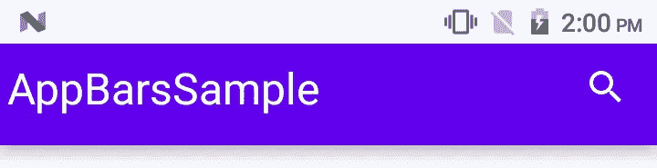
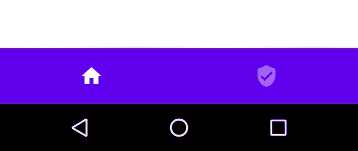
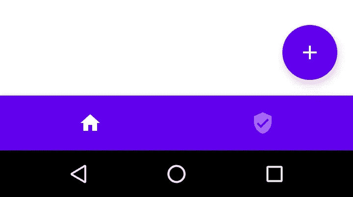
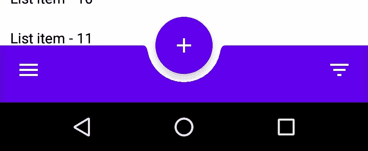
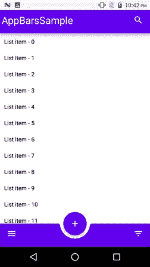

# 探索 Jetpack Compose 中的应用程序栏

> 原文：<https://betterprogramming.pub/exploring-app-bars-in-jetpack-compose-94a7e0920e32>

## 自定义 Android 应用程序的顶部和底部栏

图片由[黑客资本](https://unsplash.com/@hackcapital?utm_source=medium&utm_medium=referral)在 [Unsplash](https://unsplash.com?utm_source=medium&utm_medium=referral)

# 这篇文章的要点

在这篇文章中，我们将学习如何在 [Jetpack Compose](https://developer.android.com/jetpack/compose) 中设计应用程序栏。我们将介绍顶部应用程序栏的简单设计和自定义图标设计，以及默认设置，并将 fab 按钮与底部栏的切口对齐。

在本文的最后，您将找到整个流程的 GitHub 要点，因此可以随意使用代码。

# 介绍

Jetpack Compose 是谷歌最近试图让 Android 开发者轻松构建 UI 的尝试之一。

> “Jetpack Compose 是一个用于构建原生 Android UI 的现代工具包。Jetpack Compose 以更少的代码、强大的工具和直观的 Kotlin APIs 简化并加速了 Android 上的 UI 开发。”— [安卓开发者](https://developer.android.com/jetpack/compose/tutorial)

Jetpack Compose 已经进入测试版有一段时间了，它很可能在八月底发布稳定版。这意味着 API 结构将不再有任何剧烈的变化，因此这将是学习如何使用这个下一代 UI 套件进行 Android 开发的大好时机。

您需要安装 Android Studio Canary，北极狐(2020.3.1) 版本才能使用 Jetpack Compose beta。

# 先决条件

在进一步学习之前，您必须具备如何使用 Jetpack Compose 的基本知识。如果你是作曲新手，我强烈推荐阅读以下文章:

*   " [Jetpack 构成组件(第 1 部分)](/jetpack-compose-components-part-1-a80717dbfb59)"
*   "[在 JetPack Compose 中构建 Android 布局](/build-android-layouts-in-jetpack-compose-bda2e0837f5e)"
*   [“使用 Jetpack 撰写的 Android 底部导航栏”](/android-bottom-navigation-bar-with-jetpack-compose-8c2aa02b933d)
*   [“探索 Jetpack Compose 中的 Android 底部表单”](/explore-android-bottom-sheets-in-jetpack-compose-50eff0257231)

# 什么是应用程序栏？

*应用程序栏*，也称为*动作栏*，是应用程序 UI 中最重要的设计元素之一，因为它提供了用户熟悉的视觉结构和交互元素。一个`TopAppBar`显示一组动作以及屏幕标题。

一个`BottomAppBar`在屏幕底部显示一组与当前屏幕相关的动作，类似于底部导航栏。它可以选择性地显示一个浮动的动作按钮，该按钮可以重叠在底部栏的顶部，或者作为底部栏中的一个剪切块。

`BottomAppBar`与底部导航栏相比，我们可以灵活地设计不同的布局。开箱后，Jetpack Compose *脚手架*同时支撑`TopAppBar`和`BottomAppBar`。

## TopAppBar

让我们从设计 TopAppBar 开始。它只是我们用来显示在屏幕顶部的工具栏。首先，让我们看看现成的可组合函数:

*   `modifier` —修改器的作用类似于基于视图的布局中的布局参数。
*   `backgroundColor`和`contentColor` —用于将自定义颜色应用于顶部栏的背景和内容。
*   `elevation` —用于自定义顶栏的标高
*   `content` —这是我们可以设计顶栏的地方。

现在，让我们设计一个简单的`TopAppBar`，在右上角有一个标题和搜索图标，因为默认情况下`TopAppBar`给出了行范围来设计布局。看看下面的代码:

带有简单标题和搜索图标的顶栏设计

作者截图

# BottomAppBar

`BottomAppBar`类似于顶部应用程序栏结构，唯一的区别是底部应用程序栏具有额外的功能，如包括 fab 剪切块。首先，让我们看看默认的可组合函数，如下所示:

*   `modifier` —修改器的作用类似于基于视图的布局中的布局参数。
*   `backgroundColor`和`contentColor` —用于将自定义颜色应用于顶部栏的背景和内容。
*   `elevation` —用于自定义顶栏的标高。
*   `cutoutShape`—这用于将 UI 小部件(如浮动操作按钮)放置在底部栏上，具有定义的剪切形状。默认情况下，其值为`null`。
*   `content` —这是我们可以设计顶栏的地方。

现在，让我们设计一个简单的带有几个图标的`BottomAppBar`。看一下代码:

带有几个 CTA 的简单底部条

作者截图

这很好；让我们将底部栏与 fab 图标结合起来。代码如下:

默认情况下，Compose `Scaffold` 提供了一种通过`floatingActionButton`、`floatingActionButtonPosition`和`isFloatingActionButtonDocked`参数将浮动动作按钮停靠到屏幕的方法。

作者截图

现在，这对于一个常规的底部导航视图来说是很好的，但是如果我们想要一个底部栏的剪切按钮，而不是导航项目，我们想要在底部栏的开始和结束处有两个图标呢？

对现有代码做一些调整，这是可能的。首先，让我们从 FAB 按钮开始。

*   首先，我们需要将`isFloatingActionButtonDocked`参数更新为 true，这样它就会与底部的条形重叠。
*   其次，我们需要通过将`floatingActionButtonPosition`参数更新为`FabPosition.*Center*`来将它放在中间

看一下代码:

下一步是重新设计底部的酒吧。现在我们将使用图标按钮，而不是使用`*BottomNavigationItem*` *，*，这将使我们对设计部分有更多的控制。看一下代码:

作者截图

通过将`isFloatingActionButtonDocked`参数更改为真，fab 按钮与底部条重叠，`cutoutShape`在底部条上添加 FAB 的剪切块。移动到内部设计，我们已经使用了`*IconButton*` 和*`*spacer*`*来设计内部布局 ***。*****

**现在我们已经完成了顶部和底部的设计，是时候把这些东西放在一起了。看一下代码:**

**带有简单列表的顶栏和底栏设计**

****

**带有顶部和底部应用程序栏的最终输出**

# **奖金**

**我最近看到了由 [Satya Pavan Kantamani](https://medium.com/u/d255c4fc9d76?source=post_page-----4c9f44d04e68--------------------------------) 发表的这篇关于 Jetpack 视图绑定的优秀文章。强烈建议:**

** [## 在 Android 中用 Jetpack 视图绑定替换已弃用的 Kotlin 合成

### 如果科特林合成材料正在消失，是时候转向替代品了吗？

better 编程. pub](/android-jetpack-view-binding-c0947f7a6e9e) 

目前就这些。希望你学到了有用的东西。

感谢阅读。**