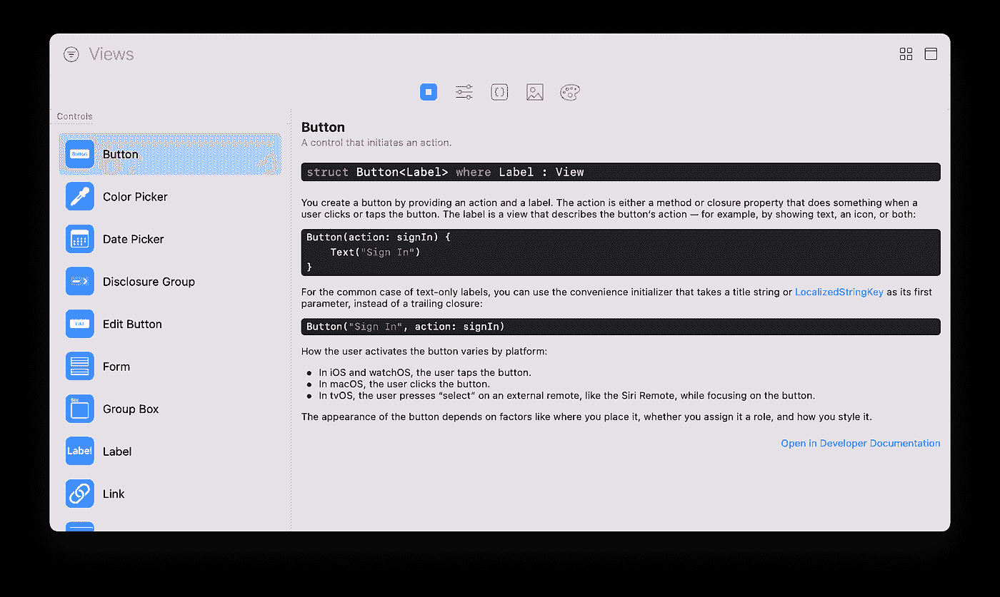
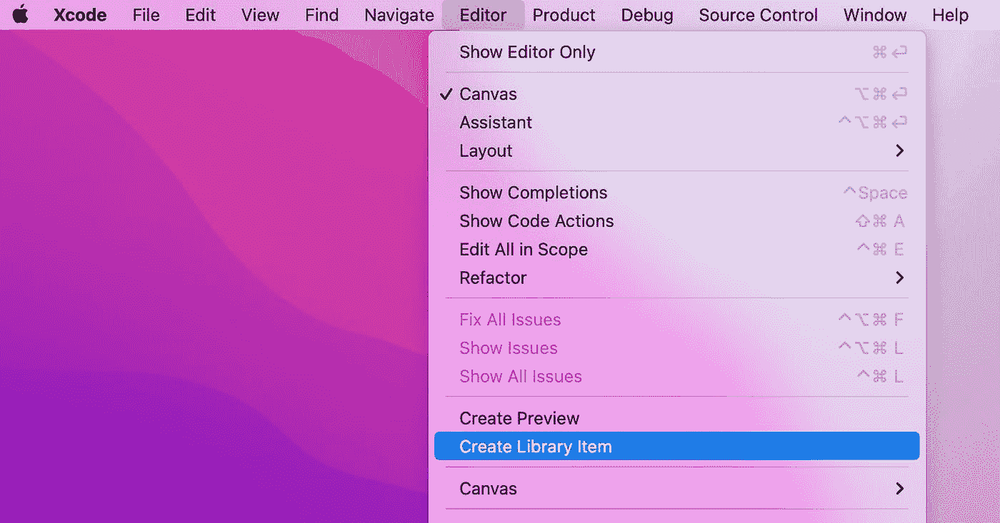
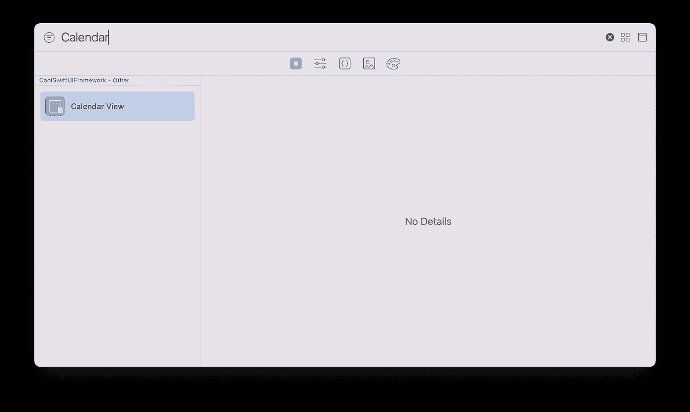

# 探索 Apple 的 DeveloperToolsSupport 框架

> 原文：<https://betterprogramming.pub/exploring-apples-developertoolssupport-framework-fe6bbee6bc3c>

## 看看鲜为人知的框架

Mia Baker 在 [Unsplash](https://unsplash.com?utm_source=medium&utm_medium=referral) 上的照片

[developertoolsupport](https://developer.apple.com/documentation/developertoolssupport)是 iOS 14+ / macOS 11+中引入的一个小框架。它只包含一个协议和一个结构。它使开发人员能够向 Xcode 库添加自定义 SwiftUI 视图和视图修改器。

# Xcode 库

使用键盘快捷键 shift-command-L (⇧⌘L)打开 Xcode 资源库

**重要提示**:xcode 库中的视图和修改器标签只有在画布打开时才可见(⌥⌘
)

# 将 SwiftUI 视图和修改器添加到 Xcode 库

> *要向库中添加项目，请创建一个符合 LibraryContentProvider 协议的结构，并将任何要添加的项目封装为 LibraryItem 实例。实现 views computed 属性以添加包含视图的库项目。实现 modifiers(base:)方法来添加包含视图修饰符的项。当您工作时，Xcode 会从项目中的所有资源库内容提供者获取项目，并使它们在其资源库中可供您使用。*

遗憾的是，使用 SwiftUI 视图文件模板时，Xcode 不会生成默认实现。相反，您可以使用 Xcode 中的菜单选项来创建默认实现。

视图及其`LibraryContentProvider`实现的例子。

您可以通过`LibraryItem`初始化器提供额外的特征，比如替代。

*注意*:你不需要为这个框架编写额外的 import 语句。写`import SwiftUI`语句的时候`DeveloperToolsSupport`是引擎盖下导入的。

打开 Xcode 库(⇧⌘L)会列出这个自定义视图。

# 缺点

当我第一次听说这个功能时，我非常兴奋。我很快意识到有一些重要的警告:

*   Xcode 不会将 SwiftUI 视图的 markdown 文档用作库项目的描述😭也没有其他方法来添加描述。
*   您不能将图像或缩略图添加到库项目。
*   库项目中代码段的有限格式选项。只有当你的`init`函数接受多个参数并且它们的类型需要深度嵌套初始化时，这才是有意义的。我建议您内联指定所有内容。

我仍然相信为您的可重用 SwiftUI 视图创建库内容提供者是有意义的，因为我希望苹果和 Xcode 团队从长远来看能够克服这些缺点。

在我的下一篇博客文章中，我将向您展示如何向 Xcode 添加一个自定义文件模板，它允许您创建一个新的 SwiftUI 文件，一次完成视图、预览和库内容提供者实现。

*最初发布于*[*https://blog . eidinger . info*](https://blog.eidinger.info/apples-developertoolssupport-framework)*。*