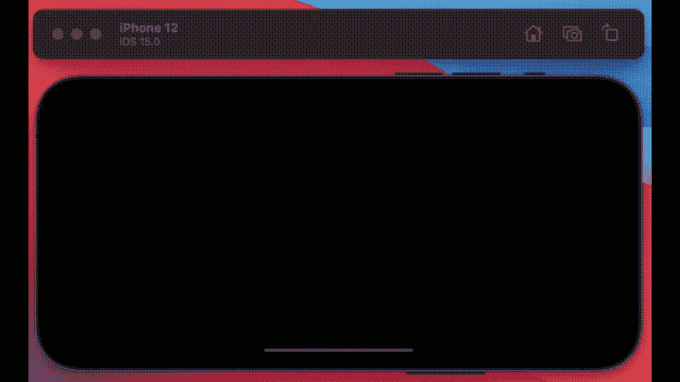
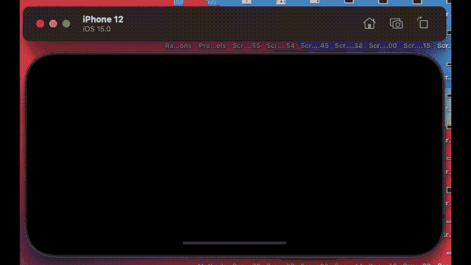
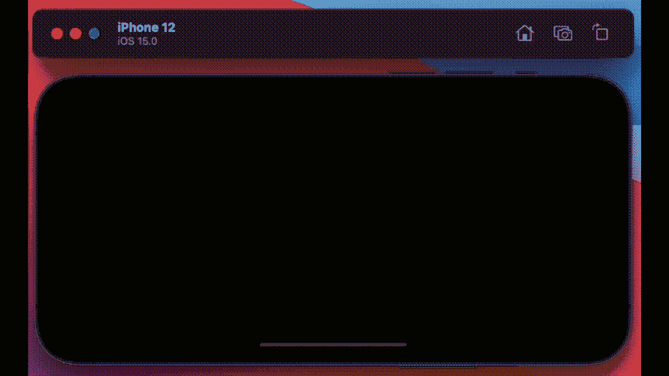
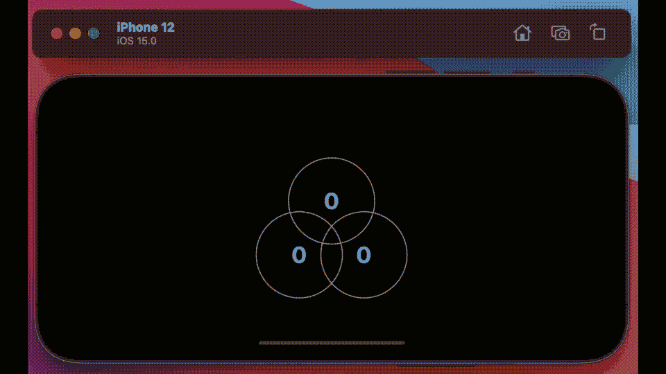

# Swift 5.5 中的异步调用—任务和任务组

> 原文：<https://betterprogramming.pub/exploring-asynchronous-tasks-and-task-groups-in-swift-5-5-8dd7bc639c8c>

## 顺序地、并行地创建任务，使用 Swift 并发处理结果、返回的类型和主要参与者


来源: [Undraw](https://undraw.co/search)

上个月，我发表了几篇论文，主题是今年苹果 WWDC 2021 大会的一个主要议题——并发。苹果发表了至少七篇关于这个主题的演讲。

*   [满足异步等待](https://developer.apple.com/videos/play/wwdc2021/10132/)
*   [对 URLSession 使用 Async-Await](https://developer.apple.com/videos/play/wwdc2021/10095/)
*   [探索 Swift 中的结构化并发](https://developer.apple.com/videos/play/wwdc2021/10134/)
*   [用 Swift Actors 保护可变状态](https://developer.apple.com/videos/play/wwdc2021/10133/)
*   [满足异步序列](https://developer.apple.com/videos/play/wwdc2021/10058/)
*   [幕后的快速并发](https://developer.apple.com/videos/play/wwdc2021/10254/)
*   [在 SwiftUI 中发现并发](https://developer.apple.com/videos/play/wwdc2021/10019/)
*   [将核心数据并发引入 Swift 和 SwiftUI](https://developer.apple.com/videos/play/wwdc2021/10017/)

三个多小时的视频——我自己看完了所有的视频，并对这个主题做了一些实际研究，我最初发表了几篇关于演员、`[asyncSequences](/understanding-asyncsequence-in-swift-5-5-ed2f7d218337)`和 [URL 处理](/urlsession-combine-and-asyncawait-96981923a7ec)——把最广泛的主题留到最后——任务的文章。我将在这里介绍。

# 任务

在开始之前，我需要定义任务这个术语的含义。任务不是将在特定 CPU 内核上运行的线程、队列或作业，它只是一段具有特定优先级的代码，是 Swift 5.5 中四个可能的优先级之一。

# 概观

我想通过一个简单的 SwiftUI 界面来说明新的编码范式——维恩图中的三个圆圈。

代码将在运行时以指定的延迟填充每个形状。为了与使用`async/await`指令的新规则保持一致，我不会使用任何其他并发/线程语言特性(苹果告诉我们这样做不好)。

在我的 Venn 的每个循环中，我打印代码运行的延迟。

这是我启动的每个任务都会运行的代码。

```
func changer(newColor:Color, delay:Int) async throws -> Color {
  debugPrint("delay \(newColor) \(delay)")
  textDelay[newColor] = delay
  try await Task.sleep(seconds: delay)
  return newColor
}
```

我在其中运行了一个扩展，您也可以在这里看到:

```
extension Task where Success == Never, Failure == Never {
  static func sleep(seconds: Int) async throws {
  let duration = UInt64(seconds * 1000_000_000)
  try await sleep(nanoseconds: duration)
  }
}
```

该扩展用于延迟方法的返回。感谢[黑客用 Swift](https://www.hackingwithswift.com/store) 在哪里找到的。

# 按顺序运行任务

维恩牌上的数字是所用的时间。最初，我按顺序运行改变颜色的方法，如你所见，首先是绿色，然后是蓝色，最后是红色——间隔为两秒钟。



这背后的代码很简单。看起来是这样的:

```
func serialTasks() async throws {
  try await colour[0] = changer(newColor:.green, delay: 2)
  try await colour[1] = changer(newColor:.blue, delay: 2)
  try await colour[2] = changer(newColor:.red, delay: 2)
}
```

`try`是必需的，因为 changer 函数中的 sleep 函数会抛出。`await`关键字告诉系统这个函数可能需要时间——它应该在运行下一个函数之前等待。

`serialTasks`方法本身在主 SwiftUI 代码的单个`.task`标记部分中运行。

我在 SwiftUI 界面中运行的代码使用了一个`.task`标签。：

```
.task {
  do {
    try await serialTasks()
  } catch {
    print(error.localizedDescription)
  }
}
```

请注意这段代码，因为它将在主线程上运行，同时从主线程继承优先级。

我在同一个构造中运行这里展示的所有任务，只是简单地更改了被调用函数的名称。理论上，iOS 15 可以决定在多个线程下的多个内核上运行这个程序——作为一名程序员，你再也不用担心这个细节了。

提示:如果我需要/想要在 SwiftUI 接口内专门运行一个不在主线程上运行的任务和/或从其父线程继承优先级，你需要使用`Task.detached(priority: .choices)`；用一个可能的选择来代替选择。

# 并行运行任务

当然，并发意味着同时进行，这在 M1 芯片上意味着多达 32 个内核，理论上，你应该能够让事情运转起来。

也就是说，我将展示并行运行相同方法的五个版本的代码。

我有五个版本，因为并发编码不适合胆小的人，而且有多种方法可以做到这一点。

## 1.在单个任务下运行 Swift 代码

bon——这是第一个，然后——有一个小的变化——这次改变颜色的时间后面的数字是随机的，尽管我在单个`.task`标签下运行这个。但这只是我眼中的部分并行解决方案。

我并行运行所有的颜色变化——我按顺序等待它们完成— `green`、`blue`，然后是`red`。尽管红色在绿色和蓝色之前很久就跑完了，但我们先看到绿色，然后是蓝色和红色同时出现:



这个解决方案背后的代码稍微复杂一点，尽管仍然非常简单:

```
func parrallelTasksI() async throws {
  async let colour1 = changer(newColor:.green, delay: Int.random(in: 0...7))
  async let colour2 = changer(newColor:.blue, delay: Int.random(in: 0...7))
  async let colour3 = changer(newColor:.red, delay: Int.random(in: 0...7))
  try await colour[0] = colour1
  try await colour[1] = colour2
  try await colour[2] = colour3
}
```

let 告诉系统这段代码可以独立运行，并且它对所有的转换器方法都是这样。

## 2.在 Swift 中并行运行多个任务

为了解决这个问题，我需要告诉系统，我想用第二个解决方案独立地运行这些方法中的每一个，如下所示。

时间决定了圆圈再次填充的顺序。
整个事情是并行运行的。我又跑了三次。



这个动画 GIF 背后的代码如下所示:

我再次使用了`async`和 wait 语言——但关键的是，这一次，我把它们放在了一起。我这样做是为了让他们都在自己的环境中运行，一旦完成，就返回来填充他们正在工作的圈子。

我们完了，但是，不，我们还没完。第二种解决方案没有错。如果它能解决你的问题，你就有了答案——但事实是，你很可能需要更多。

这段代码的主要问题是，您几乎无法控制已经启动的任务，除非您关闭创建它们的视图，否则它们将被终止(在 OS 术语中是干净的)。

## 3.取消任务

如果在这一点上，你的头开始旋转，因为下一次迭代感觉有点像向前两步和向后一步，你会被原谅。

为了控制这些任务，我需要将它们分配给一个变量——为此，我需要离开我用来启动它们的作业——这意味着我必须再启动三个任务来解决我在第一个解决方案中遇到的问题。

输出与已经显示的结果相同，所以我只给出代码:

我在其中创建了六个任务——为了演示这个过程，中途取消了其中一个。

但是，请注意，cancel 进程除了标记一个作业已被取消之外，没有什么作用。如果作业已经开始，则不会停止。

## 4.从任务中获得结果

放松，我们快完成了。同样，动画 GIF 看起来和已经发布的一样，所以我跳转到代码。在这个版本中，我设法再次分解任务，同时让代码就位，以便在为时已晚之前进行潜在的取消检查。

我想说这是最终版本——但不是——我们可以做得更好一点。

## 5.使用分离的任务和主要参与者

bon——最后，我们到了——嗯，老实说，第二个解决方案不错，但前提是你能跳过任务的取消或放弃。和最后两个一样，我们直接进入正题。

这里使用了几个其他的特性——我运行的`Task`是作为一个分离的颜色发出的——所以用我设置的优先级，而不是继承的优先级，我在`mainActor`(主线程，与 SwiftUI 相同)下运行`setColour`方法。

在这段代码中，我有三个任务，它们都独立运行。当一个任务完成时，我首先确认它没有同时被取消，然后检查返回的结果类型。

我在一个单独的过程中这样做。假设它没有被取消，并且没有其他错误，它应该设置颜色。警告取消的任务仍可能返回成功的结果。

# 分组任务

好的——如果你读了前面的部分，你会很习惯任务的分解——我确信这在你的脑海里留下了一个挥之不去的想法。

如果你在 M1 max 芯片中一点一点地将它分成 32 个内核，那么你可以更快地完成工作，这是一个很好的想法，但是，正如俗话所说，“上升的东西，必须下降”，“分裂的东西，最终必须回到一起”。

提出适合解决方案的问题当然很好(教程似乎就是这样)，但是现实世界呢？

你确实有可以并行运行的代码——但是代码需要协调它运行的方法，如果你把它们分开并并行执行，这些过程需要协调它们的返回。

## 特遣部队

所以协调任务最简单的方法是使用顺序任务；所以你把你的任务按顺序排列，或者用顺序代码混合搭配并行的任务。
但是这种方法不是可有可无的。

一个更好的解决方案是使用小组任务。

新的 Swift 5.5 API 中的组任务是需要同时完成的并行和/或顺序任务的集合，也称为相互等待。我直接提到的唯一主要限制是它们都必须返回相同的类型——尽管我将在后面讨论一个变通方法。

让我们从一个动画 GIF 开始，它展示了我们第一次尝试的结果，以及我上一篇论文所基于的文氏图。

我运行这个应用程序两次，以确保你能理解你在看什么。这些数字是每个进程所花费的随机时间，尽管这有一点争议，因为它们是分组的，它们花费的时间与最慢的进程一样长。


动画 GIF 背后的代码如下所示:

在所示的代码中，我定义了一个任务组，并向其中添加了三个任务。

每一个都将返回一种新的颜色。在代码本身中，我在第 7 行注释掉了一个取消分组结果的选项。

与任务的情况一样，这仅设置了一个标志；如果任务已经开始，它不会停止运行。

最后，当最慢的完成时，整个组返回`newColours`数组或者抛出一个错误消息。

该方法本身在如下所示的`.task`选项卡中运行:

```
.task {
  do {
    try colour = await newGroup()
  } catch {
    print(error.localizedDescription)
  }
}
```

## 高级任务组

这个看起来像这样——这可能看起来有点奇怪——但请和我呆在一起，因为这里发生了很多事情。

现在我创建了一个任务组，然后向其中添加了三个任务，确认它们没有在我之前被取消。



*   但是直接在添加第一个任务之后，我设置了一个提取来提前获得它的副本。你看，它开始执行，因为它独立于组任务设置标签。
*   我还在设置好下一个任务后提取它的结果，这一次，在小组到达之前，预先复制出结果类型并设置颜色，因此提前完成[蓝色圆圈，数字 2]。
*   最后，我简单地让`task3`执行，该组在填充颜色(红色+绿色+蓝色)之前等待所有三种颜色。

## 处理任务组中的返回类型

现在，说了这么多，让我们重温一下相同类型的返回限制并修复它。但首先，这是文氏图:


其背后的代码如下所示:

我从一个包含我想要返回的所有数据的自定义结构开始。现在，与前一个案例一样，发生了很多事情:

*   我添加了三个任务，它们使用一个定制的结构，通过一个方法`changerV`分配颜色和标签。
*   该标签用作任务完成时设置的延迟，但圆圈仍然是黑色的。
*   直到最后一项任务完成，圆圈才会被填满。但是我将标签设置为单个过程完成。

所有这些让我想到了 Swift 5.5 下的`Tasks`这篇文章的结尾。这是一次试图理解正在发生的事情的迷人旅程，也是一次很好的学习练习。

我希望你能像我写这本书时一样喜欢读它，并从中有所收获。

访问 Bitbucket [这里](https://bitbucket.org/wizard1066/concurrentcode/commits/8384f85a2ffa0ec56422d4a906c015ec7340012f)完整的源代码。感谢阅读。