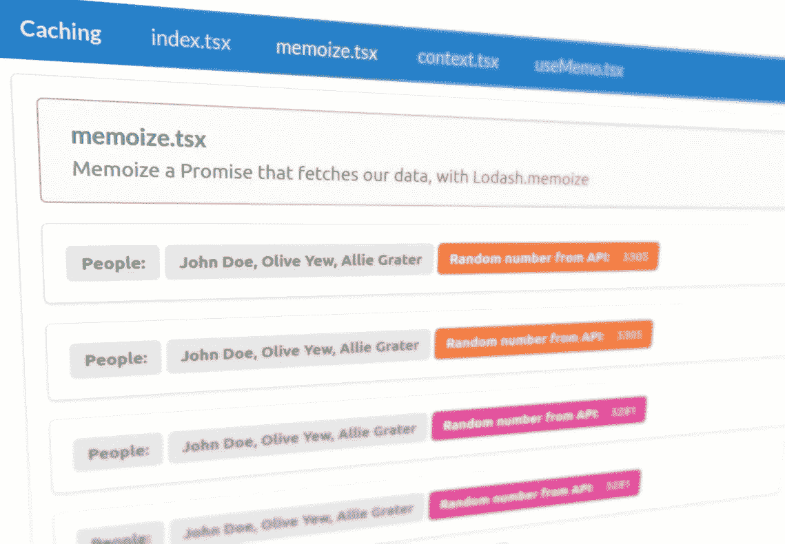
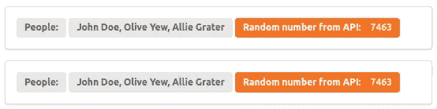
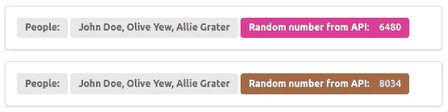
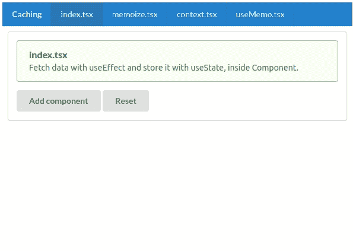
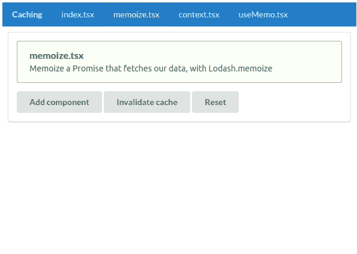
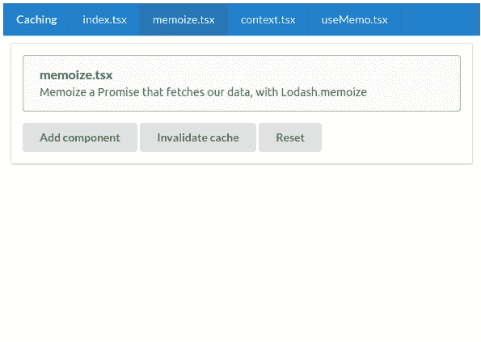
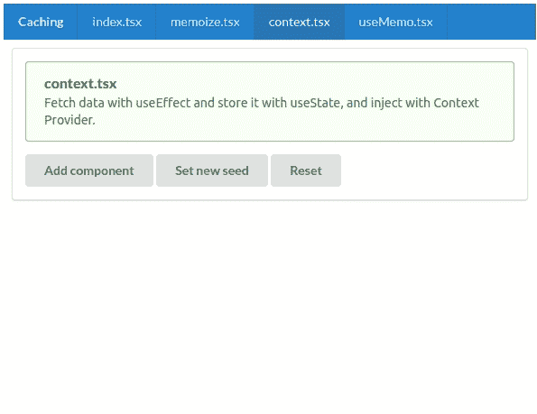
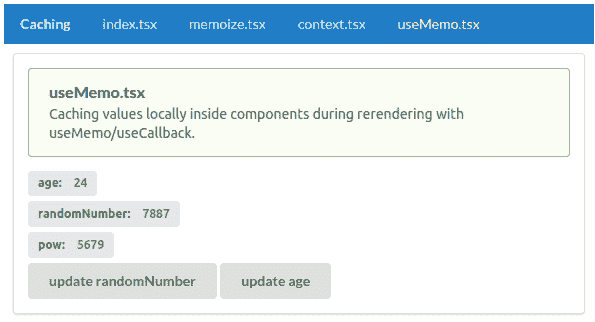

# 探索 React 中的缓存技术

> 原文：<https://betterprogramming.pub/exploring-caching-techniques-in-react-d30bbb78d54d>

## 如何使用记忆、上下文、使用记忆、使用状态和使用效果



我们今天将创造什么！作者照片。

在 React 中获取数据是一回事。存储和缓存这些数据是另一回事。可能性似乎是无穷无尽的，差异往往是微妙的，这使得选择正确的技术有时有点困难。

今天，我们将探索不同的技术，看看它们所有的细节和微妙之处。我应该用`useMemo`还是记忆？我应该用`useState`和一个上下文来存储数据吗？当我们完成后，您应该能够轻松地做出关于缓存数据的明智选择。你会了解所有的来龙去脉。

而且还有大量的动画 gif。你还能希望什么？

我们开始吧！

# 我们的数据

在深入研究代码之前，我们可以快速浏览一下我们将在(大部分)组件中获取的数据。作为我们的 API 的文件如下所示:

当我们向项目中的路径`/api/people`发出请求时，就会执行这段代码。如您所见，我们返回一个具有两个属性的对象:

*   `randomNumber`:0-10000 范围内的随机数。
*   `people`:一个有三个虚构名字的静态数组。

属性将帮助我们可视化我们是否在前端渲染缓存的数据。继续读下去。很快就说得通了。

注意，我们通过使用`setTimeout`模拟了一点网络延迟。

## 人员组件

当我们呈现来自 API 的数据时，我们将把它传递给一个名为`[PeopleRenderer](https://gitlab.com/gvanderput/gerard-caching-techniques/-/blob/master/components/PeopleRenderer.jsx)`的组件。看起来是这样的:


PeopleRenderer 组件。



显示相同(缓存)数据的两个组件。



呈现不同(非缓存)数据的两个组件。

说了这么多，让我们来看看第一个技巧。

# 使用效果

在我们的组件内部，我们可以使用`[useEffect](https://reactjs.org/docs/hooks-effect.html)`钩子来获取数据。然后我们可以使用`[useState](https://reactjs.org/docs/hooks-state.html)`将它存储在本地(组件内部):

通过传递一个空数组作为第二个参数(见第 11 行)，当我们的组件被挂载到 DOM 时，将执行`useEffect`钩子——只有在那时。当我们的组件被重新渲染时，它不会再次执行。这是一个“执行一次”的钩子。

以这种方式使用`useEffect`的一个警告是，当我们的 DOM 中有组件的多个实例时，它们都将单独获取数据(当它们被挂载时):



动画:组件分别获取数据。

这个技术没有错。有时候，这正是我们想要的。但在其他时候，我们可能希望获取一次数据，并通过缓存在所有其他实例中重用它。我们可以使用几种技术来实现这一点。

# 记忆化

记忆化是一个非常简单的技术的花哨词。这意味着您创建了一个函数，每次调用该函数时，它都会在返回函数之前将函数调用的结果存储在缓存中。

当这个*记忆化的*函数第一次被调用时，结果被计算(或者获取，或者你在函数体内做的任何事情)。在返回结果之前，您将它们存储在缓存中用输入参数创建的键下:

创建这种样板代码会很快变得很麻烦，所以像 [Lodash](https://lodash.com/docs/4.17.15#memoize) 和[understand](https://underscorejs.org/#memoize)这样的流行库提供了实用函数，您可以使用它们轻松地创建记忆化的函数:

## 利用记忆获取数据

我们可以在获取数据时利用这种技术。我们创建了一个`getData`函数，该函数返回一个`Promise`，当获取请求完成时，该函数被解析。我们记住这个`Promise`:

请注意，在这个例子中我们没有处理错误。这应该有自己的文章——特别是当我们使用记忆化时(被拒绝的`Promise`也会被记忆化，这可能会有问题)。

现在我们可以用另一个看起来像这样的钩子替换我们的`useEffect`:

由于`getData`的结果被记忆，我们的组件在安装时都会收到相同的数据:



动画:我们的组件使用相同的记忆承诺。

同样值得一提的是，当我们打开`memoize.tsx`页面时(在我们挂载组件的第一个实例之前)，数据已经被预取了。这是因为我们在页面顶部的一个单独的文件中定义了我们的`getData`函数，而`Promise`是在加载该文件时创建的。

我们也可以通过给内存化函数的`cache`属性分配一个新的`Cache`来使内存化函数的缓存无效(清空):

```
getData.cache = new memoize.Cache();
```

或者，您可以清除现有的缓存(它是一个`[Map](https://developer.mozilla.org/en-US/docs/Web/JavaScript/Reference/Global_Objects/Map)`实例):

```
getData.cache.clear();
```

不过，这是特定于 Lodash 的功能。其他库需要其他解决方案。在这里，您可以看到使缓存失效的过程:



动画:重置内存化的 getData 函数的缓存。

# 反应上下文

另一个流行且讨论广泛(但经常被误解)的工具是 [React Context](https://reactjs.org/docs/context.html) 。我再次声明，它不会取代像 Redux 这样的工具。它不是一个状态管理工具。马克·埃里克森正在网上进行一场艰苦的战斗，并不断解释原因。我强烈推荐阅读他最近关于这个话题的文章。

如果你真的感兴趣，也可以考虑阅读我的相关文章:

[](https://medium.com/swlh/react-hooks-and-redux-are-friends-not-enemies-cb0ecfa613ed) [## React Hooks 和 Redux 是朋友，不是敌人

### 他们相处得很好，目的不一样。

medium.com](https://medium.com/swlh/react-hooks-and-redux-are-friends-not-enemies-cb0ecfa613ed) 

那么什么是语境呢？这是一种将数据注入组件树的机制。如果您有一些数据，那么您可以用一个`useState`钩子将这些数据存储在组件层次结构中较高的一个组件中。然后，您可以使用上下文`Provider`将数据注入到您的树中，之后您可以读取(消费)下面任何组件中的数据。

举个例子比较好理解。首先，创建新的上下文:

然后我们用上下文`Provider`包装呈现您的`People`组件的组件:

在第 12 行，我们可以渲染任何我们想要的东西。在某些时候，在树的更下面，我们将呈现我们的`People`组件:

我们可以通过使用一个`[useContext](https://reactjs.org/docs/hooks-reference.html#usecontext)`钩子来使用来自`Provider`的值。结果看起来像这样:



动画:从上下文中使用数据。

请注意这里的一个重要区别！在上面动画的结尾，我们按下按钮“设置新种子”这样，存储在我们的上下文`Provider`中的数据被重新获取。完成后(750 毫秒后)，新获取的数据成为我们的`Provider`的新值，我们的`People`组件被重新渲染。正如你所看到的，它们都*共享*相同的数据。

这与我们上面看的记忆化例子有很大的不同。在这种情况下，每个组件通过使用`useState`存储它自己的记忆数据副本。在这种情况下，通过使用和消费上下文，它们不存储副本，而只使用对同一对象的引用。这就是为什么当我们更新我们的`Provider`中的值时，所有的组件都用相同的数据更新。

# 使用备忘录

最后但同样重要的是，快速看一下`[useMemo](https://reactjs.org/docs/hooks-reference.html#usememo)`。这个钩子不同于我们看到的其他技术，因为它只是一种本地级别的缓存形式:在组件的一个实例中。您不能使用`useMemo`在几个组件之间共享数据——至少在没有诸如 prop-drilling 或依赖注入(例如，React Context)之类的变通方法的情况下。

`useMemo`是一个优化工具。您可以使用它来防止每次重新渲染组件时重新计算值。文档[比我能更好地解释](https://reactjs.org/docs/hooks-reference.html#usememo)，但是让我们看一个例子:

*   `getRnd`(第 2 行):返回 0-10000 范围内的随机数的函数。
*   `age`(第 4 行):用`useState`存储代表年龄的数字。
*   `randomNumber`(第 5 行):用`useState`存储一个随机数。

最后，我们在第 7 行使用`useMemo`。我们记忆函数调用的结果，并将结果存储在一个名为`pow`的变量中。我们的函数返回一个数字，它是`age`的 2 次方加上一个随机数的和。它依赖于`age`变量，这就是为什么我们将它传递给`useMemo`调用的依赖参数。

该函数仅在年龄值改变时执行。如果我们的组件重新呈现并且`age`的值没有改变，`useMemo`将简单地返回记忆的结果。

在这个例子中，`pow`的计算并不是很复杂，但是你可以想象当我们的函数比较重，我们必须经常重新渲染我们的组件时，这样做的好处。

最后两个动画将说明发生了什么。首先，我们更新`randomNumber`并且我们不影响`age`的值。因此，我们看到`useMemo`在起作用(当组件被重新渲染时，`pow`的值不会改变)。每次我们单击按钮，我们的组件都会重新呈现:



动画:许多重新渲染，但权力的价值是用记忆。

然而，如果我们改变`age`的值，那么`pow`也会被重新呈现，因为我们的`useMemo`调用依赖于`age`的值:


动画:当我们更新依赖关系时，我们的记忆值也随之更新。

# 结论

JavaScript 中有许多缓存数据的技术和实用程序。本文只是触及了表面，但我希望它能提供一些您可以在开发之旅中随身携带的知识。

本文中使用的所有代码都可以在我位于 [GitLab](https://gitlab.com/gvanderput/gerard-caching-techniques) 的知识库中找到。

感谢您的宝贵时间！