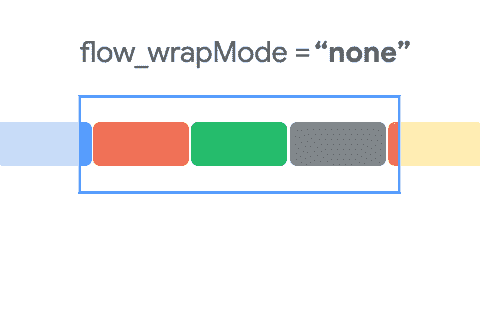

# 探索 Android 中的 ConstraintLayout 2.0

> 原文：<https://betterprogramming.pub/exploring-constraintlayout-2-0-in-android-317584003ee9>

## 流程、图层和动作布局


照片由 [rafzin p](https://unsplash.com/@rafzin?utm_source=medium&utm_medium=referral) 在 [Unsplash](https://unsplash.com?utm_source=medium&utm_medium=referral) 上拍摄

# 介绍

`ConstraintLayout`是一个强大的 Jetpack 库，允许开发人员使用 Android Studio 内置的交互式工具快速创建复杂且响应迅速的 UI，以便预览您的 XML。

`ConstraintLayout`的一个显著优点是，我们可以用平面视图层次结构(没有嵌套视图组)构建复杂的 UI。这导致绘制的图层数量减少，从而提高了性能。

## ConstraintLayout 的几个关键特性

1.  我们可以相对于彼此定位视图。
2.  我们可以使用偏差或其他视图将视图居中。
3.  我们可以指定视图的纵横比。
4.  我们可以对视图进行分组和链接。

## 一些辅助对象

辅助对象是对用户不可见的对象，但是可以方便地对齐开发人员的视图。

*   `Guideline`
*   `Barrier`
*   `Placeholder`

要了解更多关于`ConstraintLayout` v1.0 的信息，请阅读这篇[文章](https://medium.com/better-programming/essential-components-of-constraintlayout-7f4026a1eb87)。

# ConstraintLayout 2.0

历史课讲够了。是时候将`ConstraintLayout`的 v2.0 集成到你的项目中了。为此，在`build.gradle`文件中的 dependencies 标签下添加下面一行。

```
implementation “androidx.constraintlayout:constraintlayout:2.0.1”
```

这个版本给`ConstraintLayout`带来了几个新功能；让我们毫不迟疑地开始挖掘它们。

# 流动

`Flow`是 v2 中新增的虚拟布局，类似于 v1 中的组。是`Chain`和`Group`的组合，有特异功能。简单地说，`Flow`在运行时用动态大小链接视图。

与`Group`类似，`Flow`也获取引用视图 id 并创建一个`Chain`行为。`Flow`提供的一个重要优势是`wrapMode`(一种在视图溢出时配置视图的方法)。开箱即用，我们有三种模式可供选择:`none`、`aligned`和`chain`。



流动模式:无、链和对齐

*   `[wrap none](https://developer.android.com/reference/androidx/constraintlayout/helper/widget/Flow#wrap_none)` :从引用的视图中创建一个链
*   `[wrap chain](https://developer.android.com/reference/androidx/constraintlayout/helper/widget/Flow#wrap_chain)`:仅当参考视图不适合时，创建多个链(一个接一个)
*   `[wrap aligned](https://developer.android.com/reference/androidx/constraintlayout/helper/widget/Flow#wrap_aligned)`:类似于`wrap chain`，但是会通过创建行和列来对齐视图

使用 ConstraintLayout 的流程用法

这个特性看起来很简单，但是我们可以使用`ConstraintLayout` 2.0 创建流程布局。我们不再需要使用流布局库了。

在 2.0 之前，我们必须计算渲染每个视图后的剩余空间，以确保下一个视图适合那里，否则我们必须在下一行对齐它。但是现在我们需要使用`Flow`。

要了解更多关于`Flow`、[的信息，请阅读官方文件](https://developer.android.com/reference/androidx/constraintlayout/helper/widget/Flow)。

# 层

`Layer`是`ConstraintLayout` 2.0 中的新助手，类似于`Guideline` s 和`Barrier` s。我们可以创建一个虚拟层，就像一个具有多个引用视图的组。一旦视图被引用，我们可以使用`Layer`在那些视图上应用转换。

它类似于一个`Group`助手，在这里我们可以绑定多个视图并执行基本的操作，比如可见性(可见和不可见)。有了`Layer`，我们可以更上一层楼。我们可以将动画一起应用于`rotate`、`translate`或`scale` 多个视图。

ConstraintLayout 2.0 中的图层用法

# 运动布局

`MotionLayout`是`ConstraintLayout`的一个子类，包含了它所有突出的特性，它是完全声明性的，能够在 XML 中实现复杂的转换。它向后兼容 API level 14，这意味着它覆盖了 99%的用例。

Android Studio 4.0 中新的`MotionLayout`编辑器使得使用`MotionLayout`更加容易。它提供了一个奇特的环境来实现过渡、`MotionScenes`等等。

要了解更多关于`MotionLayout`的信息，请阅读这篇[文章](https://medium.com/better-programming/beginners-guide-to-motion-layout-732395a7de7e)。

就这些了，希望你能学到一些有用的东西，感谢阅读。