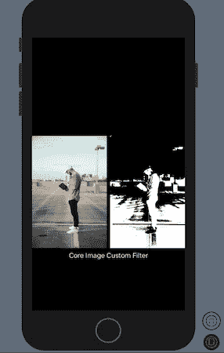

# 探索核心图像:苹果的第一个计算机视觉框架

> 原文：<https://betterprogramming.pub/exploring-core-image-apples-first-computer-vision-framework-160f4a589413>

## 从首选计算机视觉框架到图像过滤工具的旅程


由 [Unsplash](https://unsplash.com?utm_source=medium&utm_medium=referral) 上 [Mukuko 工作室](https://unsplash.com/@mukukostudio?utm_source=medium&utm_medium=referral)拍摄的照片

多年来，苹果在每年的 WWDC 大会上发布了一些突破性的功能。除了 iOS 社区，全世界的开发者都热切期待苹果的年度大会。难怪要找出哪个 WWDC 会议与众不同总是一个两难的选择。

有人说，由于推出了一系列新功能和重要工具，WWDC 2019 年是多年来最好的开发者大会。SwiftUI 是一个强大的构建用户界面的新框架，核心 ML 和 Vision 框架的重大升级使得淡化苹果在 2019 年取得的成就变得很棘手——我也不会这样做。

因此，在不对过去的 WWDC 会议进行比较的情况下，我将带你回到三年前(WWDC 2017)，当时苹果发布了两个强大的框架，从而大大推动了人工智能应用。

对于外行来说，Core ML 是苹果的机器学习框架，它让你可以将预先训练好的和定制的模型集成到你的应用程序中，只需几行代码就可以运行推理。

另一方面，Vision 是一个功能强大、易于使用的框架，构建在 Core ML 之上，为各种计算机视觉任务提供解决方案，包括人脸和地标检测、文本识别、条形码识别、图像相似性和显著性。

但是这些解决方案中的很多——特别是人脸、矩形、条形码检测和显著性——在视觉出现之前就已经存在了。苹果实际上已经首次发布了带有核心图像框架的人脸检测 API。

[Core Image](https://developer.apple.com/documentation/coreimage) ，用苹果自己的话说就是*一种图像处理和分析技术，为静态和视频图像*提供高性能处理。鉴于多年来 Core Image 的显著增强，可以说该框架是未来设备上视觉任务的领跑者，苹果在这方面投入了大量资金，以推动计算机视觉领域的发展。

那么，是什么导致了从核心图像成为首选框架，到视觉框架突然出现并最终占据主导地位的转变呢？

> **两个字:深度学习。**

深度学习的出现不仅大大提高了人脸检测和图像识别等任务的最先进精度，还使解决其他计算机视觉问题变得更加容易。

例如，核心图像中的人脸检测基于 OpenCV 的 [Viola-Jones 算法](https://en.wikipedia.org/wiki/Viola%E2%80%93Jones_object_detection_framework)。该算法进行类似 Haar 的特征选择，这类似于 CNN 中的内核——一个用于应用变换和效果的小矩阵。

与 CNN 不同，在 CNN 中，内核值很容易通过训练来确定，Haar 特性需要手动计算(大量的数学计算)，因此带来了可扩展性和定制问题。

例如，在 Core Image 中执行面部识别(或任何自定义图像分类任务)需要识别特定面部的 Haar，如果面部被部分覆盖或方向(头部倾斜)改变，这很容易遇到准确性问题。

另一方面，训练图像数据集并通过 Vision API 集成模型使识别更加准确和高效。

因此，尽管岩心图像具有较高的执行速度(由于计算量较小)和相对较小的数据集，但其在计算机视觉领域的应用仍然受到限制。强大的边缘设备的出现只是导致了向视觉框架的转变，这缓解了手动选择和提取特征的问题。

核心图像框架现在主要用于将变换和视觉效果(滤镜)应用于图像和视频。

让我们深入研究核心图像 API，看看它如何让我们创建和应用这些过滤器。

# 核心映像框架的关键类

## 杀虫剂检测器

`CIDetector`类用于处理图像以检测面部、矩形、条形码和文本。例如，使用以下方法检测人脸:

```
let faceDetector = CIDetector(ofType: CIDetectorTypeFace, context: nil, options: [CIDetectorAccuracy: CIDetectorAccuracyHigh])let faces = faceDetector?.features(in: **CIImage**(image: inputImage)!) as! [CIFaceFeature]for face in faces{
print(faces.hasSmile)
print(faces.leftEyeClosed)
print(faces.hasMouthPosition)
}
```

使用面部检测器，我们可以确定微笑概率、头部姿势、执行眨眼检测等等。此外，我们可以过滤`CIDetector`以仅返回具有特定属性的面部，如下所示:

```
let faceDetector = CIDetector(ofType: CIDetectorTypeFace, **context**: nil, options: [CIDetectorSmile: true])
```

接下来让我们看看`CIImage`。

## CIImage

`CIImage`是核心图像自己的数据类型，包含了图像的所有信息。与听起来相反的是，`CIImage`并不能代替图像。它更像是一种能够产生图像的“配方”。

`CIImages`可以从`UIImage`、图像文件或像素数据中创建。从`UIImage`创建`CIImage`非常简单，如下面的代码片段所示:

```
let inputImage = CIImage(image: uiImage)
```

一个`CIImage`是一个轻量级的对象，在这个意义上，对它应用任何滤镜都不会渲染任何图像。它只是将滤镜添加到如何生成最终图像的指令配方中。

## **CIContext**

`CIContext`是图像渲染和分析实际发生的处理环境。这是一个绘图目的地，在这里编译过滤器以生成输出图像。

实例化一个`CIContext`是一个昂贵的操作——因此，重用实例是一个好主意——特别是因为它们是不可变的和线程安全的。

一个`CIContext`使用应用了滤镜的`CIImage`创建输出图像。这里有一个简单的方法来创建一个`CIContext`:

```
let ciContext = CIContext(options: nil)
```

我们传递属性类似于`allowLowPower`、`outputColorSpace`(默认情况下接受默认的 RGB 颜色空间，但您可以将其更改为 Quartz2D 或任何其他颜色空间)、`highQualityDownsample`和[的](https://developer.apple.com/documentation/coreimage/cicontextoption)。

```
**let** cgimg = context.createCGImage(filter.image, from: filter.image.extent)
```

在`CIContext`中，`CGImage`(另一种图像数据类型)是通过传入图像及其`extent`创建的，这意味着完整的图像。

## CIFilter

`CIFilter`是一个可变对象，负责根据输入图像和指定的`attributes`范围创建最终的`CIImage`。

`CIFilters`不能在线程间安全共享，不像`CIContext`。我们可以使用`CIKernel`创建自己的定制过滤器，或者将多个`CIFilters`链接在一起构建一个复合过滤器。

此外，`CIFilter`类提供了按类别查询内置过滤器的方法，并返回给定过滤器可用的`inputKeys`和`outputKeys`的列表。

以下代码片段显示了如何查询核心映像的内置过滤器:

```
//All filters
CIFilter.filterNames(inCategories: nil)CIFilter.filterNames(inCategory: kCICategoryBlur)//The blur category consists of filters like gaussian, zoom blur etc.
```

以下是如何为图像创建显著性滤镜的示例(突出显示感兴趣的区域):

```
guard let inputImage = UIImage(named: image_name_here) 
else { return }let beginImage = CIImage(image: inputImage)
let context = CIContext()
let currentFilter = CIFilter.saliencyMap()currentFilter.inputImage = beginImage

guard let outputImage = currentFilter.outputImage 
else {return }if let cgimg = context.createCGImage(outputImage, from: outputImage.extent) {let uiImage = UIImage(cgImage: cgimg)}
```


右边的图像应用了显著性滤镜

## CIKernel

每个核心图像过滤器的核心是一个由`CIKernel`类管理的内核函数。内核函数告诉过滤器如何变换输入图像的每个像素。

本质上，有三种不同类型的内核:颜色内核、扭曲内核和混合内核。定制颜色内核需要创建一个`CIColorKernel`的实例并传递内核代码，或者利用[金属着色器库](https://developer.apple.com/documentation/metal/mtllibrary)。

## 创建自定义过滤器

让我们来看一个自定义滤镜，它根据阴影将灰色转换为黑色和白色(较暗的阴影会转换为白色，反之亦然):



# 结论

我们看到，尽管 Core Image 代表了一个强大的近实时处理框架，但由于它支持的定制化水平，它最终为苹果的深度学习驱动的视觉框架铺平了道路。尽管如此，核心图像仍然是基于照片和视频的过滤应用程序的重要框架。

iOS 13 不仅在 Core Image 中引入了一堆新的滤镜，还让它们的使用更加类型安全。在下一篇文章中，我们将探索一系列核心图像过滤器，并了解如何使用金属着色器语言来更容易地创建和合成我们自己的自定义过滤器。

这一次到此为止。感谢阅读。