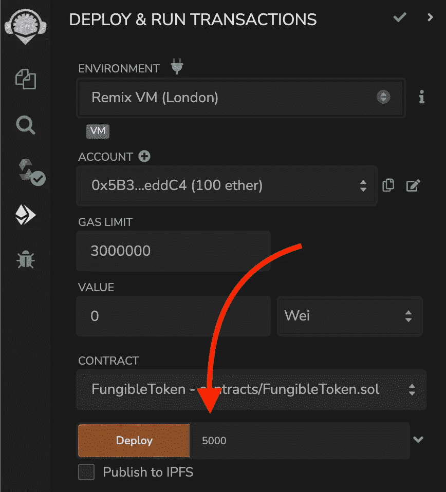
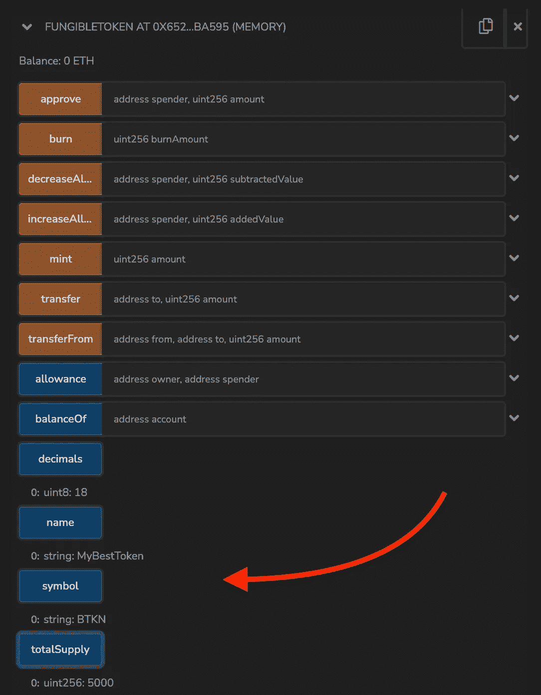
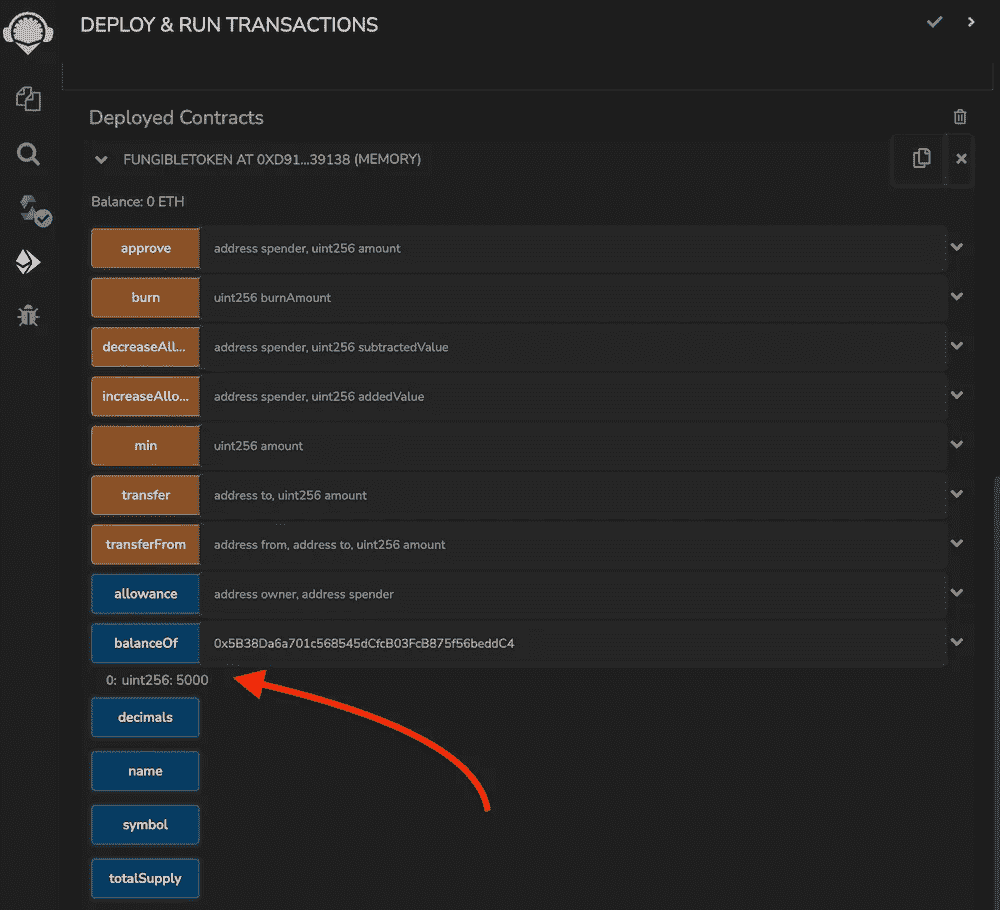
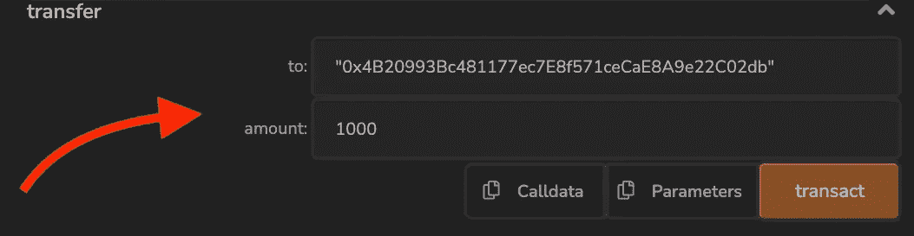
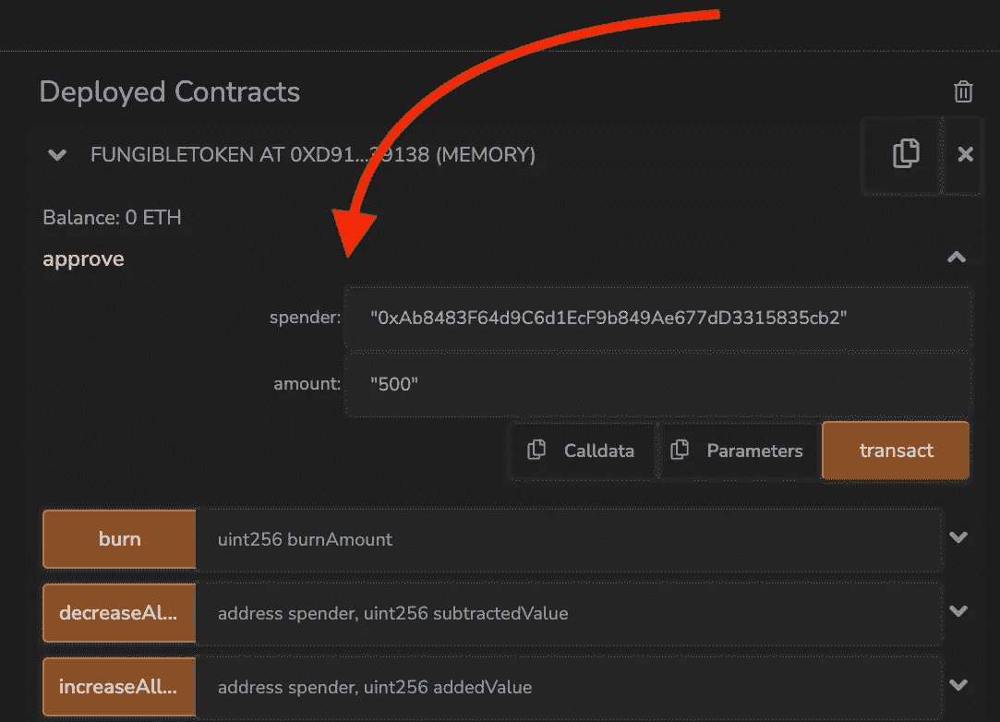
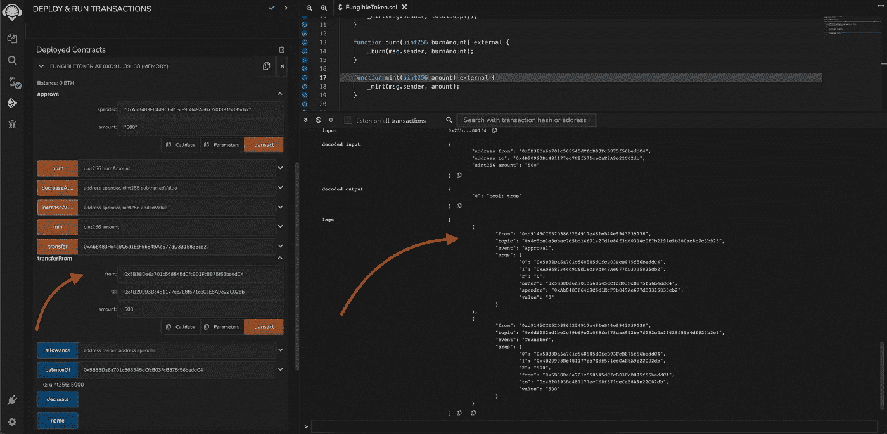

# 探索 ERC20 可替换令牌标准的可靠性

> 原文：<https://betterprogramming.pub/exploring-erc20-fungible-token-standard-in-solidity-d3a9936a6a63>

## 满足 EVM 链代币的黄金标准


[regularguy.eth](https://unsplash.com/@moneyphotos) 在 [Unsplash](https://unsplash.com/?utm_source=medium&utm_medium=referral) 上的照片。

这次让我们来谈谈可替换令牌，它是 DeFi 中的主要构件之一。这些代币可以代表硬币、黄金、谷物和其他可以兑换的资产。我们将研究第 20 号以太坊改进提案中的一个。这个令牌标准被广泛称为 ERC20，它描述了智能合约中令牌的接口。该 ERC20 标准定义了令牌转移、批准支出、创建等功能。

为了用代码说明 ERC20 标准，我们将使用[openzeplin ERC 20](https://docs.openzeppelin.com/contracts/4.x/erc20)实现。

# 铸造和燃烧

total token 供应有两个主要动作。我们可以用薄荷或者烧了它们。铸造意味着创造更多的供给，而燃烧意味着一旦我们需要就减少供给。

# 铸造

为了创造代币供应，我们需要铸造这个数量。当我们在后台铸造时，调用这个函数的后台调用者接收提供的令牌数量。

让我们创建一个充当 ERC20 令牌的智能合约。在构造函数中，我们需要提供总的令牌供应并调用 OpenZepplin 的`ERC20`实现构造函数，提供令牌名称和符号。

```
contract FungibleToken is ERC20 {
  constructor(uint256 totalSupply) ERC20("MyBestToken", "BTKN") {
    _mint(msg.sender, totalSupply);
  }
```

当我们想要部署这个契约时，我们应该提供`totalSupply`。我想提一下，我们用的是 [Remix 开发 IDE](https://remix-project.org/) 。要使用像 [Alchemy](https://www.alchemy.com/) 或 [Quicknode](https://www.quicknode.com/) 、[这样的 RPC 端点来部署这个契约，您可以阅读本文](/how-to-create-your-own-nft-smart-contract-tutorial-1b90978bd7a3)。



如果需要，我们可以通过铸造更多的代币来发行更多的代币。

# 燃烧的

当我们需要降低流通中可用代币的总价值时，我们可以烧掉它们。令牌燃烧意味着我们向零地址`0x0000000000000000000000000000000000000000`发送特定数量的令牌，它将被永久锁定，因为没有人可以访问该地址。

```
function burn(uint256 burnAmount) external {
    _burn(msg.sender, burnAmount);
  }
```

要烧掉代币，我们需要传递铸造代币的地址和我们想要烧掉的数量。

# 效用函数

ERC20 标准中的几个实用函数帮助我们找到令牌信息和余额。

# 令牌信息

一旦智能合约部署到链上，任何人都可以看到名称、符号和小数。唯一需要的是令牌智能合约地址。



# 平衡

本质上，ERC20 标准保存了地址的映射和它所拥有的数量。这意味着在任何给定的时间，我们可以要求平衡的具体地址。它是公开可见和可访问的。当然我们不知道这个地址后面是谁，也不能改变金额。



在幕后，ERC20 OpenZepplin 标准在一个映射中保持平衡，其中键是一个地址，值是`uint256`。一点魔法都没有。

```
mapping(address => uint256) private _balances;
```

# 转移

当我告诉你我们不能改变一个地址持有的令牌数量时，我撒了一点谎。我们可以将令牌转移到某个地址，或者授予某个地址的转移权限。转让权意味着我们给予另一个地址代表我们花费一定数量代币的权利。

# 转移代币

一旦我们持有一定数量的 ERC20 代币，我们就可以将不超过总数的代币发送到任何地址。这也包括零地址`0x0000000000000000000000000000000000000000`，从技术上来说，这意味着燃烧。



在 ERC20 实现中，描述了一旦我们转移令牌，我们发送的金额将从我们的余额中扣除，并根据我们发送到的地址增加。它检查我们是否有足够的代币来转移，以及我们是否没有超出我们的余额。请记住，我们一直在处理象征性的资产负债表。

# 代表转让代币

将转让权交给其他人听起来可能很复杂，但它在 DeFi 中被广泛使用，我们提供以太坊智能合约权来操作我们的令牌。例如，智能合约掉期令牌将它们放入流动性池，或者我们希望获得一笔贷款，为我们的令牌提供抵押品。

首先，我们需要给一个地址的权利，并提供它可以操作的最大数量。ERC20 实施还将检查我们是否没有超出可用令牌，并在内部映射中保留令牌允许量。

```
mapping(address => mapping(address => uint256)) private _allowances;
```

这个映射密钥是令牌持有者的地址。然后，值是另一个映射，其中关键是支出者地址和允许支出的金额。



给予消费权后，我们可以减少或增加给花钱者的津贴。

现在，消费者可以将我们保留的代币金额发送到任何其他地址，只要提供代币持有者地址、发送地址和要转移的代币金额。



在 ERC20 标准的实施中，津贴和余额也相应地发生了变化。所提供的代币金额将减少消费方津贴，并且接收方的余额将增加。

# TL；速度三角形定位法(dead reckoning)

ERC20 是以太坊改进提案中的首批标准之一。它描述了一个智能契约，其中包含可替换的令牌余额和地址间的转移。它还谈到了额外的功能，如允许代表代币持有者消费。这是 EVM 链条上代币的黄金标准。

# 链接

*   [样本代码](https://gist.github.com/fassko/9a25b7249394cf20625d705364ff469b)
*   [EIP-20:令牌标准](https://eips.ethereum.org/EIPS/eip-20)
*   [ERC-20 —以太坊文档](https://ethereum.org/en/developers/docs/standards/tokens/erc-20/)
*   [ERC-20 由 Investopedia](https://www.investopedia.com/news/what-erc20-and-what-does-it-mean-ethereum/)
*   [ERC 20—openzeplin 文档](https://docs.openzeppelin.com/contracts/4.x/erc20)
*   [ERC 20—openzeplin 实现](https://github.com/OpenZeppelin/openzeppelin-contracts/blob/master/contracts/token/ERC20/ERC20.sol)
*   [SolidState ERC20 实施](https://github.com/solidstate-network/solidstate-solidity/blob/master/contracts/token/ERC20/SolidStateERC20.sol)