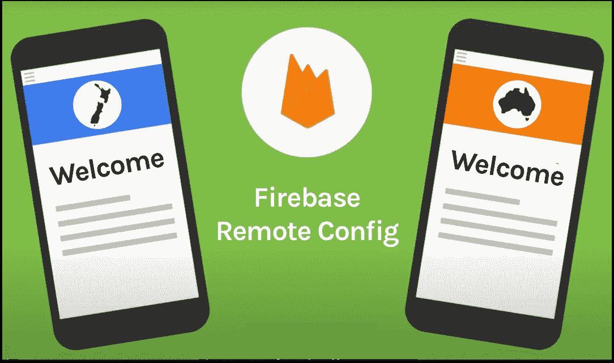
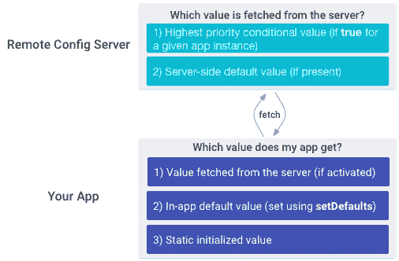
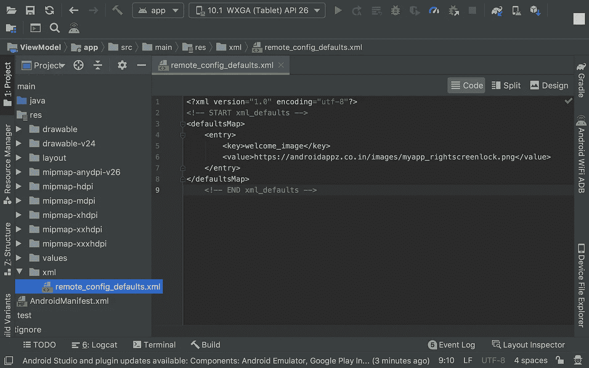
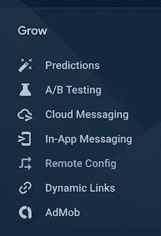
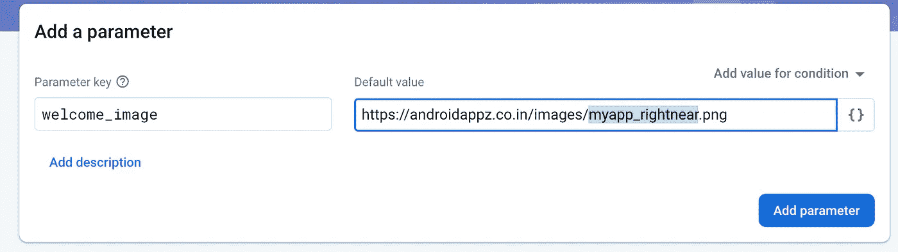
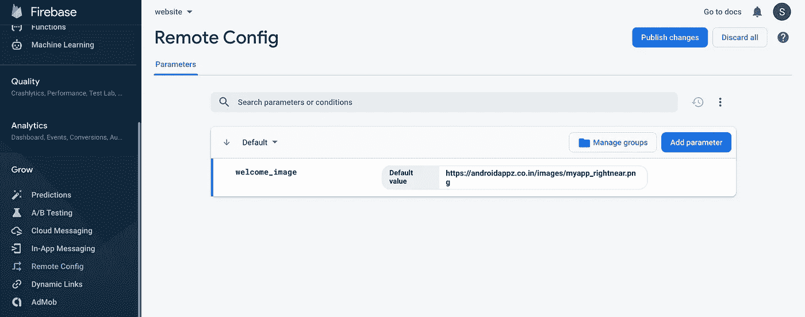
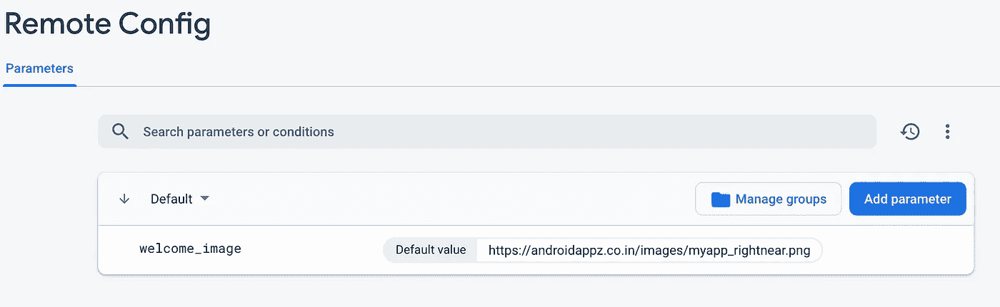
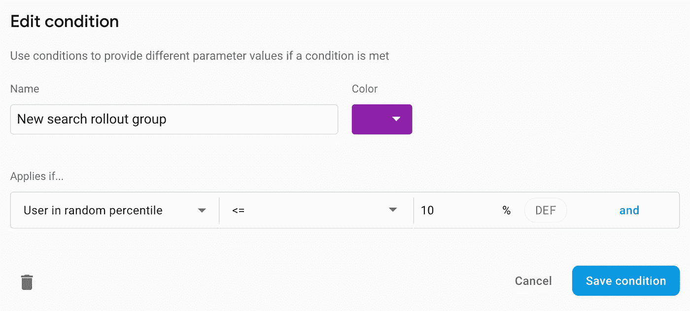

# 探索 Firebase 远程配置

> 原文：<https://betterprogramming.pub/exploring-firebase-remote-config-51f9cf88a8d0>

## 基于存储在 Firebase 中的远程配置更改应用程序的行为



# 介绍

[Firebase](https://firebase.google.com/) 是一个移动和网络应用开发平台，由 Firebase，Inc .于 2011 年开发，后于 2014 年被谷歌收购。截至 2020 年 3 月，Firebase 平台拥有 19 款产品，被超过 150 万个 app 使用。如今，Firebase 对于 Android 开发者来说已经变得非常必要。

谷歌的 Firebase 有很多功能可以帮助构建更好的应用程序——通过监控和提高应用程序质量等。

它在一个屋檐下有许多功能，如远程配置、崩溃分析、分析、云消息等。

Firebase 的每一个元素都非常容易学习，也非常重要。对于想要托管自己的网站以展示其产品组合或其他任何东西的小开发人员来说， [Firebase 托管](https://firebase.google.com/products/hosting) 是一种功能，通过它，您可以在遵循几个步骤后的几分钟内轻松托管一个网站，并且最初是免费的。看看我两年前在 Firebase 上主持的[作品集](https://androidappz.co.in/)。

现在让我们深入了解一下*远程配置的概念。*

# 我们为什么需要它？

Firebase Remote Config 是一项云服务，我们可以通过它改变我们应用程序的行为和外观，而无需发布应用程序更新，没有任何成本，并且每日活跃用户数量不限。它也被推荐用于应用程序更新检查的使用。

在使用远程配置时，我们创建应用内默认值来控制应用的行为和外观。稍后，我们可以使用 Firebase 控制台来更新这些值，并使用远程 Config REST API 来覆盖所有应用程序用户或部分用户的应用程序内默认值。

简单来说，在服务器端，我们可以维护所需值的键值对，而在客户端，当我们处理 Rest APIs 时，我们可以获取这些值，并使用它们来更新应用程序或更改应用程序的外观或行为。

我们的应用程序控制何时应用更新，它可以频繁地检查更新并应用它们，对性能的影响可以忽略不计。

# 它是如何工作的？

远程配置包括一个客户端库，可以处理重要的任务，如获取参数值并缓存它们，同时还可以让我们控制何时激活或获取新值，以便它们影响我们应用程序的用户体验。这让我们可以通过控制任何更改的时间来保护我们的应用体验。

远程配置客户端库`get`方法为参数值提供了单一的访问点。我们的应用程序使用与获取应用程序内默认值相同的逻辑来获取服务器端值，因此我们可以向应用程序添加远程配置功能，而无需编写大量代码。

要覆盖应用程序内的默认值，可以使用 Firebase 控制台或远程配置后端 API 来创建与应用程序中使用的参数同名的参数。

对于每个参数，您可以设置一个服务器端默认值来覆盖应用程序内默认值，也可以创建条件值来覆盖满足特定条件的应用程序实例的应用程序内默认值。下图显示了参数值在远程配置后端和我们的应用程序中的优先级:



# 如何使用它

需要遵循四个简单的步骤:

*   添加必需的**依赖项**
*   **在定义我们需求的应用内设置默认参数值**
*   **添加和更新**服务器端默认和条件参数值
*   添加逻辑到**获取、激活并获取参数值**

让我们通过一个用例来更好地理解这一点，比如更改欢迎屏幕图像。假设有一个应用程序在闪屏上显示一个图像，几天后，我想改变那个图像。在这里，我不需要发布应用程序更新。让我们看看如何使用远程配置来实现这一点。

# 履行

## **第一步**

如果你还没有，[将 Firebase 添加到你的 Android 项目中](https://firebase.google.com/docs/android/setup)。

然后让我们在应用程序级`build.gradle` ( `app/build.gradle`)中添加远程配置依赖。

```
implementation 'com.google.firebase:firebase-config-ktx:19.1.4'
implementation 'com.google.firebase:firebase-analytics-ktx:17.4.3'
```

对于远程配置，Google Analytics 需要将应用实例的[有条件定向到用户属性、受众和 Firebase 预测。确保在你的项目中启用谷歌分析。](https://firebase.google.com/docs/remote-config/parameters#conditions_rules_and_conditional_values)

## **第二步**

设置应用内默认参数值。我们可以在远程配置对象中设置应用程序内的默认参数值，这样我们的应用程序在连接到远程配置后端之前就可以正常运行，因此如果在后端没有设置默认值，默认值也是可用的。

1.  使用存储在应用程序的`res/xml`文件夹中的`Map`对象或[XML 资源文件](https://developer.android.com/guide/topics/resources/providing-resources.html)定义一组参数名称和默认参数值。远程配置快速启动示例应用程序使用一个 [XML 文件](https://github.com/firebase/quickstart-android/blob/master/config/app/src/main/res/xml/remote_config_defaults.xml)来定义默认的参数名称和值。
2.  使用`[setDefaultsAsync(int)](https://firebase.google.com/docs/reference/android/com/google/firebase/remoteconfig/FirebaseRemoteConfig#setDefaultsAsync(int))`将这些值添加到`remoteConfig`对象中，如图所示:

```
val remoteConfig = Firebase.remoteConfig
remoteConfig.setDefaultsAsync(R.xml.remote_config_defaults)
```

在我们的例子中，右击`res` 文件夹，如果不存在就添加`xml`文件夹。然后，添加一个属性名为`welcome_image`的 XML 文件。



这里，根据需求，我们可以添加任意数量的参数。

## **第三步**

在远程配置后端设置参数值。现在是时候添加和更新我们的价值观了。从 [Firebase 控制台](https://console.firebase.google.com/)中，打开您的项目，然后从左侧菜单的增长部分中选择远程配置。



我们必须填写“参数键”和“默认值”最后，不要忘记点击“发布更改”以使我们的更改生效。使用与应用内`welcome_image`相同的键添加参数。



接下来，点击“添加参数”你会看到下面的屏幕。点击右上角的“发布更改”按钮，使您的更改生效。



一旦成功添加，它将如下所示:



现在我们完成了服务器端的工作。

## 奖金

我们可以添加依赖于平台的参数、参数的格式等。要对现有远程配置参数执行百分比卷展栏，请向参数添加一个新条件，该条件包含“随机百分位数的用户”条件，且%值设置为 10%:



点击"[查看更多关于如何为不同用例添加不同参数的选项，我可以用远程配置做些什么？](https://firebase.google.com/docs/remote-config/use-cases)”

## **第四步:**

从应用程序端，从远程配置中获取最新的值，并更新应用程序的外观。这可以通过使用一个`singleton`类或者在应用程序类中来实现

1.  要从远程配置后端获取参数值，调用`[fetch()](https://firebase.google.com/docs/reference/android/com/google/firebase/remoteconfig/FirebaseRemoteConfig#fetch())`方法。您在后端设置的任何值都被获取并存储在远程配置对象中。
2.  要使获取的参数值对您的应用程序可用，请调用`[activate()](https://firebase.google.com/docs/reference/android/com/google/firebase/remoteconfig/FirebaseRemoteConfig#activate())`方法。
3.  如果您想在一次调用中获取并激活值，您可以使用一个`fetchAndActivate()`请求从远程配置后端获取值，并使它们对应用程序可用:

将来，如果我们想更改欢迎屏幕上的图像，我们只需更改 Firebase 控制台中的 URL。你还可以做更多的事情，所以在 [Firebase](https://firebase.google.com/) 网站上查看事情的完整列表。

# 参考

*   [“Android 远程配置入门](https://www.youtube.com/watch?v=XbNcQqoi_S8&feature=emb_logo)”通过 Firecasts
*   [“Android 上的 Firebase 远程配置入门”](https://firebase.google.com/docs/remote-config/use-config-android)通过 Firebase 文档