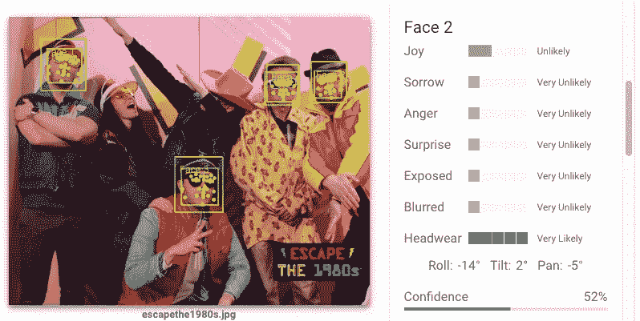
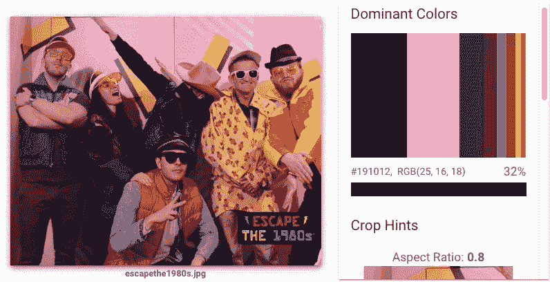
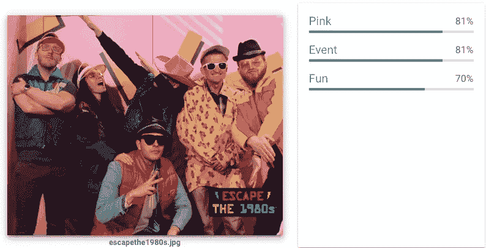
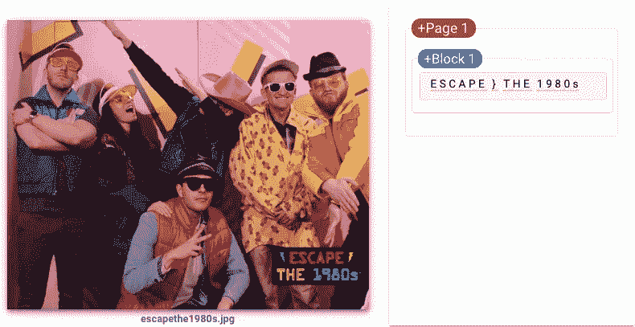
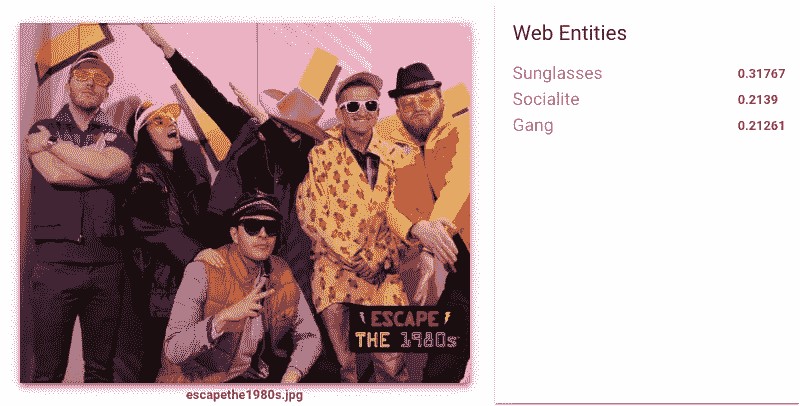
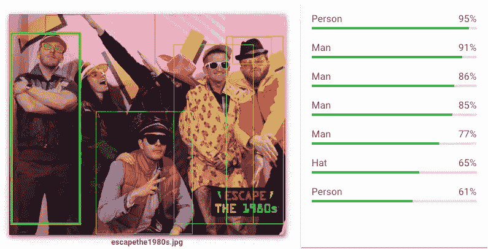
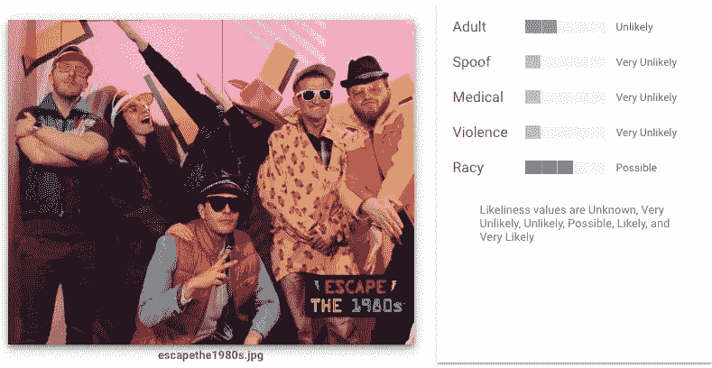
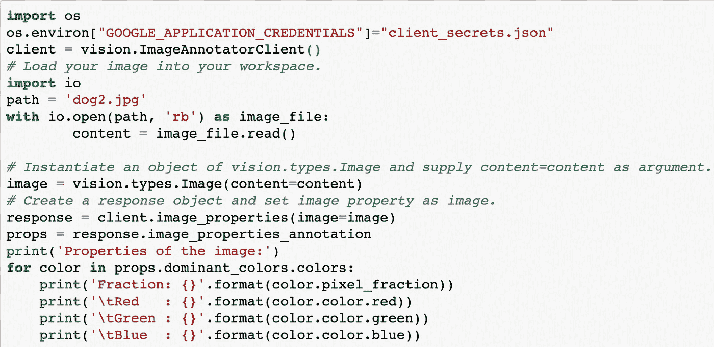
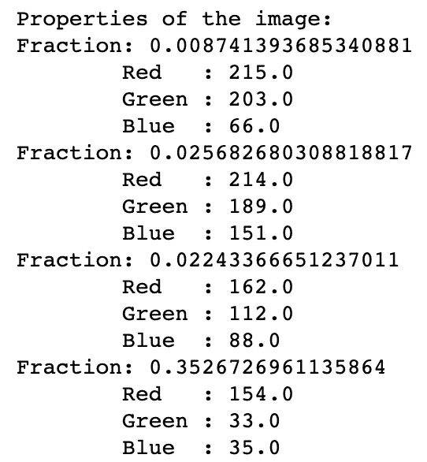
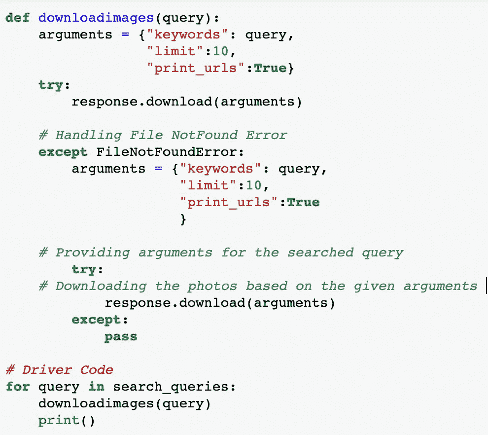

# 使用 Python 探索 Google Cloud Vision API 和特性演示

> 原文：<https://betterprogramming.pub/exploring-google-cloud-vision-api-and-feature-demonstration-with-python-1f02e1dbdfd3>

## 赋予无限的应用可能性以生命…

[Google Cloud Vision API](https://cloud.google.com/vision/) 是一个非常强大的工具，结合 Python 库，可以赋予无限的应用可能性以生命。

Vision API 是谷歌预先训练的模型，可以检测物体和人脸，执行图像识别、分类、标记以及从图像中提取打印或手写文本。它允许开发人员轻松集成内置功能。

# **谷歌云视觉 API 的特性**

## **1。面部检测**

Vision API 可以对本地图像文件和远程图像 URL 执行功能检测。`DETECT_FACES`和`DETECT_FACES_URI`功能可以在图像中执行多张人脸检测，以及相关的关键人脸属性，如情绪状态和头饰。

## **2。图像属性**

检测图像的一般属性，如主色和适当的裁剪提示。

## **3。检测标签**

Vision API 可以检测和提取图像中各种类别的实体信息。标签可以识别一般对象、位置、活动、动物种类、产品等等。

## **4。光学字符识别**

从图像中检测和提取文本。`TEXT_DETECTION`和`DOCUMENT_TEXT_DETECTION`标注支持 OCR。

## **5。网页检测**

Web 检测检测对图像的 web 引用。在 web 上搜索最佳猜测标签和具有完全和部分匹配图像的页面。

## 6。检测多个物体

云视觉 API 可以使用*对象定位—* 模块检测和提取图像中的多个对象，该模块可以识别关于对象、对象位置以及包含对象的图像区域的矩形边界的信息。

## 7。检测不良内容(安全搜索)

*   检测图像中的露骨内容，如成人内容或暴力内容。该特性使用五个类别(`adult`、`spoof`、`medical`、`violence`和`racy`，并返回每个类别出现在给定图像中的可能性。

# **Python 的 Vision API 客户端库**

用`!pip install google-cloud-vision`安装 Vision API 的 Python 变种，用`from google.cloud import vision`验证安装成功。

## 8.检测图像属性

此功能可让您检测一般图像属性，如主色或裁剪提示。

首先，我们设置 Google 云平台凭证并调用`ImageAnnotatorClient()`，它包含提取图像属性的实用程序。

输出

# 使用 Python 下载谷歌图片

Python 有一个名为`google_images_download`的模块，它提供了一个平台来搜索网页并将符合条件的图片下载到我们的本地文件夹中。

`!pip install google_images_download`

然后我们导入`google_images_download`模块。

TK 是' response = '代码的一部分？我们创建一个`response`对象:`response = google_images_download.googleimagesdownload()`

列出搜索查询:

`search_queries =[‘dogs playing with balloons’,
‘cats playing with yarns’,
‘funny ducks’]`

我们可以通过设置参数属性来创建更详细的搜索。

*   **关键词**是搜索查询。
*   **格式**是图像文件格式。
*   **限制**是要下载的图像数量。
*   **打印 URL**是打印图像文件的 URL。
*   **尺寸**是可以手动指定的图像尺寸(`large`、`medium`、`icon`)。
*   **纵横比**表示要下载的图像的高宽比。(`tall`、`square`、`wide`、`panoramic`)

当我们运行上面的 Python 查询时，它将打印目录中带有搜索查询名称的三个文件夹，每个文件夹将包含相关的图像。

# 摘要

在本教程中，我解释了 Google Cloud Vision API 的属性，演示了 Python 的特性，并在您的目录中为 Google 图片搜索结果创建了本地文件夹。

# 资源 *:*

*   [https://cloud.google.com/vision](https://cloud.google.com/vision)