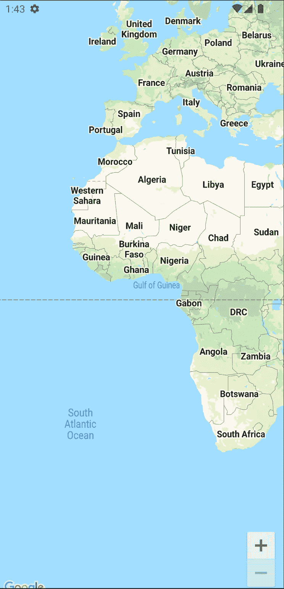
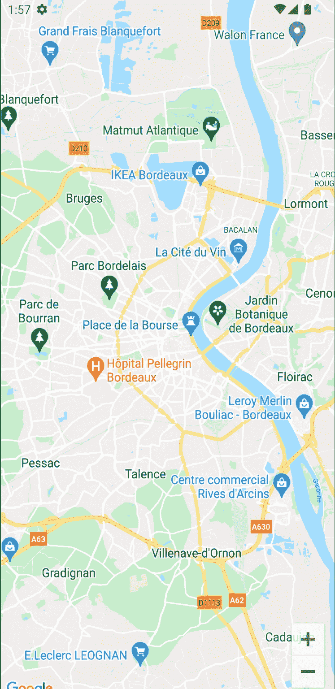
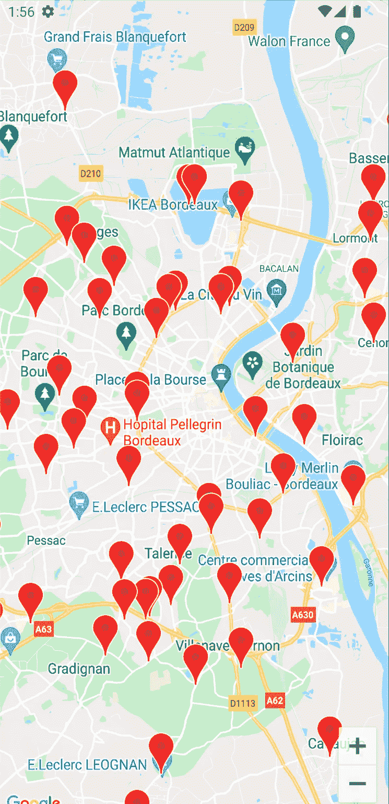
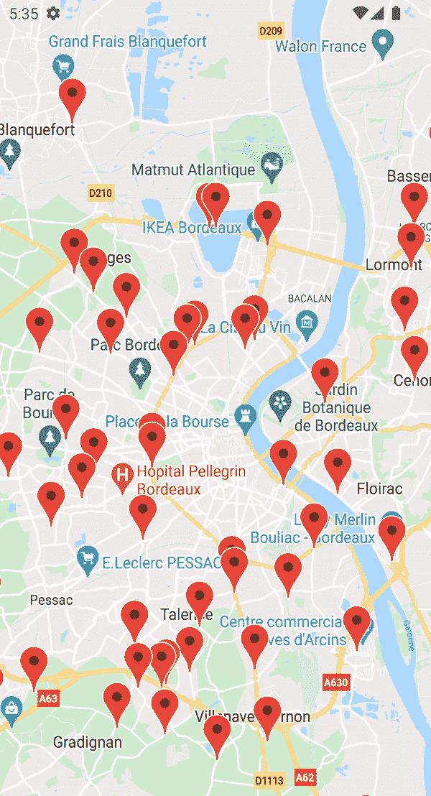
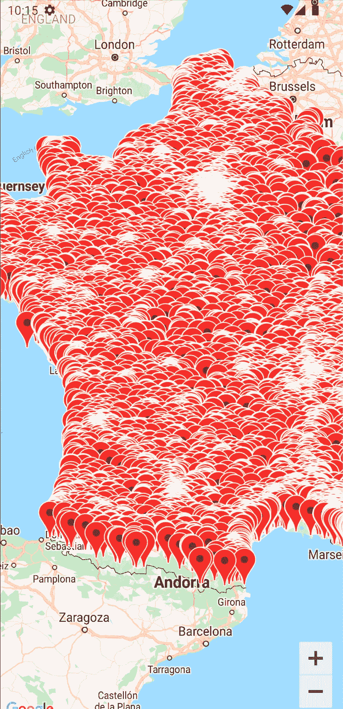

# 探索 Android 版谷歌地图合成库

> 原文：<https://betterprogramming.pub/exploring-google-map-compose-library-for-android-af2a784f9508>

## 介绍基于地图合成应用的新时代


威尔·麦克马汉在 [Unsplash](https://unsplash.com?utm_source=medium&utm_medium=referral) 拍摄的照片

随着[地图构建库](https://github.com/googlemaps/android-maps-compose)的[最近发布](https://cloud.google.com/blog/products/maps-platform/compose-maps-sdk-android-now-available)，这是我用 Jetpack Compose 构建项目的绝佳时机。在这个应用程序中，我从我的服务器上获取一个给定区域周围的兴趣点列表，并在地图上标记它们。

我本可以继续使用基于视图的 GoogleMap，并将它包装在一个 T0 中，以便在 Compose 环境中调用它。尤其是当您需要一些高级特性时，因为 Compose 库仍然受到一些限制(稍后将详细介绍)。

但是我希望你们中的一些人和我一样兴奋地发现这个在 Compose 中为 Compose 制作的新库。

本文将带您了解如何使用动态标记渲染地图。我们还将介绍如何在与地图交互时刷新这些兴趣点(平移、缩放、旋转)。

# 配置您的地图

要在您的移动应用程序中渲染地图，您需要完成本[文档](https://developers.google.com/maps/documentation/android-sdk/cloud-setup)中涉及的这一繁琐部分。总而言之，您必须:

*   创建(或链接)您的 Google Cloud 计费帐户到您的项目。2018 年，谷歌迁移到现收现付计划，要求每个项目预先配置你的支付细节。在本教程中，我们将使用一个静态地图与移动 SDK，所以我们将留在雷达下。但是根据你以后对你的应用程序的计划，有一个潜在的成本需要考虑。更多信息[点击此处](https://mapsplatform.google.com/pricing/)。
*   为项目启用 Map SDK。
*   创建 API 密钥。您可以通过将它链接到您用来签名应用的 SHA-1 证书来限制它，以避免恶意使用。
*   添加所需的依赖项，并将 API 密钥链接到 AndroidManifest 文件。

一旦你完成了以上步骤，有趣的部分就开始了。

# 渲染地图

该库公开了一个`GoogleMap` Composable 作为渲染地图的入口点。多个可选参数可让您自定义地图体验。

如果你不提供任何论据，你会看到一个以赤道和本初子午线为中心的世界地图。



来自 lat/lng 0 的世界地图

如果您查看构造函数的详细信息，`GoogleMap`采用了一个默认位置为纬度和经度 0 的`CameraPositionState`。

我们希望将我们的地图定位在一个特定的位置——或者您当前的位置，但我不会在本文中涉及它。

该地图由一个单一的事实来源驱动:摄像机的状态`CameraPositionState`。每当您与地图交互时，状态都会更新并发生重组。

举个例子，我会把镜头对准波尔多🍷🥖🇫🇷.我们将使用`rememberCameraPositionState`函数记住这些坐标，并将它们传递给`GoogleMap` Composable。在这里，我任意将缩放级别设置为 12，以俯瞰整个波尔多地区。

当我们运行应用程序时，我们会得到以下结果:



波尔多地区

这就是使用地图合成显示地图所需的全部内容！印象深刻不是吗？现在，展示一些兴趣点会很棒。

# 显示周界内的兴趣点

`GoogleMap` Composable 接受一个`content` lambda 作为它的最后一个参数，让您在地图上进行绘制。为此，我们想看看`Marker`可组合。它接受一个`MarkerState`——一个`LatLng`对象的包装器。

默认情况下，`Marker`将显示经典的红色精确定位。您可以使用它的其他参数对其进行自定义。

出于我的目的，我已经开发了一个 API，它带有一个 route，可以返回某个位置周围的对象列表。它需要三个参数:

*   纬度
*   经度
*   半径(米)

从`CameraPositionState`中，我们可以从地图的摄像头中检索中心位置:

```
val centerLocation = cameraPositionState.position.target
val latitude = centerLocation.latitude
val longitude = centerLocation.longitude
```

我们需要一些帮助来计算半径。诀窍在于将地图给出的缩放级别——从 0(整个地球)到大于 21 的数字——转换成以米为单位的更人性化的半径。如果你想了解更多关于谷歌如何渲染地图的信息，你会发现这篇文章非常有趣。

Google 提供了一个 [maps 实用程序库](https://developers.google.com/maps/documentation/android-sdk/utility)，它通过以地图的一个角(例如左上角)为中心位置来为我们计算这个距离。

```
val topLeftLocation = cameraPositionState.projection?.*visibleRegion*?.farLeft
val radius = SphericalUtil.computeDistanceBetween(topLeftLocation, centerLocation)
```

您需要准备好地图来检索上述值(否则投影将是`null`)。请求它们的一个好地方是在λ内。在这里，我将要求我的视图模型检索计算半径内的 poi 位置。

最后，我遍历标记坐标，生成所有的`Marker`组件。

为了模拟这种情况，您可以创建一组坐标，并将其赋予您的`GoogleMap` Composable，就像您从 API 中获取它们一样。

下面是我的服务器产生的坐标:



波尔多地区的标记列表

但这只是摄像机所看到的一些 poi 的快照。最终，您会希望在与地图交互时刷新这些兴趣点。

# 与地图互动

地图允许您通过平移、缩放甚至旋转等手势来控制要显示的内容。这些互动必然会改变摄像机看到的东西。因此，您的兴趣点必须相应地改变。

有了 Map Compose，你将再次依赖于你唯一的真理来源:T4。它有一个属性叫做`isMoving`，地图一移动就会变成`true`。当相机空闲时，它返回到`false`。

您可能想简单地将您的获取方法包装在一个 if 条件中，如下所示:

虽然这样做可行，但是会给服务器带来过多的请求！

这是由于重组工作的性质。例如，如果您平移地图，相机的中心位置将会改变。随着地图的移动，您将使用新观察到的中心位置刷新您的兴趣点。提取的 poi 可能会不同，所以您的状态将会改变，导致重组。

这意味着您将再次遇到该条件并刷新您的 poi，直到您的状态停止变化——这可能会导致大量的请求！

相反，您应该将这种交互视为副作用[并相应地包装它。因为您想在`isMoving`状态改变时触发这样的效果，所以您可以使用`LaunchEffect`并将这个值作为它的键传递。最后，当地图停止移动时刷新您的兴趣点。](https://developer.android.com/jetpack/compose/side-effects)

我制作了一个简短的视频来说明刷新是如何进行的。即使当我快速投掷地图时——地图会变得模糊直到动画停止——当地图空闲时，兴趣点会显示出来。



平移和缩放地图时刷新兴趣点

这种合成方法的有趣之处在于它背后的性能！由于重组系统，您可以传递兴趣点列表，地图将只显示这些标记。不需要考虑生命周期，也不需要确保您已经正确清除了相机不再显示的先前标记。更不用说代码可读性很强，只需要几行代码。

如果你还在，恭喜你！我们已经介绍了在与地图交互时如何使用地图合成和显示兴趣点的一些基础知识。

尽管这对你们中的一些人来说已经足够了，但是在全面深入本库之前，还有一些事情值得一提。

# 陷阱和限制

有些东西你可能希望有，但还没有准备好地图合成。聚类就是这种情况。

该机制在同一区域内收集一组兴趣点。没有它，你可能最终会有一个塞满了马克笔的地图！



你能在这 10 000 个兴趣点中找出你要找的吗？

不仅你在地图上看不到多少，而且你可以想象当你试图画出所有这些标记时，性能会有多差。

由于上面提到的 util 库中的`ClusterManager`,您可以实现集群。然而，这个管理器需要一个来自视图库的`GoogleMap`——这可能会令人困惑，因为名称匹配，但它不是来自合成库的`GoogleMap`。

所以当我写这几行的时候，地图合成库还不支持聚类。你可以在这里关注未决问题[。](https://github.com/googlemaps/android-maps-compose/issues/44)

同时，你有几个选择:

1.  继续使用以前的 map API，直到支持集群。
2.  将缩放级别限制在一个合理的值。这可以防止渲染无数的兴趣点，就像防止地图滞后一样。但是这不会取代一个好的聚类，因为你的兴趣点密度可能会因地区而异。根据您想要显示的数据，您的用户体验可能会降低。

记住这一点，您就可以开始使用地图合成库了。我确信，一旦它赶上缺失的功能，它将成为地图应用的游戏规则改变者。

同时，为即将发布的版本跟踪他们的 [GitHub 库](https://github.com/googlemaps/android-maps-compose)。享受地图创作的乐趣！