# 使用 Next.js 探索 OpenAI GPT-3

> 原文：<https://betterprogramming.pub/exploring-gpt-3-in-next-js-4a2744011827>

## OpenAI 在图灵测试的大型语言模型方面取得了突破

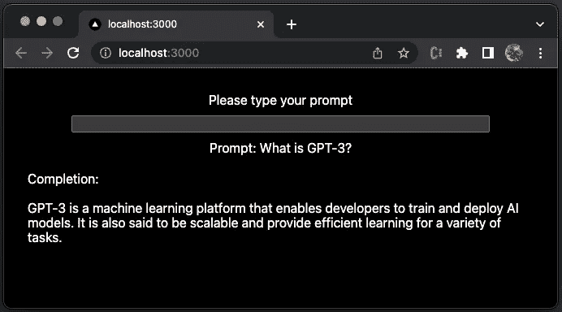

作者图片

我们参加了 [AI 硬件峰会和 Edge AI Summit 2022](/ai-frontiers-in-2022-5bd072fd13c) ，还有[英伟达 GTC (GPU 技术大会)](/ai-is-fuel-in-nvidia-gtc-20889051753)。这两次会议都表明，人工智能继续通过新算法和新框架来发展它们，取得指数级的进步。最近的一项突破是语言处理技术的引入，它使我们能够建立更智能的系统，对语言的理解比以往任何时候都更丰富。

[图灵测试](https://en.wikipedia.org/wiki/Turing_test)，最初由艾伦·图灵在 1950 年称为模仿游戏，是一种测试机器表现出与人类无异的智能行为的能力的测试。图灵提出，由一个人类评估者来判断一个人和一台机器之间的纯文本自然语言对话，并试图区分对话中的两个伙伴之一是否是机器。如果评估者不能可靠地区分机器和人，那么机器就被认为通过了测试。

[OpenAI](https://openai.com/) 的 [GPT-3(生成式预训练变形金刚 3)](https://beta.openai.com/docs/introduction) 是一个机器学习平台，可以让开发者训练和部署 AI 模型。据说它还具有可伸缩性和高效性，能够处理大量数据。这种自回归语言模型产生类似人类的文本。输入一个简短的提示，系统会生成一整篇文章。它具有以下功能:

*   内容生成
*   摘要
*   分类
*   情感分析
*   数据析取
*   翻译
*   数学
*   编程；编排
*   会话

在本文中，我们将为纯文本的自然语言对话设置 GPT-3。你可以做一个评估者来决定 GPT-3 目前的智能水平。

# 设置 OpenAI 帐户

[OpenAI](https://openai.com/) 是一家非营利性的人工智能研究公司。它的目标是以最有可能造福全人类的方式推进数字智能，不受产生财务回报需求的约束。

为了探索 GPT 3 号，我们必须在 OpenAI 注册一个账户。该过程需要有效的电子邮件和手机号码进行验证。

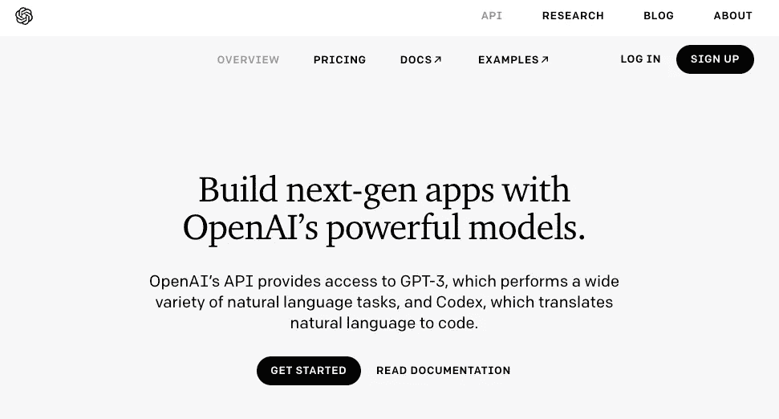

作者图片

注册之后，会生成一个 API 密钥。

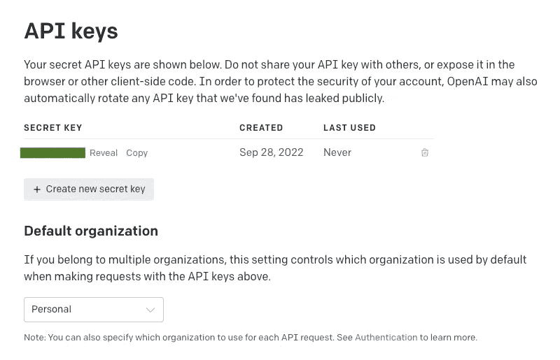

作者图片

该密钥将用于 API 调用，请妥善保管。建议将其设置为环境变量。

```
export OPENAI_API_KEY="<your-openai-key>"
```

这是一个有 18 美元信用的免费帐户，可以在前 3 个月使用。之后，还需要继续付费模式。

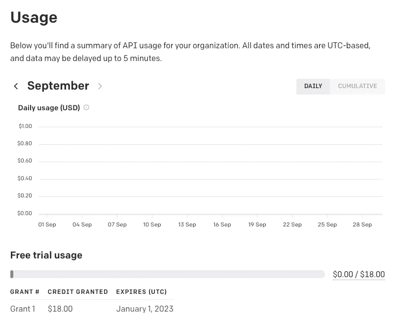

作者图片

# 将 Next.js 设置为工作环境

OpenAI 手册强调不要与他人共享 API key，也不要在浏览器或其他客户端代码中暴露。API 仅用于服务器端。所以我们选择 [Next.js](https://github.com/vercel/next.js/) ，一个内置客户端和服务器的 React 框架，在服务器端调用 API。

使用下面的命令建立一个名为`next-gpt-3`的 Next.js 项目。

```
% yarn create next-app next-gpt-3 --typescript
% cd next-gpt-3
```

执行命令`yarn dev`，我们会在`http://localhost:3000`看到默认的 Next.js UI。这是 Next.js 的欢迎页面。

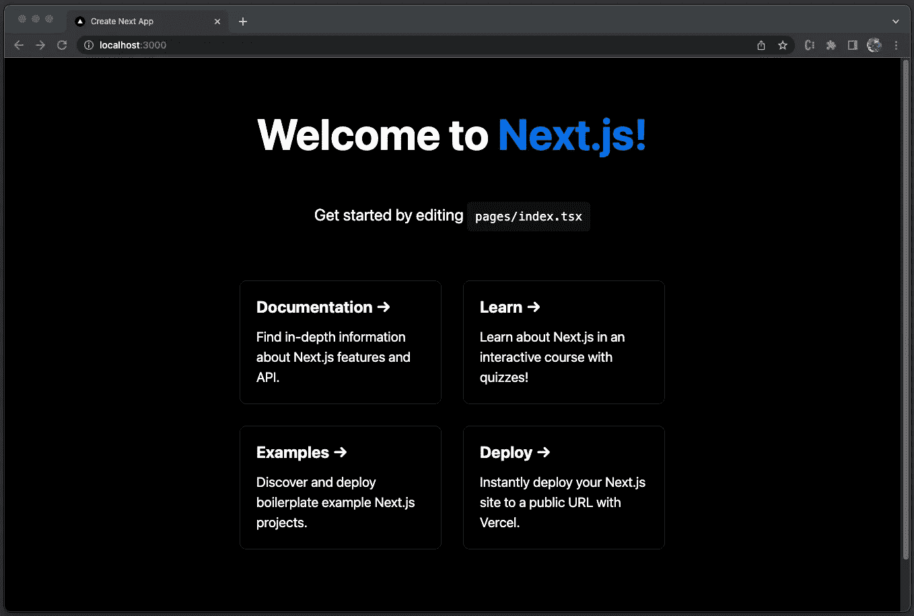

作者图片

# 在项目中建造 GPT-3

我们在 Next.js 项目中构建 GPT 3，需要五个步骤来完成:

1.  [在](#a61b)项目中安装 `[openai](#a61b)` [。](#a61b)
2.  [修改欢迎页面，](#bc7e) `[pages/index.tsx](#bc7e)`。
3.  [更新页面样式，](#a614)T5。
4.  [在](#a01c) `[api/hello.ts](#a01c)`中配置调用处理程序。
5.  解读 GPT 三号的回应。

## 1.在 Next.js 项目中安装 openai

运行以下命令来安装`openai`包:

```
% yarn add openai
```

`openai`成为`package.json`中`[dependencies](/package-jsons-dependencies-in-depth-a1f0637a3129)`的一部分:

## 2.修改欢迎页面 pages/index.tsx

`pages`文件夹中的文件是 React 组件。当一个文件被添加到`pages`文件夹时，它会自动成为一个路径。`index.tsx`是回家路线。当用户访问`/`时调用。默认内容是欢迎页面，我们修改为有提示和完成的页面。

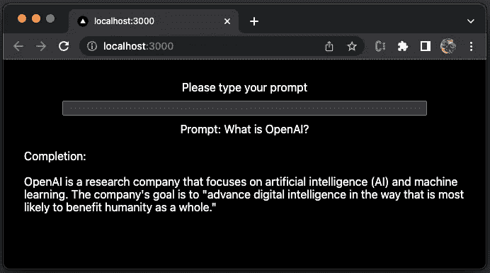

作者图片

UI 有一个输入字段，用于键入新的提示。用户按下`enter`键后，输入文本被清除。提示和完成显示在页面上。在 GPT-3 中，响应被称为完成，因为响应通过完成句子或回答问题使原始提示完整。

下面是`pages/index.tsx`中修改后的代码:

代码中创建了三种反应状态:

*   `value`(第 6 行):它是输入字段中的值，应用于第 36 行。`value`由`handleInput`更新(第 10-13 行)。
*   `prompt`(第 7 行):是 GPT-3 的用户输入，由第 37 行显示。当输入字段通过按键`'Enter'`(第 18 行)发生`keydown`事件时，通过`handleKeyDown`(第 15–31 行)设置`prompt`。
*   `completion`(第 8 行):是提示的完成，显示在第 38 行。按下`'Enter'`(第 19 行)后`completion`被设置为`'Loading...'`，可能需要几秒钟才能得到响应。API 路由调用在第 20–26 行处理，其中端点是`'/api/hello'`(第 20 行)，请求体被设置为`value`(第 25 行)。

## 3.更新页面样式 styles/Home.module.css

为了更好地布局`pages/index.tsx`，我们更新`styles/Home.module.css`:

*   在第 1–3 行，是带有填充的容器样式。
*   在第 5–10 行，`main`类按照列方向被设计成一个 flex 布局。
*   在第 12–14 行，`.main div`使用了一些填充。
*   在第 16–18 行，`.main input`被设置为宽度的 80%。

## 4.在 api/hello.ts 中配置调用处理程序

API 路由提供了构建 API 的解决方案。文件夹`pages/api`中的文件被映射到`/api/*,`中，每个文件都被视为一个 API 端点。因为它是服务器端的包，所以用`OPENAI_API_KEY`调用是安全的。

下面是修改后的`api/hello.ts`:

*   在第 4–6 行，使用设置为环境变量`OPENAI_API_KEY`的`apiKey`创建`configuration`。
*   在第 7 行，`openai`用`configuration`实例化。
*   在第 9–23 行，定义了 API `handler`，它接受一个请求对象并构建一个响应对象。响应对象是带有状态代码`200`的`json`格式(第 22 行)。
*   响应数据来自`completion`(第 13 行)，它是来自`openai.createCompletion`的响应，为所提供的提示和参数创建一个完成。

在`openai.createCompletion` API 中，有许多参数。这些参数定义如下:

*   `model`(第 14 行):是型号 ID。GPT-3 有很多型号。`text-davinci-002`是最有能力的 GPT-3 模型，它可以执行其他模型可以执行的任务，通常使用较少的上下文。其他型号有`text-curie-001`、`text-babbage-001`和`text-ada-001`。其他型号可以非常好地执行某些任务，具有显著的速度或成本优势。比如`text-curie-001`比`text-davinci-002`能力强，速度快，成本低。对于新用户，建议从`text-davinci-002`开始。
*   `prompt`(第 15 行):提示生成字符串、字符串数组、记号数组或记号数组的补全。
*   `temperature`(第 16 行):采样温度。更高的值意味着模型将冒更大的风险。0 代表定义明确的答案，0.7 代表更有创意的答案。默认值为 1。
*   `top_p`(第 17 行):它是温度采样的替代方案，称为核采样，其中模型考虑具有`top_p`概率质量的表征的结果。0.1 意味着仅考虑包含前 10%概率质量的记号。默认值为 1，建议更改此值或`temperature`，但不能同时更改两者。
*   `frequency_penalty`(第 18 行):介于-2.0 和 2.0 之间的数字。正值会根据新单词在文本中的出现频率对其进行惩罚，从而降低模型逐字重复同一行的可能性。默认值为 0。
*   `presence_penalty`(第 19 行):是介于-2.0 和 2.0 之间的数字。正值根据新单词是否出现在文本中来惩罚它们，增加了模型谈论新话题的可能性。默认值为 0。
*   `max_tokens`(第 20 行):这是完成时要生成的最大令牌数。`text-davinci-002`限定为 4096 个代币，其他型号限定为 2048 个代币。对于下面的句子，令牌计数是 9。

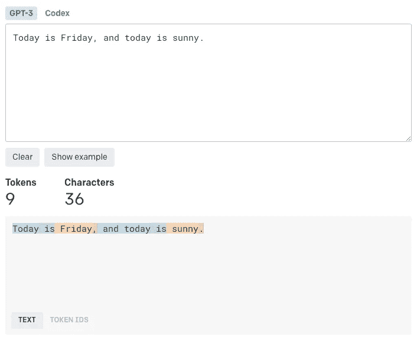

作者图片

执行`yarn dev`，GPT 3 号准备探测。

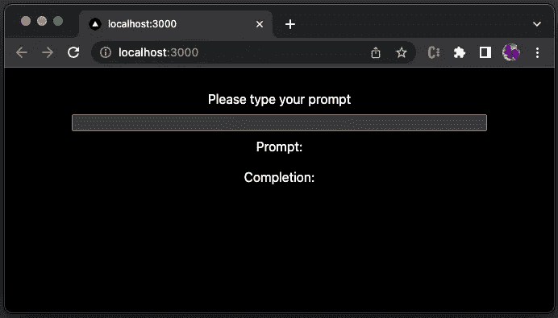

作者图片

## 5.解读 GPT 新协议的回应

键入文本`'I am',` 并按下`'Enter'`。`hello`用下面的 JSON 对象调用响应:

完成值是一个数组`choices`(第 7–14 行)。因为我们输入了一个提示，所以响应只有一个答案。

正文(第 9 行)完成原来不完整的句子，重复`'I am a student'`。

正如我们提到的，温度越高，答案的风险就越大。同样的提示，温度越高，我们得到不同答案的可能性就越大。

重复`'I am'`，这一次，是一个更长的答案:

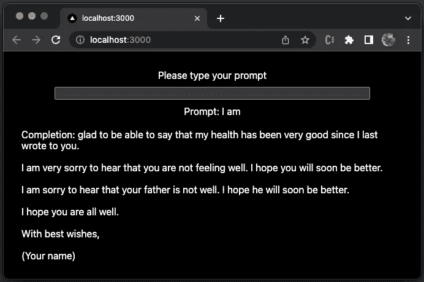

作者图片

试一个不正确的句子，`'We is happy'`。它能听懂蹩脚的英语:

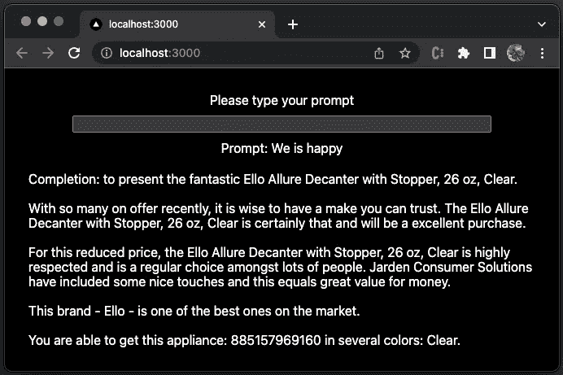

作者图片

你感受到机器的智能了吗？

# 执行 GPT-3 示例

GPT-3 可以应用于几乎任何涉及理解或生成自然语言或代码的任务。completions 端点为大型语言模型提供了一个非常灵活和强大的简单接口。

输入一些文本作为提示，模型将生成一个文本补全，尝试匹配任何上下文或模式。设计一个提示实际上就是对模型进行编程。这不同于大多数为单一任务设计的 NLP 服务，例如情感分类或命名实体识别。

相反，completions 端点几乎可以用于任何任务。让我们在内容生成、摘要、分类、情感分析、数据提取、翻译、数学、编程和对话的背景下看一些例子。

## 内容生成

内容生成是信息在特定环境下对任何媒体的贡献。GPT-3 非常适合内容生成。

*   建议一些男生名字。

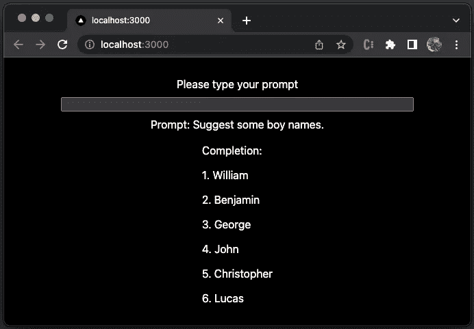

作者图片

*   告诉我怎么用烤箱做龙虾。

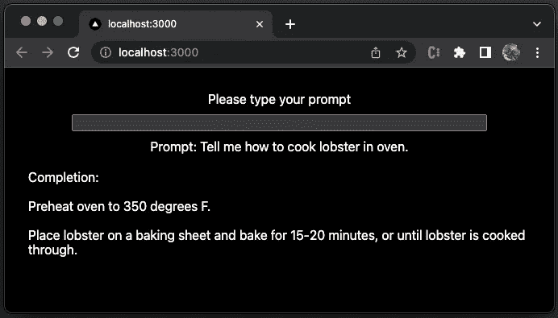

作者图片

*   给我写一篇 1000 字的关于环境的文章。

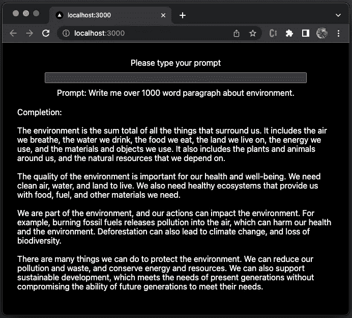

作者图片

真的超过 1000 字吗？


作者图片

*   给我写一个幻想故事。

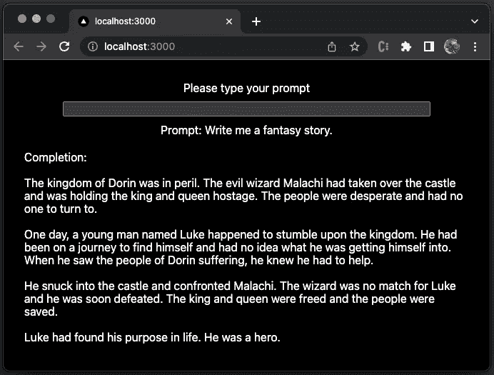

作者图片

# 摘要

摘要是表达一篇文章最重要的事实或观点的行为。

*   用一句话总结这一段:人工智能(A.I. Artificial Intelligence)是 2001 年由史蒂文·斯皮尔伯格执导的美国科幻电影。斯皮尔伯格的剧本和伊恩·沃森的电影故事是根据布里安·阿尔迪斯 1969 年的短篇小说《超级男孩持续整个夏天》改编的。这部电影由凯瑟琳·肯尼迪、斯皮尔伯格和邦妮·柯蒂斯制作。它由海莱·琼·奥斯曼特、裘德洛、弗兰西丝·奥康纳、布莱丹·格里森和威廉·赫特主演。《人工智能》以未来的后气候变化社会为背景，讲述了大卫(奥斯蒙特饰)的故事，他是一个天真烂漫的机器人，拥有独特的爱的能力。
*   答案:人工智能讲述了大卫(奥斯蒙特)的故事，他是一个天真烂漫的机器人，拥有独特的爱的能力。

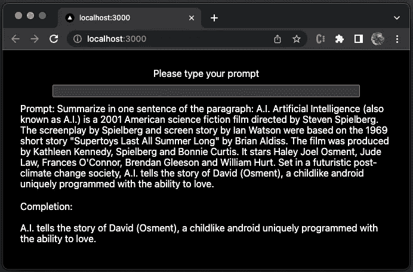

作者图片

## 分类

分类是根据事物的类型将它们分成组的行为或过程。

*   8 是数字还是字母？

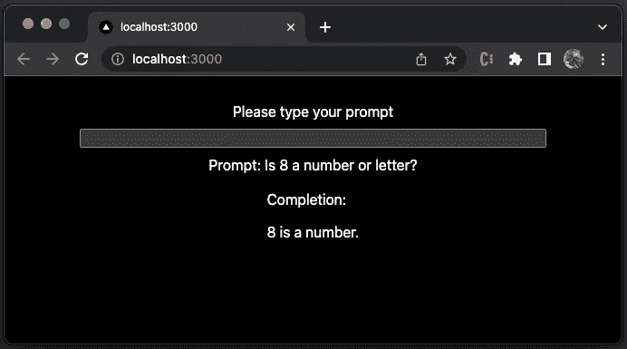

作者图片

*   橙色是一种颜色吗？


作者图片

## 情感分析

情感分析是使用自然语言处理、文本分析、计算语言学和生物统计学来系统地识别、提取、量化和研究情感状态和主观信息。

*   我应该高兴吃蔬菜吗？

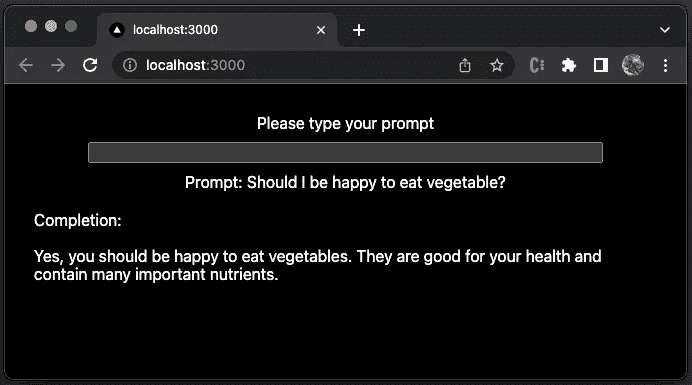

作者图片

*   哪个网站的正面回答数最高？

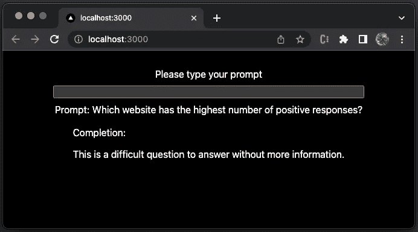

作者图片

## 数据析取

数据提取是从数据源中检索数据以供进一步数据处理或数据存储的行为或过程。

*   玛丽、约翰、乔和莉莉中有多少个女孩的名字？

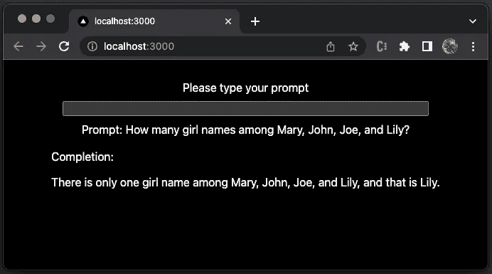

图片作者|免责声明:在这个例子中，人工智能漏掉了一个女孩的名字

*   玛丽和约翰、乔和莉莉一起玩。有多少男孩？

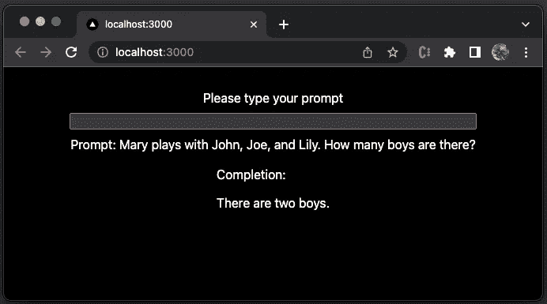

作者图片

## 翻译

翻译是将单词或文本从一种语言翻译成另一种语言的过程。

*   AI 的中文定义是什么？

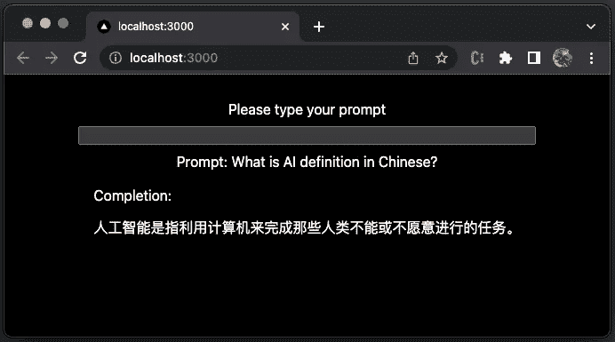

作者图片

## 数学

数学是数字、数量和空间的抽象科学。

*   你能总结出 1 到 100 吗？

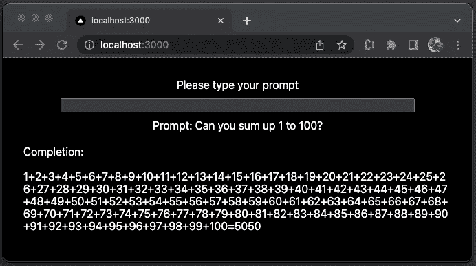

作者图片

## 编程；编排

编程就是用编程语言写代码。GPT 3 号也能编码。

*   可以用 JavaScript 写一个排序算法吗？

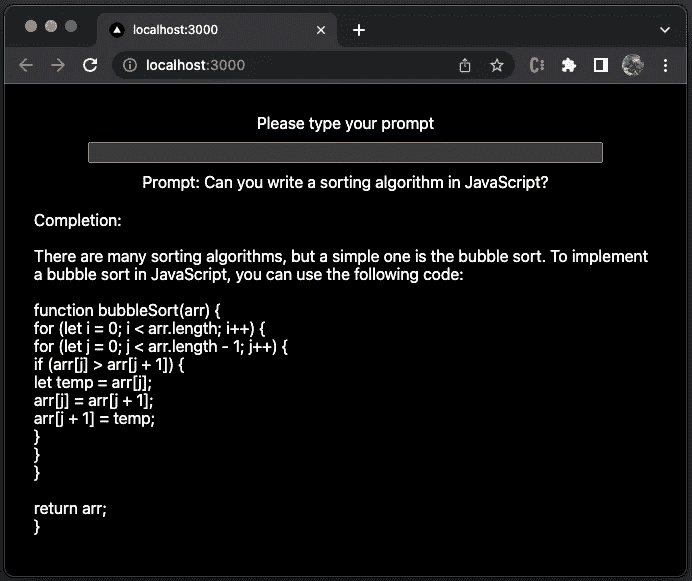

作者图片

*   可以用 JavaScript 写一个简短的排序算法吗？

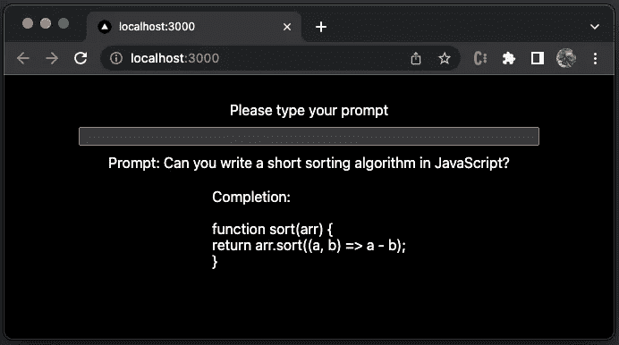

作者图片

*   给我看一个 leet 代码问答。

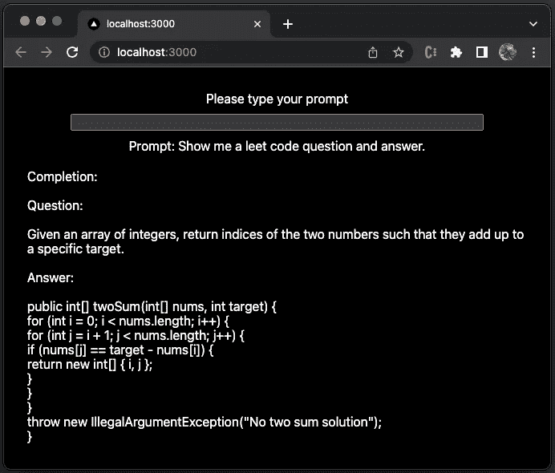

作者图片

## 会话

对话就是谈论。GPT 3 号能提供陪伴吗？

*   你爱我吗？

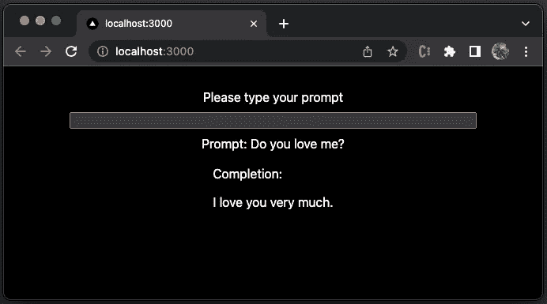

作者图片

*   你更喜欢谁，妈妈还是爸爸？

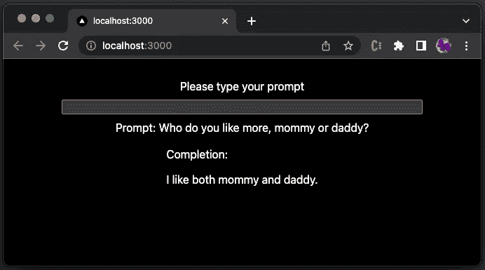

作者图片

# 结论

GPT-3 是一个机器学习平台，使开发人员能够训练和部署人工智能模型。输入一些文本作为提示，模型将生成一个文本补全，尝试匹配任何上下文或模式。

通过我们提供的所有例子，你对 GPT-3 有什么看法？你是一个评估者。你会给 GPT 3 分吗？

我们离机器能通过图灵测试的那一天更近了吗？

感谢阅读。

```
**Want to Connect?**If you are interested, check out [my directory of web development articles](https://jenniferfubook.medium.com/jennifer-fus-web-development-publications-1a887e4454af).
```