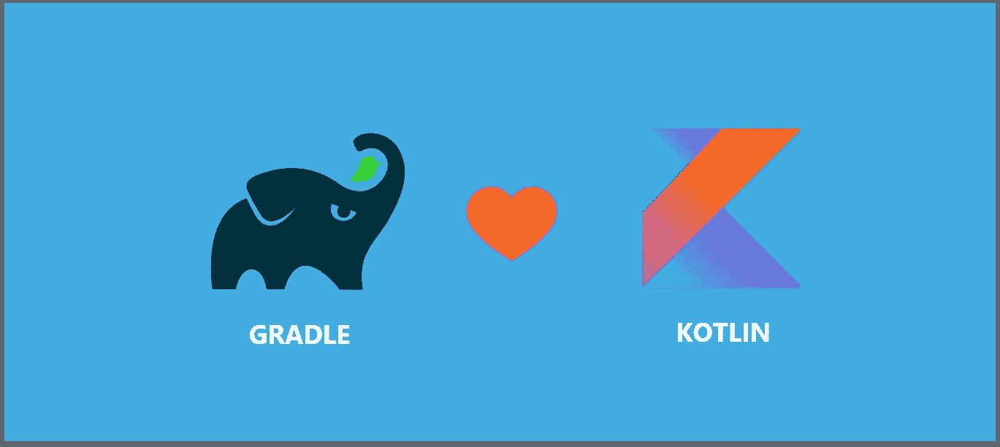

# 探索 Kotlin DSL

> 原文：<https://betterprogramming.pub/exploring-kotlin-dsl-4ab67ed13062>

## 将构建脚本从 Groovy 迁移到 Kotlin DSL

图片来源:作者

# 这篇文章的要点

在本文中，我将分享我在一个项目中将`build.gradle`文件从 [Groovy](https://github.com/GroovyAndroid) 转换为 [Kotlin](https://kotlinlang.org/) DSL 的过程。除此之外，我将分享一些我一路走来学到的细节。

# 什么是 Kotlin DSL？

DSL 代表*特定领域语言*。它遵循声明性代码，而不是命令性代码，以尽量减少样板代码。

> 特定领域语言(DSL)是一种专用于特定应用领域的计算机语言。这与通用语言(GPL)形成对比，后者可广泛应用于各个领域。”— [维基百科](https://en.wikipedia.org/wiki/Domain-specific_language)

Kotlin 是一种通用语言(GPL)，已经成为开发 Android 应用程序的强大工具。像带有接收器块的中缀和 lambda 函数这样的特性使得 Kotlin 非常适合特定领域语言。

# 为什么要用 Kotlin DSL？

一般来说，DSL 语言专注于应用程序的特定部分，而像 Kotlin 和 Java 这样的 GPL 语言可以用于多个部分。因为它是建立在核心语言(Kotlin)之上的，Kotlin DSL 没有自己的语法；相反，它遵循父语言的特征。

如果我们用 Kotlin DSL 而不是 Groovy 来编写构建脚本，我们几乎享受不到什么好处。

*   编译时错误
*   代码导航
*   自动完成
*   增强的 IDE 编辑体验(继承自 Kotlin)
*   在整个应用程序中使用相同语言的一致性
*   最重要的是，你会对你写的东西有一个概念

默认情况下，Android 项目使用 Groovy 语言构建脚本。如果你已经做了一段时间的 Android 开发人员，我相信你会面临主要的困难，比如 IDE 支持差、性能问题、运行时错误等等。通过使用 Kotlin DSL 脚本，您不仅可以克服这些棘手问题，还可以了解您正在编写的内容。

# 移民

说够了，让我们开始编码吧。

在开始迁移之前，我们可以盲目地做一些标准的事情:

1.  验证[版本是否大于 5。](https://gradle.org/)
2.  将`build.gradle`改名为`build.gradle.kts`。
3.  用双引号代替单引号。

## 第一步。转换设置

现在我们可以使用 Kotlin 语法了，让我们从将`settings.gradle`文件重命名为`settings.gradle.kts`开始。看一看:

转换 settings.gradle 文件

## 第二步。转换 build.gradle(项目级别)

同样，我们需要从将`build.gradle`重命名为`build.gradle.kts`开始。我们得从头开始转换了。首先，我们需要改变`kotlin_version`变量。看一看:

简单的科特林变量转换

下一步是转换`repositories`块:

`repositories`是`ScriptHandler`到为脚本依赖配置仓库的扩展功能。

一旦我们完成了存储库，就该处理依赖块了。在 Kotlin DSL 中，`dependencies`是一个`unsafeLazy`变量，用于声明脚本的依赖关系。看一看:

项目级依赖项转换

现在，最后一部分是转换`task clean`块，这非常简单。看一看:

这就是全部——我们已经完成了项目级构建脚本文件的转换。当我们把所有的部分放在一起时，代码看起来如下所示:

构建

## 第三步。转换 build.gradle(应用程序级别)

现在我们已经完成了项目级的`build.gradle`，是时候转换最后一个构建脚本文件，应用级的`build.gradle`。像往常一样，我们需要从将`build.gradle`重命名为`build.gradle.kts`开始。

首先，我们需要转换插件的语法。看一看:

现在该更新`defaultConfig` 块了。看一看:

看到转换后的代码，我们很容易说`compileSdkVersion`、`minSdkVersion`、`targetSdkVersion`是函数。而`versionName`和`versionCode`只是简单的变量。

下一步是转换`buildtypes`。看一看:

最后一步是转换`dependencies`，这类似于我们在项目级构建脚本中所做的。我们需要使用`implementation`或`api`作为函数，并将依赖库作为参数传递。看一看:

现在，当我们把这些片段放在一起时，最终的应用程序级`build.gradle.kts`文件如下所示:

应用级 build.gradle.kts

耶！我们已经完成了迁移。只需点击 Gradle sync 按钮，现在您的项目就包含了 Kotlin DSL 脚本。

# 更多转换

通常，我们从事各种各样的项目，需要使用 lint 选项、数据绑定和其他需要在脚本文件中配置的东西。让我们来看看一些最常用的配置。

## lint 选项

通常，`lintOptions`用于配置行为，比如当`gradle`遇到错误时该做什么，设置默认配置文件等等。让我们看看`lintOptions`的转换:

## 数据绑定

如果我们决定首先在项目中使用数据绑定或视图绑定，我们需要在 app 级`build.gradle.kts`文件中配置它。看一看:

## 源集

定义`sourcesets`在许多配置中都很方便，主要是当项目包含各种产品风格和构建类型时。看一下来源的转换:

# 我的想法

作为一名 Android 开发人员，使用 Kotlin DSL 可以让我轻松地用自己熟悉的语言编写脚本文件。一旦你完成了移植，代码看起来更加清晰易懂。我在构建时间上没有看到任何显著的改进，可能是因为有了额外的时间来确保类型安全。

无论我们使用 Groovy 还是 Kotlin DSL，我们仍然被字符串所困，无法导入库，我认为这不是一个好的做法。但我很高兴 Gradle 团队和社区正在努力使这一过程顺利和安全。

# 奖金

要了解更多关于 Kotlin 的信息，请阅读 Kotlin 高级编程系列的前几部分:

*   [“使用 Kotlin 进行高级编程](https://medium.com/better-programming/advanced-android-programming-with-kotlin-5e40b1be22bb)”
*   [“使用 Kotlin 进行高级编程—第 2 部分](https://medium.com/android-dev-hacks/advanced-android-programming-with-kotlin-part-2-aae2a15258b0)”
*   [“使用 Kotlin 进行高级编程—第 3 部分](https://medium.com/better-programming/advanced-programming-in-kotlin-2e01fbc39134)”
*   [“kot Lin 中的高级 Android 编程—第四部分”](https://medium.com/better-programming/advanced-android-programing-in-kotlin-part-4-187b88fea048)

要了解更多关于 Kotlin 协同例程和 Kotlin 的其他高级特性，请阅读以下文章:

*   [“科特林协程，从基础到高级](https://medium.com/better-programming/kotlin-coroutines-from-basics-to-advanced-ad3eb1421006)
*   [“如何使用 Kotlin 密封类进行状态管理”](https://medium.com/better-programming/how-to-use-kotlin-sealed-classes-for-state-management-c1cfb81abc6a)
*   [“使用新 Kotlin 流进行异步数据加载](https://medium.com/better-programming/asynchronous-data-loading-with-new-kotlin-flow-233f85ae1d8b)”
*   [“探索科特林的收藏和序列”](https://medium.com/better-programming/exploring-collections-and-sequences-in-kotlin-3a324ea08fb9)
*   [“为什么以及如何使用 Kotlin 的原生序列化库](https://medium.com/better-programming/why-and-how-to-use-kotlins-native-serialization-library-c88c0f14f93d)”

# 更新

目前就这些。希望你学到了有用的东西，感谢阅读。