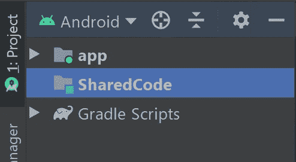
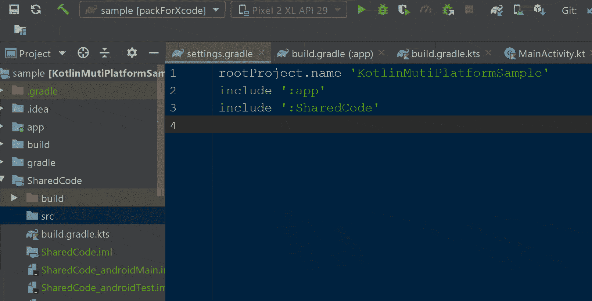
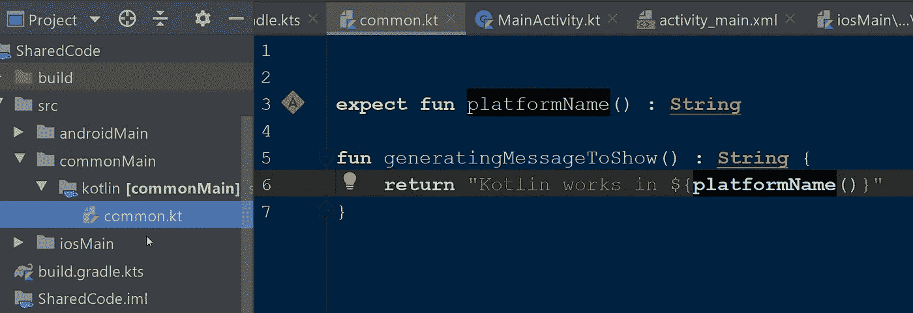
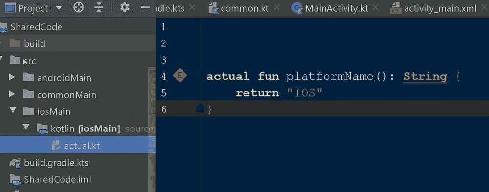

# 探索 Kotlin 多平台(第 1 部分)

> 原文：<https://betterprogramming.pub/exploring-kotlin-multiplatform-part-1-b73f59d61135>

## Kotlin 多平台项目设置和基础


图片来源:作者

# 介绍

Kotlin 让 Android 开发变得更有趣。如果你在网上搜索，你会发现很多 Kotlin 解决 Java 痛点的方法，以及 Kotlin 的特性如何让 Android 开发更有趣。但大多数人都不明白，Kotlin 的功能远不止用于 Android。

正如“ [Open Source For You](https://www.opensourceforu.com/2018/07/kotlin-a-language-for-modern-multi-platform-applications/#:~:text=Kotlin%20is%20a%20multi-platform,use%20the%20LLVM%20compiler%20infrastructure) ”所描述的，Kotlin 是一种简洁、安全、可互操作、工具友好的多平台编程语言。它是一种静态类型的编程语言，运行在 Java 虚拟机上，也可以编译成 JavaScript 源代码，或者可以使用 LLVM 编译器基础设施。

# 为什么是多平台项目？

首先，为什么我们需要实现一个多平台项目？降低开发成本和维护业务逻辑的单一来源很简单。

*单一事实来源*的含义是在中央存储库中维护共享的(业务逻辑)或平台无关的代码。所有支持的平台应用程序都访问它们；这样，我们可以将业务逻辑的关注点与特定于平台的问题分开。

# 为什么选择 Kotlin 多平台项目？

当我们想到多平台开发时，我们通常会想到像 Flutter 或 web 应用程序这样的框架。但是你不能使用这些框架来构建一个原生 UI。我们必须改变整个生态系统，如果你在市场上待了很长时间，这是很难做到的。

这就是 Kotlin 多平台的亮点。通过 KPP (Kotlin 多平台项目),我们可以使用特定于平台的生态系统来开发原生 UI，然后创建一个共享的 Kotlin 多平台库来集成业务逻辑。

你可以开始使用 Kotlin 为任何运行在 JVM、 [Kotlin/JS](https://kotlinlang.org/docs/reference/js-overview.html) flavor for web 和[kot Lin/Native](https://kotlinlang.org/docs/reference/native-overview.html)machine code for IOS 上的平台开发共享库。与其他框架不同，我们可以使用 Kotlin 逐步迁移到多平台结构。

# 概观

本文旨在利用 Kotlin 的代码共享功能，为 Android 和 iOS 创建一个应用程序。为了分享 Android 和 iOS 的代码，我们分别使用 Kotlin/JVM 和 Kotlin/Native。

当我们在 Android 上启动应用程序时，它将分别显示“Kotlin 在 Android 中工作”和“Kotlin 在 Android & IOS 设备中的 IOS 中工作”。

公共代码是`“Kotlin works in ${platformName()}”`，其中`platformName()`是使用`expect`关键字声明的函数。`actual`的实现将特定于平台。

# 项目设置

第一步，创建一个 Android 项目；我们可以使用安卓工作室或者 T21 社区版本。然后我们需要创建`SharedCode`模块，用于为多个平台生成工件。

## 共享代码模块

我们可以通过在`settings.gradle`文件中包含`include ‘: SharedCode’`来构建这个模块。然后重新构建项目或单击同步项目选项。项目更新后，您将在左侧面板中看到一个共享代码模块。



## 工件设置

现在，我们需要创建`SharedCode/build.gradle.kts`文件并包含下面的代码来生成必要的工件。这里的工件是`androidMain`、`commonMain`和`iosMain`。

完成后，点按“同步项目”按钮或重建项目以正确应用更改。

## 创建目录

我们需要创建缺少的目录，如`SharedCode/src/commonMain`、`SharedCode/src/androidMain`和`SharedCode/src/iosMain`，要更好地了解如何创建它们，请参见下面的视频:



# 创建共享模块

我们必须在每个工件目录中创建一个 Kotlin 子目录。然后在`SharedCode/src/commonMain`中，我们需要创建一个名为“common”的 Kotlin 文件。

这个共享文件包括所有跨平台的理想代码。在这种情况下，它包含通过获取预期输入生成的字符串。看一看:



公共文件中的源代码

`expect`是用来告诉 Kotlin 多平台框架每个平台(在这种情况下是 Android 和 iOS)都需要这个函数的关键字。

我们需要在特定于平台的文件中使用`actual`关键字，将它与公共工件的功能进行映射。现在我们来看看 android 和 iOS 文件。看一看:



iosMain 和 androidMain 子目录中的实际函数实现

# 在 Android 项目中共享代码

为了在 Android 项目中保持简单，我们可以在`build.gradle`文件中的 dependency 标签下包含下面一行:

```
**implementation** project(':**SharedCode**')
```

我们现在可以访问通用工件中的`generatingMessageToShow`函数，Android 模块中的`platformName`函数将通过`KotlinJVMTarget`调用。我们只需要在`MainActivity`的`onCreate`方法中包含下面一行。

```
tv_welcome?.text = **generatingMessageToShow**()
```

# 在 IOS 项目中共享代码

首先，我们需要生成以下目标来集成到 iOS 项目中。

*   `iOS arm64 debug` —在调试模式下运行 iOS 设备的二进制文件
*   `iOS arm64 release` —包含在应用程序发布版本中的二进制文件
*   `iOS x64 debug` —iOS 模拟器的二进制文件，使用桌面 Mac CPU

我们可以通过运行我们在 iOS 工件的`build.gradle.kts`中提到的`packForXcodegradle`任务来做到这一点。或者，我们可以通过在控制台中运行以下命令来实现。

```
**./gradlew :SharedCode:packForXcode**
```

我们可以在 Xcode 项目中使用这个工件；你可以在这里找到关于整合它们的详细说明[。一旦你完成了集成，事情就简单多了。](https://play.kotlinlang.org/hands-on/Targeting%20iOS%20and%20Android%20with%20Kotlin%20Multiplatform/06_SettingUpKotlinFramework)

注意:我们只能在 mac OS 中生成 kot Lin/原生 IOS 目标。

# 下一步是什么

既然我们已经完成了各个工件到它们平台的基本设置和集成，在下一部分中，我们将学习如何通过多平台库，如 [Ktor](https://ktor.io/) 和 [Kotlinx.serialization](https://github.com/Kotlin/kotlinx.serialization) ，在公共模块中进行服务调用和解析响应。

# 奖金

要了解更多关于 Kotlin 的信息，请阅读 Kotlin 高级编程系列的前几部分:

*   [“使用 Kotlin 进行高级编程](https://medium.com/better-programming/advanced-android-programming-with-kotlin-5e40b1be22bb)
*   [“使用 Kotlin 进行高级编程—第二部分](https://medium.com/android-dev-hacks/advanced-android-programming-with-kotlin-part-2-aae2a15258b0)”
*   [“用 Kotlin 进行高级编程—第三部分](https://medium.com/better-programming/advanced-programming-in-kotlin-2e01fbc39134)”
*   [“kot Lin 中的高级 Android 编程—第四部分”](https://medium.com/better-programming/advanced-android-programing-in-kotlin-part-4-187b88fea048)

要了解更多关于 Kotlin 协同例程和 Kotlin 的其他高级特性，请阅读以下文章:

*   [“科特林协程，从基础到高级](https://medium.com/better-programming/kotlin-coroutines-from-basics-to-advanced-ad3eb1421006)”
*   [“如何使用 Kotlin 密封类进行状态管理”](https://medium.com/better-programming/how-to-use-kotlin-sealed-classes-for-state-management-c1cfb81abc6a)
*   [“使用新 Kotlin 流程进行异步数据加载](https://medium.com/better-programming/asynchronous-data-loading-with-new-kotlin-flow-233f85ae1d8b)”
*   [“探索 Kotlin 中的集合和序列”](https://medium.com/better-programming/exploring-collections-and-sequences-in-kotlin-3a324ea08fb9)
*   [“学习如何组合科特林流](https://medium.com/@sgkantamani/learn-how-to-combine-kotlin-flows-317849a71d3e)”

要了解 Kotlin 多平台库，请阅读以下文章:

*   "[为什么以及如何使用 Kotlin 的本地序列化库](https://medium.com/better-programming/why-and-how-to-use-kotlins-native-serialization-library-c88c0f14f93d)"
*   [“如何在您的 Android 应用中使用 Ktor”](https://medium.com/better-programming/how-to-use-ktor-in-your-android-app-a99f50cc9444)
*   [“Koin—kot Lin 原生依赖注入库”](https://medium.com/android-dev-hacks/koin-kotlin-native-dependency-injection-library-f1daddc1ef99)

就这些了，希望你能学到一些有用的东西，感谢阅读。