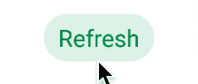
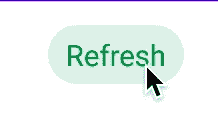

# 探索 Jetpack 合成中的 LaunchedEffect 和 InfiniteTransition

> 原文：<https://betterprogramming.pub/exploring-launchedeffect-and-infinitetransition-in-jetpack-compose-5a82ba948a15>

## 使用 Jetpack Compose 制作动画—第 3 部分


[粘土堤](https://unsplash.com/@claybanks?utm_source=medium&utm_medium=referral)在 [Unsplash](https://unsplash.com?utm_source=medium&utm_medium=referral) 上拍摄的照片

Jetpack Compose 是构建 Android 应用程序 UI 的革命性更新。它利用了声明式 UI 的概念，并带来了用 Kotlin 构建 UI 的乐趣——这是许多 Android 开发人员的梦想。如果您不熟悉 Jetpack Compose，我建议您阅读以下文章:

*   [喷气背包构成组件(第一部分)](/jetpack-compose-components-part-1-a80717dbfb59)
*   [在 Jetpack Compose 中构建 Android 布局](/build-android-layouts-in-jetpack-compose-bda2e0837f5e)

要了解有关 Jetpack Compose 中动画的更多信息，请阅读本动画系列中的以下文章:

*   [“Jetpack 合成—动画注释:1”——探索合成中的动画可见性](/jetpack-compose-animation-notes-1-30f130189159)
*   [“Jetpack Compose—Animation Notes:2”——构建 Fab 菜单，带有 Compose AnimatedVisibility 和 Animatable](https://sgkantamani.medium.com/jetpack-compose-animation-notes-2-aef3428af6a6)
*   “Jetpack Compose-Animation Notes:3”-你现在在这里

话虽如此，我们还是开始吧。

# 介绍

## 目标是什么？

我们正试图实现一个按钮刷新动画，包括无休止的旋转缩放文本和图标。看一看:



## `LaunchedEffect`

`LaunchedEffect`是一个有两个参数的组合函数——key 1 和 block。

1.  `key1` —类型为`Any`，每当该参数传入的值发生变化，就会触发`block`函数。
2.  `block` — Kotlin `suspend`具有自己的协程作用域。每当值`key1`更新时，运行范围被取消并重新启动。当 LaunchedEffect 离开组合时，协程将被取消。

看看函数签名:

```
@Composable
@NonRestartableComposable
@OptIn(InternalComposeApi::class)
fun LaunchedEffect(
    key1: Any?,
    block: suspend CoroutineScope.() -> Unit
)
```

在我们的用例中，我们可以使用`LaunchedEffect`函数在任何状态变化触发的初始合成或重组时执行动画。

## 无限位置

`InfiniteTransition`负责运行子动画。通过使用`rememberInfiniteTransition`，我们可以运行无限的子动画。在我们的例子中，我们可以用它来无限旋转加载图标。

# 按钮状态

让我们创建一个具有文本和图标两种状态的枚举类，在按钮中显示文本或图标。让我们也创建一个扩展函数来返回相反的状态，它可以用来更新用户动作的状态。看一看:

```
enum class ButtonState{
    TEXT, ICON
}fun ButtonState.getOppositeState() : ButtonState = when(this){
    ButtonState.TEXT -> ButtonState.ICON
    ButtonState.ICON -> ButtonState.TEXT
}
```

# 设计刷新按钮

为了设计刷新按钮，我们使用了可组合的`Box`作为根，因为在任何给定的点，只有`Text`或`Icon`会出现。看一下代码:

将以下颜色添加到项目`color.kt`类中:

```
val GreenButton = *Color*(0xFF00914b)
```

看一下输出:



在进入动画部分之前，首先，我们需要消除涟漪效应，因为它不适合我们的自定义动画。我们可以通过在`Modifier`上创建任何扩展并处理`clickable`函数的`indication`和`interactionSource`参数来实现这一点，如下所示:

现在我们可以在根`Box` composable 上使用`clickableNoRipple`函数代替`clickable`。

# 无限旋转

让我们从更简单的动画开始，当按钮的状态变为`ICON`时，我们必须旋转刷新图标。为此，我们必须使用由图标包装的`Modifer`的`rotate`扩展功能。`rotate`以`float`为参数，表示旋转的度数。

这里棘手的部分是计算度数，`rememberInfiniteTransition`是适合这个目的的。让我们创建一个单独的可组合组件来创建和维护这个转换。看一看:

`animateFloat`是`InfiniteTransition`的扩展功能。它有三个参数:

1.  `initialValue` —表示初始度数的浮点值。
2.  `targetValue` —一个浮点值，指示动画结束时的度数。
3.  `animationSpec` —表示动画细节的参数。在我们的例子中是`infiniteRepeatable`，使用`tween`来控制持续时间和重复模式。

如前所述，我们必须将`rotateComposable`与附加到可组合图标框的`Modifier`一起使用。看一看:

看一下输出:


# 使用 LaunchedEffect 缩放动画

先说需要动画的三个方面——文字、图标缩放、文字内容变化。对于缩放部分，我们可以使用`Animatable`和`remember`，对于内容部分，我们可以使用`mutableStateOf`，看看:

```
val scaleText = remember{ *Animatable*(initialValue = 1f) }
val scaleIcon = *remember*{ *Animatable*(initialValue = 0f) }
var displayString by remember { *mutableStateOf*("Refresh")}
```

最初，将显示可组合的`Text`，因此`scaleText`的`initialValue`是`1f`。而`scaleIcon`是`0f`，因为它将被隐藏。

让我们用`refershScalingAnimation`创建一个简单的`Composable`函数，它有两个参数:

1.  `buttonState` —执行各自的缩放动画和内容变化。
2.  `isSelected` — `Boolean`用作`LaunchedEffect`键的参数。

看一看:

现在我们必须使用`scaleText`和`scaleIcon`上的`animateTo`功能来触发各自块中的缩放动画。如果按钮状态是`ICON`，那么我们必须从`scaleText`开始，将`targetValue`作为`0f`，然后将`displayString`更新为空，最后通过`scaleIcon`将图标缩放到`1f`。如果`buttonState`是`TEXT`，我们必须反转动画。看一看:

最后一步是使用`scaleText`和`scaleIcon`，修改器应用于`Text`和`Icon`可组合函数**。**由于我们已经为`LaunchedEffect`动画创建了一个单独的函数，我们必须返回`scaleText`、`scaleIcon`和`displayString`来使用它们各自的可组合函数。看看完整的功能:

现在，让我们从`ButtonRefresh`触发`refershScalingAnimation`，并将`scaleText`、`scaleIcon`和`displayString`应用于各自的可组合函数。看一看:

看一下输出:


# 结论

仅此而已。我们用`LaunchedEffect`和`InfiniteTransition`可组合函数实现了一个定制的刷新按钮动画。请点击此处查看完整代码。在 Jetpack Compose 中，动画是一个有趣的话题，可以为 UI 带来更流畅的自然效果。请继续关注 Jetpack Compose 中关于动画的更多文章。

# 奖金

[](/back-press-handling-in-android-jetpack-compose-42d9ed402d40) [## Android Jetpack Compose 中的反压处理

### 创建一个处理函数来定制你的反压事件

better 编程. pub](/back-press-handling-in-android-jetpack-compose-42d9ed402d40) 

目前就这些。希望你学到了有用的东西。感谢阅读。