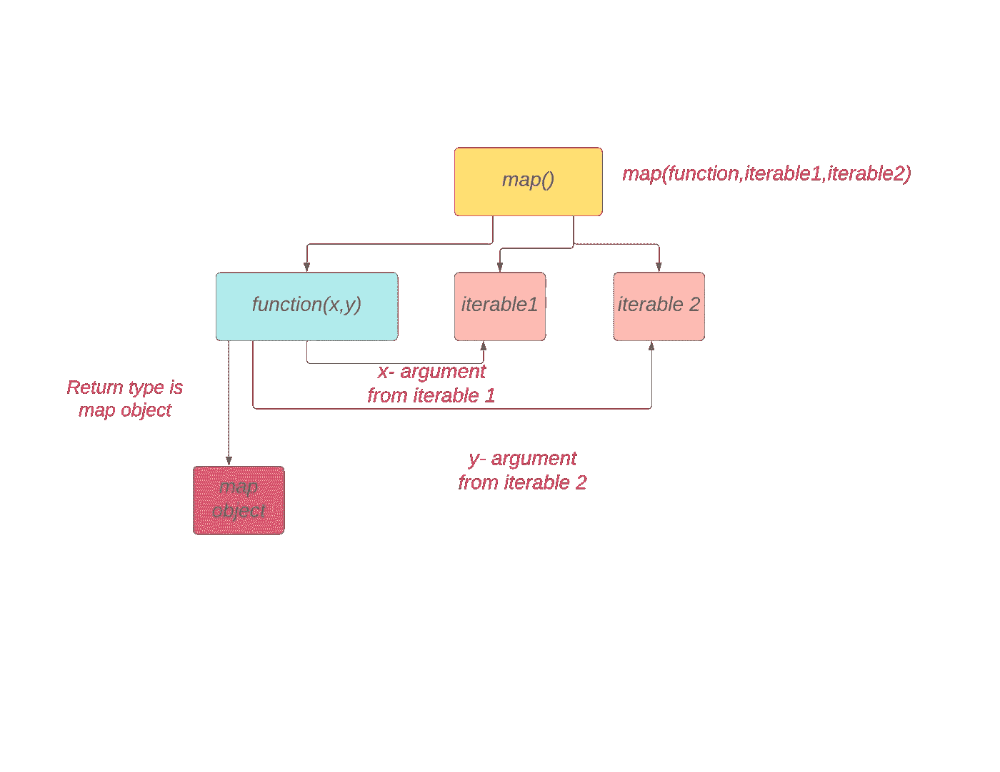
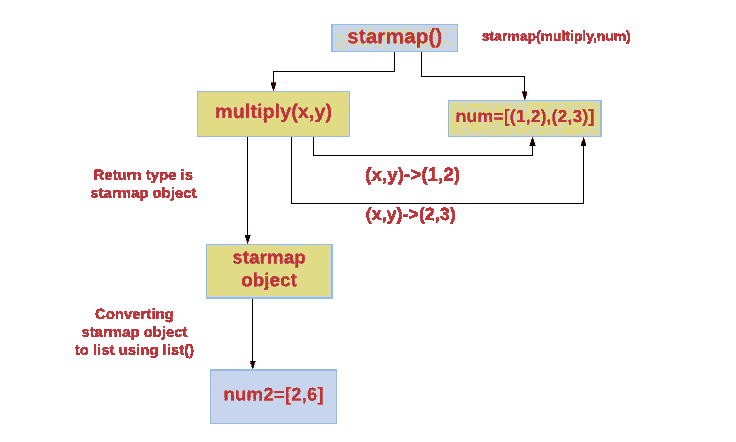

# 探索 Python 中的 Map()与 Starmap()

> 原文：<https://betterprogramming.pub/exploring-map-vs-starmap-in-python-6bcf32f5fa4a>

## 让我们来了解一下不同之处


照片由 [Porapak Apichodilok](https://www.pexels.com/@nurseryart?utm_content=attributionCopyText&utm_medium=referral&utm_source=pexels) 从 [Pexels](https://www.pexels.com/photo/blur-close-up-figure-focus-346696/?utm_content=attributionCopyText&utm_medium=referral&utm_source=pexels) 拍摄。

# 地图

> ”`map(function, iterable, ...)`
> 
> 返回一个迭代器，将函数应用于 iterable 的每一项，产生结果。如果传递了额外的 iterable 参数，该函数必须接受同样多的参数，并并行应用于所有 iterable 中的项。对于多个可迭代对象，当最短的可迭代对象用尽时，迭代器停止。”— [Python 的文档](https://docs.python.org/3/library/functions.html#map)

*   `map()`函数用于将函数应用于 iterable 中的每一项。
*   我们也可以传递多个 iterables，但是提到的函数也应该有那么多参数(例如，两个 iterables 意味着两个参数)。
*   如果给定的多个可迭代对象长度不同，那么当最短的可迭代对象用尽时，`map`迭代器就会停止。
*   返回类型是一个`map`对象。
*   `map`对象是一个迭代器。



作者照片。

我们可以通过以下方式访问`map`对象，它是一个迭代器:

*   我们可以使用`list()`构造函数将 map 对象转换成序列对象，比如 list，使用`tuple()`构造函数转换成 tuple。
*   我们还可以使用一个`for`循环遍历`map`对象。
*   我们也可以使用`next()`函数访问`map`对象中的元素。

## 示例 1:使用 map()将函数应用于一个 iterable 中的所有项

*   `square()`函数被定义为返回数字的平方。
*   在`map`函数中，我们传递了`square()`函数和列表对象。
*   `square()`功能适用于列表对象中的所有项目。
*   返回类型是一个`map`对象。
*   `map`对象是一个迭代器，包含 iterable(列表对象)中所有项目的平方。
*   使用一个`list()`构造函数将`map`对象转换成一个列表。

## 示例 2:使用 map()函数将 lambda 函数应用于一个 iterable 中的所有项

## 示例 3:使用 map()函数将函数应用于两个长度相同的可迭代对象

*   因为给出了两个 iterables，所以函数应该包含两个参数。
*   `multiply(x,y)`函数将从第一个可迭代的`num1`中获取第一个参数`x`，从第二个可迭代的 `num2`中获取第二个参数`y`。

## 示例 4:使用 map()函数将包含一个参数的函数应用于两个可迭代对象

*   这会引发一个`TypeError`。
*   对于两个可迭代对象，函数应该包含两个参数。

## 示例 5:使用 map()函数将函数应用于相同长度的多个可迭代对象

## 示例 6:使用 map()函数将函数应用于不同长度的多个可迭代对象

*   如果给定的多个可迭代对象长度不同，当最短的可迭代对象用尽时，映射迭代器停止。
*   在这个例子中，最短的可迭代长度是 2。所以函数`multiply()`只应用于每个 iterable 中的两个项目。

## 示例 7:使用 for 循环遍历 map 对象

## 示例 8:使用 next()函数访问 map 对象中的元素

*   地图对象是一个`iterator`。所以我们可以使用`next()`函数访问 map 对象中的下一个元素。

## 示例 9:使用 map()函数将内置函数应用于 iterable (string)

```
colors=['red','yellow','blue']
s=list(map(str.upper,colors))
print (s)*#Output:['RED', 'YELLOW', 'BLUE']*
```

## 示例 10:使用 map()函数将函数应用于 iterable (tuple)

```
def square(x):
    return x*xt1=(1,2,3)
s=tuple(map(square,t1))
print (s)*#Output:(1, 4, 9)*
```

# itertools.starmap()

> ”`itertools.starmap(function, iterable)`
> 
> 创建一个迭代器，使用从 iterable 中获得的参数计算函数。当实参参数已经分组到来自单个 iterable 的元组中(数据已经过“预压缩”)时，代替 map()使用。map()和 starmap()之间的区别类似于函数(a，b)和函数(*c)之间的区别。”— [Python 的文档](https://docs.python.org/3/library/itertools.html#itertools.starmap)

*   首先，我们必须导入`itertools`模块。
*   只有`itertools`模块支持`starmap`方法。
*   `starmap(function, iterable)` →将函数和 iterable 传递给`starmap`方法。
*   iterable 内部的项也应该是 iterable。否则会引发一个`TypeError`。
*   返回类型是一个`itertools.starmap`对象。
*   `starmap`对象是一个迭代器。

我们可以通过以下方式访问`starmap`对象，它是一个迭代器:

*   我们可以使用`list()`构造函数将`starmap`对象转换成序列对象，比如列表，或者使用`tuple()`构造函数转换成元组。
*   我们还可以使用一个`for`循环遍历地图对象。
*   我们也可以使用`next()`函数访问`starmap`对象中的元素。



作者图片

## 示例 1:使用 starmap()将用户定义的函数应用于元组列表

## 示例 2:使用 starmap()将 pow()应用于元组列表

使用`map()`:

```
num=map(pow,[0,1,2],[2,2,2])
print (list(num))
*#Output:[0, 1, 4]*
```

## 示例 3:如果 iterable 中的元素是不可迭代的，它将引发一个 TypeError

```
import itertools
num=itertools.starmap(lambda x:x**2,[1,2,3])
print (list(num))
*#Output:TypeError: 'int' object is not iterable*
```

## 示例 4:使用 starmap()将 lambda 函数应用于元组列表

```
import itertools
num=itertools.starmap(lambda x,y:x+y,[(0,1),(1,2),(2,3)])
print (list(num))*#Output:[1, 3, 5]*
```

## 示例 5:使用 for 循环访问 starmap 对象中的项目

## 示例 6:使用 next()方法访问 starmap 对象中的项目

*   地图对象是一个`iterator`。因此我们可以使用`next()`函数访问地图对象中的下一个元素。

```
import itertools
num=itertools.starmap(lambdax,y:x+y,[(0,1),(1,2),(2,3)])
print (next(num))*#Output:1* print (next(num))*#Output:3* print (next(num))*#Output:5*
```

# 结论

*   `map()`:允许多重迭代。
*   `starmap()`:只允许一个 iterable。iterable 内部的项也应该是 iterable。
*   `map`对象和`starmap`对象都是迭代器。
*   `map()`:内置功能。
*   `itertools.starmap()`:你要导入`itertools`模块。

# 资源

*   [地图-python 文档](https://docs.python.org/3/library/functions.html#map)
*   [itertools.starmap-python 文档](https://docs.python.org/3/library/itertools.html#itertools.starmap)

## 我的博客链接

[reduce() vs accumulate()](https://codeburst.io/reduce-vs-accumulate-in-python-3ecee4ee8094)

[filter()vs filter false()](https://medium.com/dev-genius/filter-vs-itertools-filterfalse-in-python-d2e56ec54cae)

请关注此空间，了解更多关于 Python 和数据科学的文章。如果你喜欢看我的更多教程，就关注我的 [***中***](https://medium.com/@IndhumathyChelliah)[***LinkedIn***](https://www.linkedin.com/in/indhumathy-chelliah/)*[***Twitter***](https://twitter.com/IndhuChelliah)***。****

*感谢阅读！*