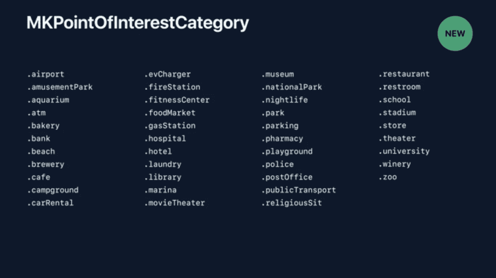
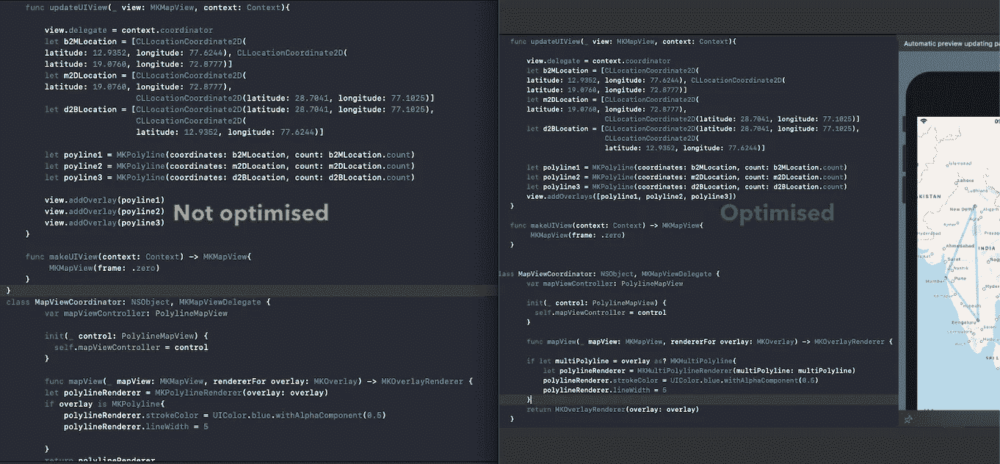
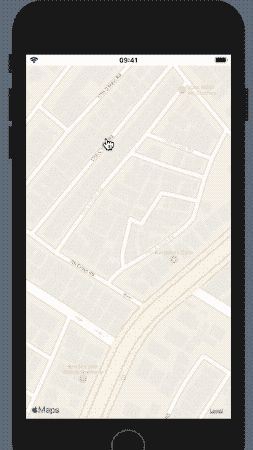

# 在 iOS 13 上探索地图工具包

> 原文：<https://betterprogramming.pub/exploring-mapkit-on-ios-13-1a7a1439e3b6>

## 除 SwiftUI 之外，优化的覆盖图、兴趣点等等


图片来自 [Pixabay](https://pixabay.com/?utm_source=link-attribution&utm_medium=referral&utm_campaign=image&utm_content=1130732) 的 [Dariusz Sankowski](https://pixabay.com/users/DariuszSankowski-1441456/?utm_source=link-attribution&utm_medium=referral&utm_campaign=image&utm_content=1130732) 。iOS 13 地图工具包中引入了其中的大部分功能

地图一直是苹果每次 WWDC 活动的常客。通过不断的增强和升级，苹果努力将多年来最薄弱的环节转化为强项。

在 WWDC 2019 期间，苹果展示了它如何改进苹果地图。虽然大多数新的苹果地图更新将在 2019 年底推出，但 [MapKit](https://developer.apple.com/documentation/mapkit) 已经为我们准备了很多。

以下是 MapKit 今年带来的一些改进:

*   兴趣点。
*   优化的折线和多边形渲染。
*   改进的搜索和自动完成。
*   控制相机边界和变焦。

在接下来的几节中，我们将详细讨论这些增强功能。在本文的整个过程中，我们将使用 [SwiftUI](https://developer.apple.com/xcode/swiftui/) 实现 MapKit 示例。

# 过滤兴趣点

iOS 13 中升级的 MapKit 框架现在允许我们在地图上按类别包含和排除某些地方。

以下是目前可用的兴趣点类别:



[来自 WWDC 2019 视频](https://developer.apple.com/videos/play/wwdc2019/236/)

下面的代码展示了如何过滤兴趣点，以便在`MKMapView`中只包含一组特定的类别。

```
let categories:[MKPointOfInterestCategory] = [.cafe]
let filters = MKPointOfInterestFilter(including: categories)mapView.pointOfInterestFilter = .some(filters)
```

结果，我们在 SwiftUI 中得到如下过滤后的地图外观。


屏幕截图

# 优化的地图覆盖

iOS 13 MapKit 引入了`MKMultiPoyline`和`MKMultiPolygon`类，以相同的风格对叠加进行分组，而不是为每个创建单独的渲染器对象。

当您在一个`MapView`上处理多个覆盖时，这极大地提高了您的应用程序的性能。

添加如下所示的折线将创建三个不同的渲染器。

```
view.addOverlay(poyline1)
view.addOverlay(poyline2)
view.addOverlay(poyline3)
```

相反，使用`MKMultiPolyine`执行以下操作将只创建一个渲染器，并防止应用程序中出现任何性能问题。

```
view.addOverlays([polyline1, polyline2, polyline3])
```

让我们看看如何通过在基于 SwiftUI 的视图中实现`MKMapViewDelegate`协议来集成新的`MKMultiPolylines`。

## 将多段线添加到地图视图

以下代码设置 UIKit 和 SwiftUI 之间的协调器桥，并在地图上添加折线覆盖:

```
struct PolylineMapView: UIViewRepresentable {
    func makeCoordinator() -> MapViewCoordinator{
         return MapViewCoordinator(self)
    }

    func updateUIView(_ view: MKMapView, context: Context){ **view.delegate = context.coordinator**
        let b2MLocation = ... //add your location coordinates here
        let m2DLocation = ...
        let d2BLocation = ...

        let polyline1 = MKPolyline(coordinates: b2MLocation, count: b2MLocation.count)
        let polyline2 = MKPolyline(coordinates: m2DLocation, count: m2DLocation.count)
        let polyline3 = MKPolyline(coordinates: d2BLocation, count: d2BLocation.count)
        view.addOverlays([polyline1, polyline2, polyline3])
    }

    func makeUIView(context: Context) -> MKMapView{
         MKMapView(frame: .zero)
    }
}
```

该委托负责将协调器类的更改传达给 SwiftUI 视图。

## 设置 MKMapViewDelegate 和 PolylineRenderer

在下面的代码中，我们已经在实例`MKMultiPolylineRenderer`(iOS 13 中新引入的)上设置了折线样式:

```
class MapViewCoordinator: NSObject, MKMapViewDelegate {
        var mapViewController: PolylineMapView

        init(_ control: PolylineMapView) {
          self.mapViewController = control
        }

        func mapView(_ mapView: MKMapView, rendererFor overlay: MKOverlay) -> MKOverlayRenderer {if let multiPolyline = overlay as? MKMultiPolyline{
            let polylineRenderer = **MKMultiPolylineRenderer**(multiPolyline: multiPolyline)
            polylineRenderer.strokeColor = UIColor.blue.withAlphaComponent(0.5)
            polylineRenderer.lineWidth = 5
        }
        return MKOverlayRenderer(overlay: overlay)
    }
}
```

以下是针对多条折线优化的新渲染器与旧渲染器的对比:



右边的是新的 iOS 13

# 改进的搜索结果

地图工具包搜索和自动完成结果通过包含新的`ResultType`得到了增强，它允许我们指定我们想要看到的结果。

*   `.pointsOfInterest`
*   `.address`
*   `.query`

此外，搜索完成器还允许通过兴趣点过滤，将结果限制在特定类别。下面是一些小代码，展示了 iOS 13 地图工具包增强的自动完成功能:

```
let completer = MKLocalSearchCompleter()completer.delegate = selfcompleter.pointOfInterestFilter = .some(MKPointOfInterestFilter(including: [.cafe]))completer.resultTypes = .query
```

保存搜索结果的`MKMapItem`实例现在有了一个包含`pointsOfInterest`的附加属性，以指示返回位置或名称的类别类型。

# 控制相机边界

`CameraBoundary`是`MKMapView`中新引入的类。它允许我们将地图的平移限制在特定的边界区域。这意味着，即使您将贴图区域设置在边界之外，也不会违反相机边界。

```
mapView.cameraBoundary = MKMapView.CameraBoundary(coordinateRegion: region)
```

或者，我们也可以在`CameraBoundary`内部传递一个`MKMapRect`实例。

iOS 13 出来的另一个新类是`CameraZoomRange`。这允许我们根据中心坐标距离设置摄像机变焦控制。

下面的代码展示了实现这两个类的`MapView`:

```
struct CameraBoundaryMapView: UIViewRepresentable {

    func updateUIView(_ view: MKMapView, context: Context){let region = MKCoordinateRegion(center: CLLocationCoordinate2D(
        latitude: 12.9352, longitude: 77.6244), latitudinalMeters: 500, longitudinalMeters: 500)

        view.setCameraZoomRange(MKMapView.**CameraZoomRange**(minCenterCoordinateDistance: 500, maxCenterCoordinateDistance: 2000), animated: true)view.cameraBoundary = MKMapView.**CameraBoundary**(coordinateRegion: region)   
    }
    func makeUIView(context: Context) -> MKMapView{
         MKMapView(frame: .zero)
    }
}
```



iOS 13 中可以限制相机变焦和平移

# 结论

因此，我们已经讨论了一些非常有趣的变化，如兴趣点和相机变焦，并看到了 iOS 13 中的 MapKit 如何优化叠加渲染。

完整的 SwiftUI 源代码可在 [GitHub 资源库](https://github.com/anupamchugh/iowncode/tree/master/iOS13MapKit)中获得。

这件作品到此为止。我希望你喜欢读它。