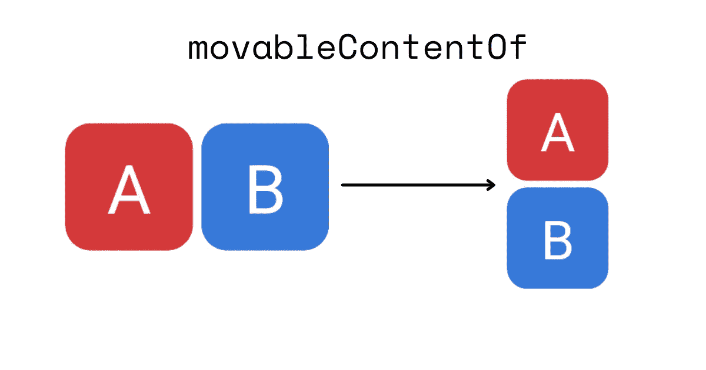
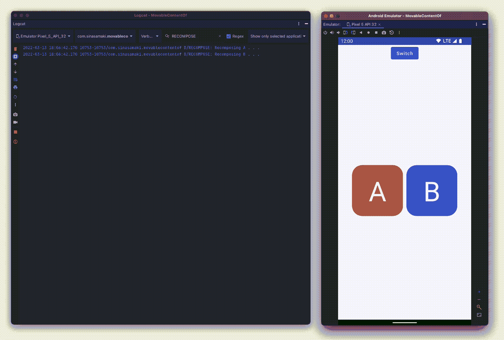
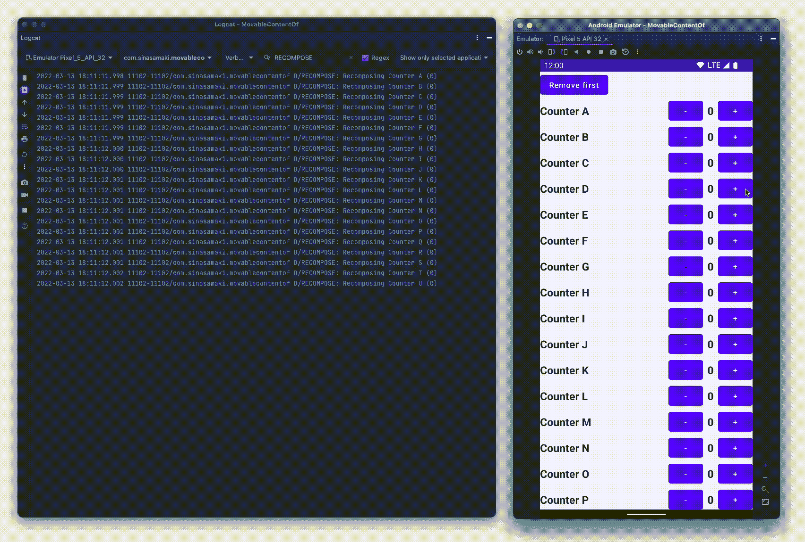

# 在 Jetpack Compose 中探索 MovableContentOf

> 原文：<https://betterprogramming.pub/exploring-movablecontentof-in-jetpack-compose-6807a43047cd>

## 告别 Android 中的重组视图



Jetpack Compose 最近在版本`1.2.0-alpha03`中引入了一个名为`movableContentOf`的新功能。

顾名思义，这使我们能够移动内容而不需要重组。如果重新压缩的开销很大或者数量很多，这可以节省时间并提高性能。

Jetpack compose 已经有了一些非常智能的优化，这些优化会自动应用，以避免不必要的重新组合。尽管它可能很聪明，但我们有时需要手动避免重新编译，而`movableContentOf`是这项工作的工具之一。

它的工作原理是接收一个可组合的 lambda 函数，它将记住这个函数并移动到它被调用的任何地方。我认为理解和掌握好处的最好方法是通过一个例子。

```
...
var isRow by remember {  
    mutableStateOf(true)  
}  

Column(  
    horizontalAlignment = Alignment.CenterHorizontally  
) {  
    Button(onClick = { isRow = !isRow }) {  
        Text(text = "Switch")  
    }  
    if (isRow) {  
        Row(  
            Modifier.weight(1f),  
            verticalAlignment = Alignment.CenterVertically  
        ) {  
            LetterBox(letter = 'A')  
            LetterBox(letter = 'B')  
        }  
    } else {  
        Column(  
            Modifier.weight(1f),  
            verticalArrangement = Arrangement.Center  
        ) {  
            LetterBox(letter = 'A')  
            LetterBox(letter = 'B')  
        }  
    }  
}
...
```

上面的例子包含两个可以在行或列中显示的框。该按钮可用于在两种模式之间切换。问题是每次点击按钮时，图块都会被重新组合。每当发生重组时，我们都可以通过使用 log 语句来看到这一点。



为了防止瓷砖在切换方向时不必要的重组，我们可以引入`movableContentOf`。

```
...
val boxes = remember {  
    movableContentOf {  
        LetterBox(letter = 'A')  
        LetterBox(letter = 'B')  
    }  
}  

Column(  
    horizontalAlignment = Alignment.CenterHorizontally  
) {  
    Button(onClick = { isRow = !isRow }) {  
        Text(text = "Switch")  
    }  
    if (isRow) {  
        Row(  
            Modifier.weight(1f),  
            verticalAlignment = Alignment.CenterVertically  
        ) {  
            boxes()  
        }  
    } else {  
        Column(  
            Modifier.weight(1f),  
            verticalArrangement = Arrangement.Center  
        ) {  
            boxes()  
        }  
    }  
}
...
```

使用`movableContentOf`，盒子只会被组合一次。当方向切换时，相同的盒子将会相应地重新排列，而不会重新组合。


另一个可能派上用场的场景是在列表中。在下一个示例中，它用于正确维护状态并避免列中不必要的重新计算。

```
[@Composable](http://twitter.com/Composable)  
fun ColumnExample() {  
    val list = remember {  
        mutableStateListOf<String>().apply {  
            for (i in 0..20) add("Counter ${'A' + i}")  
        }  
    }  

    Column {  
        Button(onClick = {  
            list.removeFirstOrNull()  
        }) {  
            Text(text = "Remove first")  
        }  
        Column(  
            modifier = Modifier  
    .verticalScroll(state = rememberScrollState())  
                .weight(1f)  
        ) {  
            list.forEach {  
                Counter(text = it)  
            }  
        }  
    }  
}
```

在这个例子中，我们有一列计数器和一个删除列表中第一个计数器的按钮。但是，如果我们运行应用程序并检查日志语句，我们会注意到两个主要问题。


首先，应用程序不能正确维护状态。当第一个计数器被移除时，计数器的状态移动到下面的位置。其次，日志语句表明，删除一个计数器会重新组合其位置受到影响的每个项目。使用`movableContentOf`我们可以保持计数器的正确状态，并且当我们只需要在列中移动计数器的位置时，可以避免重新计算。

```
...
val listComposables = list.movable {  
    Counter(text = it)  
}  

Column {  
    Button(onClick = {  
        list.removeFirstOrNull()  
    }) {  
        Text(text = "Remove first")  
    }  
    Column(  
        modifier = Modifier  
   .verticalScroll(state = rememberScrollState())  
            .weight(1f)  
    ) {  
        list.forEach {  
            listComposables(it)  
        }  
    }  
}
...
```

扩展函数`movable`定义为:

```
[@Composable](http://twitter.com/Composable)  
fun <T> List<T>.movable(  
    transform: [@Composable](http://twitter.com/Composable) (item: T) -> Unit  
): [@Composable](http://twitter.com/Composable) (item: T) -> Unit {  
    val composedItems = remember(this) { mutableMapOf<T, [@Composable](http://twitter.com/Composable) () -> Unit>() }  
    return { item: T ->  
        composedItems.getOrPut(item) {  
            movableContentOf { transform(item) }  
        }.invoke()  
    }  
}
```

现在，如果我们现在运行它，我们将看到计数器的状态被正确保存，同时，当移动位置时，计数器不会被重新组合。



完整的代码可在[这里](https://github.com/sinasamaki/movableContentOf/tree/main)获得。这只是两个例子，但是使用`movableContentOf`来提高代码性能的可能性有很多。如果你需要更多关于如何使用它的信息，你可以直接去 [android docs](https://cs.android.com/androidx/platform/frameworks/support/+/androidx-main:compose/runtime/design/movable-content.md) 。在这里，你还可以找到更多关于它在不同情况下的行为的信息。

感谢阅读，祝你好运！

*原载于*[](https://sinasamaki.com/post/2022-03-14-movable-content-of/)**。**