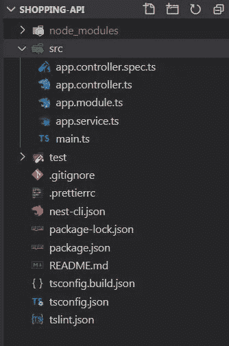
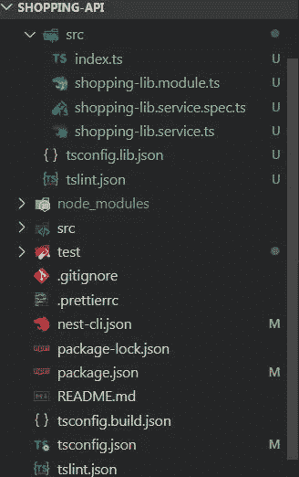

# 探索 NestJS 工作空间

> 原文：<https://betterprogramming.pub/exploring-nestjs-workspace-7d674ba3c86a>

## 标准模式与 monorepo 模式


NestJS 标志

在我的[上一篇文章](https://medium.com/p/a4e8b0b09db4)中，我们看到了为什么以及如何使用 [NestJS](https://nestjs.com/) ，在本文中，我们将浏览 NestJS 工作区。

# NestJS 工作空间

NestJS 支持两种模式:

*   标准模式
*   单报告模式

## 标准模式

当我们使用`nest new <app-name>`创建一个新的应用程序时，我们使用的是标准模式。在标准模式下，TypeScript 的`tsc`将被用作编译器。下面是我们的应用程序在标准模式下的样子。



## 单报告模式

monorepo 模式是指我们有多个应用程序，通常是一个应用程序和一个库，我们已经有一个应用程序，让我们使用下面的命令添加一个库。它将添加一个新的库项目。

```
nest generate lib shoppingLib
```

现在，由于我们处于 monorepo 模式，而不是`tsc`， [webpack](https://webpack.js.org/) 将被用作构建工具。您可以打开`nest-cli.json`并注意到添加了下面几行代码。`compilerOptions`有`webpack`值为真。

添加库后，应用程序结构将如下所示:



单一报告

让我们看一下一些重要的文件:

*   `tsconfig.json` : 运行`tsc`传输文件时使用的配置文件。
*   `nest-cli.json` : 当我们处于 monorepo 模式时，Nest CLI 配置文件有一个项目列表，并定义了我们在 monorepo 中使用哪个构建工具`webpack`，默认情况下是`tsc`。
*   `main.ts`:这是我们的 NestJS 应用程序的入口文件，有一个`bootstrap()`函数来引导我们的应用程序。默认情况下，服务器运行在端口 3000 上，您可以更改它，在生产中使用它时，我们可以使用环境变量。
*   `app.module.ts`:这是我们的根模块，已经注册了所有模块、控制器和服务。
*   `app.controller.ts`:我们的应用程序应该至少定义一个控制器，这是我们的默认控制器。
*   在我们的应用程序中，我们可以有多个服务。这是作为工作空间的一部分添加的示例服务，这是可选的。
*   `Libraries` **:** 库可以有可重用的代码，比如服务、管道、防护或拦截器。

# 用于 NestJS 全栈应用的工具

如果你正在用 Angular/React.js 构建一个全栈应用，并且想要使用 NestJS 作为后端，你应该考虑 [Nx Dev Tools](https://nx.dev/angular/getting-started/what-is-nx) ，它提供了很多特性。

# 结论

我们了解了 NestJS 工作区和两种可用的模式以及它们之间的区别，以及如何将我们的工作区转换为 monorepo 模式。

我们还看到了不同的文件，这些文件很重要，以及它们为什么有用。在下一篇文章中，我们将讨论控制器以及如何创建和配置端点。