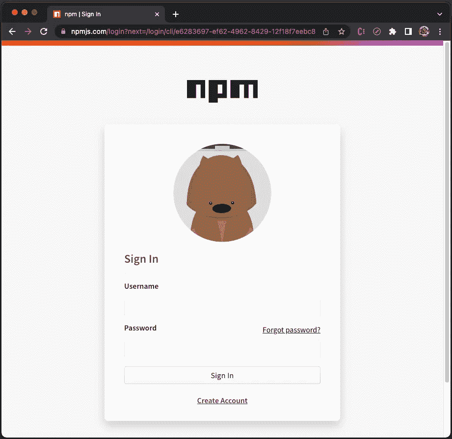
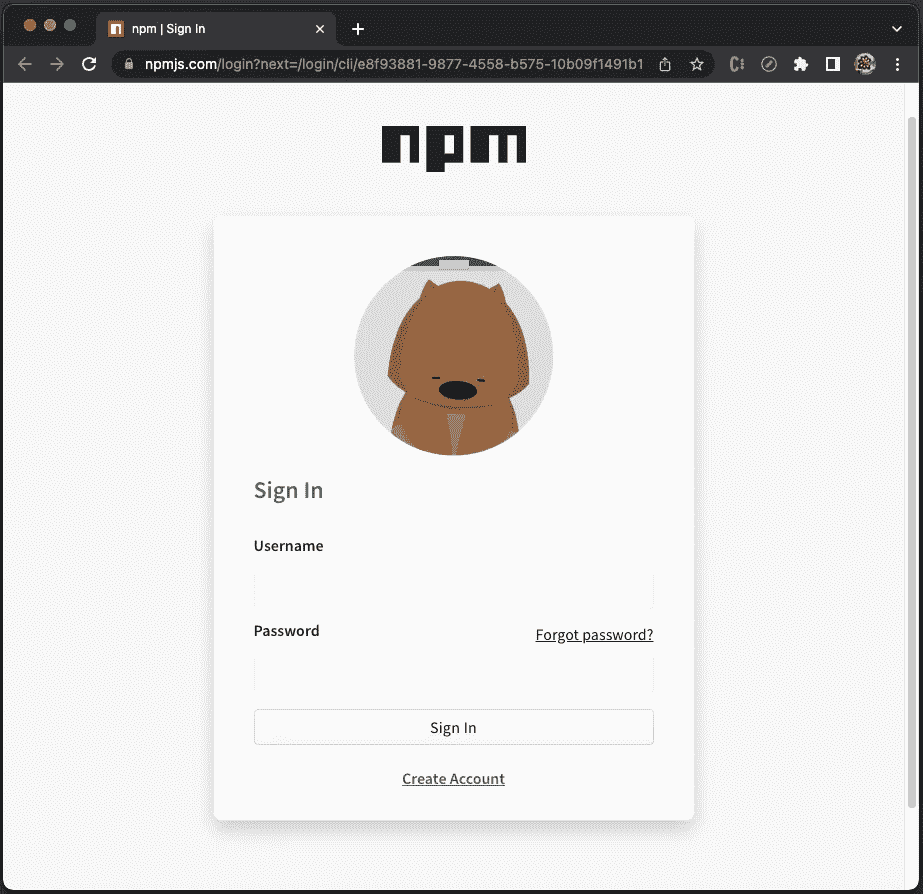

# 探索 npm 9 中的新功能

> 原文：<https://betterprogramming.pub/exploring-new-features-in-npm-9-bea4631a96d6>

## 配置、计时、日志级别、登录、添加用户、查询、打包、访问和安装的更改，以及删除


格伦·卡斯滕斯-彼得斯在 [Unsplash](https://unsplash.com?utm_source=medium&utm_medium=referral) 上的照片

# 介绍

npm 是 node.js JavaScript 平台的包管理器。它将模块放在适当的位置(`node_modules`)，以便节点可以找到它们。它还智能地管理依赖冲突。

npm 是可配置的，以支持发布、发现、安装和开发节点程序的各种用例。它有一个强大的命令列表。

[npm 9](https://newreleases.io/project/npm/npm/release/9.0.0) 发布于 2022 年 10 月 19 日。这个主要版本的目标是标准化适当的缺省值，并尽可能清理遗留配置。

以下是安装 npm 9 的命令:

```
% npm install -g npm@9
```

安装后，npm 的版本为 9.0.1。

```
% npm --version
9.0.1
```

这是帮助手册:

可以对任何支持的节点版本进行 npm 9 升级，`^14.17.0 || ^16.13.0 || >=18.0.0`。

`[nvm](/how-to-use-nvm-to-manage-node-js-19-and-npm-9-bc5656d52d5f)` [是管理节点和 npm 版本的简单方法](/how-to-use-nvm-to-manage-node-js-19-and-npm-9-bc5656d52d5f)。我们在 [node.js 19](/6-major-features-of-node-js-19-b98e28b9670c) 工作环境中探索 npm 9 的特性。

这些是 npm 9 中的新功能:

```
[Changes](#28fb) [in config](#28fb)[Changes in](#0358) [timing and loglevel](#0358)[Changes in](#48ee) [npm login and npm addUser](#48ee)[Changes in](#a5f5) [npm](#a5f5) [query](#a5f5)[Changes in](#3909) [npm](#3909) [pack](#3909)[Changes in](#b612) [npm access](#b612)[Changes in](#51a9) [npm](#51a9) [install](#51a9)[Removals of](#0f52) [npm birthday](#0f52)[,](#0f52) [npm set-script](#0f52)[,](#0f52) [and npm bin](#0f52)
```

# npm 配置中的更改

`npm config`管理 npm 配置文件。它支持以下用法:

`npm config fix`是一个验证配置和修复问题的新命令。

下面是源代码:

我们在使用 npm 9 时遇到一个错误:

执行`npm config fix`解决了问题:

对于`build`错误，npm 在 stdout 上输出一些 JSON 错误。以前，npm 会在 stderr 上输出所有 JSON 格式的错误，这使得很难解析，因为 stderr 流通常已经写入了日志。npm 9 改进了它。

此外，`npm config set`不再接受弃用或无效的配置选项。npm 9 config 去掉了`node-version`和`npm-version`，[让](#51a9) `[install-links](#51a9)` [默认为真](#51a9)。

# 时间和日志级别的变化

所有 npm 命令都可以有一个选项标志，`—-timing`。设置该标志后，npm 会将计时数据与调试日志数据一起写入文件。日志位置由`logs-dir`选项设置，并返回到`<CACHE>/_logs/`。

下面是如何执行`npm —-timing`:

每次运行定时命令后，在`<CACHE>/_logs/`中会生成一个新的定时文件，如`2022–11–01T02_31_07_194Z-timing.json`。

计时文件命名为`<ID>-timing.json`，其中`<ID>`为时间戳。这种命名方法类似于调试日志。

下面是`2022–11–01T02_31_07_194Z-timing.json`中的 [JSON](/exploring-json-json5-and-circular-references-2b5b0c5de532) 数据:

JSON 数据有三个顶级键，`metadata`(第 4 行)、`timers`(第 14 行)和`unfinishedTimers`(第 40 行)。

从 npm 9 开始，`timing`已经作为`--loglevel`的值被删除。除了在`--silent`时，`--timing`将显示定时信息，与`--loglevel`无关。

下面是带有`--loglevel info`的`timing`命令:

*   计时文件列在第 59 行。
*   调试文件列在第 61 行。

下面是带有`--loglevel silent`的`timing`命令:

无论`--loglevel`的设置如何，定时文件和日志文件都在`<CACHE>/_logs/`中生成。

# npm 登录和 npm addUser 中的更改

在 npm 9 之前，有一个命令`npm addUser`，它有两个别名`login`和`add-user`。

在 npm 9 中，`npm login`是一个单独的命令，它在指定的注册表中验证用户，并将凭据保存到`.npmrc`文件中。如果没有指定注册表，将使用默认注册表。

下面是如何执行`npm login`:

按`ENTER`，浏览器打开登录窗口:



作者图片

在 npm 9 中，`npm addUser`有一个别名`add-user`。它在指定的注册表中创建新用户，并将凭证保存到`.npmrc`文件中。如果没有指定注册表，将使用默认注册表。

下面是如何执行`npm addUser`:

按下`ENTER`，浏览器打开登录窗口:



作者图片

对于`npm login`和`npm addUser`，仅支持两个`auth-type`值:

*   `web`:默认值。
*   `legacy`:使用`legacy`时，从提示中读入用户名和密码。

这些`auth-type`值已在 npm 9 中删除:`sso`、`saml`、`oauth`和`webauthn`。

`web`和`legacy`只尝试各自的方法，即 npm 不再全部尝试，等着看哪个不失败。

对于`npm login`和`npm addUser`，浏览器中的登录窗口看起来是一样的。然而，根据`auth-type`的不同，它们也有一些不同之处:

*   `web`:对`/-/v1/login`的 POST 请求在其针对`adduser`的有效载荷中包含一个`{ create: true }`值。
*   `legacy`:对`/-/user/org.couchdb.user:${username}`
    的`PUT`请求在其针对`adduser`的有效载荷中包含一个`email`值。

# npm 查询中的更改

`npm query`检索经过过滤的软件包列表。它使用 CSS 选择器来执行过滤，尽管没有标签选择器，比如`div`、`h1`和 `a`。查询目标是[依赖对象](/package-jsons-dependencies-in-depth-a1f0637a3129)。

这些是受支持的选择器:

*   `*`万能选择器
*   `#<name>`依赖选择器(相当于`[name="..."]`)
*   `#<name>@<version>`(相当于`[name=<name>]:semver(<version>)`)
*   `,`选择器列表分隔符
*   `.`依赖类型选择器
*   `:`伪选择器

我们设置了 [Create React App](/an-in-depth-guide-for-create-react-app-5-cra-5-b94b03c233f2) ，其中包含了`package.json`。

```
% npx create-react-app my-app
% cd my-app
```

查询套餐，`react`:

查询结果显示了`react`包的详细信息。在第 68 行，`queryContext`是`{}`，这是 npm 9 中的一个新属性。

`queryContext`属性可以包括`versions`、`outdated.outOfRange,` 和`outdated.outOfRange`。我们来看三个例子。

示例 1:`queryContext`属性包含`versions`，这是给定节点的每个可用版本的数组。

`:outdated(<type>)`是一个伪选择器，用来显示过时的依赖关系。`:outdated > #react`显示过期的 React 包。从下面代码的第 69–111 行开始，它显示了一长串过时的 React 包。

示例 2:`queryContext`属性包括`outdated.inRange`，一个对象数组，每个对象都有一个`from`和`versions`。

`from`是依赖于当前节点的节点在磁盘上的位置，`versions`是满足该依赖性的所有可用版本的数组。

`.prod:outdated(in-range)`返回与满足范围内至少一个边缘的新版本的生产相关性。

执行`npm query ".prod:outdated(in-range)"`，我们可以看到`queryContext`中的`outdated`属性，有`from`(第 4 行)和`versions`(第 5-9 行)。

示例 3:`queryContext`属性包括`outdated.outOfRange`，一个对象数组，每个对象都有一个`from`和`versions`。

`from`是依赖于当前节点的节点在磁盘上的位置，而`versions`是不满足依赖性的每个可用版本的数组。

`.prod:outdated(out-of-range)`返回不满足依赖关系的生产依赖关系。

执行`npm query ".prod:outdated(out-of-range)"`，我们可以在一个`queryContext`中看到`outOfRange`属性，有一个`from`(第 4 行)和`versions`(第 5-10 行)。

# 国家预防机制包的变化

`npm pack`从包中创建一个 tarball。在 Create React App 工作环境内，执行`npm pack`。它在目录中生成 tarball，`my-app-0.1.0.tgz`。

从 npm 9 开始，`npm pack`在应用忽略规则时遵循严格的操作顺序。如果一个`files`数组出现在`package.json`中，那么来自根的`.gitignore`和`.npmignore`文件中的规则将被忽略。

# 国家预防机制准入方面的变化

`npm access`设置已发布包的访问级别。以下是 npm 8 中的命令用法:

对于所有子命令，`npm access`将对当前工作目录中的包执行操作，如果没有包名传递给子命令的话。

*   `public` / `restricted`(已弃用):将软件包设置为可公开访问或受限。
*   `grant` / `revoke`(已弃用):添加或删除用户和团队对包的只读或读写访问权限。
*   `2fa-required` / `2fa-not-required`(已弃用):配置软件包是否要求发布它的任何人在其帐户上启用双因素身份验证。
*   `ls-packages`(已弃用):显示用户或团队可以访问的所有包，以及访问级别，只读公共包除外。它不会打印整个注册表列表。
*   `ls-collaborators`(已弃用):显示软件包的所有访问权限。将只显示您至少拥有读取权限的包的权限。如果传入了`<user>`,那么列表只过滤到用户所属的团队。
*   `edit`(未实施)

`npm access`子命令已被重命名。以下是 npm 9 中的命令用法:

尽管 npm 9 重命名了子命令，但功能保持不变。

# npm 安装中的更改

`npm install`命令安装一个包和它所依赖的任何包。`install-strategy`是一个新标志，它有以下类型:

*   `hoisted`:在顶层安装不重复的，必要时在目录结构内复制。这是默认值。

```
npm install —-install-strategy=hoisted is the same as npm install.
```

*   `nested`:安装到位。禁止吊装。

```
npm install --install-strategy=nested is the same as npm install --legacy-bundling. legacy-bundling has been deprecated in favor of  —-install-strategy=nested.
```

*   `shallow`:只在顶层安装直接依赖关系。

```
npm install --install-strategy=shallow is the same as npm install --global-style. global-style has been deprecated in favor of  --install-strategy=shallow.
```

许多配置参数对安装有一些影响，`install-links`是选项之一。如果设置为 true，协议依赖项将作为常规依赖项打包和安装，而不是创建符号链接。在 npm 8 中，默认值为 false，在 npm 9 中已更改为 true。

# 删除 npm 生日、npm 设置脚本和 npm bin

`[npm birthday](https://github.com/npm/cli/issues/4091)`是复活节彩蛋。它要么显示离 npmcli 的生日还有多少毫秒，要么打印一堆气球表情符号和第一次提交到这个存储库的提交散列。前段时间被拆了，单独成了自己的包。

`npm set-script`在`package.json`的`scripts`部分创建一个任务。

`npm bin`打印 npm 将安装可执行文件的文件夹。

这些是 npm 8 中的有效命令:

但是，npm 9 中删除了这些命令:

# 结论

npm 9 已经发布。它支持节点版本`^14.17.0 || ^16.13.0 || >=18.0.0`。

npm 9 改了`config``timing``loglevel``login``addUser``query``pack``access``install`。它还删除了`npm birthday`、`npm set-script`和`npm bin`。

如果您想了解以前版本的特性，请阅读以下文章:

*   [快速浏览 npm 8 特性和对 npm 9 的预测—近距离观察 es 模块(ESM)](/what-might-be-coming-in-npm-9-6985cf2678a6)
*   [了解和采用 npm 7 的分步指南](https://medium.com/better-programming/the-step-by-step-guide-to-understanding-and-adopting-npm-7-914504f7090f)

感谢阅读。

```
**Want to Connect?**If you are interested, check out [my directory of web development articles](https://jenniferfubook.medium.com/jennifer-fus-web-development-publications-1a887e4454af).
```