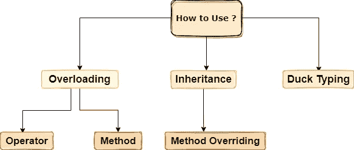

# 探索 Python 中的多态性

> 原文：<https://betterprogramming.pub/exploring-polymorphism-in-python-f12b167c5e9f>

## 了解如何应用多态性


迈克尔·泽兹奇在 [Unsplash](https://unsplash.com?utm_source=medium&utm_medium=referral) 上的照片

多态在编程中是一个非常著名和有趣的话题。作为一个词，它意味着以几种不同的形式出现。在程序设计中，它可以被定义为具有相同名称但不同功能的函数或函数的组合。

多态性可以大致分为两种类型:

# **内置多态函数**

这些是可以以不同方式使用的内置运算符或函数。在下面的代码片段中，我们可以看到加法运算符如何用于将两个整数相加，连接两个字符串，以及添加两个列表。类似地，我们可以看到如何使用内置函数 `len()`来检测字符串和列表的长度。

内置多态函数的示例

```
Output
Poly Morphism
11
['Poly', 2, '3', '4', 5, 'Morphism']
12
6
```

# **用户自定义多态函数**

顾名思义，这些是由用户定义或编写来执行不同功能的函数。在下面的代码片段中，我们可以使用 multiply 函数将两个数字、三个数字或四个数字相乘。我们可以根据自己的需要修改这个函数，因此它可以以多种方式为我们服务。

用户定义函数的示例

```
Output
6
24
120
```

# 如何使用多态性？



多态性的各种用途

## **运算符重载**

在这种类型的重载中，我们可以以各种方式使用运算符，而不仅仅是它的预定义含义，比如乘法运算符可以用于将两个整数相乘或扩展一个字符串。让我们来看一个运算符重载的实际实现:

运算符重载示例

```
Total Cost: 550
```

在这个例子中，我们试图使用`Books`类来存储图书的 MRP，然后找到总成本，而`__add__`函数帮助我们实现了这个目标。如果我们不包含`__add__`函数，我们将会得到一个错误，我们将不能添加两个对象。因此，根据这里的`__add__`函数的功能，操作符重载将帮助我们添加两个或更多的对象。

## **方法重载**

方法重载的简单含义是一个包含多个同名但参数不同的方法的类。现在，Python 出现了一个问题。Python 默认不支持方法重载，但是有几种不同的方法可以实现它。让我们借助一个例子来理解它:

方法重载的例子

```
No Food Item Booked
Lunch Booked
Lunch & Dinner Booked
```

在上面的例子中，我们可以看到一个类`Book_Food`，其中有一个`book`函数，它的参数为`None`，每当我们传递参数时，它都会根据这些参数进行操作，因此它可以表现为单参数、双参数和无参数函数。我们可以在这里添加几种类型的逻辑，使它根据我们的需要以不同的方式运行。

## **方法覆盖**

在 Python 中，我们可以重新实现一个方法，并根据需要在子类中改变它的功能。我们可以从父类继承子类中的方法，这些方法有相同的名称，可能有相同的参数，但功能不同。这个过程被称为`Method Overriding`，在我们的父类方法的功能不适合子类的情况下非常有用。

方法重写的示例

```
19.0
19.0
50
```

## **鸭子打字**

它来自下面的引用:

> "如果它看起来像鸭子，叫起来也像鸭子，那它就是鸭子."

这意味着定义方法的类并不重要，重要的是它定义的方法。在这个功能中，我们根本不检查类型，而是检查方法及其定义。我们可以用一个类似于方法覆盖的例子来理解它:

鸭子打字的例子

```
19.0
50
19.0
```

在上面的例子中，我们可以看到我们在每个类中都调用了相同的方法名，但是它们的功能是不同的，这就是我们所关注的。

感谢阅读。