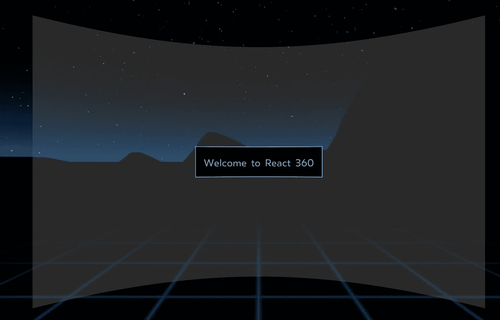
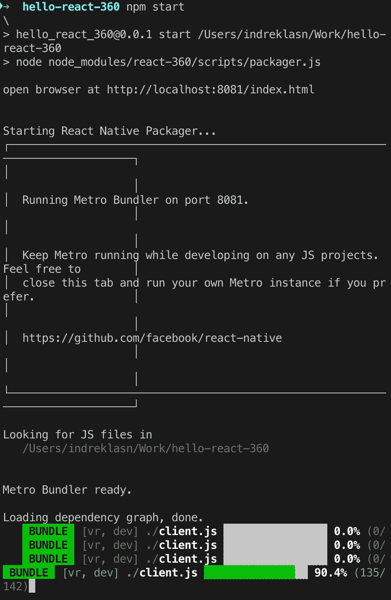
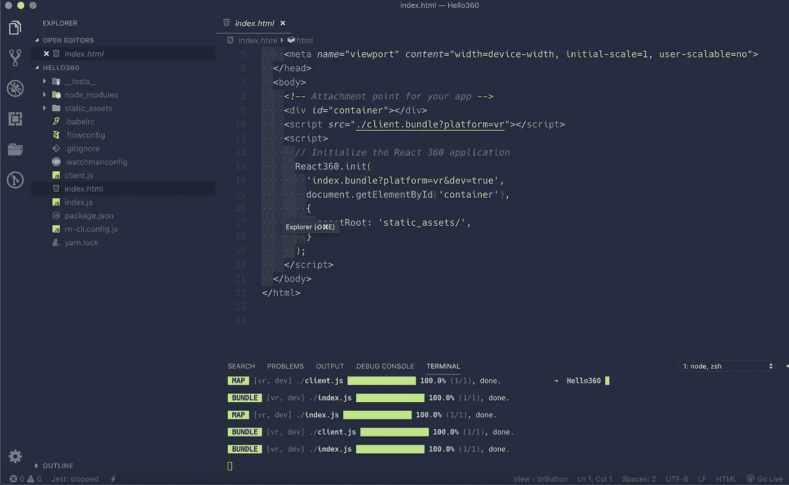
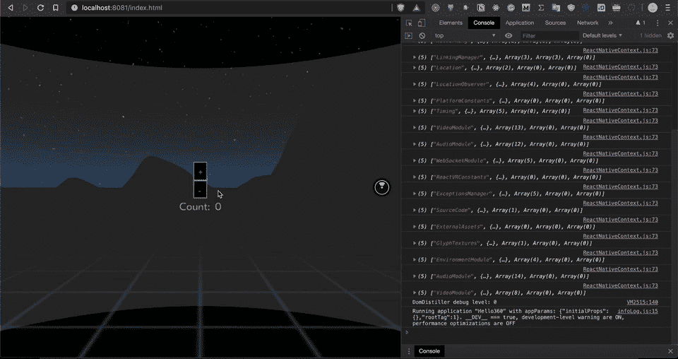

# 探索 React 360 VR 库

> 原文：<https://betterprogramming.pub/exploring-react-360-vr-library-7260d51dc776>

## React 360 是一个用于创建 3D 和 VR 用户界面的框架



“欢迎反应 360”

React 360 是建立在 [React](https://reactjs.org/) 之上的库。它旨在简化复杂 UI 的创建。React 360 允许您使用熟悉的工具和概念在网络上创建身临其境的 360 内容。


由[斯科特·韦伯](https://unsplash.com/@scottwebb?utm_source=unsplash&utm_medium=referral&utm_content=creditCopyText)在 [Unsplash](https://unsplash.com/search/photos/virtual-reality-oculus?utm_source=unsplash&utm_medium=referral&utm_content=creditCopyText) 上拍摄的照片

# React 360 和 React VR 有什么不同？

2017 年初，脸书和 Oculus 发布了一个名为 React VR 的 JavaScript 库，该库旨在在网络浏览器中创建 3D 和 VR 体验。与此同时，Oculus 开始使用该框架的原生 C++版本来构建自己的第一方应用。

随着时间的推移，当我们处理框架的不同需求时，这两个项目的 API 发生了分歧。为了避免两个系统之间的混淆，开源框架已经被重命名为 React 360。这更好地反映了它的用例:可以在 PC、移动和 VR 设备上消费的沉浸式 360°体验的创建。

如果你以前用过 React VR，你应该会发现 React 360 非常相似。我们简化了许多更常见的工作流程，例如在 3D 空间中放置 2D UI 元素，并针对这些用例优化了性能。[在这里看完整对比](https://facebook.github.io/react-360/docs/what-is.html)。

我们不需要 [Oculus](https://amzn.to/2yqQ36A) 或 [Google Cardboard](https://amzn.to/2LR4h9h) 来开发我们的 VR 应用。我们只需要一个浏览器和一个代码编辑器来让我们的 VR 应用程序工作。多酷啊。

# 入门指南

你需要安装 [Node.js](https://nodejs.org/) 。当 React 360 在你的网络浏览器中运行时，捆绑你的代码的构建管道依赖于 Node。

*   Mac:在 Mac 上，我们推荐通过[自制](http://brew.sh/)安装 Node.js。
*   Windows:从[nodejs.org 下载页面](https://nodejs.org/en/download/)获取 Windows 安装程序。
*   Linux:转到[nodejs.org 软件包管理器页面](https://nodejs.org/en/download/package-manager/)来查找您的 Linux 发行版的具体说明。

接下来，我们需要 React 360 命令行工具。此 CLI 工具允许您创建和管理 React 360 项目。

```
npm install -g react-360-cli
```

一旦我们有了 CLI，我们就可以初始化我们的项目。

```
react-360 init hello-react-360
```


初始化 React 360 项目

您现在可以通过运行`npm start`来启动您的项目

```
npm start
```



启动 React 360 项目

如果我们在`[http://localhost:8081/index.html](http://localhost:8081/index.html)`打开浏览器，我们应该能够看到欢迎消息。


React 360 欢迎消息

# React 360 项目结构



## 索引. js

所有的 React 代码都存放在这里。这是构建您的应用程序并决定其外观的代码。

由`index.js`导入的任何代码也将成为你的应用的一部分，允许你将你的应用组织成许多不同的文件。

## client.js

这是将您的浏览器连接到 React 应用程序的代码——运行时。这个文件做三件事。首先，它创建 React 360 的一个新实例，加载 React 代码并将其附加到 DOM 中的特定位置。这也是您的应用程序可以传递各种初始化选项的地方。

## `index.html`

这是您在查看应用程序时加载的网页。它所做的只是提供一个挂载 JavaScript 代码的点。这是故意的。HTML 省略了大部分功能，因此您可以轻松地将 React 360 应用程序集成到服务器渲染页面或现有的 web 应用程序中。

# 创建计数器

对于简短而甜蜜的演示，让我们创建一个计数器。React 360 库使用与 React Native 类似的概念。如果你对 React 本地概念感兴趣，请查看本教程。

[](https://medium.com/better-programming/bitcoin-ripple-ethereum-price-checker-with-react-native-redux-e9d076037092) [## 我们来构建:加密货币原生手机 App，带 React Native + Redux

medium.com](https://medium.com/better-programming/bitcoin-ripple-ethereum-price-checker-with-react-native-redux-e9d076037092) 

首先，我们需要从 react-360 库中导入`View`、`Text`和`VrButton`元素。

其次，让我们声明我们的初始`state`并创建`decrement`和`increment`函数。

很标准的东西。接下来，我们将使用之前导入的 React 360 元素。

一旦我们有了标记，我们应该能够与我们的 360 计数器进行交互。



React 360 VR 示例

这就是我们对 React 360 库的超级简单介绍。我鼓励你更深入地探索构建 VR 应用程序的所有可能性。

# 从这里去哪里

我强烈建议通读 React 360 官方文档，以便深入了解。

[](https://facebook.github.io/react-360/) [## React 360 创造令人惊叹的 360 度体验

### 创造令人惊叹的 360 度体验

创造令人惊叹的 360°体验 facebook.github.io](https://facebook.github.io/react-360/) [](https://developer.mozilla.org/en-US/docs/Web/API/WebVR_API) [## WebVR API

### WebVR 为暴露虚拟现实设备提供了支持——例如像 Oculus Rift 或…

developer.mozilla.org](https://developer.mozilla.org/en-US/docs/Web/API/WebVR_API) [](https://egghead.io/courses/vr-applications-using-react-360) [## 使用 React 360 的虚拟现实应用

### 如果您使用过 React，您就会知道它如何为复杂的问题提供明智的解决方案。这是多么令人兴奋啊…

蛋头](https://egghead.io/courses/vr-applications-using-react-360) [](https://alligator.io/react/react-360/) [## React 360 简介

### React 360(或 React VR)是一个用于使用 React 创建虚拟现实体验的库，并使用 Three.js 进行…

鳄鱼. io](https://alligator.io/react/react-360/) 

感谢阅读！❤