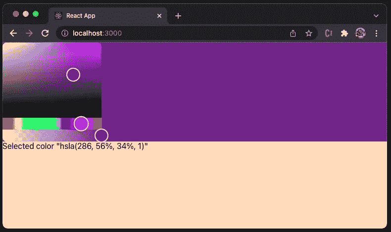
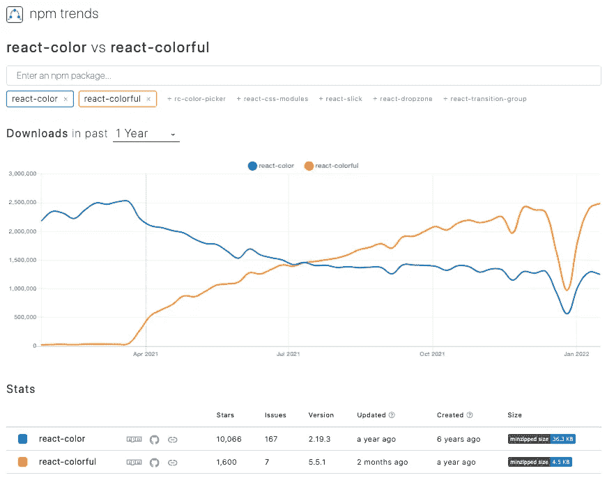
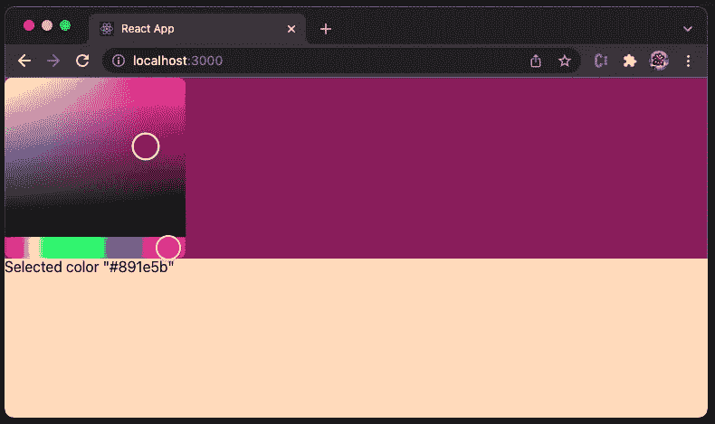
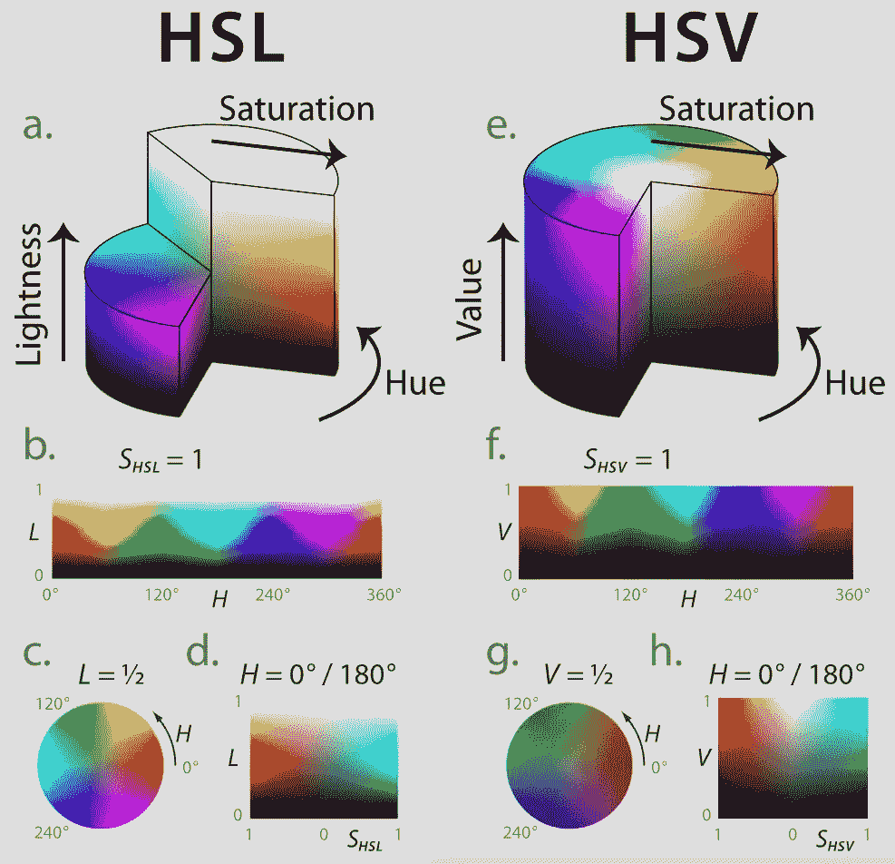
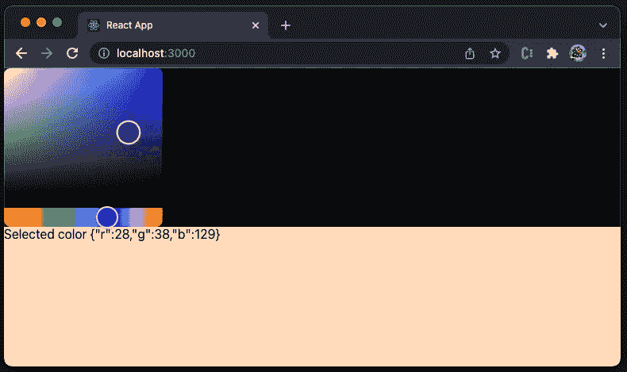
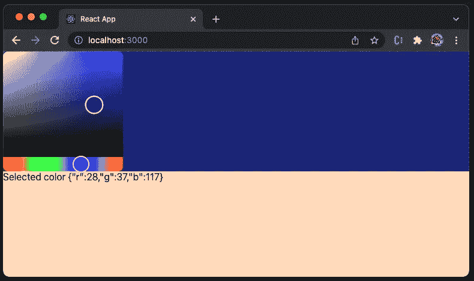
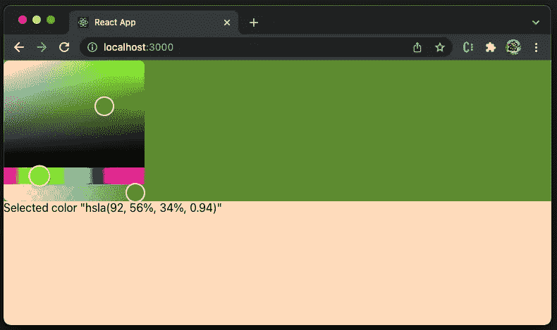

# 探索 React-Colorful:最流行的 React 颜色选择器

> 原文：<https://betterprogramming.pub/exploring-react-colorful-the-most-popular-react-color-picker-2e2c135ad3e9>

## 浅谈作者如何使用图像



作者图片

你知道颜色吗？

是的，它是红色的。

能分辨颜色吗，`#00ff00`？

大概是的，如果你明白一个十六进制的颜色值是由`#rgb`指定的，其中 r(红)、g(绿)、b(蓝)是介于`00`和`ff`之间的颜色强度。因此，它是绿色的。

颜色怎么样，`hsla(286, 56%, 34%, 1)`？

嗯…人类的认知变得困难。

为了可用性，需要一个颜色选择器。它是一个用户界面，具有颜色的可视化表示，以及选择颜色的能力。上面的图像是一个颜色选择器，它告诉我们`hsla(286, 56%, 34%, 1)`是紫色的。

最流行的 React 拾色器是什么？

自 2021 年年中以来，`[react-colorful](https://github.com/omgovich/react-colorful)`已经超过`[react-color](https://github.com/casesandberg/react-color)`成为最受欢迎的 React 拾色器。



作者图片

我们来看看如何使用`react-colorful`。

# 在 Create React 应用程序中设置颜色选择器

我们使用 [Create React App](/an-in-depth-guide-for-create-react-app-5-cra-5-b94b03c233f2) 作为探索`react-colorful`的基础。以下命令创建一个 React 项目:

```
% npx create-react-app my-app
% cd my-app
```

设置`react-colorful`:

```
% npm i react-colorful
```

`react-colorful`成为`package.json`中`[dependencies](/package-jsons-dependencies-in-depth-a1f0637a3129)`的一部分:

`react-colorful`提供 13 种颜色型号。其中，`HexColorPicker`是最常见的一种，它使用了一个十六进制的颜色值。

将以下代码复制到`src/App.js`:

它设置了一个带有`peachPuff`背景的用户界面(第 9 行)，它获取整个视口的高度(第 10 行)。

用户界面上有两个项目:

*   颜色选择器(第 13–19 行)，放置在具有选定颜色的 div 上(第 15 行)。第 18 行是颜色选择器组件。
*   所选颜色的字符串表示(第 20 行)。

通过`npm start`执行代码。选择选中的颜色`#891e5b`，用于上半部分背景。



作者图片

下面的视频显示了颜色选择器如何更改上半部分背景的颜色。

作者图片

# 不同的颜色模型

正如我们提到的，有 13 种颜色模型支持不同的颜色表示。

*   `HexColorPicker`，如`"#ffffff"`
*   `RgbColorPicker`，如`{ r: 255, g: 255, b: 255 }`
*   `RgbaColorPicker`，如`{ r: 255, g: 255, b: 255, a: 1}`
*   `RgbStringColorPicker`，如`"rgb(255, 255, 255)"`
*   `RgbaStringColorPicker`，如`"rgba(255, 255, 255, 1)"`
*   `HslColorPicker`，如`{ h: 0, s: 0, l: 100 }`
*   `HslaColorPicker`，如`{ h: 0, s: 0, l: 100, a: 1 }`
*   `HslStringColorPicker`，如`"hsl(0, 0%, 100%)"`
*   `HslaStringColorPicker`，如`"hsla(0, 0%, 100%, 1)"`
*   `HsvColorPicker`，如`{ h: 0, s: 0, v: 100 }`
*   `HsvaColorPicker`，如`{ h: 0, s: 0, v: 100, a: 1 }`
*   `HsvStringColorPicker`，如`"hsv(0, 0%, 100%)"`
*   `HsvaStringColorPicker`，如`"hsva(0, 0%, 100%, 1)"`

有 4 种方法来描述颜色:

*   十六进制:十六进制颜色值由`#rgb`指定，其中 r(红色)、g(绿色)和 b(蓝色)是在`00`和`ff`之间的颜色强度。`"#000000"`是黑色，`"#ff0000"`是红色，`"#00ff00"`是绿色，`"#0000ff"`是蓝色，`"#ffffff"`是白色。
*   RGB: RGB 是一个有三个键的对象，其中`r`是红色值，`g`是绿色值，`b`是蓝色值。每个值指定了`0`和`255`之间的颜色强度。`{ r: 0, g: 0, b: 0 }`是黑色，`{ r: 255, g: 0, b: 0 }`是红色，`{ r: 0, g: 255, b: 0 }`是绿色，`{ r: 0 g: 0, b: 255 }`是蓝色，`{ r: 255, g: 255, b: 255 }`是白色。
*   HSL: HSL 代表色调、饱和度和亮度。色调是色轮上从 0 到 360 的度数。0 是红色，120 是绿色，240 是蓝色。饱和度是百分比值，其中`0%`是灰色阴影，`100%`是全色。明度指定亮度，其中`0%`为黑色，`50%`为“正常”，而`100%`为白色。`{ h: 0, s: 0, l: 100 }`是白色。
*   HSV: HSV 代表色调、饱和度和值。它也被称为 HSB(色调、饱和度和亮度)。HSL 和 HSV 的区别在于，HSL 中`100%`明度的颜色是纯白色，而 HSV 中的`100%`值只是在有色物体上发出白光。`{ h: 0, s: 0, v: 100 }`是黑色。

[下图](https://en.wikipedia.org/wiki/HSL_and_HSV)显示了 HSL 和 HSV 的区别，明度随饱和度变化。



雅各布·鲁斯，CC BY-SA 3.0<[https://creativecommons.org/licenses/by-sa/3.0](https://creativecommons.org/licenses/by-sa/3.0)>，经由维基共享

对于每种颜色表示，都有另一个可选变量，`a` (alpha)，它指定不透明度。是一个介于`0`和`1`之间的值，其中 0 表示透明，1 表示不透明。

`react-colorful`支持除 Hex 以外的所有型号的 alpha 通道，Hex 的支持是[进行中](https://github.com/omgovich/react-colorful/issues/161)。

# 使用不同的颜色选择器

让我们试试不同的颜色选择器。以`RgbColorPicker`为例，我们将`src/App.js`中的导入语句修改如下:

```
import { RgbColorPicker as Picker } from 'react-colorful';
```

通过`npm start`执行代码。挑选选中的颜色，`{ r: 28, g: 38, b: 129 }`。但是，上半部分背景的颜色仍然是黑色。



作者图片

发生了什么事？

因为打印的颜色字符串是正确的，所以颜色选择器按预期工作。问题是如何设置 CSS 颜色。CSS 颜色虽然取 RGB/HSL 值，但格式不同，即`rgb(r, g, b[, a])` / `hsl(h, s, l[, a])`。

有另一个叫做 [colord](https://github.com/omgovich/colord) 的工具可以解决这个问题，因为它具有操纵和转换颜色的功能。

建立`colord`:

```
% npm i colord
```

`colord`包含在`package.json`中，和`react-colorful`一起。

我们在`src/App.js`中导入`colord`:

第 16 行使用`colord`将颜色转换成十六进制值。现在`RgbColorPicker`工作了。



作者图片

让我们试试另一个颜色选择器，`HslaColorPicker`。只需将`src/App.js`中的导入语句修改如下:

```
import { HslaColorPicker as Picker } from 'react-colorful';
```

它与颜色选择和不透明设置完美配合。



作者图片

下面的视频显示了颜色选择器如何更改上半部分背景的颜色。

作者图片

上面的例子改变了颜色的不透明度。我们已经将 UI 背景设置为`peachPuff`。当 alpha 值较低时，我们可以看到`peachPuff`的阴影融入其中。

# 反应-丰富多彩的功能

`react-colorful`具有以下从其他拾色器中脱颖而出的特点。

*   小:只有 2.8 KB 的 gzip 文件。
*   可树摇动:只有使用过的零件会被导入到 app bundle 中。
*   快速:它仅由挂钩和功能组件构成。
*   防弹:它是用严格的打字稿编写的，并且有 100%的测试覆盖率。
*   类型化:软件包附带了类型。
*   简单:界面简单明了，易于使用。
*   跨浏览器:对于大多数浏览器来说，它开箱即用，与版本无关。
*   移动友好:它支持移动设备和触摸屏。
*   [无障碍](/10-steps-to-building-web-applications-with-accessibility-a11y-81cd2c1dd499):遵循 WAI-ARIA 指南，为辅助技术用户提供支持。
*   无依赖:在`package.json`中没有依赖，只是对等依赖`[react](https://github.com/facebook/react/tree/main/packages/react)`和`[react-dom](https://github.com/facebook/react/tree/main/packages/react-dom)`，最小版本`16.8.0`。

# 结论

`react-colorful`是 React 应用程序的一个微型拾色器组件。它是最受欢迎的 React 颜色选择器，有 13 种颜色型号。它是快速的、经过良好测试的、无依赖性的、移动友好的和可访问的。我们已经展示了它在 React 应用程序中的易用性。

如果你对内置用户界面没意见，`react-colorful`是一个很好的选择。然而，如果你想要一个不同外观的颜色选择器，你可能想要[看看](/a-first-look-at-react-color-the-most-complete-react-color-pickers-4ce1d0fc73de) `[react-color](/a-first-look-at-react-color-the-most-complete-react-color-pickers-4ce1d0fc73de)`。

感谢阅读。我希望这有所帮助。如果你有兴趣，可以看看[我的其他媒体文章](https://jenniferfubook.medium.com/jennifer-fus-web-development-publications-1a887e4454af)。