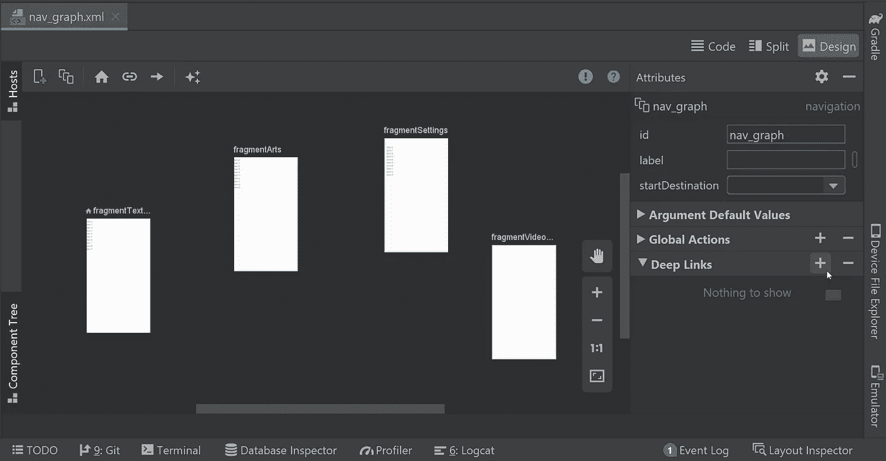
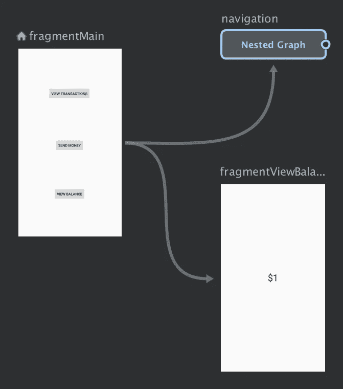

# 探索 Jetpack 导航组件的实时用例

> 原文：<https://betterprogramming.pub/exploring-real-time-use-cases-of-jetpack-navigation-component-e58dd8dfba5>

## 对话目的地、深层链接和嵌套图形


照片由[格伦·卡斯滕斯-彼得斯](https://unsplash.com/@glenncarstenspeters?utm_source=medium&utm_medium=referral)在 [Unsplash](https://unsplash.com?utm_source=medium&utm_medium=referral) 拍摄。

Jetpack 的导航组件是一个转换库，将对开发人员如何编写代码以在屏幕之间导航产生巨大影响。

到目前为止，我已经看到了很多专注于活动和片段的教程。但是 Android 不仅仅是一堆屏幕。它确实有吸引人的对话。此外，深层链接是导航的另一个核心方面。最后，随着产品的增长，我们无法将所有屏幕都放在一个图形中，因此我们需要学习如何将目的地分组到多个图形中。

在今天的文章中，我将重点介绍这三个概念。如果你不熟悉 Jetpack 导航组件，我建议你先阅读[这篇文章](https://medium.com/better-programming/jitpack-navigation-component-in-android-944165c35f54)并学习基础知识。

话虽如此，我们还是开始吧。

# 对话目的地

为了解释对话目的地，我们将以`BottomSheetDialogFragment`为例。假设当你点击一部电影时，我们有一个电影列表。我们需要显示底部工作表对话框的细节。

我将创建底部的 sheen 对话框片段，并解释使用导航组件触发它所需实现的代码，而不是创建整个应用程序并拖动本文。

没有任何进一步的延迟，让我们创建一个名为`MovieDetailsDialog`的底部表单对话框片段:

这是一个简单的底部表单对话框，我们使用`[viewBinding](https://medium.com/better-programming/everything-you-should-know-about-viewbinding-in-android-52552af9e8ba)`来链接布局。下一步是在导航图中为这个对话框创建一个目的地。我们需要使用一个`dialog`标签，而不是在这里使用一个普通的片段:

现在我们在导航图中有了对话片段和它的目的地。下一步是使用导航组件触发它。这类似于调用普通片段。看一看:

仅此而已。现在，您离将应用程序从传统的导航系统转移到全新的 Jetpack 导航组件又近了一步。

# 深层链接

我们将讨论本文的第二个概念:深层链接。让我们从基础开始，而不是变得极客。

## 什么是深度链接？

深度链接类似于我们日常使用的链接或网址。每个链接或 URL 用于将用户导航到特定的目的地。例如，让我们看看下面的 URL:

```
https://www.examplemovies.com/avengers?part=3
```

通常在网络上，这个网址会加载`avengers part3`电影详情。在移动应用程序中也是如此。在 Android 中，我们使用*意图过滤器*的概念将特定的屏幕与特定的链接联系起来。要学习深层链接的基础知识，请阅读本文。

现在我们知道了什么是深层链接，让我们来探索如何在 Jetpack 导航组件中使用它们。我们举个同样的例子:`MovieDetailsDialog`。这里，我们将创建一个深度链接来触发一个电影细节对话框以及常规的导航动作。

我们可以使用导航编辑器创建一个到目的地的深层链接。切换到设计选项卡，并点击工作室右侧的属性面板。然后，您将看到带有加号的深层链接选项，用于创建指向您选择的目的地的深层链接:



在这里，我们创建了一个显式的深度链接，它使用一个`PendingIntent`将用户带到应用程序中的一个特定位置。在这种情况下，这是一个电影细节对话框。

您可以创建一个明确的深层链接，作为通知或应用程序快捷方式的一部分。一旦我们创建了深层链接，图中的对话目的地将如下所示:

要导航到应用程序中的电影细节对话框，我们可以使用导航操作，但是当您需要从快捷方式、通知或某种外部资源导航时，深层链接会很方便。

我们可以使用`NavDeepLinkBuilder`来创建一个待定的意图，并使用它来导航:

# 嵌套图

现在介绍本文的最后一个概念:嵌套图。如前所述，随着时间的推移，代码库会随着产品而增长。很难在单个图形中维护每个屏幕。

分离目的地并保持清晰的导航图结构的一种方法是通过嵌套图。

> 一系列的目的地可以被分组到被称为*根图*的父导航图内的*嵌套图*中。嵌套图形有助于组织和重用应用程序 UI 的各个部分，例如自包含的登录流程。”— [安卓开发者](https://developer.android.com/guide/navigation/navigation-nested-graphs)

我们可以为应用程序中的每个模块创建单独的图表。例如，如果我们使用一个娱乐应用程序，我们可以为登录流、入职、电视节目、电影等创建单独的图表。基于图表的功能。

尽管看起来很有用，但我们需要遵循一些规则来使用嵌套图。第一个也是最重要的规则是嵌套图应该封装在根图中。它们不能单独使用。

第二条规则是，任何导航图都应该有一个起始目的地。这也适用于嵌套图。导航组件只能通过其起始目的地进入任何嵌套图。

## 将目的地分组到嵌套图形中

*   在导航编辑器中，您首先需要选择想要放入嵌套图中的所有目的地。我们可以通过按住 Shift 键并点击目的地来实现。
*   然后我们需要右键单击并选择移动到嵌套图形>新建图形。这将创建一个嵌套图形并移动所选目的地。看一看:



*   双击嵌套图形以显示其目的地。
*   我们可以从根图中触发嵌套图目标，如下所示:

# 奖金

要了解有关 Jetpack 库的更多信息，请阅读以下文章:

*   [“工作管理器基础知识，如何将工作管理器与 Rxjava2 一起使用& Kotlin 协同程序”](https://medium.com/swlh/workmanager-basics-how-to-use-workmanager-with-rxjava2-kotlin-coroutines-c2a317197038)
*   [“安卓房间持久性库🔗科特林协程](https://medium.com/@sgkantamani/android-room-persistence-library-kotlin-coroutines-26d53a09d384)
*   **[“App 启动—新架构组件”](https://medium.com/@sgkantamani/app-startup-new-architecture-component-d115b062a701)**

**要了解有关 Android 高级开发的更多信息，请阅读以下文章:**

*   **[“了解如何在 Android 中创建矢量资源”](https://levelup.gitconnected.com/vector-asserts-in-android-f0774ba8bf92)**
*   **[“安卓产品口味”](https://medium.com/@sgkantamani/android-product-flavors-eb526e35f9f1)**
*   **[“如何创建和发布 Android 库”](https://medium.com/@sgkantamani/how-to-create-and-publish-an-android-library-f37bf715932)**
*   **[“在您的 Android 应用中实现广告”](https://medium.com/android-dev-hacks/implementing-ads-in-your-android-application-28ac676024aa)**

**目前就这些。希望你学到了有用的东西。感谢阅读。**